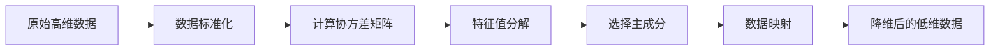

# 主成分分析PCA原理与代码实例讲解

## 1. 背景介绍
### 1.1 什么是主成分分析
主成分分析（Principal Component Analysis，简称PCA）是一种常用的数据降维方法，它通过线性变换将原始数据变换为一组各维度线性无关的表示，可用于提取数据的主要特征分量，去除噪声和冗余，实现数据压缩和降维。PCA 作为一种无监督学习算法，在机器学习、计算机视觉、信号处理等领域有着广泛的应用。

### 1.2 PCA的应用场景
- 数据压缩：通过PCA可以用更少的维度来表示原始高维数据，实现数据压缩。
- 特征提取：PCA 可以提取数据的主要特征，去除噪声干扰，改善算法的效果。
- 可视化：通过PCA将高维数据映射到二维或三维空间，便于对数据进行可视化分析。
- 预处理：PCA可以作为其他机器学习算法的预处理步骤，提高算法速度和效果。

## 2. 核心概念与联系
### 2.1 协方差矩阵
协方差矩阵度量了数据集中不同维度间的相关性。对于一个 n 维数据集，其协方差矩阵是一个对称的 n×n 矩阵，第 i 行 j 列的元素表示第 i 个变量和第 j 个变量的协方差。协方差矩阵对角线上的元素是各个变量本身的方差。

### 2.2 特征值与特征向量
对协方差矩阵进行特征值分解，可以得到特征值和特征向量。特征值表示数据变化的方差，特征向量表示主成分的方向。特征值越大，表示在该特征向量方向上数据的方差越大，包含的信息越多。

### 2.3 主成分
通过选取最大的 k 个特征值对应的特征向量，将原始数据映射到这 k 个特征向量张成的 k 维子空间上，得到的 k 维向量就是主成分。主成分与原始数据具有相同的数据特征，但维度更低，方差最大。

## 3. 核心算法原理具体操作步骤
PCA 的具体计算步骤如下：

1. 数据标准化：对原始数据进行标准化，使每个维度的均值为0，方差为1。
2. 计算协方差矩阵：计算标准化后数据的协方差矩阵。
3. 特征值分解：对协方差矩阵进行特征值分解，得到特征值和特征向量。
4. 选择主成分：按照特征值从大到小排序，选择前 k 个特征向量作为主成分。
5. 数据映射：将原始数据映射到选定的 k 个主成分上，得到降维后的数据。



## 4. 数学模型和公式详细讲解举例说明
### 4.1 数据标准化
对于数据矩阵 $X=(x_1,x_2,...,x_n)$，其中 $x_i$ 表示第 i 个样本，标准化公式为：

$$x_i^{'}=\frac{x_i-\mu}{\sigma}$$

其中，$\mu$ 为均值，$\sigma$ 为标准差。

### 4.2 协方差矩阵计算
标准化后的数据矩阵 $X^{'}$ 的协方差矩阵 $C$ 计算公式为：

$$C=\frac{1}{n-1}X^{'T}X^{'}$$

### 4.3 特征值分解
对协方差矩阵 $C$ 进行特征值分解：

$$C=V\Lambda V^T$$

其中，$\Lambda=diag(\lambda_1,\lambda_2,...,\lambda_n)$ 为特征值构成的对角矩阵，$\lambda_1\geq\lambda_2\geq...\geq\lambda_n$，$V=(v_1,v_2,...,v_n)$ 为特征向量构成的矩阵。

### 4.4 主成分选择与数据映射
选择前 k 个最大特征值对应的特征向量 $V_k=(v_1,v_2,...,v_k)$，将原始数据 $X$ 映射到 $V_k$ 张成的 k 维空间中，得到降维后的数据 $Y$：

$$Y=X\cdot V_k$$

## 5. 项目实践：代码实例和详细解释说明
下面以 Python 和 scikit-learn 库为例，展示 PCA 的代码实现：

```python
from sklearn.decomposition import PCA
from sklearn.preprocessing import StandardScaler

# 数据标准化
scaler = StandardScaler()
X_std = scaler.fit_transform(X)

# 创建 PCA 对象，指定降维后的维度
pca = PCA(n_components=k)

# 拟合数据并进行降维
X_pca = pca.fit_transform(X_std)
```

其中，`X` 为原始数据矩阵，`k` 为降维后的目标维度。

首先，使用 `StandardScaler` 对数据进行标准化处理。然后，创建 `PCA` 对象，设置降维后的目标维度 `n_components`。最后，调用 `fit_transform` 方法对标准化后的数据进行 PCA 降维，得到降维后的数据 `X_pca`。

PCA 对象的属性 `explained_variance_` 表示各主成分的方差，`explained_variance_ratio_` 表示各主成分的方差占总方差的比例，`components_` 表示主成分向量。

## 6. 实际应用场景
### 6.1 人脸识别
在人脸识别中，原始图像数据维度很高，直接处理计算量大。通过 PCA 可以将高维图像数据降维到较低维度，提取主要特征，再进行人脸识别，可以大大提高识别效率和准确率。

### 6.2 基因数据分析
基因表达数据通常包含成千上万个基因，数据维度极高。使用 PCA 可以将高维基因数据降维，提取主要的基因表达模式，有助于发现不同样本间的差异和相似性，进行基因分类和聚类分析。

### 6.3 推荐系统
在推荐系统中，用户-物品评分矩阵维度通常很高，存在数据稀疏问题。PCA 可以用于提取用户或物品的隐语义特征，将高维评分数据映射到低维隐语义空间，缓解数据稀疏问题，提高推荐精度。

## 7. 工具和资源推荐
- scikit-learn：机器学习 Python 库，提供了 PCA 的高效实现。
- MATLAB：数学软件，提供了 PCA 的内置函数。
- Weka：数据挖掘工具，提供了 PCA 的图形化实现。
- 《Pattern Recognition and Machine Learning》：经典机器学习教材，对 PCA 有深入讲解。
- 《机器学习》周志华：机器学习入门教材，对 PCA 原理讲解透彻。

## 8. 总结：未来发展趋势与挑战
PCA 作为经典的线性降维方法，在许多领域得到了广泛应用。但 PCA 也存在一些局限性，如只考虑线性关系，对数据分布有一定假设。为克服这些局限性，一些非线性降维方法如核主成分分析（KPCA）、流形学习等被提出。

未来，PCA 及其扩展方法将继续在数据降维和特征提取领域发挥重要作用。同时，如何利用先验知识指导 PCA，如何将 PCA 与深度学习结合以处理更复杂数据，如何提高 PCA 的可解释性和鲁棒性等，都是值得关注的研究方向。

## 9. 附录：常见问题与解答
### 9.1 如何选择主成分数目？
主成分数目 k 可以通过以下方法选取：

1. 根据累积方差贡献率。计算前 k 个主成分的方差之和占总方差的比例，取大于阈值（如 90%）的最小 k 值。
2. 根据特征值大小。观察特征值大小，取拐点处的 k 值。
3. 交叉验证。将不同 k 值对应的降维结果用于后续任务，通过交叉验证选择最优 k 值。

### 9.2 PCA 对数据尺度敏感吗？
PCA 对数据尺度敏感，不同维度量纲不同会影响 PCA 效果。因此，在进行 PCA 之前，通常需要对数据进行标准化，使各维度均值为 0，方差为 1。

### 9.3 PCA 和因子分析有什么区别？
PCA 和因子分析都可用于提取数据中的隐含因子结构，但有以下区别：

- PCA 重点在降维，得到的主成分是原始变量的线性组合；而因子分析重点在发现隐含因子，得到的因子是隐含变量。
- PCA 不对数据分布做任何假设；而因子分析通常假设数据服从高斯分布。
- PCA 得到的主成分正交独立；而因子分析得到的因子可以存在相关性。

作者：禅与计算机程序设计艺术 / Zen and the Art of Computer Programming