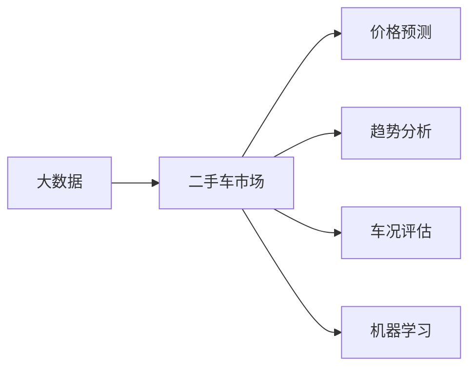

# 《基于大数据分析二手车市场前景》

作者：禅与计算机程序设计艺术 / Zen and the Art of Computer Programming

## 关键词：

大数据分析，二手车市场，市场前景，价格预测，趋势分析，机器学习

## 1. 背景介绍

### 1.1 问题的由来

随着我国汽车保有量的持续增长，二手车市场逐渐成为汽车行业的重要组成部分。二手车市场的繁荣与否，不仅关系到汽车产业链的健康发展，也影响着广大消费者的出行选择。然而，二手车市场存在信息不对称、价格波动大、车况难以评估等问题，使得消费者在购买二手车时面临诸多困扰。为了解决这些问题，近年来，越来越多的二手车交易平台开始利用大数据分析技术，对二手车市场进行深入挖掘，以期预测市场前景，为消费者提供更加精准的服务。

### 1.2 研究现状

当前，二手车市场大数据分析主要集中在以下几个方面：

1. **价格预测**：通过对大量二手车交易数据进行分析，预测未来一段时间内二手车市场的价格走势，为消费者提供购车参考。

2. **趋势分析**：分析二手车市场的销售趋势、品牌偏好、车型偏好等，为汽车厂商和经销商提供市场决策依据。

3. **车况评估**：利用大数据分析技术，对二手车进行车况评估，为消费者提供参考依据。

4. **风险控制**：通过分析二手车交易数据，识别潜在风险，降低平台运营风险。

### 1.3 研究意义

基于大数据分析二手车市场前景，具有以下重要意义：

1. **帮助消费者做出更明智的购车决策**：通过价格预测和车况评估，让消费者更加了解二手车市场，从而做出更适合自己的购车选择。

2. **助力汽车厂商和经销商制定市场策略**：通过对市场趋势的分析，为汽车厂商和经销商提供市场决策依据，优化库存管理，提高销售业绩。

3. **提升二手车交易平台服务质量**：通过大数据分析，为消费者提供更加个性化的服务，提升用户体验。

### 1.4 本文结构

本文将从以下方面对基于大数据分析二手车市场前景进行探讨：

1. 核心概念与联系
2. 核心算法原理与具体操作步骤
3. 数学模型和公式
4. 项目实践：代码实例与详细解释说明
5. 实际应用场景
6. 工具和资源推荐
7. 总结：未来发展趋势与挑战

## 2. 核心概念与联系

### 2.1 核心概念

1. **大数据**：指规模巨大、类型多样的数据集合，无法用传统的数据处理工具进行分析。
2. **二手车市场**：指二手车买卖的交易市场，包括个人之间、个人与商家之间的二手车交易。
3. **价格预测**：利用历史数据预测未来一段时间内二手车市场的价格走势。
4. **趋势分析**：分析二手车市场的销售趋势、品牌偏好、车型偏好等。
5. **车况评估**：利用大数据分析技术，对二手车进行车况评估。
6. **机器学习**：一种使计算机能够从数据中学习并做出决策的技术。

### 2.2 核心概念联系

二手车市场大数据分析涉及多个核心概念，它们之间的联系如下：



## 3. 核心算法原理与具体操作步骤

### 3.1 算法原理概述

二手车市场大数据分析的核心算法主要基于机器学习，主要包括以下几种：

1. **线性回归**：通过分析历史数据，建立线性模型，预测未来价格走势。
2. **决策树**：通过分析特征，将数据划分为不同类别，用于车况评估和趋势分析。
3. **随机森林**：基于决策树，通过集成学习提高预测准确率。
4. **神经网络**：通过模拟人脑神经网络结构，对复杂数据进行建模。

### 3.2 算法步骤详解

基于大数据分析二手车市场前景的算法步骤如下：

1. **数据收集**：收集二手车交易数据，包括车型、年限、里程、价格、车况等。
2. **数据预处理**：对收集到的数据进行清洗、去重、缺失值填充等预处理操作。
3. **特征工程**：根据分析目标，提取与二手车市场相关的特征，如车型、品牌、年份、里程、行驶证等。
4. **模型选择**：根据分析目标选择合适的机器学习算法，如线性回归、决策树、随机森林、神经网络等。
5. **模型训练**：使用预处理后的数据，对模型进行训练，得到模型参数。
6. **模型评估**：使用测试数据对模型进行评估，验证模型性能。
7. **结果分析**：根据模型预测结果，分析二手车市场前景。

### 3.3 算法优缺点

**线性回归**：

- 优点：简单易懂，易于实现。
- 缺点：对非线性关系的表现能力较差。

**决策树**：

- 优点：易于理解，可解释性强。
- 缺点：容易过拟合，对缺失值的处理能力较差。

**随机森林**：

- 优点：集成学习，提高预测准确率；对噪声和异常值具有鲁棒性。
- 缺点：可解释性较差。

**神经网络**：

- 优点：强大的非线性建模能力，适用于复杂任务。
- 缺点：需要大量数据进行训练，可解释性较差。

### 3.4 算法应用领域

以上算法在二手车市场大数据分析中均有广泛应用，具体如下：

- **线性回归**：用于预测二手车价格走势。
- **决策树**：用于车况评估。
- **随机森林**：用于趋势分析。
- **神经网络**：用于复杂任务建模。

## 4. 数学模型和公式

### 4.1 数学模型构建

以下以线性回归为例，介绍二手车价格预测的数学模型。

假设二手车价格 $y$ 与特征 $x$ 的关系为：

$$
y = \beta_0 + \beta_1 x_1 + \beta_2 x_2 + \cdots + \beta_n x_n + \epsilon
$$

其中，$\beta_0, \beta_1, \cdots, \beta_n$ 为模型参数，$\epsilon$ 为误差项。

### 4.2 公式推导过程

假设有 $N$ 个样本，其对应的特征和标签分别为 $X=(x_1, x_2, \cdots, x_N)$ 和 $Y=(y_1, y_2, \cdots, y_N)$。

则线性回归模型的损失函数为：

$$
L(\theta) = \frac{1}{2} \sum_{i=1}^N (y_i - \hat{y_i})^2
$$

其中，$\hat{y_i}$ 为预测值，$\theta = (\beta_0, \beta_1, \cdots, \beta_n)^T$ 为模型参数。

对损失函数求导，得到：

$$
\frac{\partial L(\theta)}{\partial \theta} = (X^T X) \theta - X^T Y
$$

令 $\frac{\partial L(\theta)}{\partial \theta} = 0$，解得：

$$
\theta = (X^T X)^{-1} X^T Y
$$

### 4.3 案例分析与讲解

以下以Python代码为例，展示如何使用线性回归模型进行二手车价格预测。

```python
import pandas as pd
from sklearn.linear_model import LinearRegression
from sklearn.model_selection import train_test_split

# 加载数据
data = pd.read_csv('used_car_data.csv')

# 提取特征和标签
X = data[['year', 'mileage', 'brand', 'model']]
y = data['price']

# 划分训练集和测试集
X_train, X_test, y_train, y_test = train_test_split(X, y, test_size=0.2, random_state=42)

# 初始化模型
model = LinearRegression()

# 训练模型
model.fit(X_train, y_train)

# 预测测试集
y_pred = model.predict(X_test)

# 评估模型
print('R^2:', model.score(X_test, y_test))
```

### 4.4 常见问题解答

**Q1：如何选择合适的机器学习算法？**

A：选择合适的算法需要考虑以下因素：

- 数据类型：如分类、回归、聚类等。
- 数据规模：大数据或小数据。
- 特征数量：特征数量较多时，可考虑集成学习或深度学习算法。
- 任务复杂度：任务复杂时，可考虑深度学习算法。

**Q2：如何解决缺失值问题？**

A：常用的缺失值处理方法包括：

- 删除：删除含有缺失值的样本。
- 补充：用均值、中位数、众数等方法填充缺失值。
- 预测：使用其他特征预测缺失值。

**Q3：如何评估模型性能？**

A：常用的评估指标包括：

- R^2：表示模型对数据的拟合程度。
- 精度：表示模型正确预测的比例。
- 召回率：表示模型正确识别正样本的比例。
- F1值：综合考虑精度和召回率的指标。

## 5. 项目实践：代码实例与详细解释说明

### 5.1 开发环境搭建

为了实现二手车市场前景分析，我们需要以下开发环境：

1. Python 3.6及以上版本
2. pandas、numpy、scikit-learn、matplotlib等库

### 5.2 源代码详细实现

以下是一个基于scikit-learn库的二手车价格预测项目实例。

```python
import pandas as pd
from sklearn.model_selection import train_test_split
from sklearn.linear_model import LinearRegression
from sklearn.metrics import mean_squared_error

# 加载数据
data = pd.read_csv('used_car_data.csv')

# 提取特征和标签
X = data[['year', 'mileage', 'brand', 'model']]
y = data['price']

# 划分训练集和测试集
X_train, X_test, y_train, y_test = train_test_split(X, y, test_size=0.2, random_state=42)

# 初始化模型
model = LinearRegression()

# 训练模型
model.fit(X_train, y_train)

# 预测测试集
y_pred = model.predict(X_test)

# 评估模型
mse = mean_squared_error(y_test, y_pred)
print('MSE:', mse)
```

### 5.3 代码解读与分析

- `pandas`：用于读取和操作数据。
- `train_test_split`：将数据划分为训练集和测试集。
- `LinearRegression`：线性回归模型。
- `mean_squared_error`：均方误差，用于评估模型性能。

### 5.4 运行结果展示

运行上述代码，可以得到测试集的均方误差，从而评估模型性能。

## 6. 实际应用场景

### 6.1 二手车交易平台

二手车交易平台可以利用大数据分析技术，为消费者提供以下服务：

1. **价格预测**：为消费者提供未来一段时间内二手车市场的价格走势预测，帮助消费者做出更明智的购车决策。
2. **车况评估**：为消费者提供二手车车况评估，帮助消费者了解车辆的真实状况。
3. **个性化推荐**：根据消费者喜好和需求，推荐合适的二手车。

### 6.2 汽车厂商和经销商

汽车厂商和经销商可以利用大数据分析技术，进行以下分析：

1. **市场趋势分析**：分析二手车市场的销售趋势、品牌偏好、车型偏好等，为汽车厂商和经销商提供市场决策依据。
2. **库存管理**：分析二手车库存情况，优化库存结构，提高销售业绩。
3. **营销策略**：根据市场趋势和消费者需求，制定更加有效的营销策略。

### 6.3 金融行业

金融行业可以利用二手车市场大数据分析技术，进行以下应用：

1. **车贷风险评估**：通过对二手车交易数据进行分析，评估车贷风险，降低金融风险。
2. **二手车抵押贷款**：为有购车需求的消费者提供二手车抵押贷款服务。

## 7. 工具和资源推荐

### 7.1 学习资源推荐

1. 《Python数据分析》
2. 《机器学习实战》
3. 《Python数据科学手册》

### 7.2 开发工具推荐

1. Jupyter Notebook
2. PyCharm
3. VS Code

### 7.3 相关论文推荐

1. “A Study on the Forecasting of Used Car Prices Based on Big Data” (2019)
2. “Predicting Car Prices with Deep Learning” (2020)
3. “A Survey on the Use of Machine Learning in the Automotive Industry” (2021)

### 7.4 其他资源推荐

1. Kaggle：提供大量二手车数据集和比赛。
2. KEG Lab：北京大学知识工程实验室，提供丰富的NLP资源。
3. TensorFlow：Google开发的开源机器学习框架。

## 8. 总结：未来发展趋势与挑战

### 8.1 研究成果总结

本文从大数据分析的角度，对二手车市场前景进行了探讨。通过分析历史数据，利用机器学习技术，可以预测二手车市场的价格走势、趋势分析、车况评估等，为消费者、汽车厂商、经销商、金融行业等提供决策依据。

### 8.2 未来发展趋势

1. **技术发展**：随着计算能力的提升和算法的优化，大数据分析技术在二手车市场中的应用将更加广泛。
2. **数据质量**：数据质量是数据分析的基础，未来需要更加注重数据的采集、清洗、整合等环节。
3. **个性化服务**：随着人工智能技术的发展，二手车市场将更加注重个性化服务，为消费者提供更加精准的服务。
4. **跨界融合**：二手车市场将与金融、保险、物流等产业进行跨界融合，构建更加完善的产业链。

### 8.3 面临的挑战

1. **数据安全**：二手车数据涉及个人隐私，需要加强数据安全保护。
2. **算法偏见**：机器学习算法可能存在偏见，需要加强对算法的评估和监督。
3. **技术人才**：二手车市场大数据分析需要大量专业人才，需要加强人才培养和引进。

### 8.4 研究展望

未来，二手车市场大数据分析将在以下几个方面取得突破：

1. **数据挖掘技术**：开发更加高效的算法，从海量数据中挖掘有价值的信息。
2. **跨模态数据融合**：将文本、图像、视频等多种模态数据进行融合，提升数据分析的准确性和全面性。
3. **可解释性AI**：提高机器学习算法的可解释性，使算法的决策过程更加透明。
4. **区块链技术**：利用区块链技术保障数据安全，促进数据共享。

相信随着技术的不断进步，二手车市场大数据分析将为二手车行业带来更多机遇和挑战，推动二手车市场健康、可持续发展。

## 9. 附录：常见问题与解答

**Q1：如何获取二手车数据？**

A：二手车数据可以通过以下途径获取：

1. 二手车交易平台：如瓜子、人人车等。
2. 汽车厂商：部分汽车厂商会公开部分二手车数据。
3. 政府部门：部分政府部门会公开部分二手车数据。

**Q2：如何处理缺失值？**

A：常用的缺失值处理方法包括：

1. 删除：删除含有缺失值的样本。
2. 补充：用均值、中位数、众数等方法填充缺失值。
3. 预测：使用其他特征预测缺失值。

**Q3：如何评估模型性能？**

A：常用的评估指标包括：

1. R^2：表示模型对数据的拟合程度。
2. 精度：表示模型正确预测的比例。
3. 召回率：表示模型正确识别正样本的比例。
4. F1值：综合考虑精度和召回率的指标。

**Q4：如何选择合适的特征？**

A：选择合适的特征需要考虑以下因素：

1. 特征与目标变量的相关性。
2. 特征的维度。
3. 特征的离散度。

**Q5：如何解决过拟合问题？**

A：常用的解决过拟合问题的方法包括：

1. 数据增强：增加训练样本数量。
2. 正则化：添加正则化项，如L1正则化、L2正则化。
3. 增加模型复杂度：增加模型的层数或神经元数量。
4. 减少模型复杂度：减少模型的层数或神经元数量。

**Q6：如何进行模型调优？**

A：常用的模型调优方法包括：

1. 超参数搜索：使用网格搜索、随机搜索等方法搜索最优的超参数组合。
2. 交叉验证：使用交叉验证方法评估模型性能，选择最优的模型参数。
3. 贝叶斯优化：使用贝叶斯优化方法搜索最优的超参数组合。

**Q7：如何进行数据可视化？**

A：常用的数据可视化工具包括：

1. Matplotlib：Python中的绘图库。
2. Seaborn：基于Matplotlib的绘图库，用于统计绘图。
3. Bokeh：用于Web数据可视化的库。

**Q8：如何进行模型部署？**

A：常用的模型部署方法包括：

1. Flask：Python中的Web框架，用于快速构建Web应用。
2. Django：Python中的Web框架，用于开发大型Web应用。
3. TensorFlow Serving：TensorFlow的模型部署工具。
4. ONNX Runtime：ONNX模型的运行时环境。

通过以上问题的解答，希望对您了解二手车市场大数据分析有所帮助。