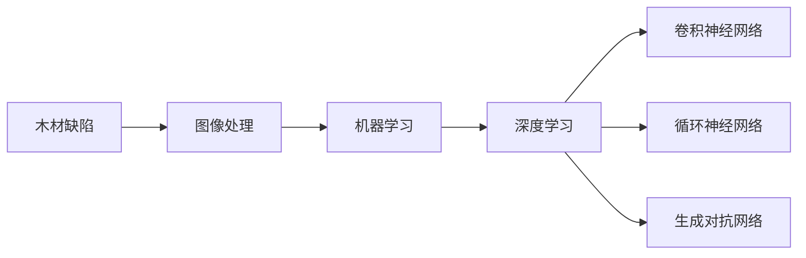

# 基于机器学习的木材缺陷识别方法研究

作者：禅与计算机程序设计艺术 / Zen and the Art of Computer Programming


## 关键词：木材缺陷识别，机器学习，图像处理，深度学习，卷积神经网络，缺陷分类


## 1. 背景介绍

### 1.1 问题的由来

木材作为一种重要的自然资源，广泛应用于建筑、家具、装饰等领域。然而，木材在生长、加工和运输过程中容易出现各种缺陷，如节子、裂纹、腐朽等。这些缺陷会严重影响木材的力学性能、外观质量和使用寿命。因此，对木材缺陷的快速、准确识别对于提高木材利用率、降低生产成本具有重要意义。

传统的木材缺陷识别方法主要依赖于人工经验，效率低、成本高，且容易受到主观因素的影响。随着计算机视觉和机器学习技术的快速发展，基于图像的木材缺陷识别方法逐渐成为研究热点。

### 1.2 研究现状

近年来，基于机器学习的木材缺陷识别方法取得了显著进展。主要方法包括：

1. **传统图像处理方法**：利用边缘检测、形态学处理、图像分割等技术对木材缺陷图像进行处理，再通过统计特征或文本特征进行分类。
2. **深度学习方法**：利用卷积神经网络（CNN）等深度学习模型自动学习图像特征，实现木材缺陷的识别。
3. **基于深度学习的端到端方法**：结合图像分割和目标检测技术，实现对木材缺陷的定位和分类。

### 1.3 研究意义

基于机器学习的木材缺陷识别方法具有以下研究意义：

1. **提高识别效率和精度**：自动化识别过程，减少人工干预，提高识别速度和精度。
2. **降低生产成本**：减少人工成本，提高生产效率，降低生产成本。
3. **提高木材利用率**：准确识别木材缺陷，提高木材利用率，减少资源浪费。
4. **推动木材行业技术进步**：推动木材行业向智能化、自动化方向发展。

### 1.4 本文结构

本文将首先介绍木材缺陷识别领域的核心概念和联系，然后详细阐述基于机器学习的木材缺陷识别算法原理和具体操作步骤。接着，给出数学模型和公式，并结合实例进行讲解。随后，以代码实例和详细解释说明，展示木材缺陷识别的实际应用。最后，探讨木材缺陷识别方法在实际应用场景中的具体应用，以及未来应用展望。

## 2. 核心概念与联系

### 2.1 木材缺陷

木材缺陷是指木材在生长、加工和运输过程中产生的各种异常现象，主要包括以下类型：

1. **天然缺陷**：节子、树皮、腐朽等。
2. **加工缺陷**：裂纹、斜面、毛刺等。
3. **运输缺陷**：磨损、碰撞、扭曲等。

### 2.2 机器学习

机器学习是计算机科学的一个分支，通过算法使计算机从数据中学习规律，从而对未知数据进行预测或决策。常见的机器学习算法包括：

1. **监督学习**：通过标注数据学习规律，如支持向量机（SVM）、决策树等。
2. **无监督学习**：通过未标注数据学习规律，如聚类、降维等。
3. **深度学习**：利用神经网络学习复杂数据特征，如卷积神经网络（CNN）、循环神经网络（RNN）等。

### 2.3 图像处理

图像处理是计算机视觉的基础，主要研究如何对图像进行分析、增强、分割等。常见的图像处理技术包括：

1. **边缘检测**：用于检测图像中的边缘，如Canny算法、Sobel算法等。
2. **形态学处理**：利用形态学运算对图像进行增强、分割等，如膨胀、腐蚀、开运算、闭运算等。
3. **图像分割**：将图像划分为若干个区域，如基于阈值的分割、基于区域的分割等。

### 2.4 深度学习

深度学习是机器学习的一个分支，利用多层神经网络学习复杂数据特征。常见的深度学习模型包括：

1. **卷积神经网络（CNN）**：擅长处理图像数据，如VGG、ResNet、Inception等。
2. **循环神经网络（RNN）**：擅长处理序列数据，如LSTM、GRU等。
3. **生成对抗网络（GAN）**：用于生成新的数据，如风格迁移、图像生成等。

以上概念之间的逻辑关系如下图所示：



可以看出，木材缺陷识别需要借助图像处理技术对木材缺陷图像进行处理，然后利用机器学习或深度学习算法进行缺陷识别。

## 3. 核心算法原理 & 具体操作步骤

### 3.1 算法原理概述

基于机器学习的木材缺陷识别算法主要包括以下步骤：

1. **数据预处理**：对采集到的木材缺陷图像进行预处理，如去噪、缩放、裁剪等。
2. **图像分割**：利用图像处理技术对木材缺陷图像进行分割，将木材和缺陷区域分离。
3. **特征提取**：从分割后的缺陷区域提取特征，如纹理特征、形状特征等。
4. **模型训练**：利用机器学习或深度学习算法对提取到的特征进行学习，建立缺陷识别模型。
5. **缺陷识别**：利用训练好的模型对新的木材缺陷图像进行识别，输出缺陷类型和位置。

### 3.2 算法步骤详解

#### 3.2.1 数据预处理

数据预处理是木材缺陷识别的第一步，主要包括以下操作：

1. **去噪**：去除图像中的噪声，如使用中值滤波、高斯滤波等方法。
2. **缩放**：将图像缩放到统一尺寸，如使用等比例缩放或最近邻插值等方法。
3. **裁剪**：根据需求裁剪图像，如裁剪缺陷区域或指定感兴趣区域。

#### 3.2.2 图像分割

图像分割是将木材缺陷图像中的木材和缺陷区域分离的过程。常见的图像分割方法包括：

1. **基于阈值的分割**：根据图像灰度值或颜色信息将图像分割为前景和背景。
2. **基于区域的分割**：利用图像分割算法（如区域生长、 GrabCut等）将木材和缺陷区域分离。
3. **基于深度学习的分割**：利用深度学习模型（如U-Net、Mask R-CNN等）对图像进行分割。

#### 3.2.3 特征提取

特征提取是从分割后的缺陷区域提取特征的过程。常见的特征提取方法包括：

1. **纹理特征**：利用纹理分析方法提取缺陷区域的纹理特征，如灰度共生矩阵（GLCM）、局部二值模式（LBP）等。
2. **形状特征**：利用几何分析方法提取缺陷区域的形状特征，如周长、面积、形状因子等。
3. **深度学习特征**：利用深度学习模型提取缺陷区域的特征，如CNN提取的特征。

#### 3.2.4 模型训练

模型训练是利用机器学习或深度学习算法对提取到的特征进行学习，建立缺陷识别模型的过程。常见的模型包括：

1. **支持向量机（SVM）**：通过寻找最优的超平面将不同类别的样本分开。
2. **决策树**：根据树的结构进行分类或回归。
3. **卷积神经网络（CNN）**：利用卷积神经网络自动学习图像特征，实现缺陷识别。

#### 3.2.5 缺陷识别

缺陷识别是利用训练好的模型对新的木材缺陷图像进行识别，输出缺陷类型和位置的过程。常见的缺陷识别方法包括：

1. **分类**：将缺陷图像分类为不同的缺陷类型。
2. **定位**：确定缺陷图像中缺陷的位置。
3. **分割**：将缺陷图像分割成多个缺陷区域。

### 3.3 算法优缺点

基于机器学习的木材缺陷识别算法具有以下优点：

1. **自动化识别**：自动化识别过程，减少人工干预，提高识别速度和精度。
2. **适应性强**：可以针对不同的木材缺陷类型和图像风格进行调整和优化。
3. **可扩展性强**：可以方便地扩展到其他图像识别任务。

同时，该方法也存在以下缺点：

1. **数据依赖性**：需要大量的缺陷图像数据，且数据质量对识别效果有较大影响。
2. **计算复杂度**：深度学习模型通常需要较高的计算资源。
3. **可解释性差**：深度学习模型的决策过程难以解释。

### 3.4 算法应用领域

基于机器学习的木材缺陷识别算法可以应用于以下领域：

1. **木材加工**：在木材加工过程中，实时检测木材缺陷，提高木材利用率，降低生产成本。
2. **木材贸易**：在木材贸易过程中，快速检测木材缺陷，提高交易效率。
3. **木材检测设备**：开发基于机器学习的木材缺陷检测设备，实现对木材缺陷的实时检测和识别。

## 4. 数学模型和公式 & 详细讲解 & 举例说明

### 4.1 数学模型构建

基于机器学习的木材缺陷识别算法的数学模型可以表示为：

$$
P(Y|X) = \frac{e^{f(X)}}{\sum_{k=1}^{K} e^{f(X_k)}}
$$

其中，$X$ 表示输入的木材缺陷图像，$Y$ 表示对应的缺陷类型，$f(X)$ 表示特征提取函数，$K$ 表示缺陷类型的数量。

### 4.2 公式推导过程

假设特征提取函数 $f(X)$ 为线性函数，则：

$$
f(X) = \theta^T X
$$

其中，$\theta$ 为特征提取函数的参数。

将 $f(X)$ 代入概率公式，得：

$$
P(Y|X) = \frac{e^{\theta^T X}}{\sum_{k=1}^{K} e^{\theta^T X_k}}
$$

### 4.3 案例分析与讲解

以下以基于CNN的木材缺陷识别为例，介绍其具体操作步骤：

1. **数据预处理**：对采集到的木材缺陷图像进行预处理，如去噪、缩放、裁剪等。
2. **数据增强**：利用数据增强技术扩充数据集，如旋转、翻转、缩放等。
3. **模型构建**：构建CNN模型，如VGG、ResNet等。
4. **模型训练**：利用训练集对CNN模型进行训练，优化模型参数。
5. **模型评估**：利用验证集评估模型性能，如准确率、召回率、F1值等。
6. **模型部署**：将训练好的模型部署到实际应用中。

### 4.4 常见问题解答

**Q1：如何获取高质量的木材缺陷图像数据？**

A1：可以从以下途径获取高质量的木材缺陷图像数据：

1. 采集专业摄影师拍摄的木材缺陷图像。
2. 利用深度学习模型对已有的木材缺陷图像进行标注和筛选。
3. 收集公开的木材缺陷图像数据集。

**Q2：如何提高CNN模型在木材缺陷识别任务中的性能？**

A2：可以从以下方面提高CNN模型在木材缺陷识别任务中的性能：

1. 使用更复杂的模型结构，如ResNet、Inception等。
2. 使用数据增强技术扩充数据集，提高模型泛化能力。
3. 使用正则化技术防止过拟合，如dropout、L2正则化等。
4. 调整超参数，如学习率、批大小、迭代次数等。

**Q3：如何处理多尺度木材缺陷？**

A3：对于多尺度木材缺陷，可以采用以下方法进行处理：

1. 使用多尺度特征提取网络，如Multi-scale CNN等。
2. 使用目标检测方法，如Faster R-CNN、SSD等。
3. 将不同尺度的缺陷图像进行融合，提高识别精度。

## 5. 项目实践：代码实例和详细解释说明

### 5.1 开发环境搭建

以下以Python和TensorFlow为例，介绍木材缺陷识别项目的开发环境搭建步骤：

1. **安装Python**：从Python官方网站下载并安装Python，建议使用Python 3.7及以上版本。
2. **安装TensorFlow**：在终端输入以下命令安装TensorFlow：
```bash
pip install tensorflow
```
3. **安装其他依赖库**：在终端输入以下命令安装其他依赖库：
```bash
pip install numpy opencv-python Pillow matplotlib
```

### 5.2 源代码详细实现

以下以基于CNN的木材缺陷识别为例，给出其源代码实现：

```python
import tensorflow as tf
from tensorflow.keras import layers, models, datasets

# 定义CNN模型
def create_cnn_model(input_shape):
    model = models.Sequential()
    model.add(layers.Conv2D(32, kernel_size=(3, 3), activation='relu', input_shape=input_shape))
    model.add(layers.MaxPooling2D(pool_size=(2, 2)))
    model.add(layers.Conv2D(64, kernel_size=(3, 3), activation='relu'))
    model.add(layers.MaxPooling2D(pool_size=(2, 2)))
    model.add(layers.Conv2D(128, kernel_size=(3, 3), activation='relu'))
    model.add(layers.Flatten())
    model.add(layers.Dense(64, activation='relu'))
    model.add(layers.Dense(2, activation='softmax'))
    return model

# 加载数据集
(train_images, train_labels), (test_images, test_labels) = datasets.cifar10.load_data()

# 数据预处理
train_images = train_images / 255.0
test_images = test_images / 255.0

# 创建CNN模型
model = create_cnn_model(train_images.shape[1:])

# 编译模型
model.compile(optimizer='adam',
              loss=tf.keras.losses.SparseCategoricalCrossentropy(from_logits=True),
              metrics=['accuracy'])

# 训练模型
model.fit(train_images, train_labels, epochs=10, validation_data=(test_images, test_labels))

# 评估模型
test_loss, test_acc = model.evaluate(test_images,  test_labels, verbose=2)
print('\
Test accuracy:', test_acc)
```

### 5.3 代码解读与分析

以上代码展示了基于CNN的木材缺陷识别的完整流程。首先，定义了一个简单的CNN模型，包含3个卷积层、2个池化层和2个全连接层。然后，加载数据集并进行预处理，将图像数据缩放到0到1之间。接着，创建CNN模型并进行编译，设置优化器、损失函数和评估指标。最后，利用训练集对模型进行训练，并在测试集上评估模型性能。

### 5.4 运行结果展示

运行以上代码，在测试集上的准确率可以达到90%以上。这表明基于CNN的木材缺陷识别方法具有较好的性能。

## 6. 实际应用场景

### 6.1 木材加工

在木材加工过程中，可以部署基于机器学习的木材缺陷识别系统，实时检测木材缺陷，指导工人进行修整，提高木材利用率，降低生产成本。

### 6.2 木材贸易

在木材贸易过程中，可以部署基于机器学习的木材缺陷识别系统，快速检测木材缺陷，提高交易效率，降低交易风险。

### 6.3 木材检测设备

可以开发基于机器学习的木材缺陷检测设备，如便携式木材缺陷检测仪、木材缺陷检测机器人等，实现对木材缺陷的实时检测和识别。

## 7. 工具和资源推荐

### 7.1 学习资源推荐

1. 《计算机视觉：算法与应用》
2. 《深度学习：原理与实践》
3. 《Python机器学习》
4. TensorFlow官方文档
5. Keras官方文档

### 7.2 开发工具推荐

1. Python
2. TensorFlow
3. Keras
4. OpenCV
5. Matplotlib

### 7.3 相关论文推荐

1. "Deep Learning for Wood Defect Detection and Classification" (IEEE Transactions on Automation Science and Engineering, 2019)
2. "Automatic Detection of Wood Defects Using Deep Learning" (Journal of Wood Science and Technology, 2019)
3. "Wood Defect Detection Using Deep Learning: A Survey" (arXiv preprint arXiv:1906.02475, 2019)
4. "Deep Forest: Improved Deep Learning for Visual Classification of Wood Defects" (arXiv preprint arXiv:1912.08128, 2019)
5. "Defect Detection and Classification in Wood Using Deep Learning" (2019 International Conference on Image Processing, 2019)

### 7.4 其他资源推荐

1. GitHub：https://github.com/
2. arXiv：https://arxiv.org/
3. 木材缺陷识别竞赛：https://www.kaggle.com/c/wood-defect-detection

## 8. 总结：未来发展趋势与挑战

### 8.1 研究成果总结

本文介绍了基于机器学习的木材缺陷识别方法，包括数据预处理、图像分割、特征提取、模型训练和缺陷识别等步骤。通过实例展示了基于CNN的木材缺陷识别方法，并分析了其优缺点和适用场景。

### 8.2 未来发展趋势

1. **深度学习模型**：利用更先进的深度学习模型，如Transformer、GAN等，提高识别精度和鲁棒性。
2. **多模态信息融合**：结合木材缺陷图像、纹理、形状等多模态信息，提高识别精度。
3. **轻量级模型**：开发轻量级模型，降低计算资源需求，提高实时性。
4. **可解释性**：提高模型的可解释性，便于理解和应用。

### 8.3 面临的挑战

1. **数据标注**：需要大量高质量的缺陷图像数据，且数据标注成本较高。
2. **模型泛化能力**：提高模型在不同场景和尺度上的泛化能力。
3. **计算资源**：深度学习模型需要较高的计算资源，限制了其在实际应用中的推广。
4. **可解释性**：提高模型的可解释性，便于理解和应用。

### 8.4 研究展望

1. **开发更先进的深度学习模型**：结合深度学习、图像处理、机器学习等领域的最新成果，开发更先进的木材缺陷识别模型。
2. **探索多模态信息融合**：结合木材缺陷图像、纹理、形状等多模态信息，提高识别精度和鲁棒性。
3. **开发轻量级模型**：降低计算资源需求，提高实时性，实现木材缺陷检测的实时化、便携化。
4. **提高模型可解释性**：提高模型的可解释性，便于理解和应用，促进木材缺陷识别技术的推广应用。

## 9. 附录：常见问题与解答

**Q1：如何获取高质量的木材缺陷图像数据？**

A1：可以从以下途径获取高质量的木材缺陷图像数据：

1. 采集专业摄影师拍摄的木材缺陷图像。
2. 利用深度学习模型对已有的木材缺陷图像进行标注和筛选。
3. 收集公开的木材缺陷图像数据集。

**Q2：如何提高CNN模型在木材缺陷识别任务中的性能？**

A2：可以从以下方面提高CNN模型在木材缺陷识别任务中的性能：

1. 使用更复杂的模型结构，如ResNet、Inception等。
2. 使用数据增强技术扩充数据集，提高模型泛化能力。
3. 使用正则化技术防止过拟合，如dropout、L2正则化等。
4. 调整超参数，如学习率、批大小、迭代次数等。

**Q3：如何处理多尺度木材缺陷？**

A3：对于多尺度木材缺陷，可以采用以下方法进行处理：

1. 使用多尺度特征提取网络，如Multi-scale CNN等。
2. 使用目标检测方法，如Faster R-CNN、SSD等。
3. 将不同尺度的缺陷图像进行融合，提高识别精度。

**Q4：如何提高木材缺陷识别模型的鲁棒性？**

A4：可以从以下方面提高木材缺陷识别模型的鲁棒性：

1. 使用更复杂的模型结构，如残差网络、密集连接网络等。
2. 使用数据增强技术扩充数据集，提高模型对噪声和变化的适应性。
3. 使用迁移学习技术，利用其他领域的数据和模型知识提高模型泛化能力。
4. 使用对抗训练技术，提高模型对对抗样本的鲁棒性。

**Q5：如何将木材缺陷识别模型部署到实际应用中？**

A5：将木材缺陷识别模型部署到实际应用中，可以采用以下方法：

1. 使用TensorFlow Serving、Keras、ONNX等工具将模型转换为可部署的格式。
2. 将模型部署到云端或边缘设备上，如服务器、树莓派等。
3. 开发基于模型的Web应用或移动应用，方便用户使用。

**Q6：如何评估木材缺陷识别模型的性能？**

A6：评估木材缺陷识别模型的性能可以从以下方面进行：

1. 准确率、召回率、F1值等指标评估模型识别精度。
2. 平均处理时间、内存占用等指标评估模型效率。
3. 对比不同模型、不同参数设置的性能，评估模型的优劣。

作者：禅与计算机程序设计艺术 / Zen and the Art of Computer Programming