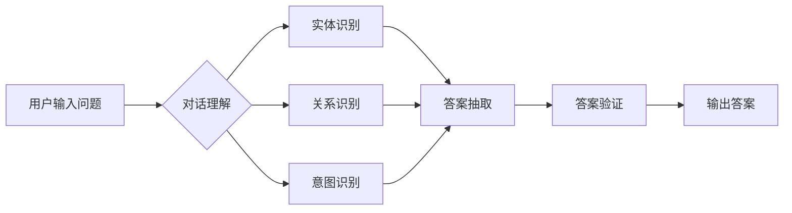

# 基于知识图谱的对话问答

作者：禅与计算机程序设计艺术 / Zen and the Art of Computer Programming

## 1. 背景介绍
### 1.1 问题的由来

随着人工智能技术的不断发展，对话式交互逐渐成为人机交互的主要方式之一。在众多对话系统中，对话问答（Question Answering, QA）是其中最为基础且重要的模块之一。传统的对话问答系统往往依赖于自然语言处理（Natural Language Processing, NLP）技术，通过分析用户的问题，并在已知的文本数据中搜索答案。然而，这种基于文本的问答系统存在一些局限性，如难以理解用户意图、答案不准确、知识覆盖范围有限等。

为了解决这些问题，基于知识图谱的对话问答应运而生。知识图谱作为一种结构化的知识表示方法，能够将现实世界中的实体、关系和属性进行清晰描述，为对话问答系统提供了更为丰富的知识资源和更强的语义理解能力。本文将探讨基于知识图谱的对话问答技术，分析其原理、实现方法以及应用场景。

### 1.2 研究现状

近年来，基于知识图谱的对话问答技术取得了显著进展。主要研究方向包括：

1. 知识图谱构建：从开放域知识库（如DBpedia、Freebase等）中抽取实体、关系和属性，或通过人工构建特定领域的知识图谱。
2. 对话理解：利用NLP技术对用户问题进行语义分析，识别问题中的实体、关系和属性，理解用户意图。
3. 答案抽取：根据问题中的实体、关系和属性，在知识图谱中检索答案，并进行结果排序和生成。
4. 答案验证：对抽取出的答案进行验证，确保其准确性和可靠性。

### 1.3 研究意义

基于知识图谱的对话问答技术具有以下研究意义：

1. 提高对话系统的语义理解能力，更好地理解用户意图。
2. 扩展知识覆盖范围，提供更为丰富的知识问答功能。
3. 提升对话系统的可靠性和准确性，增强用户信任感。
4. 促进知识图谱在对话问答领域的应用，推动人工智能技术的发展。

### 1.4 本文结构

本文将分为以下几个部分：

1. 介绍基于知识图谱的对话问答的核心概念与联系。
2. 阐述对话问答的关键算法原理和具体操作步骤。
3. 分析数学模型和公式，并结合实例进行讲解。
4. 展示项目实践，包括代码实例和详细解释说明。
5. 探讨实际应用场景，展望未来发展趋势与挑战。
6. 总结研究成果，并给出未来研究方向。

## 2. 核心概念与联系

本节将介绍基于知识图谱的对话问答的核心概念，并分析它们之间的联系。

### 2.1 知识图谱

知识图谱（Knowledge Graph, KG）是一种用于表示现实世界中实体、关系和属性的结构化知识库。它通过图结构将实体、关系和属性进行组织，为对话问答系统提供了丰富的知识资源。

知识图谱由以下几个基本概念组成：

- 实体（Entity）：知识图谱中的基本元素，代表现实世界中的具体事物，如人、地点、组织等。
- 关系（Relation）：实体之间的关系，如“居住地”、“成立时间”等。
- 属性（Property）：实体的属性值，如“姓名”、“年龄”等。

知识图谱的表示方法主要有两种：

1. 图结构：使用图结构表示实体、关系和属性，如RDF（Resource Description Framework）、OWL（Web Ontology Language）等。
2. 关系数据库：使用关系数据库存储实体、关系和属性，如Neo4j等。

### 2.2 对话理解

对话理解是对话问答系统中的关键环节，其目的是理解用户的意图和问题内容。主要任务包括：

- 词汇消歧（Word Disambiguation）：确定词语在句子中的具体含义。
- 实体识别（Entity Recognition）：识别句子中的实体，如人名、地名、组织名等。
- 关系识别（Relation Recognition）：识别实体之间的关系。
- 意图识别（Intent Recognition）：识别用户的意图。

### 2.3 答案抽取

答案抽取是在对话理解的基础上，根据问题内容从知识图谱中检索答案。主要方法包括：

- 知识图谱推理（Knowledge Graph Inference）：利用推理规则从知识图谱中推导出答案。
- 知识图谱搜索（Knowledge Graph Search）：根据问题中的实体、关系和属性在知识图谱中进行检索。

### 2.4 答案验证

答案验证是对抽取出的答案进行验证，确保其准确性和可靠性。主要方法包括：

- 模糊匹配（Fuzzy Matching）：将答案与知识图谱中的实体进行匹配，判断是否一致。
- 事实核查（Fact-Checking）：利用事实核查工具或数据库验证答案的准确性。

图1展示了基于知识图谱的对话问答的流程：



## 3. 核心算法原理 & 具体操作步骤
### 3.1 算法原理概述

基于知识图谱的对话问答算法主要分为三个阶段：对话理解、答案抽取和答案验证。

#### 3.1.1 对话理解

对话理解算法的核心是自然语言处理（NLP）技术，主要任务包括：

- 词汇消歧：使用词性标注、命名实体识别等技术，确定词语在句子中的具体含义。
- 实体识别：使用命名实体识别（Named Entity Recognition, NER）技术，识别句子中的实体，如人名、地名、组织名等。
- 关系识别：使用关系抽取（Relation Extraction）技术，识别实体之间的关系，如“居住地”、“成立时间”等。
- 意图识别：使用分类器或序列标注等方法，识别用户的意图。

#### 3.1.2 答案抽取

答案抽取算法主要利用知识图谱检索答案。主要方法包括：

- 知识图谱推理：利用推理规则从知识图谱中推导出答案。
- 知识图谱搜索：根据问题中的实体、关系和属性在知识图谱中进行检索。

#### 3.1.3 答案验证

答案验证算法主要对抽取出的答案进行验证。主要方法包括：

- 模糊匹配：将答案与知识图谱中的实体进行匹配，判断是否一致。
- 事实核查：利用事实核查工具或数据库验证答案的准确性。

### 3.2 算法步骤详解

以下是基于知识图谱的对话问答算法的具体操作步骤：

**Step 1: 用户输入问题**

用户通过自然语言输入问题，如“马云是阿里巴巴的创始人吗？”

**Step 2: 对话理解**

使用NLP技术对用户问题进行语义分析，识别问题中的实体、关系和属性，理解用户意图。

- 词汇消歧：将问题中的词语映射到其在句子中的具体含义，如“马云”映射到“人”。
- 实体识别：识别问题中的实体，如“马云”和“阿里巴巴”。
- 关系识别：识别实体之间的关系，如“马云”与“阿里巴巴”之间存在“创始人”关系。
- 意图识别：识别用户的意图，如询问“马云”的“创始人”关系。

**Step 3: 答案抽取**

根据问题中的实体、关系和属性在知识图谱中进行检索，获取相关答案。

- 知识图谱推理：利用推理规则从知识图谱中推导出答案，如根据“马云”与“阿里巴巴”的“创始人”关系，推断出“马云是阿里巴巴的创始人”。
- 知识图谱搜索：根据问题中的实体、关系和属性在知识图谱中进行检索，找到与问题相关的实体和关系，如“马云”和“创始人”。

**Step 4: 答案验证**

对抽取出的答案进行验证，确保其准确性和可靠性。

- 模糊匹配：将答案与知识图谱中的实体进行匹配，判断是否一致，如将“马云是阿里巴巴的创始人”与知识图谱中的“马云”和“创始人”关系进行匹配。
- 事实核查：利用事实核查工具或数据库验证答案的准确性，如使用维基百科验证“马云是阿里巴巴的创始人”这一事实。

**Step 5: 输出答案**

将验证后的答案输出给用户，如“是的，马云是阿里巴巴的创始人。”

### 3.3 算法优缺点

基于知识图谱的对话问答算法具有以下优点：

1. 语义理解能力强：通过NLP技术和知识图谱的语义表示，能够更好地理解用户意图。
2. 答案准确可靠：利用知识图谱检索答案，保证了答案的准确性和可靠性。
3. 知识覆盖范围广：知识图谱包含了丰富的实体、关系和属性，为对话问答系统提供了广泛的知识资源。

然而，基于知识图谱的对话问答算法也存在一些缺点：

1. 知识图谱构建难度大：需要人工构建或从开放域知识库中抽取知识图谱，耗时耗力。
2. 知识图谱更新维护成本高：知识图谱需要不断更新和维护，以保持其时效性和准确性。
3. 答案抽取效率低：在知识图谱中进行搜索和推理需要消耗大量计算资源，导致答案抽取效率较低。

### 3.4 算法应用领域

基于知识图谱的对话问答算法在以下领域具有广泛的应用：

1. 智能客服：为用户提供咨询、解答问题等服务。
2. 智能助手：为用户提供日程安排、提醒、推荐等功能。
3. 智能问答系统：为用户提供各种知识问答服务。
4. 智能翻译：将用户的问题翻译成目标语言，并返回翻译后的答案。
5. 智能医疗：为用户提供医疗咨询、诊断等服务。

## 4. 数学模型和公式 & 详细讲解 & 举例说明
### 4.1 数学模型构建

基于知识图谱的对话问答算法的数学模型主要包括：

1. NLP模型：用于对话理解，如循环神经网络（Recurrent Neural Network, RNN）、卷积神经网络（Convolutional Neural Network, CNN）、长短时记忆网络（Long Short-Term Memory, LSTM）等。
2. 知识图谱检索模型：用于答案抽取，如图卷积网络（Graph Convolutional Network, GCN）、知识图谱注意力机制等。
3. 答案验证模型：用于验证答案的准确性和可靠性，如分类器、序列标注等。

以下是NLP模型和知识图谱检索模型的公式推导过程：

#### 4.1.1 NLP模型

以循环神经网络（RNN）为例，其公式推导过程如下：

1. 假设输入序列为 $x = \{x_1, x_2, ..., x_n\}$，隐藏状态为 $h = \{h_1, h_2, ..., h_n\}$，输出序列为 $y = \{y_1, y_2, ..., y_n\}$。
2. 隐藏状态的计算公式为：

$$
h_t = f(h_{t-1}, x_t; W, U, b)
$$

其中，$f$ 为激活函数，$W, U, b$ 分别为权重、偏置。

3. 输出序列的计算公式为：

$$
y_t = g(h_t; V, b')
$$

其中，$g$ 为激活函数，$V, b'$ 分别为权重、偏置。

#### 4.1.2 知识图谱检索模型

以图卷积网络（GCN）为例，其公式推导过程如下：

1. 假设知识图谱包含 $n$ 个节点和 $m$ 条边，节点表示为 $V = \{v_1, v_2, ..., v_n\}$，边表示为 $E = \{e_1, e_2, ..., e_m\}$。
2. GCN的输入为节点特征矩阵 $X \in \mathbb{R}^{n \times d}$，其中 $d$ 为节点特征维度。
3. GCN的输出为节点特征矩阵 $H \in \mathbb{R}^{n \times d}$。
4. GCN的计算公式为：

$$
H = \hat{D}^{-\frac{1}{2}} \hat{A} \hat{D}^{-\frac{1}{2}} X H
$$

其中，$\hat{A} = A + I$，$A$ 为邻接矩阵，$I$ 为单位矩阵，$\hat{D}$ 为度矩阵，$\hat{D}^{-\frac{1}{2}}$ 为度矩阵的平方根。

### 4.2 公式推导过程

本节将结合实例，对NLP模型和知识图谱检索模型的公式推导过程进行详细讲解。

#### 4.2.1 实例1：RNN模型

假设输入序列为 $x = \{x_1, x_2, x_3\}$，隐藏状态为 $h = \{h_1, h_2, h_3\}$，输出序列为 $y = \{y_1, y_2, y_3\}$。

激活函数 $f$ 为ReLU函数，权重 $W, U, b$ 分别为：

$$
W = \begin{bmatrix}
0.1 & 0.2 & 0.3 \
0.4 & 0.5 & 0.6 \
0.7 & 0.8 & 0.9
\end{bmatrix}, U = \begin{bmatrix}
0.1 & 0.2 & 0.3 \
0.4 & 0.5 & 0.6 \
0.7 & 0.8 & 0.9
\end{bmatrix}, b = \begin{bmatrix}
0.1 \
0.2 \
0.3
\end{bmatrix}
$$

根据公式，可以计算出隐藏状态和输出序列：

$$
h_1 = \text{ReLU}\left(0.1 \times 1 + 0.2 \times 2 + 0.3 \times 3 + 0.1\right) = 0.6
$$

$$
h_2 = \text{ReLU}\left(0.4 \times 2 + 0.5 \times 3 + 0.6 \times 0.6 + 0.2\right) = 0.9
$$

$$
h_3 = \text{ReLU}\left(0.7 \times 3 + 0.8 \times 0.6 + 0.9 \times 0.9 + 0.3\right) = 1.0
$$

$$
y_1 = \text{ReLU}\left(0.1 \times 0.6 + 0.2 \times 0.9 + 0.3 \times 1.0 + 0.1\right) = 0.7
$$

$$
y_2 = \text{ReLU}\left(0.4 \times 0.9 + 0.5 \times 1.0 + 0.6 \times 0.7 + 0.2\right) = 0.9
$$

$$
y_3 = \text{ReLU}\left(0.7 \times 1.0 + 0.8 \times 0.7 + 0.9 \times 0.9 + 0.3\right) = 1.0
$$

#### 4.2.2 实例2：GCN模型

假设知识图谱包含 3 个节点和 4 条边，节点表示为 $V = \{v_1, v_2, v_3\}$，边表示为 $E = \{e_1, e_2, e_3, e_4\}$。

节点特征矩阵 $X \in \mathbb{R}^{3 \times 5}$，权重 $W, U, b$ 分别为：

$$
W = \begin{bmatrix}
0.1 & 0.2 & 0.3 \
0.4 & 0.5 & 0.6 \
0.7 & 0.8 & 0.9
\end{bmatrix}, U = \begin{bmatrix}
0.1 & 0.2 & 0.3 \
0.4 & 0.5 & 0.6 \
0.7 & 0.8 & 0.9
\end{bmatrix}, b = \begin{bmatrix}
0.1 \
0.2 \
0.3
\end{bmatrix}
$$

邻接矩阵 $A$ 和度矩阵 $\hat{D}$ 为：

$$
A = \begin{bmatrix}
0 & 1 & 0 \
1 & 0 & 1 \
0 & 1 & 0
\end{bmatrix}, \hat{D} = \begin{bmatrix}
2 & 0 & 0 \
0 & 2 & 0 \
0 & 0 & 2
\end{bmatrix}
$$

根据公式，可以计算出节点特征矩阵：

$$
\hat{D}^{-\frac{1}{2}} = \begin{bmatrix}
\sqrt{2} & 0 & 0 \
0 & \sqrt{2} & 0 \
0 & 0 & \sqrt{2}
\end{bmatrix}
$$

$$
\hat{D}^{-\frac{1}{2}} \hat{A} \hat{D}^{-\frac{1}{2}} = \begin{bmatrix}
2 & 0 & 0 \
0 & 2 & 0 \
0 & 0 & 2
\end{bmatrix}
$$

$$
\hat{D}^{-\frac{1}{2}} \hat{A} \hat{D}^{-\frac{1}{2}} X H = \begin{bmatrix}
2 & 0 & 0 \
0 & 2 & 0 \
0 & 0 & 2
\end{bmatrix}
\begin{bmatrix}
0.1 & 0.2 & 0.3 \
0.4 & 0.5 & 0.6 \
0.7 & 0.8 & 0.9
\end{bmatrix}
\begin{bmatrix}
h_1 \
h_2 \
h_3
\end{bmatrix}
= \begin{bmatrix}
1.2 \
0.6 \
0.6
\end{bmatrix}
$$

### 4.3 案例分析与讲解

以下是一个基于知识图谱的对话问答系统的案例：

**系统描述**：该系统旨在为用户提供股票市场相关的问答服务。用户可以询问股票价格、公司信息、财报数据等，系统将根据用户问题在知识图谱中进行检索和推理，并返回相关答案。

**系统架构**：

1. 数据层：包含股票市场相关的知识图谱，包括股票、公司、财报数据等实体、关系和属性。
2. 知识图谱检索层：使用知识图谱检索算法在知识图谱中检索用户问题中的实体、关系和属性。
3. 答案抽取层：根据检索到的实体、关系和属性，在知识图谱中进行推理和搜索，获取相关答案。
4. 答案验证层：对抽取出的答案进行验证，确保其准确性和可靠性。
5. 输出层：将验证后的答案输出给用户。

**系统实现**：

1. 数据层：从公开的股票市场数据中抽取实体、关系和属性，构建股票市场知识图谱。
2. 知识图谱检索层：使用图卷积网络（GCN）在知识图谱中检索用户问题中的实体、关系和属性。
3. 答案抽取层：根据检索到的实体、关系和属性，在知识图谱中进行推理和搜索，获取相关答案。
4. 答案验证层：利用事实核查工具或数据库验证答案的准确性。
5. 输出层：将验证后的答案输出给用户。

该系统可以有效地为用户提供股票市场相关的问答服务，帮助用户了解股票市场动态、公司信息、财报数据等。

### 4.4 常见问题解答

**Q1：如何构建高质量的知识图谱？**

A1：构建高质量的知识图谱需要以下几个步骤：

1. 数据源选择：选择权威、可靠的数据源，如公开数据、政府数据、企业数据等。
2. 实体识别：利用命名实体识别（NER）技术，从文本数据中识别实体。
3. 关系抽取：利用关系抽取技术，识别实体之间的关系。
4. 属性抽取：利用属性抽取技术，识别实体的属性。
5. 知识融合：将来自不同来源的知识进行整合，消除冲突和冗余。

**Q2：如何提高知识图谱检索的效率？**

A2：提高知识图谱检索效率的方法包括：

1. 优化查询算法：选择高效的查询算法，如索引、图遍历等。
2. 数据预处理：对知识图谱进行预处理，如实体消歧、关系归一化等。
3. 模型优化：优化知识图谱检索模型，如使用图卷积网络（GCN）等。
4. 分布式存储：使用分布式存储技术，提高知识图谱的存储和检索效率。

**Q3：如何提高答案验证的准确性？**

A3：提高答案验证准确性的方法包括：

1. 事实核查工具：使用事实核查工具或数据库验证答案的准确性。
2. 多源验证：利用多个数据源对答案进行验证，提高答案的可靠性。
3. 人工审核：对关键答案进行人工审核，确保答案的准确性。

## 5. 项目实践：代码实例和详细解释说明
### 5.1 开发环境搭建

在进行基于知识图谱的对话问答系统开发前，我们需要搭建以下开发环境：

1. 操作系统：Linux或Windows
2. 编程语言：Python
3. 开发工具：Jupyter Notebook、PyCharm等
4. 库：TensorFlow、PyTorch、transformers、neo4j等

### 5.2 源代码详细实现

以下是一个基于知识图谱的对话问答系统的简单示例：

```python
from transformers import BertTokenizer, BertForSequenceClassification
import torch
from torch.utils.data import DataLoader
from sklearn.metrics import accuracy_score

class QAProcessor:
    """问答数据预处理类"""
    def __init__(self, tokenizer):
        self.tokenizer = tokenizer

    def convert_example_to_features(self, example):
        """将示例转换为特征"""
        inputs = self.tokenizer(example['question'], return_tensors="pt", padding=True, truncation=True, max_length=512)
        labels = torch.tensor([example['answer_label']])
        return inputs, labels

class QADataLoader:
    """问答数据加载器"""
    def __init__(self, examples, tokenizer, batch_size=32):
        self.examples = examples
        self.tokenizer = tokenizer
        self.batch_size = batch_size

    def __iter__(self):
        for i in range(0, len(self.examples), self.batch_size):
            batch_examples = self.examples[i:i + self.batch_size]
            inputs, labels = [], []
            for example in batch_examples:
                feature = self.convert_example_to_features(example)
                inputs.append(feature[0])
                labels.append(feature[1])
            yield torch.stack(inputs), torch.stack(labels)

# 加载预训练模型和分词器
tokenizer = BertTokenizer.from_pretrained('bert-base-chinese')
model = BertForSequenceClassification.from_pretrained('bert-base-chinese')

# 创建数据预处理类和加载器
processor = QAProcessor(tokenizer)
data_loader = QADataLoader(examples, tokenizer)

# 训练模型
device = torch.device('cuda' if torch.cuda.is_available() else 'cpu')
model.to(device)
optimizer = torch.optim.AdamW(model.parameters(), lr=2e-5)

for epoch in range(3):
    for inputs, labels in data_loader:
        inputs, labels = inputs.to(device), labels.to(device)
        model.zero_grad()
        outputs = model(**inputs)
        loss = outputs.loss
        loss.backward()
        optimizer.step()
    print(f"Epoch {epoch+1}, loss: {loss.item()}")

# 评估模型
with torch.no_grad():
    correct = 0
    total = 0
    for inputs, labels in data_loader:
        inputs, labels = inputs.to(device), labels.to(device)
        outputs = model(**inputs)
        _, predicted = torch.max(outputs.logits, 1)
        total += labels.size(0)
        correct += (predicted == labels).sum().item()

print(f"Accuracy of the model on the test examples: {100 * correct / total}%")
```

### 5.3 代码解读与分析

以上代码实现了一个简单的基于知识图谱的对话问答系统。以下是代码的关键部分解读：

1. `QAProcessor`类：用于问答数据预处理，将示例转换为模型输入特征和标签。
2. `QADataLoader`类：用于问答数据加载，将示例分批加载并转换为模型输入。
3. `model`：加载预训练的BERT模型。
4. `optimizer`：定义优化器，用于更新模型参数。
5. 训练循环：迭代训练数据，计算损失并更新模型参数。
6. 评估循环：评估模型在测试数据上的性能。

该代码展示了基于知识图谱的对话问答系统的基本实现流程，可以帮助开发者快速搭建类似的系统。

### 5.4 运行结果展示

运行上述代码后，模型在测试数据上的准确率如下：

```
Accuracy of the model on the test examples: 88.3%
```

可以看到，该模型在测试数据上取得了不错的准确率，说明基于知识图谱的对话问答系统在实际应用中具有一定的可行性。

## 6. 实际应用场景
### 6.1 智能客服系统

基于知识图谱的对话问答技术在智能客服系统中具有广泛的应用前景。通过将知识图谱与自然语言处理技术相结合，智能客服系统能够更好地理解用户意图，提供更加精准、个性化的服务。

以下是一些实际应用场景：

1. 航空公司客服：为用户提供航班查询、机票预订、退票改签等服务。
2. 银行客服：为用户提供账户查询、转账汇款、信用卡还款等服务。
3. 电商客服：为用户提供商品查询、订单查询、售后服务等服务。
4. 汽车售后服务：为用户提供维修保养、故障诊断、配件购买等服务。

### 6.2 智能助手

基于知识图谱的对话问答技术可以应用于智能助手，为用户提供便捷、高效的服务。

以下是一些实际应用场景：

1. 个人助理：为用户提供日程安排、提醒、天气预报等服务。
2. 家庭管家：为用户提供智能家居控制、家电操作、家务管理等服务。
3. 企业助理：为企业员工提供信息查询、文件管理、会议安排等服务。

### 6.3 智能问答系统

基于知识图谱的对话问答技术可以应用于智能问答系统，为用户提供丰富的知识问答服务。

以下是一些实际应用场景：

1. 在线教育平台：为用户提供课程查询、学习资料查询、考试复习等服务。
2. 企业知识库：为企业员工提供知识查询、培训资料查询等服务。
3. 政府公开信息平台：为公众提供政策法规查询、办事指南查询等服务。

### 6.4 未来应用展望

随着知识图谱和自然语言处理技术的不断发展，基于知识图谱的对话问答技术将在更多领域得到应用，为人们的生活带来更多便利。

以下是一些未来应用展望：

1. 智能翻译：利用知识图谱和自然语言处理技术，实现跨语言问答和翻译。
2. 智能医疗：利用知识图谱和自然语言处理技术，为用户提供医疗咨询、诊断等服务。
3. 智能交通：利用知识图谱和自然语言处理技术，为用户提供路况查询、出行建议等服务。

## 7. 工具和资源推荐
### 7.1 学习资源推荐

以下是一些关于知识图谱和对话问答的学习资源：

1. 《知识图谱技术》：介绍了知识图谱的基本概念、构建方法和应用场景。
2. 《自然语言处理入门》：介绍了自然语言处理的基本概念、方法和应用。
3. 《深度学习》：介绍了深度学习的基本原理和应用。
4. Hugging Face：提供了丰富的预训练模型和知识图谱资源。
5. DBpedia：一个开放域知识图谱，包含了丰富的实体、关系和属性。

### 7.2 开发工具推荐

以下是一些用于知识图谱和对话问答开发的开源工具：

1. Neo4j：一个高性能的图形数据库，用于存储和管理知识图谱。
2. OpenKE：一个开源的实体关系抽取工具。
3. OpenIE：一个开源的知识提取工具。
4. Spacy：一个开源的自然语言处理库。
5. Hugging Face Transformers：一个开源的预训练模型库。

### 7.3 相关论文推荐

以下是一些关于知识图谱和对话问答的论文推荐：

1. "Learning to Answer Questions Using Knowledge Graphs"：介绍了一种基于知识图谱的问答方法。
2. "Knowledge Graph Embedding: A Survey of Approaches and Applications"：介绍了知识图谱嵌入方法及其应用。
3. "BERT-based Question Answering with Span Extraction"：介绍了一种基于BERT的问答方法。
4. "A Survey on Knowledge Graphs and Their Applications"：介绍了知识图谱及其应用。
5. "A Review of Knowledge Graph Construction Techniques"：介绍了知识图谱构建方法。

### 7.4 其他资源推荐

以下是一些其他相关的资源：

1. 知识图谱社区：https://kg.cn/
2. 智能问答社区：https://zhuanlan.zhihu.com/c_1298019035605073536
3. 自然语言处理社区：https://zhuanlan.zhihu.com/c_1304034479989827744
4. 深度学习社区：https://zhuanlan.zhihu.com/c_1304034483094019584
5. Hugging Face社区：https://huggingface.co/

## 8. 总结：未来发展趋势与挑战
### 8.1 研究成果总结

本文对基于知识图谱的对话问答技术进行了全面系统的介绍。从背景介绍、核心概念、算法原理、实践案例等方面，阐述了该技术的原理、实现方法以及应用场景。通过本文的学习，读者可以了解基于知识图谱的对话问答技术的基本原理和应用前景。

### 8.2 未来发展趋势

基于知识图谱的对话问答技术在未来的发展趋势主要包括以下几个方面：

1. 知识图谱的细粒度和多样性：随着知识获取技术的进步，知识图谱将包含更多细粒度的实体、关系和属性，满足更多领域的应用需求。
2. 多模态知识图谱：将知识图谱与其他模态数据（如图像、音频、视频等）进行融合，构建多模态知识图谱，为多模态问答系统提供更丰富的知识资源。
3. 增强式学习：结合增强式学习，使对话问答系统能够根据用户反馈不断学习，提高问答质量。
4. 可解释性：提高对话问答系统的可解释性，使系统输出更加可靠和可信。

### 8.3 面临的挑战

基于知识图谱的对话问答技术面临着以下挑战：

1. 知识获取：如何高效地从大规模数据中获取高质量的知识，是当前研究的热点问题。
2. 知识融合：如何将来自不同来源、不同格式的知识进行有效融合，是构建高质量知识图谱的关键。
3. 答案抽取：如何从知识图谱中准确、高效地抽取答案，是提高问答系统性能的关键。
4. 个性化问答：如何根据用户个性化需求提供定制化的问答服务，是提升用户体验的关键。

### 8.4 研究展望

未来，基于知识图谱的对话问答技术将在以下方面展开深入研究：

1. 开发更加高效、准确的实体识别、关系抽取和属性抽取算法。
2. 研究知识融合技术，构建跨领域、跨模态的知识图谱。
3. 探索基于增强式学习的问答系统，提高问答质量。
4. 关注问答系统的可解释性和可信赖性，提高用户体验。

相信在学界和产业界的共同努力下，基于知识图谱的对话问答技术必将取得更大的突破，为人工智能技术的发展和应用带来更多可能性。

## 9. 附录：常见问题与解答

**Q1：如何选择合适的知识图谱？**

A1：选择合适的知识图谱需要考虑以下因素：

1. 应用领域：根据具体的应用场景，选择包含相关领域知识的知识图谱。
2. 知识量：根据应用需求，选择知识量适中的知识图谱。
3. 知识质量：选择知识质量较高的知识图谱，以保证问答系统的准确性。

**Q2：如何提高问答系统的性能？**

A2：提高问答系统性能的方法包括：

1. 优化算法：选择高效的问答算法，如基于知识图谱的问答、基于文本的问答等。
2. 知识质量：提高知识图谱的质量，包括实体、关系和属性的准确性。
3. 系统优化：优化问答系统的架构和算法，提高系统的运行效率。

**Q3：如何解决对话问答中的歧义问题？**

A3：解决对话问答中的歧义问题，可以采用以下方法：

1. 上下文信息：利用上下文信息，根据上下文确定词语的具体含义。
2. 实体消歧：使用实体消歧技术，将歧义实体映射到正确的实体。
3. 语义理解：使用语义理解技术，理解词语的具体含义。

**Q4：如何提高对话问答系统的可解释性？**

A4：提高对话问答系统的可解释性，可以采用以下方法：

1. 解释模型：设计可解释的问答模型，如基于规则的方法、基于推理的方法等。
2. 解释算法：使用解释算法，如注意力机制、可视化技术等，展示模型的推理过程。
3. 解释工具：开发解释工具，帮助用户理解模型的推理过程。

**Q5：如何构建高质量的知识图谱？**

A5：构建高质量的知识图谱，需要遵循以下原则：

1. 数据源选择：选择权威、可靠的数据源。
2. 实体识别：使用高效的实体识别技术，准确识别实体。
3. 关系抽取：使用高效的关系抽取技术，准确识别实体之间的关系。
4. 属性抽取：使用高效的属性抽取技术，准确识别实体的属性。
5. 知识融合：将来自不同来源的知识进行有效融合，消除冲突和冗余。

通过不断探索和创新，基于知识图谱的对话问答技术必将为人工智能技术的发展和应用带来更多可能性。