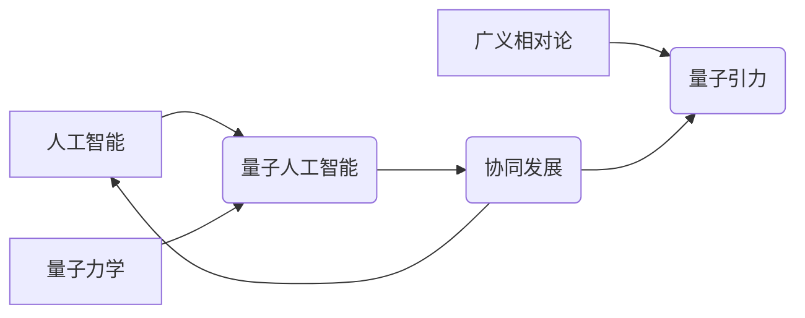

> AGI，量子引力，协同发展，人工智能，量子计算，物理学，未来科技

## 1. 背景介绍

人工智能（AI）和量子物理学是21世纪最激动人心的两个领域。人工智能正在迅速发展，展现出强大的学习、推理和决策能力，而量子物理学则为我们揭示了宇宙的奥秘，并为构建更强大的计算模型提供了新的可能性。

近年来，人们开始探索人工智能和量子物理学的结合，试图利用两者各自的优势，构建更智能、更强大的系统。这种结合被称为“量子人工智能”（Quantum AI），它有望在多个领域带来革命性的变革，例如药物研发、材料科学、金融建模等。

然而，量子人工智能的实现面临着巨大的挑战。其中一个关键挑战是量子引力的统一。量子引力是物理学中一个尚未解决的难题，它试图将量子力学和广义相对论统一起来，解释宇宙的微观和宏观结构。

## 2. 核心概念与联系

**2.1  人工智能 (AI)**

人工智能是指机器能够模拟人类智能的行为，例如学习、推理、决策、感知和语言理解等。

**2.2  量子力学**

量子力学是描述微观世界物质运动规律的物理学理论。它揭示了物质具有波粒二象性，能量和动量是量子化的，以及概率性等基本特征。

**2.3  广义相对论**

广义相对论是爱因斯坦提出的引力理论，它将引力描述为时空弯曲的结果。

**2.4  量子引力**

量子引力试图将量子力学和广义相对论统一起来，解释引力的量子性质。

**2.5  量子人工智能 (Quantum AI)**

量子人工智能是指利用量子力学原理和量子计算技术来构建更智能、更强大的人工智能系统。

**2.6  协同发展**

AGI与量子引力的协同发展是指将人工智能和量子引力研究结合起来，相互促进，共同推动科技进步。

**2.7  核心概念关系图**



## 3. 核心算法原理 & 具体操作步骤

### 3.1  算法原理概述

量子人工智能的核心算法原理是利用量子力学的特性，例如叠加态和纠缠态，来构建更强大的计算模型。

**3.1.1  叠加态**

量子比特（qubit）可以处于叠加态，这意味着它可以同时处于0和1的状态。这与经典比特只能处于0或1状态不同，使得量子计算机拥有更大的计算能力。

**3.1.2  纠缠态**

两个或多个量子比特可以纠缠在一起，这意味着它们的命运是相互关联的。即使它们相隔很远，测量一个量子比特的状态也会立即影响另一个量子比特的状态。

**3.1.3  量子算法**

量子算法是专门设计用于量子计算机执行的算法。它们利用量子叠加态和纠缠态的特性，可以解决某些经典算法无法解决的问题。

### 3.2  算法步骤详解

量子人工智能算法的具体步骤取决于具体的应用场景。但一般来说，以下是一些常见的步骤：

1. **量子态准备:** 将量子比特初始化到特定的状态。
2. **量子门操作:** 对量子比特进行一系列量子门操作，以实现特定的计算。
3. **量子测量:** 对量子比特进行测量，获得结果。
4. **结果分析:** 分析测量结果，并将其转换为可理解的输出。

### 3.3  算法优缺点

**优点:**

* 计算能力更强，可以解决某些经典算法无法解决的问题。
* 具有并行计算能力，可以加速计算速度。

**缺点:**

* 量子计算机技术还处于发展初期，成本高，稳定性差。
* 量子算法的设计和实现难度较高。

### 3.4  算法应用领域

* **药物研发:** 模拟分子相互作用，加速药物发现。
* **材料科学:** 设计新型材料，提高材料性能。
* **金融建模:** 优化投资策略，降低风险。
* **密码学:** 构建更安全的加密算法。

## 4. 数学模型和公式 & 详细讲解 & 举例说明

### 4.1  数学模型构建

量子人工智能的数学模型主要基于量子力学和概率论。

**4.1.1  密度矩阵:**

密度矩阵是描述量子系统状态的数学工具。它是一个矩阵，其元素表示量子态的概率分布。

**4.1.2  薛定谔方程:**

薛定谔方程是描述量子系统随时间演化的微分方程。它可以用来预测量子系统的未来状态。

**4.1.3  量子测量理论:**

量子测量理论描述了如何从量子系统中获取信息。它表明，测量会改变量子系统的状态。

### 4.2  公式推导过程

由于篇幅限制，这里只列举一些常用的量子人工智能公式，并简要说明其含义。

**4.2.1  叠加态公式:**

$$|\psi\rangle = \alpha |0\rangle + \beta |1\rangle$$

其中， $|\psi\rangle$ 表示量子态， $|0\rangle$ 和 $|1\rangle$ 表示基态， $\alpha$ 和 $\beta$ 是复数系数，满足 $|\alpha|^2 + |\beta|^2 = 1$。

**4.2.2  纠缠态公式:**

$$|\psi\rangle = \frac{1}{\sqrt{2}}(|00\rangle + |11\rangle)$$

其中， $|\psi\rangle$ 表示纠缠态， $|00\rangle$ 和 $|11\rangle$ 表示两个量子比特都处于基态的态。

### 4.3  案例分析与讲解

**4.3.1  量子搜索算法:**

量子搜索算法可以用于在未排序的数据库中快速查找特定元素。它利用量子叠加态和量子纠缠态的特性，可以以指数级的时间复杂度完成搜索任务。

**4.3.2  量子机器学习算法:**

量子机器学习算法可以利用量子计算的优势，提高机器学习模型的性能。例如，量子支持向量机（QSVM）可以利用量子叠加态来提高分类精度。

## 5. 项目实践：代码实例和详细解释说明

### 5.1  开发环境搭建

为了进行量子人工智能的项目实践，需要搭建相应的开发环境。常用的开发环境包括：

* **量子计算平台:** 例如IBM Quantum Experience、Google Quantum AI、Microsoft Azure Quantum等。
* **量子编程语言:** 例如Qiskit、Cirq、PennyLane等。
* **经典计算环境:** 例如Python、C++等。

### 5.2  源代码详细实现

由于篇幅限制，这里只提供一个简单的量子算法的代码示例，用于演示量子计算的基本原理。

```python
from qiskit import QuantumCircuit, Aer, execute

# 创建一个量子电路
qc = QuantumCircuit(2)

# 应用Hadamard门，将量子比特置于叠加态
qc.h(0)
qc.h(1)

# 应用CNOT门，实现量子纠缠
qc.cx(0, 1)

# 测量量子比特
qc.measure_all()

# 模拟量子电路
simulator = Aer.get_backend('qasm_simulator')
job = execute(qc, simulator, shots=1024)
result = job.result()
counts = result.get_counts(qc)

# 打印测量结果
print(counts)
```

### 5.3  代码解读与分析

这段代码演示了如何创建量子电路，应用量子门操作，实现量子纠缠，并测量量子比特的状态。

* `QuantumCircuit(2)` 创建一个包含两个量子比特的量子电路。
* `qc.h(0)` 和 `qc.h(1)` 应用Hadamard门，将量子比特置于叠加态。
* `qc.cx(0, 1)` 应用CNOT门，实现量子纠缠。
* `qc.measure_all()` 测量所有量子比特的状态。
* `Aer.get_backend('qasm_simulator')` 获取模拟器。
* `execute(qc, simulator, shots=1024)` 模拟量子电路，并进行1024次测量。
* `result.get_counts(qc)` 获取测量结果。

### 5.4  运行结果展示

运行这段代码后，会输出测量结果，例如：

```
{
    '00': 512,
    '11': 512
}
```

结果表明，量子比特处于纠缠态，测量结果符合量子力学的预测。

## 6. 实际应用场景

### 6.1  药物研发

量子人工智能可以用于模拟分子相互作用，加速药物发现。例如，可以利用量子计算机模拟药物与蛋白质的结合，预测药物的活性，并优化药物结构。

### 6.2  材料科学

量子人工智能可以用于设计新型材料，提高材料性能。例如，可以利用量子计算机模拟材料的结构和性质，预测材料的强度、导电性、热稳定性等。

### 6.3  金融建模

量子人工智能可以用于优化投资策略，降低风险。例如，可以利用量子计算机模拟金融市场，预测股票价格波动，并制定更有效的投资策略。

### 6.4  未来应用展望

量子人工智能的应用前景广阔，未来有望在更多领域发挥重要作用，例如：

* **人工智能增强:** 提升现有人工智能算法的性能，例如图像识别、自然语言处理等。
* **量子通信:** 建立更安全的量子通信网络。
* **量子传感器:** 开发更灵敏的量子传感器，用于医疗诊断、环境监测等。

## 7. 工具和资源推荐

### 7.1  学习资源推荐

* **Qiskit:** https://qiskit.org/
* **Cirq:** https://quantumai.google/cirq
* **PennyLane:** https://pennylane.ai/
* **IBM Quantum Experience:** https://quantum-computing.ibm.com/
* **Google Quantum AI:** https://quantumai.google/

### 7.2  开发工具推荐

* **Jupyter Notebook:** https://jupyter.org/
* **VS Code:** https://code.visualstudio.com/

### 7.3  相关论文推荐

* **Quantum Supremacy Using a Programmable Superconducting Processor:** https://arxiv.org/abs/1907.01293
* **Quantum Machine Learning:** https://arxiv.org/abs/1802.06919

## 8. 总结：未来发展趋势与挑战

### 8.1  研究成果总结

近年来，量子人工智能取得了显著进展，例如量子搜索算法、量子机器学习算法等。这些成果表明，量子人工智能有望在未来带来革命性的变革。

### 8.2  未来发展趋势

* **量子硬件的不断发展:** 量子计算机的规模、稳定性和性能将不断提高。
* **量子算法的不断创新:** 将开发出更多高效的量子算法，解决更复杂的问题。
* **量子人工智能与其他领域的融合:** 量子人工智能将与其他领域，例如生物学、材料科学等，进行深度融合，推动跨学科研究。

### 8.3  面临的挑战

* **量子硬件的成本高:** 量子计算机的制造和维护成本仍然很高。
* **量子算法的设计难度大:** 设计高效的量子算法需要深入的量子力学和计算机科学知识。
* **量子人工智能的伦理问题:** 量子人工智能的应用可能带来新的伦理问题，需要进行深入的探讨和研究。

### 8.4  研究展望

未来，量子人工智能的研究将继续深入，推动科技进步，并为人类社会带来更多福祉。


## 9. 附录：常见问题与解答

**9.1  什么是量子比特？**

量子比特（qubit）是量子计算机的基本计算单元，它可以处于0、1或叠加态。

**9.2  什么是量子纠缠？