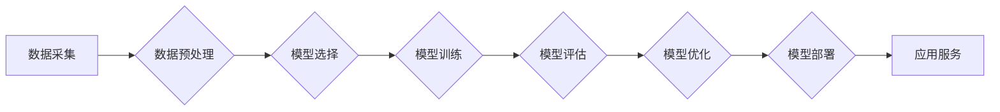

> AI工程学, 机器学习, 深度学习, 模型训练, 应用开发, 实战经验, 算法原理, 项目实践

## 1. 背景介绍

人工智能（AI）正以惊人的速度发展，从语音识别到图像生成，AI技术已经渗透到我们生活的方方面面。然而，将AI技术从实验室转化为实际应用，并非易事。AI工程学应运而生，它致力于将AI技术与工程实践相结合，构建可扩展、可靠、高效的AI应用系统。

随着AI技术的不断发展，AI工程学也面临着新的挑战和机遇。一方面，AI模型的复杂性不断增加，模型训练和部署的难度也随之提高。另一方面，AI应用场景日益多样化，对AI系统的性能、安全性和可解释性提出了更高的要求。

本书旨在为读者提供AI工程学的系统性学习指南，涵盖从核心概念到实际应用的各个方面。通过深入浅出的讲解、丰富的案例分析和实用的代码实例，帮助读者掌握AI工程学的知识和技能，并能够独立开发高质量的AI应用系统。

## 2. 核心概念与联系

AI工程学的核心概念包括：

* **机器学习（Machine Learning）:**  让计算机从数据中学习，无需明确编程，自动发现模式和规律。
* **深度学习（Deep Learning）:**  一种更高级的机器学习方法，利用多层神经网络模拟人类大脑的学习过程。
* **模型训练（Model Training）:**  使用训练数据，调整模型参数，使其能够准确预测或分类。
* **模型评估（Model Evaluation）:**  使用测试数据，评估模型的性能，例如准确率、召回率、F1-score等。
* **模型部署（Model Deployment）:**  将训练好的模型部署到实际应用环境中，使其能够提供服务。

**AI工程学流程图:**



## 3. 核心算法原理 & 具体操作步骤

### 3.1  算法原理概述

**线性回归（Linear Regression）**是一种监督学习算法，用于预测连续值。它假设数据之间存在线性关系，并通过最小化误差来找到最佳拟合直线。

### 3.2  算法步骤详解

1. **数据准备:** 收集并预处理数据，包括特征选择、数据清洗和数据标准化。
2. **模型构建:** 定义线性回归模型，即假设数据之间存在线性关系的方程。
3. **参数估计:** 使用最小二乘法或梯度下降法等算法，估计模型参数，使得模型预测值与真实值之间的误差最小。
4. **模型评估:** 使用测试数据评估模型的性能，例如计算均方误差（MSE）或R-squared值。
5. **模型优化:** 根据评估结果，调整模型参数或选择其他模型，以提高模型性能。

### 3.3  算法优缺点

**优点:**

* 算法简单易懂，易于实现。
* 计算效率高，适合处理大规模数据。

**缺点:**

* 只能处理线性关系的数据。
* 对异常值敏感。

### 3.4  算法应用领域

* 房价预测
* 股票价格预测
* 销售额预测
* 医疗诊断

## 4. 数学模型和公式 & 详细讲解 & 举例说明

### 4.1  数学模型构建

线性回归模型的数学表达式为：

$$y = w_0 + w_1x_1 + w_2x_2 + ... + w_nx_n + \epsilon$$

其中：

* $y$ 是预测值
* $w_0, w_1, w_2, ..., w_n$ 是模型参数
* $x_1, x_2, ..., x_n$ 是输入特征
* $\epsilon$ 是误差项

### 4.2  公式推导过程

最小二乘法旨在找到使误差平方和最小的模型参数。误差平方和定义为：

$$J(w) = \sum_{i=1}^{m}(y_i - \hat{y}_i)^2$$

其中：

* $m$ 是样本数量
* $y_i$ 是真实值
* $\hat{y}_i$ 是模型预测值

通过求解 $J(w)$ 的梯度，并使用梯度下降法迭代更新参数，可以找到使误差平方和最小的模型参数。

### 4.3  案例分析与讲解

假设我们想要预测房屋价格，输入特征包括房屋面积、房间数量和地理位置。我们可以使用线性回归模型，将这些特征与房屋价格建立线性关系。

通过训练模型，我们可以得到模型参数，例如：

* $w_0 = 100000$
* $w_1 = 500$
* $w_2 = 10000$

这意味着，房屋面积每增加1平方米，价格会增加500元；房间数量每增加1个，价格会增加10000元。

## 5. 项目实践：代码实例和详细解释说明

### 5.1  开发环境搭建

本项目使用Python语言进行开发，需要安装以下软件包：

* NumPy
* Pandas
* Scikit-learn

可以使用pip命令安装：

```bash
pip install numpy pandas scikit-learn
```

### 5.2  源代码详细实现

```python
import numpy as np
from sklearn.linear_model import LinearRegression
from sklearn.model_selection import train_test_split

# 加载数据
data = np.loadtxt('housing.csv', delimiter=',')
X = data[:, :-1]  # 特征
y = data[:, -1]  # 目标值

# 数据分割
X_train, X_test, y_train, y_test = train_test_split(X, y, test_size=0.2, random_state=42)

# 创建线性回归模型
model = LinearRegression()

# 模型训练
model.fit(X_train, y_train)

# 模型预测
y_pred = model.predict(X_test)

# 模型评估
from sklearn.metrics import mean_squared_error
mse = mean_squared_error(y_test, y_pred)
print(f'Mean Squared Error: {mse}')
```

### 5.3  代码解读与分析

1. 首先，我们加载数据并将其分割为训练集和测试集。
2. 然后，我们创建线性回归模型并使用训练集进行模型训练。
3. 训练完成后，我们使用测试集进行模型预测，并计算模型的均方误差（MSE）作为模型性能指标。

### 5.4  运行结果展示

运行代码后，会输出模型的均方误差值。

## 6. 实际应用场景

### 6.1  金融领域

* 欺诈检测
* 风险评估
* 股票预测

### 6.2  医疗领域

* 疾病诊断
* 药物研发
* 患者个性化治疗

### 6.3  电商领域

* 商品推荐
* 销售预测
* 客户画像

### 6.4  未来应用展望

随着AI技术的不断发展，AI工程学将在更多领域得到应用，例如自动驾驶、机器人、智能家居等。

## 7. 工具和资源推荐

### 7.1  学习资源推荐

* **书籍:**
    * 《Hands-On Machine Learning with Scikit-Learn, Keras & TensorFlow》
    * 《Deep Learning》
* **在线课程:**
    * Coursera: Machine Learning
    * Udacity: Deep Learning Nanodegree

### 7.2  开发工具推荐

* **Python:** 
    * Jupyter Notebook
    * PyCharm
* **机器学习库:**
    * Scikit-learn
    * TensorFlow
    * PyTorch

### 7.3  相关论文推荐

* **《ImageNet Classification with Deep Convolutional Neural Networks》**
* **《Attention Is All You Need》**

## 8. 总结：未来发展趋势与挑战

### 8.1  研究成果总结

AI工程学取得了显著的成果，例如在图像识别、自然语言处理、语音识别等领域取得了突破性进展。

### 8.2  未来发展趋势

* **模型规模和复杂度不断增加:** 
* **模型可解释性和安全性越来越重要:** 
* **边缘计算和联邦学习的兴起:** 

### 8.3  面临的挑战

* **数据获取和隐私保护:** 
* **模型训练和部署的效率:** 
* **AI伦理和社会影响:** 

### 8.4  研究展望

未来，AI工程学将继续朝着更智能、更安全、更可解释的方向发展，并为人类社会带来更多福祉。

## 9. 附录：常见问题与解答

**Q1: 如何选择合适的AI模型？**

**A1:** 选择合适的AI模型取决于具体的应用场景和数据特点。例如，对于分类问题，可以考虑使用支持向量机（SVM）、决策树或神经网络；对于回归问题，可以考虑使用线性回归、逻辑回归或神经网络。

**Q2: 如何评估AI模型的性能？**

**A2:** AI模型的性能可以通过多种指标进行评估，例如准确率、召回率、F1-score、均方误差（MSE）等。

**Q3: 如何部署AI模型？**

**A3:** AI模型的部署方式多种多样，例如使用云平台、容器化部署、边缘部署等。

作者：禅与计算机程序设计艺术 / Zen and the Art of Computer Programming


<end_of_turn>