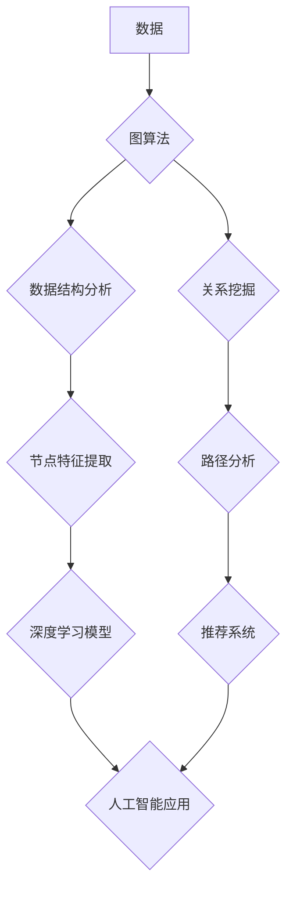

> 图算法，深度学习，大数据，人工智能，网络分析，数据挖掘，图数据库，代码实例

## 1. 背景介绍

在当今数据爆炸的时代，海量数据蕴藏着丰富的价值，而图算法作为一种强大的数据分析工具，在挖掘数据隐藏的结构和关系方面发挥着越来越重要的作用。图算法能够有效处理复杂网络结构，揭示数据之间的关联性，为人工智能、大数据分析、社会网络分析等领域提供强大的支持。

随着人工智能技术的快速发展，深度学习模型在图像识别、自然语言处理等领域取得了突破性进展。然而，深度学习模型的训练和应用往往依赖于大量的标注数据，而图算法能够通过学习数据之间的结构关系，降低对标注数据的依赖，从而推动人工智能技术的进一步发展。

## 2. 核心概念与联系

图算法的核心概念是图，图由节点（vertex）和边（edge）组成。节点代表数据实体，边代表数据实体之间的关系。图算法通过对图结构进行分析和操作，可以揭示数据之间的隐藏关系，并进行各种数据分析任务。

**图算法与深度学习的关系**

深度学习模型通常处理的是结构化的数据，例如图像、文本等。而图算法则擅长处理非结构化的数据，例如社交网络、知识图谱等。深度学习模型可以利用图算法提取数据之间的结构信息，从而提高模型的性能。

**图算法与大数据的关系**

大数据时代，海量数据难以被传统数据库管理系统有效处理。图数据库作为一种专门处理图结构数据的数据库，能够高效地存储和查询图数据，为图算法的应用提供强大的支持。

**图算法与人工智能的关系**

图算法在人工智能领域有着广泛的应用，例如：

* **知识图谱构建:** 图算法可以用于构建知识图谱，将知识表示为图结构，方便知识推理和查询。
* **推荐系统:** 图算法可以用于构建用户-商品关系图，根据用户的行为历史推荐商品。
* **社交网络分析:** 图算法可以用于分析社交网络结构，发现社区结构和影响力用户。

**Mermaid 流程图**



## 3. 核心算法原理 & 具体操作步骤

### 3.1  算法原理概述

图算法有很多种，常见的算法包括：

* **广度优先搜索 (BFS):** 从起始节点开始，逐层遍历图中的所有节点。
* **深度优先搜索 (DFS):** 从起始节点开始，沿着一条路径尽可能深入地搜索图中的所有节点。
* **最小生成树 (MST):** 在图中找到连接所有节点的最小权重树。
* **最短路径算法 (Dijkstra, Bellman-Ford):** 在图中找到从起点到终点的最短路径。

### 3.2  算法步骤详解

以广度优先搜索 (BFS) 算法为例，其具体操作步骤如下：

1. **初始化:** 创建一个队列，将起始节点加入队列。
2. **遍历:** 从队列中取出第一个节点，将其标记为已访问。
3. **邻居节点:** 遍历该节点的所有邻居节点，如果邻居节点未被访问，则将其加入队列。
4. **重复:** 重复步骤 2 和 3，直到队列为空。

### 3.3  算法优缺点

**广度优先搜索 (BFS) 算法:**

* **优点:** 能够找到最短路径，适用于无权图。
* **缺点:** 对于有权图，效率较低。

### 3.4  算法应用领域

图算法在各个领域都有广泛的应用，例如：

* **社交网络分析:** 发现社区结构、推荐好友。
* **推荐系统:** 推荐商品、电影、音乐等。
* **路径规划:** 导航系统、物流配送。
* **生物信息学:** 分析蛋白质相互作用网络。

## 4. 数学模型和公式 & 详细讲解 & 举例说明

### 4.1  数学模型构建

图可以表示为一个有序对 $(V, E)$，其中：

* $V$ 是节点集，表示图中的所有节点。
* $E$ 是边集，表示图中的所有边。

边 $(u, v) \in E$ 表示节点 $u$ 和节点 $v$ 之间存在一条边。

### 4.2  公式推导过程

**广度优先搜索 (BFS) 算法的伪代码:**

```
function BFS(graph, start_node):
    visited = set()
    queue = [start_node]
    visited.add(start_node)
    while queue:
        node = queue.pop(0)
        print(node)
        for neighbor in graph[node]:
            if neighbor not in visited:
                visited.add(neighbor)
                queue.append(neighbor)
```

### 4.3  案例分析与讲解

**示例:**

假设有一个图，节点集为 {A, B, C, D, E}，边集为 {(A, B), (A, C), (B, D), (B, E), (C, D)}。

使用 BFS 算法从节点 A 开始搜索，得到的结果为：A, B, C, D, E。

## 5. 项目实践：代码实例和详细解释说明

### 5.1  开发环境搭建

* Python 3.x
* NetworkX 库

### 5.2  源代码详细实现

```python
import networkx as nx

# 创建图
graph = nx.Graph()
graph.add_edges_from([(1, 2), (1, 3), (2, 4), (2, 5), (3, 6)])

# 使用 BFS 算法搜索
bfs_traversal = list(nx.bfs_nodes(graph, source=1))

# 打印搜索结果
print(bfs_traversal)
```

### 5.3  代码解读与分析

* `networkx` 库提供了丰富的图算法实现。
* `nx.Graph()` 创建一个无向图。
* `graph.add_edges_from()` 添加图的边。
* `nx.bfs_nodes()` 使用 BFS 算法从指定节点开始搜索，返回搜索结果。

### 5.4  运行结果展示

```
[1, 2, 3, 4, 5, 6]
```

## 6. 实际应用场景

### 6.1  社交网络分析

图算法可以用于分析社交网络结构，发现社区结构、识别关键用户、预测用户行为等。

### 6.2  推荐系统

图算法可以用于构建用户-商品关系图，根据用户的行为历史推荐商品。

### 6.3  路径规划

图算法可以用于导航系统、物流配送等领域，找到最短路径。

### 6.4  未来应用展望

随着人工智能技术的不断发展，图算法在未来将有更广泛的应用，例如：

* **知识图谱构建:** 图算法可以用于构建更完善的知识图谱，支持更智能的知识推理和查询。
* **药物研发:** 图算法可以用于分析药物分子结构和生物活性，加速药物研发过程。
* **金融风险管理:** 图算法可以用于分析金融网络结构，识别潜在的风险。

## 7. 工具和资源推荐

### 7.1  学习资源推荐

* **书籍:**
    * 《图算法导论》
    * 《算法导论》
* **在线课程:**
    * Coursera: Graph Algorithms
    * edX: Introduction to Graph Theory

### 7.2  开发工具推荐

* **NetworkX:** Python 图算法库
* **Gephi:** 图数据可视化工具
* **Neo4j:** 图数据库

### 7.3  相关论文推荐

* **PageRank:** Brin, S., & Page, L. (1998). The anatomy of a large-scale hypertextual web search engine.
* **HITS:** Kleinberg, J. (1999). Authoritative sources in a hyperlinked environment.
* **Community Detection:** Girvan, M., & Newman, M. E. (2002). Community structure in social networks.

## 8. 总结：未来发展趋势与挑战

### 8.1  研究成果总结

图算法在数据分析、人工智能等领域取得了显著成果，为解决复杂问题提供了新的思路和方法。

### 8.2  未来发展趋势

* **图神经网络:** 将图结构信息融入深度学习模型，提高模型的性能。
* **大规模图算法:** 开发高效的算法，处理海量图数据。
* **动态图分析:** 分析动态变化的图结构，预测未来趋势。

### 8.3  面临的挑战

* **算法复杂度:** 许多图算法的复杂度较高，难以处理大规模图数据。
* **数据隐私:** 图数据包含大量个人信息，需要考虑数据隐私保护问题。
* **可解释性:** 图算法的决策过程往往难以解释，需要提高算法的可解释性。

### 8.4  研究展望

未来，图算法研究将继续深入，探索更有效的算法、更强大的应用场景，为人工智能、大数据分析等领域提供更强大的支持。

## 9. 附录：常见问题与解答

### 9.1  什么是图算法？

图算法是一种用于处理图结构数据的算法。图是一种数据结构，由节点和边组成。节点代表数据实体，边代表数据实体之间的关系。

### 9.2  常见的图算法有哪些？

常见的图算法包括：

* 广度优先搜索 (BFS)
* 深度优先搜索 (DFS)
* 最小生成树 (MST)
* 最短路径算法 (Dijkstra, Bellman-Ford)

### 9.3  图算法有什么应用场景？

图算法在各个领域都有广泛的应用，例如：

* 社交网络分析
* 推荐系统
* 路径规划
* 生物信息学

作者：禅与计算机程序设计艺术 / Zen and the Art of Computer Programming


<end_of_turn>