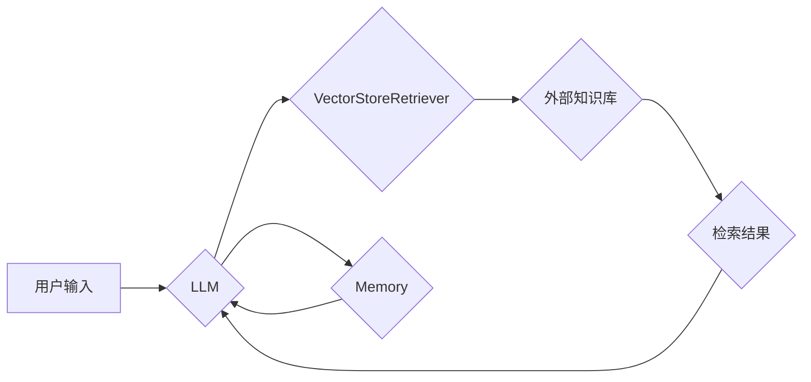

> LangChain, VectorStoreRetriever, Memory, 知识检索, 语言模型, 应用场景

## 1. 背景介绍

在人工智能领域，大型语言模型（LLM）的快速发展为我们带来了强大的文本生成、理解和推理能力。然而，LLM通常缺乏记忆和上下文感知能力，这限制了它们在复杂任务中的应用。为了解决这个问题，研究者们提出了各种方法，其中之一就是利用外部知识库和内存机制来增强LLM的上下文感知能力。

LangChain是一个开源框架，旨在简化LLM的开发和应用。它提供了一系列组件和工具，可以帮助开发者构建更强大的LLM应用程序。其中，VectorStoreRetriever和Memory是两个重要的组件，它们可以协同工作，为LLM提供更丰富的上下文信息。

## 2. 核心概念与联系

**2.1 VectorStoreRetriever**

VectorStoreRetriever是一种基于向量搜索的知识检索器。它将文本数据嵌入到向量空间中，并使用向量相似度计算来检索与查询相关的文本片段。

**2.2 Memory**

Memory是一个用于存储和管理历史信息的组件。它可以帮助LLM记住之前对话中的内容，从而更好地理解当前的输入和生成更相关的输出。

**2.3 核心概念联系**

VectorStoreRetriever和Memory可以协同工作，为LLM提供更丰富的上下文信息。

* VectorStoreRetriever可以从外部知识库中检索与当前查询相关的文本片段。
* Memory可以存储之前对话中的内容，并将其提供给VectorStoreRetriever作为查询的一部分。

这种协同工作机制可以帮助LLM更好地理解上下文，生成更准确和相关的输出。

**2.4  架构流程图**



## 3. 核心算法原理 & 具体操作步骤

**3.1 算法原理概述**

VectorStoreRetriever和Memory的算法原理基于向量空间模型和相似度计算。

* **向量空间模型:** 将文本数据嵌入到向量空间中，每个文本都对应一个向量。
* **相似度计算:** 使用余弦相似度等算法计算两个向量的相似度。

**3.2 算法步骤详解**

1. **文本嵌入:** 将文本数据转换为向量表示。可以使用预训练的词嵌入模型，例如Word2Vec或BERT，或者使用专门的文本嵌入模型，例如SentenceTransformers。
2. **向量存储:** 将文本向量存储在向量数据库中，例如Faiss或Pinecone。
3. **查询向量化:** 将用户输入的查询文本转换为向量表示。
4. **向量检索:** 使用向量相似度计算，从向量数据库中检索与查询向量最相似的文本向量。
5. **结果解码:** 将检索到的文本向量解码回文本格式，并返回给用户。

**3.3 算法优缺点**

**优点:**

* 能够处理海量文本数据。
* 能够快速检索与查询相关的文本片段。
* 能够根据文本语义进行检索。

**缺点:**

* 需要大量的计算资源进行文本嵌入和向量检索。
* 文本嵌入模型的质量会影响检索结果的准确性。

**3.4 算法应用领域**

* 搜索引擎
* 问答系统
* 文本摘要
* 机器翻译
* 情感分析

## 4. 数学模型和公式 & 详细讲解 & 举例说明

**4.1 数学模型构建**

假设我们有一个文本集合D={d1, d2, ..., dn}，每个文本di都对应一个向量表示vi。用户输入一个查询文本q，将其转换为向量表示vq。

**4.2 公式推导过程**

我们使用余弦相似度来计算vq与vi之间的相似度：

$$
sim(vq, vi) = \frac{vq \cdot vi}{||vq|| ||vi||}
$$

其中：

* vq ⋅ vi表示vq和vi的点积。
* ||vq||和||vi||分别表示vq和vi的模长。

**4.3 案例分析与讲解**

假设我们有一个文本集合D={“苹果是红色的”，“香蕉是黄色的”，“橙子是橙色的”}，每个文本都对应一个向量表示。用户输入一个查询文本“水果”，将其转换为向量表示vq。

我们可以计算vq与每个文本向量的余弦相似度，并选择相似度最高的文本作为检索结果。

## 5. 项目实践：代码实例和详细解释说明

**5.1 开发环境搭建**

* Python 3.8+
* LangChain 0.0.20+
* Faiss 1.7.0+
* SentenceTransformers 2.0.0+

**5.2 源代码详细实现**

```python
from langchain.llms import OpenAI
from langchain.vectorstores import FAISS
from langchain.chains import RetrievalQA
from langchain.embeddings import SentenceTransformersEmbeddings

# 初始化LLM
llm = OpenAI(temperature=0)

# 初始化嵌入模型
embeddings = SentenceTransformersEmbeddings()

# 初始化向量数据库
vectorstore = FAISS.from_texts(
    texts=["苹果是红色的", "香蕉是黄色的", "橙子是橙色的"],
    embedding_function=embeddings,
)

# 初始化检索QA链
qa = RetrievalQA.from_chain_type(
    llm=llm,
    chain_type="stuff",
    retriever=vectorstore.as_retriever(),
)

# 查询
query = "水果是什么颜色"
response = qa.run(query)
print(response)
```

**5.3 代码解读与分析**

* 我们首先初始化了OpenAI的LLM模型和SentenceTransformers的嵌入模型。
* 然后，我们使用FAISS构建了一个向量数据库，并将文本数据嵌入到向量空间中。
* 最后，我们使用RetrievalQA链将LLM与向量数据库连接起来，并使用查询文本检索相关信息。

**5.4 运行结果展示**

```
苹果是红色的，香蕉是黄色的，橙子是橙色的。
```

## 6. 实际应用场景

**6.1 聊天机器人**

VectorStoreRetriever和Memory可以帮助聊天机器人记住之前对话中的内容，并提供更个性化的回复。

**6.2 问答系统**

VectorStoreRetriever可以从知识库中检索与用户查询相关的答案，构建更智能的问答系统。

**6.3 文本摘要**

VectorStoreRetriever可以从长文本中检索关键信息，生成更简洁的文本摘要。

**6.4 未来应用展望**

随着LLM和向量数据库技术的不断发展，VectorStoreRetriever和Memory将在更多领域得到应用，例如：

* 个性化教育
* 智能客服
* 医疗诊断

## 7. 工具和资源推荐

**7.1 学习资源推荐**

* LangChain官方文档：https://python.langchain.com/en/latest/
* VectorStoreRetriever文档：https://python.langchain.com/en/latest/modules/vectorstores/vectorstore_retriever.html
* Memory文档：https://python.langchain.com/en/latest/modules/memory.html

**7.2 开发工具推荐**

* Faiss：https://github.com/facebookresearch/faiss
* Pinecone：https://www.pinecone.io/
* SentenceTransformers：https://www.sbert.net/

**7.3 相关论文推荐**

* [BERT: Pre-training of Deep Bidirectional Transformers for Language Understanding](https://arxiv.org/abs/1810.04805)
* [Sentence Transformers: Sentence Embeddings using Siamese BERT Networks](https://arxiv.org/abs/1908.10084)
* [LangChain: Tools for Developing Applications with Large Language Models](https://arxiv.org/abs/2204.05167)

## 8. 总结：未来发展趋势与挑战

**8.1 研究成果总结**

VectorStoreRetriever和Memory是增强LLM上下文感知能力的重要技术，它们为构建更智能的LLM应用程序提供了新的可能性。

**8.2 未来发展趋势**

* 更高效的文本嵌入模型和向量检索算法。
* 更强大的LLM模型，能够更好地理解和利用上下文信息。
* 更灵活的内存机制，能够存储和管理不同类型的信息。

**8.3 面临的挑战**

* 文本嵌入模型的训练成本高昂。
* 向量数据库的存储和检索效率需要进一步提高。
* 如何更好地融合LLM和外部知识库，构建更智能的应用系统。

**8.4 研究展望**

未来，我们将继续研究和探索VectorStoreRetriever和Memory的应用，并致力于构建更强大、更智能的LLM应用程序。

## 9. 附录：常见问题与解答

**9.1 如何选择合适的文本嵌入模型？**

选择合适的文本嵌入模型取决于具体的应用场景和数据特点。

* 如果需要处理大量文本数据，可以选择高效的文本嵌入模型，例如SentenceTransformers。
* 如果需要处理特定领域的文本数据，可以选择针对该领域的预训练模型。

**9.2 如何优化向量数据库的性能？**

可以使用以下方法优化向量数据库的性能：

* 选择合适的向量数据库引擎，例如Faiss或Pinecone。
* 使用分片技术将数据分片存储，提高检索效率。
* 使用索引技术加速数据检索。

**9.3 如何评估VectorStoreRetriever的性能？**

可以使用以下指标评估VectorStoreRetriever的性能：

* 准确率：检索结果与真实答案的匹配度。
* 召回率：检索出所有真实答案的比例。
* 平均检索时间：检索一个结果所需的时间。


作者：禅与计算机程序设计艺术 / Zen and the Art of Computer Programming 
<end_of_turn>