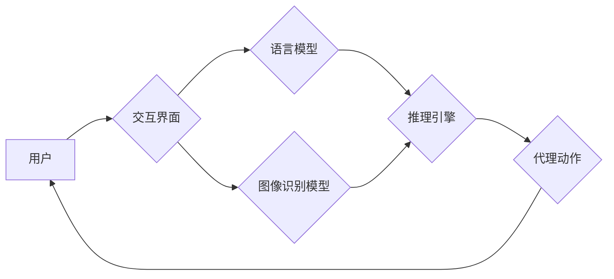

> LangChain, 多模态代理, 语言模型, 图像理解, 代码生成, 人机交互, 实际应用

## 1. 背景介绍

近年来，人工智能技术取得了飞速发展，特别是深度学习的突破，使得语言模型（如GPT-3、LaMDA）和图像识别模型（如DALL-E 2、Stable Diffusion）取得了令人瞩目的成果。这些模型能够理解和生成人类语言、图像等多种模态信息，为构建更智能、更自然的交互体验提供了强大的基础。

多模态代理作为一种新型的人机交互方式，旨在融合不同模态信息，实现更智能、更全面的交互体验。例如，一个多模态代理可以理解用户的语音指令，并根据用户的意图生成相应的文本回复，同时还可以根据用户的需求生成相关的图像或视频。

LangChain 是一个强大的开源框架，专门用于构建和部署应用程序，它提供了丰富的工具和组件，可以帮助开发者轻松地构建多模态代理。

## 2. 核心概念与联系

**2.1 多模态代理的核心概念**

多模态代理的核心概念是融合不同模态信息，实现更智能、更全面的交互体验。它通常由以下几个关键组件组成：

* **语言模型:** 用于理解和生成人类语言，例如GPT-3、LaMDA等。
* **图像识别模型:** 用于理解和分析图像信息，例如DALL-E 2、Stable Diffusion等。
* **推理引擎:** 用于根据多模态信息进行推理和决策，例如基于规则的推理、基于机器学习的推理等。
* **交互界面:** 用于与用户进行交互，例如文本界面、语音界面、图形界面等。

**2.2 多模态代理的架构**



**2.3 LangChain 在多模态代理中的作用**

LangChain 提供了丰富的工具和组件，可以帮助开发者轻松地构建多模态代理。例如：

* **模态链:** 可以将不同的模态模型串联起来，实现多模态信息交互。
* **代理:** 可以定义代理的行为和交互逻辑，例如根据用户指令执行特定任务。
* **工具:** 提供了各种工具，例如文本处理工具、图像处理工具等，可以帮助开发者构建更复杂的代理。

## 3. 核心算法原理 & 具体操作步骤

**3.1 算法原理概述**

多模态代理的核心算法原理是融合不同模态信息，实现更智能、更全面的交互体验。这通常涉及以下几个步骤：

1. **信息提取:** 从不同模态信息中提取关键信息，例如文本中的关键词、图像中的物体等。
2. **信息融合:** 将提取到的信息融合在一起，形成一个综合的表示。
3. **推理决策:** 根据融合后的信息进行推理和决策，例如判断用户的意图、生成相应的回复等。
4. **输出生成:** 将推理结果转化为相应的输出，例如文本、图像、语音等。

**3.2 算法步骤详解**

1. **信息提取:**

* **文本信息提取:** 可以使用自然语言处理（NLP）技术，例如词嵌入、主题模型等，提取文本中的关键词、实体、关系等信息。
* **图像信息提取:** 可以使用计算机视觉（CV）技术，例如目标检测、图像分类等，提取图像中的物体、场景、属性等信息。

2. **信息融合:**

* **特征融合:** 将不同模态的信息表示为向量，然后使用融合方法将向量进行融合，例如加权平均、拼接等。
* **图结构融合:** 将不同模态的信息表示为图结构，然后使用图神经网络（GNN）等方法进行融合。

3. **推理决策:**

* **规则推理:** 根据预先定义的规则，对融合后的信息进行推理和决策。
* **机器学习推理:** 使用机器学习模型，例如支持向量机（SVM）、决策树等，对融合后的信息进行分类或回归，从而进行决策。

4. **输出生成:**

* **文本生成:** 使用文本生成模型，例如GPT-3、LaMDA等，根据推理结果生成相应的文本回复。
* **图像生成:** 使用图像生成模型，例如DALL-E 2、Stable Diffusion等，根据推理结果生成相应的图像。

**3.3 算法优缺点**

* **优点:**

    * 可以融合不同模态信息，实现更智能、更全面的交互体验。
    * 可以处理更复杂的任务，例如图像识别、文本生成、对话系统等。

* **缺点:**

    * 算法复杂度较高，需要大量的计算资源。
    * 需要大量的训练数据，才能达到较好的效果。

**3.4 算法应用领域**

* **人机交互:** 构建更智能、更自然的交互体验，例如聊天机器人、虚拟助手等。
* **内容创作:** 自动生成文本、图像、视频等内容，例如新闻报道、广告文案、艺术作品等。
* **教育培训:** 提供个性化的学习体验，例如智能辅导、虚拟课堂等。
* **医疗健康:** 辅助医生诊断疾病、制定治疗方案等。

## 4. 数学模型和公式 & 详细讲解 & 举例说明

**4.1 数学模型构建**

多模态代理的数学模型通常基于以下几个方面：

* **模态嵌入:** 将不同模态的信息表示为向量，例如文本的词嵌入、图像的特征向量等。
* **融合机制:** 将不同模态的向量进行融合，形成一个综合的表示。
* **决策模型:** 根据融合后的信息进行推理和决策，例如分类、回归等。

**4.2 公式推导过程**

假设我们有两个模态的信息，分别是文本信息 $T$ 和图像信息 $I$。

* **模态嵌入:**

    * 文本嵌入: $T_e = f_t(T)$，其中 $f_t$ 是文本嵌入函数。
    * 图像嵌入: $I_e = f_i(I)$，其中 $f_i$ 是图像嵌入函数。

* **融合机制:**

    * 加权平均融合: $M = \alpha T_e + (1-\alpha) I_e$，其中 $\alpha$ 是权重系数。

* **决策模型:**

    * 分类: 使用分类模型 $g$ 对融合后的信息 $M$ 进行分类，例如 $y = g(M)$。

**4.3 案例分析与讲解**

例如，我们构建一个多模态代理，用于识别用户的情绪。

* **文本信息:** 用户输入的文本内容。
* **图像信息:** 用户上传的图像，例如用户的表情。

我们可以使用上述的数学模型，将文本信息和图像信息进行融合，然后使用分类模型识别用户的的情绪。

## 5. 项目实践：代码实例和详细解释说明

**5.1 开发环境搭建**

* Python 3.7+
* PyTorch 或 TensorFlow
* LangChain

**5.2 源代码详细实现**

```python
from langchain.agents import initialize_agent
from langchain.chains import ConversationChain
from langchain.llms import OpenAI
from langchain.tools import Tool

# 定义工具
tool = Tool(
    name="image_captioning",
    func=lambda image: "This is a description of the image.",
    description="Generate a caption for an image.",
)

# 初始化语言模型
llm = OpenAI(temperature=0.7)

# 初始化代理
agent = initialize_agent(
    tools=[tool],
    llm=llm,
    agent="zero-shot-react-description",
)

# 创建对话链
conversation = ConversationChain(agent=agent)

# 与代理交互
response = conversation.run("Show me a picture of a cat.")
print(response)
```

**5.3 代码解读与分析**

* 我们首先定义了一个工具，用于生成图像的描述。
* 然后，我们初始化了一个语言模型和一个代理。
* 最后，我们创建了一个对话链，并与代理交互。

**5.4 运行结果展示**

代理会根据用户的指令，生成相应的图像描述。

## 6. 实际应用场景

**6.1 聊天机器人**

多模态代理可以构建更智能、更自然的聊天机器人，例如可以理解用户的语音指令，并根据用户的意图生成相应的文本回复，同时还可以根据用户的需求生成相关的图像或视频。

**6.2 教育培训**

多模态代理可以提供个性化的学习体验，例如智能辅导、虚拟课堂等。例如，一个多模态代理可以根据学生的学习进度和理解情况，提供相应的学习内容和辅导。

**6.3 医疗健康**

多模态代理可以辅助医生诊断疾病、制定治疗方案等。例如，一个多模态代理可以根据患者的病历、检查结果和语音描述，辅助医生进行诊断。

**6.4 未来应用展望**

随着人工智能技术的不断发展，多模态代理的应用场景将会更加广泛。例如，可以用于虚拟现实、增强现实、自动驾驶等领域。

## 7. 工具和资源推荐

**7.1 学习资源推荐**

* **LangChain 官方文档:** https://python.langchain.com/docs/
* **Hugging Face:** https://huggingface.co/
* **OpenAI API:** https://beta.openai.com/docs/api-reference/introduction

**7.2 开发工具推荐**

* **Python:** https://www.python.org/
* **PyTorch:** https://pytorch.org/
* **TensorFlow:** https://www.tensorflow.org/

**7.3 相关论文推荐**

* **BERT: Pre-training of Deep Bidirectional Transformers for Language Understanding:** https://arxiv.org/abs/1810.04805
* **GPT-3: Language Models are Few-Shot Learners:** https://arxiv.org/abs/2005.14165
* **DALL-E 2: Hierarchical Text-Conditional Image Generation with CLIP Latents:** https://arxiv.org/abs/2102.12092

## 8. 总结：未来发展趋势与挑战

**8.1 研究成果总结**

近年来，多模态代理取得了显著的进展，例如在图像识别、文本生成、对话系统等领域取得了令人瞩目的成果。

**8.2 未来发展趋势**

* **更强大的多模态模型:** 随着人工智能技术的不断发展，未来将会出现更强大的多模态模型，能够更好地理解和生成不同模态信息。
* **更智能的交互体验:** 未来多模态代理将更加智能、更加自然，能够更好地理解用户的意图，并提供更个性化的服务。
* **更广泛的应用场景:** 多模态代理的应用场景将会更加广泛，例如虚拟现实、增强现实、自动驾驶等领域。

**8.3 面临的挑战**

* **数据获取和标注:** 多模态代理需要大量的训练数据，而获取和标注这些数据非常困难。
* **模型训练和优化:** 多模态代理模型的训练和优化非常复杂，需要大量的计算资源和专业知识。
* **伦理和安全问题:** 多模态代理的应用可能会带来一些伦理和安全问题，例如数据隐私、算法偏见等。

**8.4 研究展望**

未来，我们需要继续研究和探索多模态代理的理论和技术，以解决上述挑战，并推动多模态代理的健康发展。

## 9. 附录：常见问题与解答

**9.1 如何选择合适的模态模型？**

选择合适的模态模型取决于具体的应用场景。例如，如果需要识别图像中的物体，可以选择目标检测模型；如果需要生成文本，可以选择文本生成模型。

**9.2 如何融合不同模态的信息？**

常用的融合方法包括加权平均融合、拼接融合、图结构融合等。

**9.3 如何评估多模态代理的性能？**

常用的评估指标包括准确率、召回率、F1-score等。

**9.4 多