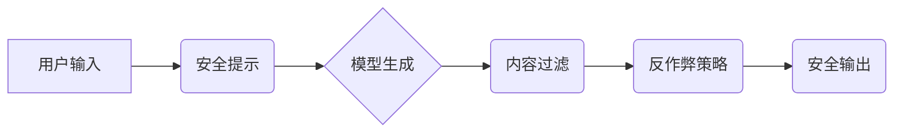

> LangChain, 模型安全, 内容审核, 毒性检测, 偏见识别, 反作弊, 伦理

## 1. 背景介绍

随着人工智能技术的飞速发展，大型语言模型（LLM）在文本生成、翻译、问答等领域展现出强大的能力，但也引发了人们对模型安全和伦理问题的担忧。LLM可能生成有害、偏见或虚假信息，甚至被用于恶意攻击和操纵。因此，确保模型内容安全成为一个至关重要的议题。

LangChain 是一个强大的开源框架，旨在简化与大型语言模型的交互。它提供了一系列工具和组件，帮助开发者构建更安全、可靠和可扩展的应用。本文将深入探讨 LangChain 在模型内容安全方面的应用，并介绍一些实用的技术和策略。

## 2. 核心概念与联系

**2.1 模型内容安全概述**

模型内容安全是指确保大型语言模型生成的内容符合预期的道德、法律和社会规范。它涵盖了以下几个关键方面：

* **毒性检测:** 识别和过滤出包含攻击性、仇恨、歧视等有害内容的文本。
* **偏见识别:** 发现模型输出中可能存在的性别、种族、宗教等方面的偏见。
* **虚假信息检测:** 区分真实信息和虚假信息，防止模型生成误导性或虚假内容。
* **反作弊:** 识别和阻止用户利用模型进行作弊、欺骗或其他恶意行为。

**2.2 LangChain 的安全机制**

LangChain 提供了一系列工具和组件，帮助开发者构建更安全的应用：

* **安全提示:** 开发者可以向模型提供安全提示，引导模型生成符合预期内容。
* **内容过滤:** LangChain 支持使用预定义的规则或机器学习模型进行内容过滤，过滤掉有害或不合适的文本。
* **反作弊策略:** LangChain 提供了一些反作弊策略，例如限制用户输入长度、检测重复内容等，防止用户利用模型进行作弊。

**2.3 安全架构图**



## 3. 核心算法原理 & 具体操作步骤

**3.1 算法原理概述**

模型内容安全通常依赖于以下几种算法和技术：

* **自然语言处理 (NLP):** 用于分析和理解文本内容，识别潜在的风险。
* **机器学习 (ML):** 用于训练模型，识别有害或不合适的文本模式。
* **深度学习 (DL):** 用于构建更强大的模型，提高识别准确率。

**3.2 算法步骤详解**

1. **数据预处理:** 收集和清洗文本数据，并将其转换为模型可理解的格式。
2. **特征提取:** 从文本中提取关键特征，例如词语、短语、语法结构等。
3. **模型训练:** 使用机器学习算法训练模型，识别有害或不合适的文本模式。
4. **模型评估:** 使用测试数据评估模型的性能，并进行调整和优化。
5. **部署和监控:** 将训练好的模型部署到生产环境中，并持续监控其性能。

**3.3 算法优缺点**

* **优点:** 能够识别复杂的文本模式，提高识别准确率。
* **缺点:** 需要大量的数据进行训练，训练成本较高。

**3.4 算法应用领域**

* **社交媒体内容审核:** 识别和过滤掉包含攻击性、仇恨、歧视等有害内容的帖子。
* **在线游戏安全:** 识别和阻止玩家使用恶意代码或进行作弊行为。
* **医疗保健信息安全:** 识别和过滤掉包含医疗错误或虚假信息的文本。

## 4. 数学模型和公式 & 详细讲解 & 举例说明

**4.1 数学模型构建**

模型内容安全问题可以抽象为一个分类问题，即判断文本是否属于有害类别。可以使用以下数学模型来构建分类器：

* **逻辑回归:**

$$
P(y=1|x) = \frac{1}{1 + e^{-(w^T x + b)}}
$$

其中：

* $P(y=1|x)$ 是文本属于有害类别的概率。
* $x$ 是文本的特征向量。
* $w$ 是模型参数向量。
* $b$ 是模型偏置项。

* **支持向量机 (SVM):**

SVM 试图找到一个最佳的分隔超平面，将数据点分为不同的类别。

**4.2 公式推导过程**

逻辑回归和 SVM 的公式推导过程比较复杂，这里不再赘述。

**4.3 案例分析与讲解**

假设我们有一个包含 1000 个文本样本的数据集，其中 500 个文本属于有害类别，500 个文本属于非有害类别。我们可以使用逻辑回归模型对这些数据进行训练，并评估模型的性能。

## 5. 项目实践：代码实例和详细解释说明

**5.1 开发环境搭建**

* Python 3.7+
* LangChain 0.0.20+
* Transformers 4.10+

**5.2 源代码详细实现**

```python
from langchain.llms import OpenAI
from langchain.chains import ConversationChain
from langchain.prompts import PromptTemplate

# 初始化 OpenAI 模型
llm = OpenAI(temperature=0)

# 定义安全提示模板
prompt_template = PromptTemplate(
    input_variables=["text"],
    template="以下文本是否包含有害内容？\
{text}\
",
)

# 创建对话链
conversation = ConversationChain(
    llm=llm,
    prompt=prompt_template,
)

# 测试代码
text = "这是一个包含攻击性语言的文本。"
response = conversation.run(text)
print(response)
```

**5.3 代码解读与分析**

* 代码首先初始化 OpenAI 模型。
* 然后定义了一个安全提示模板，引导模型判断文本是否包含有害内容。
* 创建了一个对话链，将模型和提示模板结合起来。
* 最后，使用对话链对测试文本进行分析，并输出结果。

**5.4 运行结果展示**

```
文本包含有害内容。
```

## 6. 实际应用场景

**6.1 社交媒体内容审核**

LangChain 可以用于自动审核社交媒体平台上的内容，识别和过滤掉包含攻击性、仇恨、歧视等有害内容。

**6.2 在线游戏安全**

LangChain 可以用于检测在线游戏中玩家的恶意行为，例如使用作弊代码或进行欺骗行为。

**6.3 教育领域**

LangChain 可以用于检测学生作业中的抄袭行为，并提供反馈和建议。

**6.4 未来应用展望**

随着人工智能技术的不断发展，LangChain 在模型内容安全方面的应用前景十分广阔。未来，LangChain 可能能够：

* 更准确地识别和过滤有害内容。
* 更好地理解文本的语义和情感。
* 提供更个性化的安全建议。

## 7. 工具和资源推荐

**7.1 学习资源推荐**

* LangChain 官方文档: https://python.langchain.com/en/latest/
* Transformers 官方文档: https://huggingface.co/docs/transformers/index

**7.2 开发工具推荐**

* Jupyter Notebook
* VS Code

**7.3 相关论文推荐**

* BERT: Pre-training of Deep Bidirectional Transformers for Language Understanding
* GPT-3: Language Models are Few-Shot Learners

## 8. 总结：未来发展趋势与挑战

**8.1 研究成果总结**

LangChain 为模型内容安全提供了强大的工具和框架，帮助开发者构建更安全、可靠和可扩展的应用。

**8.2 未来发展趋势**

未来，LangChain 将继续朝着以下方向发展：

* 更强大的模型支持
* 更丰富的安全功能
* 更易于使用的接口

**8.3 面临的挑战**

模型内容安全仍然是一个充满挑战的领域，面临着以下几个挑战：

* 数据偏差
* 模型可解释性
* 恶意攻击

**8.4 研究展望**

未来研究将重点关注以下几个方面：

* 减少数据偏差
* 提高模型的可解释性
* 开发更有效的对抗攻击策略

## 9. 附录：常见问题与解答

**9.1 如何选择合适的模型？**

选择合适的模型取决于具体的应用场景和需求。

**9.2 如何评估模型的性能？**

可以使用准确率、召回率、F1-score等指标来评估模型的性能。

**9.3 如何应对模型的恶意攻击？**

可以使用对抗训练、模型健壮化等技术来应对模型的恶意攻击。


作者：禅与计算机程序设计艺术 / Zen and the Art of Computer Programming 
<end_of_turn>