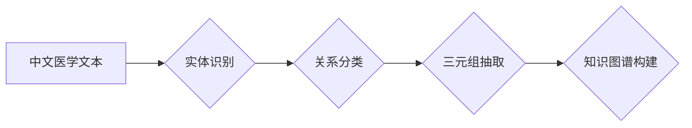

> 中文医学文本、关系抽取、自然语言处理、深度学习、知识图谱

## 1. 背景介绍

随着医疗信息化建设的不断深入，海量中文医学文本数据不断涌现。这些文本蕴含着丰富的医学知识，例如疾病、症状、治疗方法、药物等之间的关系。有效地从中文医学文本中抽取这些关系，能够为临床诊断、药物研发、医疗决策等领域提供重要的支持。

关系抽取（Relation Extraction，RE）是自然语言处理（Natural Language Processing，NLP）领域的重要任务之一，旨在识别文本中实体之间的关系。传统的RE方法主要依赖于手工设计的规则和特征工程，但对于中文医学文本这种结构复杂、语义丰富的文本类型，手工规则难以完全覆盖，特征工程也较为繁琐。

近年来，深度学习技术的快速发展为关系抽取带来了新的机遇。深度学习模型能够自动学习文本中的语义特征，并有效地识别实体之间的关系。

## 2. 核心概念与联系

关系抽取的核心概念包括：

* **实体（Entity）：** 文本中的关键概念或对象，例如疾病名称、药物名称、症状描述等。
* **关系（Relation）：** 实体之间的逻辑联系，例如“治疗”、“引起”、“缓解”等。
* **三元组（Triple）：** 由实体和关系组成的基本单位，例如（“感冒”， “引起”， “咳嗽”）。

关系抽取的目标是识别文本中的三元组。

**核心概念与联系流程图：**



## 3. 核心算法原理 & 具体操作步骤

### 3.1  算法原理概述

深度学习模型在关系抽取中的应用主要包括：

* **序列标注模型：** 将关系抽取任务转化为序列标注问题，例如使用CRF模型或BERT模型进行实体识别和关系分类。
* **图神经网络模型：** 将文本中的实体和关系表示为图结构，利用图神经网络模型学习实体之间的关系表示，并进行关系预测。

### 3.2  算法步骤详解

以序列标注模型为例，关系抽取的具体操作步骤如下：

1. **文本预处理：** 对中文医学文本进行分词、词性标注、命名实体识别等预处理操作。
2. **特征提取：** 从预处理后的文本中提取实体和关系相关的特征，例如词向量、词性序列、依存句法结构等。
3. **模型训练：** 使用训练数据训练序列标注模型，例如CRF模型或BERT模型。
4. **模型预测：** 将未标记的文本输入到训练好的模型中，预测实体和关系。
5. **结果评估：** 使用评价指标，例如F1-score、准确率等，评估模型的性能。

### 3.3  算法优缺点

**优点：**

* 自动学习文本语义特征，无需人工设计规则。
* 能够处理复杂的关系和语义。
* 性能优于传统的规则方法。

**缺点：**

* 需要大量的训练数据。
* 模型训练时间较长。
* 对数据质量要求较高。

### 3.4  算法应用领域

关系抽取技术在医疗领域有广泛的应用，例如：

* **临床诊断辅助：** 从患者病历中抽取疾病、症状、治疗方法等关系，辅助医生进行诊断。
* **药物研发：** 从医学文献中抽取药物与疾病之间的关系，用于药物研发和筛选。
* **医疗决策支持：** 从医疗数据中抽取关系，为医疗决策提供支持。

## 4. 数学模型和公式 & 详细讲解 & 举例说明

### 4.1  数学模型构建

关系抽取任务可以建模为一个分类问题，即预测给定实体对之间的关系类型。假设我们有文本片段 $T$，其中包含实体对 $(e_1, e_2)$，我们想要预测关系类型 $r$。

我们可以使用一个神经网络模型 $f$ 来学习关系类型预测函数：

$$
r = f(T, e_1, e_2)
$$

其中，$f$ 是一个神经网络模型，它接受文本片段 $T$、实体 $e_1$ 和 $e_2$ 作为输入，并输出关系类型 $r$ 的概率分布。

### 4.2  公式推导过程

神经网络模型的训练目标是最大化预测关系类型与真实关系类型的匹配度。常用的损失函数是交叉熵损失函数：

$$
L = -\sum_{r \in R} y_r \log(p_r)
$$

其中，$R$ 是所有可能的实体关系类型集合，$y_r$ 是真实关系类型 $r$ 的 one-hot 编码，$p_r$ 是模型预测关系类型 $r$ 的概率。

通过反向传播算法，我们可以更新神经网络模型的参数，使其能够更好地预测关系类型。

### 4.3  案例分析与讲解

例如，对于文本片段“患者患有感冒，感冒会导致咳嗽”，实体对为（“感冒”，“咳嗽”），关系类型为“导致”。

神经网络模型会学习到“感冒”和“咳嗽”之间的语义关系，并预测关系类型为“导致”。

## 5. 项目实践：代码实例和详细解释说明

### 5.1  开发环境搭建

* Python 3.6+
* TensorFlow 2.0+
* PyTorch 1.0+
* NLTK
* SpaCy

### 5.2  源代码详细实现

```python
import tensorflow as tf

# 定义模型结构
model = tf.keras.Sequential([
    tf.keras.layers.Embedding(input_dim=vocab_size, output_dim=embedding_dim),
    tf.keras.layers.LSTM(units=hidden_size),
    tf.keras.layers.Dense(units=num_classes, activation='softmax')
])

# 编译模型
model.compile(optimizer='adam', loss='sparse_categorical_crossentropy', metrics=['accuracy'])

# 训练模型
model.fit(x_train, y_train, epochs=epochs, batch_size=batch_size)

# 评估模型
loss, accuracy = model.evaluate(x_test, y_test)
print('Loss:', loss)
print('Accuracy:', accuracy)
```

### 5.3  代码解读与分析

* **Embedding层：** 将词向量表示为稠密的向量。
* **LSTM层：** 学习文本序列中的长短时依赖关系。
* **Dense层：** 将 LSTM 层的输出映射到关系类型概率分布。
* **编译模型：** 选择优化器、损失函数和评价指标。
* **训练模型：** 使用训练数据训练模型。
* **评估模型：** 使用测试数据评估模型的性能。

### 5.4  运行结果展示

训练完成后，可以将模型应用于新的文本数据，预测实体之间的关系类型。

## 6. 实际应用场景

### 6.1  临床诊断辅助

关系抽取技术可以从患者病历中抽取疾病、症状、治疗方法等关系，辅助医生进行诊断。例如，可以抽取“患者出现咳嗽、发烧症状，医生诊断为感冒”这样的关系，帮助医生快速判断患者的病情。

### 6.2  药物研发

关系抽取技术可以从医学文献中抽取药物与疾病之间的关系，用于药物研发和筛选。例如，可以抽取“药物A可以治疗疾病B”这样的关系，帮助研究人员发现新的药物治疗方案。

### 6.3  医疗决策支持

关系抽取技术可以从医疗数据中抽取关系，为医疗决策提供支持。例如，可以抽取“患者患有慢性病，需要长期服药”这样的关系，帮助医生制定个性化的治疗方案。

### 6.4  未来应用展望

随着深度学习技术的不断发展，关系抽取技术在医疗领域的应用前景广阔。未来，关系抽取技术可以应用于：

* **个性化医疗：** 根据患者的病史、基因信息等数据，抽取个性化的医疗建议。
* **远程医疗：** 通过关系抽取技术，远程医生可以更好地理解患者的病情，并提供远程诊断和治疗建议。
* **医疗数据分析：** 利用关系抽取技术，分析海量医疗数据，发现新的疾病模式和治疗方法。

## 7. 工具和资源推荐

### 7.1  学习资源推荐

* **Stanford NLP Group:** https://nlp.stanford.edu/
* **ACL Anthology:** https://aclanthology.org/
* **Hugging Face:** https://huggingface.co/

### 7.2  开发工具推荐

* **TensorFlow:** https://www.tensorflow.org/
* **PyTorch:** https://pytorch.org/
* **SpaCy:** https://spacy.io/

### 7.3  相关论文推荐

* **Relation Extraction via Multi-Task Learning with Graph Convolutional Networks:** https://arxiv.org/abs/1801.07924
* **BERT for Relation Extraction:** https://arxiv.org/abs/1908.08857
* **A Survey on Relation Extraction:** https://arxiv.org/abs/1903.08977

## 8. 总结：未来发展趋势与挑战

### 8.1  研究成果总结

近年来，深度学习技术在关系抽取领域取得了显著进展，例如BERT、Graph Convolutional Networks等模型在关系抽取任务上取得了优异的性能。

### 8.2  未来发展趋势

* **跨语言关系抽取:** 将关系抽取技术推广到多语言环境，实现跨语言关系抽取。
* **零样本/少样本关系抽取:** 研究无需大量训练数据的关系抽取方法，例如迁移学习、主动学习等。
* **关系推理:** 将关系抽取与知识图谱构建相结合，进行关系推理，挖掘更深层次的知识。

### 8.3  面临的挑战

* **数据标注问题:** 关系抽取任务需要大量的标注数据，数据标注成本高，效率低。
* **复杂关系表达:** 中文医学文本中存在多种复杂的关系表达方式，例如隐含关系、多层关系等，需要更 sophisticated 的模型来处理。
* **可解释性问题:** 深度学习模型的决策过程难以解释，需要研究更可解释的关系抽取模型。

### 8.4  研究展望

未来，关系抽取技术将继续朝着更智能、更自动化、更可解释的方向发展，为医疗领域提供更强大的支持。


## 9. 附录：常见问题与解答

**Q1：关系抽取和命名实体识别有什么区别？**

**A1：** 命名实体识别（Named Entity Recognition，NER）的任务是识别文本中的实体，例如人名、地名、机构名等。关系抽取的任务是识别实体之间的关系，例如“人”和“职位”之间的关系。

**Q2：关系抽取模型的训练数据需要多么大？**

**A2：** 关系抽取模型的训练数据量取决于模型的复杂度和任务的难度。一般来说，需要至少几千条标注数据才能训练出一个比较好的模型。

**Q3：关系抽取模型的评估指标有哪些？**

**A3：** 常用的关系抽取模型评估指标包括F1-score、准确率、召回率等。

**Q4：关系抽取技术有哪些应用场景？**

**A4：** 关系抽取技术在医疗、金融、法律等领域都有广泛的应用场景，例如临床诊断辅助、药物研发、知识图谱构建等。


作者：禅与计算机程序设计艺术 / Zen and the Art of Computer Programming 
<end_of_turn>