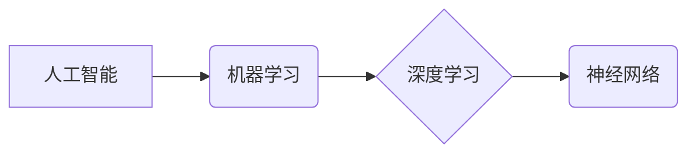

> 人工智能，机器学习，深度学习，神经网络，算法，代码实例，实践应用

## 1. 背景介绍

人工智能 (Artificial Intelligence，简称 AI) 作为一项前沿科技，近年来发展迅速，并已渗透到我们生活的方方面面。从智能手机的语音助手到自动驾驶汽车，从医疗诊断到金融风险评估，AI 正在改变着我们的世界。

随着技术的进步，AI 的发展呈现出以下趋势：

* **算法的不断优化:** 算法是 AI 的核心，其性能的提升直接关系到 AI 的应用效果。近年来，深度学习算法取得了突破性进展，在图像识别、自然语言处理等领域取得了显著成果。
* **数据量的爆炸式增长:** AI 的训练需要海量数据，而随着互联网的发展，数据量呈指数级增长，为 AI 的发展提供了充足的燃料。
* **计算能力的提升:** AI 算法的训练和运行需要强大的计算能力，而近年来，GPU 和 TPU 等高性能计算设备的出现，为 AI 的发展提供了硬件支持。

## 2. 核心概念与联系

人工智能的核心概念包括：

* **机器学习 (Machine Learning):** 使计算机能够从数据中学习，并根据学习到的知识进行预测或决策。
* **深度学习 (Deep Learning):** 一种机器学习的子集，利用多层神经网络来模拟人类大脑的学习过程。
* **神经网络 (Neural Network):** 由多个神经元组成的网络结构，能够学习复杂的非线性关系。

**核心概念联系流程图:**



## 3. 核心算法原理 & 具体操作步骤

### 3.1  算法原理概述

深度学习算法的核心是神经网络，它由多个层级的神经元组成，每个神经元接收来自上一层的输入，并通过权重进行加权求和，然后经过激活函数处理，输出到下一层。通过训练，神经网络可以学习到输入和输出之间的映射关系。

### 3.2  算法步骤详解

1. **数据预处理:** 将原始数据进行清洗、转换和特征工程，使其适合深度学习模型的训练。
2. **模型构建:** 根据任务需求选择合适的深度学习模型架构，例如卷积神经网络 (CNN) 或循环神经网络 (RNN)。
3. **模型训练:** 使用训练数据训练模型，通过反向传播算法调整模型参数，使模型的预测结果与真实值尽可能接近。
4. **模型评估:** 使用测试数据评估模型的性能，例如准确率、召回率和 F1-score。
5. **模型部署:** 将训练好的模型部署到实际应用场景中，用于进行预测或决策。

### 3.3  算法优缺点

**优点:**

* **高精度:** 深度学习算法能够学习到复杂的非线性关系，从而实现高精度的预测和分类。
* **自动化特征提取:** 深度学习模型能够自动从数据中提取特征，无需人工特征工程。
* **泛化能力强:** 深度学习模型能够对新的数据进行泛化，并取得良好的预测效果。

**缺点:**

* **数据依赖:** 深度学习算法需要海量数据进行训练，否则模型性能会下降。
* **计算资源消耗大:** 深度学习模型的训练和运行需要大量的计算资源。
* **可解释性差:** 深度学习模型的决策过程较为复杂，难以解释其背后的逻辑。

### 3.4  算法应用领域

深度学习算法已广泛应用于以下领域:

* **图像识别:** 人脸识别、物体检测、图像分类
* **自然语言处理:** 机器翻译、文本摘要、情感分析
* **语音识别:** 语音转文本、语音助手
* **推荐系统:** 商品推荐、内容推荐
* **医疗诊断:** 疾病诊断、影像分析

## 4. 数学模型和公式 & 详细讲解 & 举例说明

### 4.1  数学模型构建

深度学习模型的核心是神经网络，其数学模型可以表示为多层感知机 (Multi-Layer Perceptron，MLP)。

**MLP 模型结构:**

```
输入层 -> 隐藏层1 -> 隐藏层2 -> ... -> 隐藏层n -> 输出层
```

每个神经元接收来自上一层的输入，并通过权重进行加权求和，然后经过激活函数处理，输出到下一层。

### 4.2  公式推导过程

**神经元激活函数:**

$$
f(x) = \frac{1}{1 + e^{-x}}
$$

**权重更新公式 (梯度下降法):**

$$
\theta_{ij} = \theta_{ij} - \alpha \frac{\partial L}{\partial \theta_{ij}}
$$

其中:

* $\theta_{ij}$ 是连接神经元 i 和 j 的权重
* $\alpha$ 是学习率
* $L$ 是损失函数

### 4.3  案例分析与讲解

**举例说明:**

假设我们有一个简单的 MLP 模型，用于分类手写数字。模型输入层有 784 个神经元，对应于 MNIST 数据集中的图像像素值。隐藏层有 128 个神经元，输出层有 10 个神经元，对应于 0-9 的数字类别。

通过训练，模型会学习到输入图像像素值与数字类别的映射关系。当输入一个新的图像时，模型会将图像像素值作为输入，经过隐藏层和输出层的计算，最终输出一个概率分布，表示图像属于各个数字类别的概率。

## 5. 项目实践：代码实例和详细解释说明

### 5.1  开发环境搭建

* Python 3.x
* TensorFlow 或 PyTorch 深度学习框架
* Jupyter Notebook 或 VS Code 开发环境

### 5.2  源代码详细实现

```python
import tensorflow as tf

# 定义模型结构
model = tf.keras.models.Sequential([
    tf.keras.layers.Flatten(input_shape=(28, 28)),
    tf.keras.layers.Dense(128, activation='relu'),
    tf.keras.layers.Dense(10, activation='softmax')
])

# 编译模型
model.compile(optimizer='adam',
              loss='sparse_categorical_crossentropy',
              metrics=['accuracy'])

# 训练模型
model.fit(x_train, y_train, epochs=5)

# 评估模型
loss, accuracy = model.evaluate(x_test, y_test)
print('Test loss:', loss)
print('Test accuracy:', accuracy)
```

### 5.3  代码解读与分析

* **模型定义:** 使用 `tf.keras.models.Sequential` 创建一个顺序模型，并添加 Flatten 层、Dense 层和 Softmax 层。
* **模型编译:** 使用 `adam` 优化器、`sparse_categorical_crossentropy` 损失函数和 `accuracy` 评估指标编译模型。
* **模型训练:** 使用 `model.fit` 方法训练模型，输入训练数据 `x_train` 和标签 `y_train`，训练 5 个 epochs。
* **模型评估:** 使用 `model.evaluate` 方法评估模型在测试数据 `x_test` 和标签 `y_test` 上的性能。

### 5.4  运行结果展示

训练完成后，模型会输出测试集上的损失值和准确率。

## 6. 实际应用场景

### 6.1  图像识别

* **人脸识别:** 用于解锁手机、验证身份、监控安全。
* **物体检测:** 用于自动驾驶汽车、安防监控、工业自动化。
* **图像分类:** 用于医学影像诊断、产品分类、内容推荐。

### 6.2  自然语言处理

* **机器翻译:** 将文本从一种语言翻译成另一种语言。
* **文本摘要:** 自动生成文本的简短摘要。
* **情感分析:** 分析文本中的情感倾向，用于市场调研、客户服务等。

### 6.3  语音识别

* **语音转文本:** 将语音转换为文本，用于语音助手、听写软件等。
* **语音助手:** 例如 Siri、Alexa、Google Assistant，可以理解用户的语音指令并执行相应的操作。

### 6.4  未来应用展望

* **个性化推荐:** 基于用户的行为数据和偏好，提供个性化的商品、内容和服务推荐。
* **智能医疗:** 利用 AI 辅助医生诊断疾病、预测患者风险、个性化治疗方案。
* **自动驾驶:** 利用 AI 算法控制车辆行驶，实现无人驾驶。

## 7. 工具和资源推荐

### 7.1  学习资源推荐

* **书籍:**
    * 《深度学习》 (Deep Learning) - Ian Goodfellow, Yoshua Bengio, Aaron Courville
    * 《动手学深度学习》 (Hands-On Machine Learning with Scikit-Learn, Keras & TensorFlow) - Aurélien Géron
* **在线课程:**
    * Coursera: 深度学习 Specialization
    * Udacity: Deep Learning Nanodegree
    * fast.ai: Practical Deep Learning for Coders

### 7.2  开发工具推荐

* **TensorFlow:** Google 开发的开源深度学习框架。
* **PyTorch:** Facebook 开发的开源深度学习框架。
* **Keras:** TensorFlow 上的深度学习 API，易于使用。

### 7.3  相关论文推荐

* **AlexNet:** ImageNet Classification with Deep Convolutional Neural Networks
* **VGGNet:** Very Deep Convolutional Networks for Large-Scale Image Recognition
* **ResNet:** Deep Residual Learning for Image Recognition

## 8. 总结：未来发展趋势与挑战

### 8.1  研究成果总结

近年来，人工智能领域取得了显著进展，深度学习算法在图像识别、自然语言处理等领域取得了突破性成果。

### 8.2  未来发展趋势

* **模型规模的进一步扩大:** 更大的模型规模能够学习到更复杂的知识，从而提高模型性能。
* **模型效率的提升:** 降低模型训练和运行的计算成本，使其能够应用于更多场景。
* **模型解释性的增强:** 使 AI 模型的决策过程更加透明，提高用户对 AI 的信任。

### 8.3  面临的挑战

* **数据安全和隐私保护:** AI 算法依赖于大量数据，如何保证数据安全和隐私保护是一个重要挑战。
* **算法公平性和可解释性:** AI 算法可能存在偏见，导致不公平的结果，如何提高算法的公平性和可解释性是一个重要的研究方向。
* **伦理问题:** AI 技术的快速发展引发了伦理问题，例如 AI 决策的责任归属、AI 对就业的影响等，需要社会各界共同探讨和解决。

### 8.4  研究展望

未来，人工智能研究将继续朝着更智能、更安全、更可解释的方向发展。


## 9. 附录：常见问题与解答

**Q1: 深度学习和机器学习有什么区别？**

**A1:** 深度学习是机器学习的一种子集，它利用多层神经网络来模拟人类大脑的学习过程，而机器学习则是一个更广义的概念，包括各种算法，例如决策树、支持向量机等。

**Q2: 如何选择合适的深度学习框架？**

**A2:** TensorFlow 和 PyTorch 是目前最流行的深度学习框架，TensorFlow 更适合于生产环境，而 PyTorch 更灵活，更适合于研究和开发。

**Q3: 如何评估深度学习模型的性能？**

**A3:** 常用的评估指标包括准确率、召回率、F1-score、AUC 等，选择合适的评估指标取决于具体的任务需求。


作者：禅与计算机程序设计艺术 / Zen and the Art of Computer Programming 
<end_of_turn>