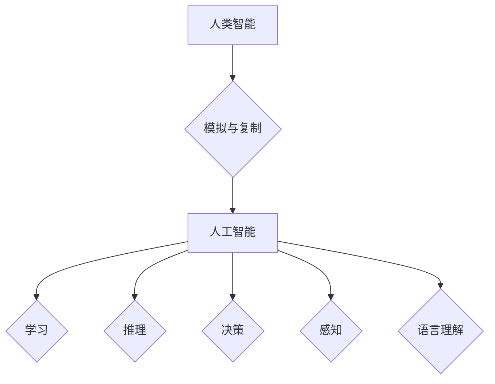

> 人工智能，术语，历史，发展，哲学，逻辑，计算

## 1. 背景介绍

人工智能（Artificial Intelligence，简称AI）作为一项前沿科技，近年来发展迅速，并逐渐渗透到人们生活的方方面面。从智能手机的语音助手到自动驾驶汽车，AI技术的应用日益广泛。然而，在AI技术蓬勃发展的今天，我们不禁要思考：人工智能这个术语是如何产生的？它最初的定义是什么？

## 2. 核心概念与联系

人工智能的核心概念是模拟和复制人类智能的行为。这包括学习、推理、决策、感知、语言理解等能力。

**Mermaid 流程图：**



## 3. 核心算法原理 & 具体操作步骤

### 3.1  算法原理概述

人工智能算法的核心是通过学习数据，建立模型，并利用模型进行预测或决策。常见的AI算法包括：

* **机器学习（Machine Learning）:** 通过训练数据，让算法自动学习规律，并进行预测或分类。
* **深度学习（Deep Learning）:** 基于多层神经网络，能够学习更复杂的特征，并实现更精准的预测。
* **自然语言处理（Natural Language Processing）:** 处理和理解人类语言，例如文本分类、机器翻译、对话系统等。
* **计算机视觉（Computer Vision）:** 赋予计算机“看”的能力，例如图像识别、物体检测、场景理解等。

### 3.2  算法步骤详解

以机器学习为例，其基本步骤包括：

1. **数据收集和预处理:** 收集相关数据，并进行清洗、转换、特征提取等预处理工作。
2. **模型选择:** 根据任务需求选择合适的机器学习算法模型。
3. **模型训练:** 使用训练数据训练模型，调整模型参数，使其能够准确预测或分类。
4. **模型评估:** 使用测试数据评估模型的性能，例如准确率、召回率、F1-score等。
5. **模型部署:** 将训练好的模型部署到实际应用场景中。

### 3.3  算法优缺点

每个AI算法都有其自身的优缺点，需要根据具体任务选择合适的算法。例如，机器学习算法能够自动学习数据规律，但需要大量数据进行训练；深度学习算法能够学习更复杂的特征，但训练成本较高。

### 3.4  算法应用领域

AI算法广泛应用于各个领域，例如：

* **医疗保健:** 疾病诊断、药物研发、个性化治疗等。
* **金融服务:** 风险评估、欺诈检测、投资决策等。
* **制造业:** 自动化生产、质量控制、 predictive maintenance等。
* **零售业:** 商品推荐、个性化营销、库存管理等。

## 4. 数学模型和公式 & 详细讲解 & 举例说明

### 4.1  数学模型构建

人工智能算法的数学模型通常基于线性代数、微积分、概率论等数学基础。例如，神经网络模型的权重和偏置参数可以通过梯度下降算法进行优化，其数学模型可以表示为：

$$
\theta = \theta - \alpha \nabla J(\theta)
$$

其中：

* $\theta$ 表示模型参数
* $\alpha$ 表示学习率
* $J(\theta)$ 表示损失函数

### 4.2  公式推导过程

损失函数的计算公式通常根据具体任务定义，例如分类任务中常用的交叉熵损失函数：

$$
J(\theta) = -\frac{1}{N} \sum_{i=1}^{N} y_i \log(p_i) + (1-y_i) \log(1-p_i)
$$

其中：

* $N$ 表示样本数量
* $y_i$ 表示真实标签
* $p_i$ 表示模型预测概率

### 4.3  案例分析与讲解

例如，在图像分类任务中，可以使用卷积神经网络（CNN）模型进行训练。CNN模型通过卷积层、池化层和全连接层等结构，学习图像特征，并进行分类预测。

## 5. 项目实践：代码实例和详细解释说明

### 5.1  开发环境搭建

使用Python语言开发AI项目，需要安装必要的库和工具，例如：

* Python 3.x
* TensorFlow 或 PyTorch
* NumPy
* Pandas

### 5.2  源代码详细实现

以下是一个简单的机器学习代码实例，使用Scikit-learn库进行线性回归模型训练：

```python
from sklearn.linear_model import LinearRegression
from sklearn.model_selection import train_test_split
from sklearn.metrics import mean_squared_error

# 数据加载
X = ... # 特征数据
y = ... # 目标数据

# 数据分割
X_train, X_test, y_train, y_test = train_test_split(X, y, test_size=0.2)

# 模型训练
model = LinearRegression()
model.fit(X_train, y_train)

# 模型预测
y_pred = model.predict(X_test)

# 模型评估
mse = mean_squared_error(y_test, y_pred)
print(f"Mean Squared Error: {mse}")
```

### 5.3  代码解读与分析

这段代码首先加载数据，然后将数据分割为训练集和测试集。接着，使用线性回归模型进行训练，并使用测试集进行预测。最后，计算模型的均方误差（MSE）作为评估指标。

### 5.4  运行结果展示

运行代码后，会输出模型的均方误差值，表示模型预测的准确性。

## 6. 实际应用场景

人工智能技术已广泛应用于各个领域，例如：

* **医疗保健:** 疾病诊断、药物研发、个性化治疗等。
* **金融服务:** 风险评估、欺诈检测、投资决策等。
* **制造业:** 自动化生产、质量控制、 predictive maintenance等。
* **零售业:** 商品推荐、个性化营销、库存管理等。

### 6.4  未来应用展望

未来，人工智能技术将继续发展，并应用于更多领域，例如：

* **自动驾驶:** 实现无人驾驶汽车，提高交通安全和效率。
* **机器人:** 开发更智能的机器人，用于工业生产、服务业等领域。
* **教育:** 提供个性化学习方案，提高教育效率。
* **科学研究:** 加速科学发现，解决复杂问题。

## 7. 工具和资源推荐

### 7.1  学习资源推荐

* **在线课程:** Coursera、edX、Udacity等平台提供丰富的AI课程。
* **书籍:** 《深度学习》、《人工智能：现代方法》等书籍。
* **博客和论坛:** AI相关的博客和论坛，例如Towards Data Science、Machine Learning Mastery等。

### 7.2  开发工具推荐

* **Python:** 作为AI开发的主要语言，拥有丰富的库和工具。
* **TensorFlow:** Google开发的开源深度学习框架。
* **PyTorch:** Facebook开发的开源深度学习框架。
* **Jupyter Notebook:** 用于代码编写、数据分析和可视化。

### 7.3  相关论文推荐

* **《ImageNet Classification with Deep Convolutional Neural Networks》:** AlexNet模型的论文。
* **《Attention Is All You Need》:** Transformer模型的论文。
* **《BERT: Pre-training of Deep Bidirectional Transformers for Language Understanding》:** BERT模型的论文。

## 8. 总结：未来发展趋势与挑战

### 8.1  研究成果总结

人工智能技术取得了长足的进步，在各个领域都取得了显著的应用成果。

### 8.2  未来发展趋势

未来，人工智能技术将朝着以下方向发展：

* **更强大的计算能力:** 随着硬件技术的进步，人工智能模型将变得更加强大。
* **更丰富的算法:** 新的算法将不断涌现，解决更复杂的问题。
* **更广泛的应用:** 人工智能将应用于更多领域，改变人们的生活方式。

### 8.3  面临的挑战

人工智能技术也面临着一些挑战，例如：

* **数据安全和隐私:** 人工智能算法依赖于大量数据，如何保护数据安全和隐私是一个重要问题。
* **算法偏见:** 人工智能算法可能存在偏见，导致不公平的结果。
* **伦理问题:** 人工智能技术的应用引发了一些伦理问题，例如人工智能的责任和义务。

### 8.4  研究展望

未来，人工智能研究需要更加注重伦理、安全和可解释性等方面，确保人工智能技术能够安全、公平、可持续地发展。

## 9. 附录：常见问题与解答

### 9.1  什么是机器学习？

机器学习是一种人工智能技术，通过训练数据，让算法自动学习规律，并进行预测或分类。

### 9.2  深度学习和机器学习有什么区别？

深度学习是机器学习的一种特殊形式，它使用多层神经网络，能够学习更复杂的特征。

### 9.3  人工智能的应用领域有哪些？

人工智能技术广泛应用于各个领域，例如医疗保健、金融服务、制造业、零售业等。

### 9.4  如何学习人工智能？

可以通过在线课程、书籍、博客和论坛等方式学习人工智能。

### 9.5  人工智能的未来发展趋势是什么？

未来，人工智能技术将朝着更强大、更智能、更广泛应用的方向发展。


作者：禅与计算机程序设计艺术 / Zen and the Art of Computer Programming 
<end_of_turn>