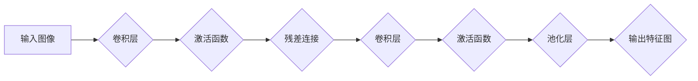

> 大模型、ResNet、深度学习、卷积神经网络、图像识别、微调、实践

## 1. 背景介绍

近年来，深度学习在计算机视觉、自然语言处理等领域取得了突破性进展，其中大模型扮演着越来越重要的角色。大模型通常指参数规模庞大的深度学习模型，拥有强大的泛化能力和学习能力，能够处理复杂的任务。ResNet（Residual Network）作为一种经典的深度卷积神经网络架构，在图像识别任务中取得了优异的性能，并为后续大模型的发展奠定了基础。

本篇文章将从零开始，带领读者深入了解ResNet的原理、架构、训练方法以及微调技巧，并通过实践案例，帮助读者掌握ResNet的开发与应用。

## 2. 核心概念与联系

### 2.1 深度学习与卷积神经网络

深度学习是一种机器学习的子领域，它利用多层神经网络来学习数据中的复杂模式。卷积神经网络（CNN）是一种专门用于处理图像数据的深度学习模型，它利用卷积操作来提取图像特征，并通过池化操作来降低特征维度，从而实现图像识别、分类等任务。

### 2.2 ResNet架构

ResNet的创新之处在于引入了残差连接（Residual Connection），它允许模型学习残差映射，即输入到输出之间的差异。残差连接可以缓解深度网络的梯度消失问题，从而使模型能够训练更深层网络，获得更好的性能。

**ResNet架构流程图**



### 2.3 微调

微调是指在预训练模型的基础上，对模型进行进一步的训练，以适应特定任务的需求。微调可以有效地提高模型的性能，并减少训练时间和数据量。

## 3. 核心算法原理 & 具体操作步骤

### 3.1 算法原理概述

ResNet的核心算法原理是残差连接，它通过跳跃连接将输入特征直接传递到后续层，从而缓解梯度消失问题，使模型能够学习更深层的特征表示。

### 3.2 算法步骤详解

1. **构建ResNet网络架构:** 根据任务需求选择合适的ResNet版本，例如ResNet-18、ResNet-34、ResNet-50等。
2. **预训练模型:** 使用公开的预训练模型，例如ImageNet数据集上训练的ResNet模型，作为初始模型。
3. **数据准备:** 准备用于微调的特定任务数据集，并进行数据预处理，例如图像裁剪、归一化等。
4. **微调训练:** 将预训练模型加载到训练环境中，并对模型进行微调训练，调整模型参数以适应特定任务的数据分布。
5. **模型评估:** 使用验证集评估模型性能，并根据评估结果调整训练参数，例如学习率、批处理大小等。
6. **模型部署:** 将训练好的模型部署到实际应用场景中，例如图像识别、物体检测等。

### 3.3 算法优缺点

**优点:**

* 能够训练更深层的网络，学习更复杂的特征表示。
* 缓解梯度消失问题，提高模型训练的稳定性。
* 能够利用预训练模型，减少训练时间和数据量。

**缺点:**

* 模型参数量较大，需要较大的计算资源。
* 微调过程需要一定的经验和技巧。

### 3.4 算法应用领域

ResNet在图像识别、物体检测、图像分割、人脸识别等计算机视觉任务中得到了广泛应用。

## 4. 数学模型和公式 & 详细讲解 & 举例说明

### 4.1 数学模型构建

ResNet的数学模型主要包括卷积层、激活函数、池化层和残差连接。

* **卷积层:** 使用卷积核对输入特征图进行卷积运算，提取特征。
* **激活函数:** 将卷积层的输出进行非线性变换，引入非线性因素，提高模型的表达能力。常用的激活函数包括ReLU、Sigmoid、Tanh等。
* **池化层:** 对卷积层的输出进行降维操作，减少特征图的尺寸，提高模型的鲁棒性。常用的池化操作包括最大池化和平均池化。
* **残差连接:** 将输入特征直接传递到后续层，并与后续层的输出相加，形成残差映射。

### 4.2 公式推导过程

ResNet的残差连接公式如下：

```latex
F(x) = H(x) + x
```

其中：

* $F(x)$ 是残差连接后的输出特征。
* $H(x)$ 是卷积层和激活函数的输出特征。
* $x$ 是输入特征。

### 4.3 案例分析与讲解

假设输入特征图大小为$H \times W \times C$，卷积层输出特征图大小为$H' \times W' \times C'$，则残差连接后的输出特征图大小为$H \times W \times C$。

## 5. 项目实践：代码实例和详细解释说明

### 5.1 开发环境搭建

* Python 3.6+
* TensorFlow/PyTorch
* CUDA/cuDNN

### 5.2 源代码详细实现

```python
import tensorflow as tf

def residual_block(input_tensor, filters, strides=1):
    # ... (实现残差块的代码)

def ResNet(input_shape, num_classes):
    # ... (实现ResNet网络架构的代码)

# ... (模型训练和评估代码)
```

### 5.3 代码解读与分析

* `residual_block()` 函数实现了一个残差块，包含卷积层、激活函数、池化层和残差连接。
* `ResNet()` 函数实现了一个ResNet网络架构，包含多个残差块和全连接层。
* 模型训练和评估代码使用TensorFlow/PyTorch框架进行实现。

### 5.4 运行结果展示

* 使用ImageNet数据集进行微调训练，并展示模型在测试集上的准确率。

## 6. 实际应用场景

ResNet在图像识别、物体检测、图像分割、人脸识别等计算机视觉任务中得到了广泛应用。

### 6.1 图像识别

ResNet可以用于识别图像中的物体类别，例如猫、狗、车等。

### 6.2 物体检测

ResNet可以用于检测图像中物体的边界框和类别，例如在图像中检测出汽车、行人、自行车等。

### 6.3 图像分割

ResNet可以用于分割图像中的每个像素点，将图像划分为不同的区域，例如分割图像中的前景和背景。

### 6.4 人脸识别

ResNet可以用于识别图像中的人脸，并将其与数据库中的人脸进行比对。

### 6.5 未来应用展望

ResNet在未来将继续在计算机视觉领域发挥重要作用，例如：

* **更深层的网络:** 随着计算资源的不断提升，ResNet将能够训练更深层的网络，学习更复杂的特征表示。
* **新的应用场景:** ResNet将应用于更多新的领域，例如医疗影像分析、自动驾驶、机器人视觉等。
* **更有效的训练方法:** 研究人员将继续探索更有效的训练方法，例如自监督学习、迁移学习等，提高ResNet的训练效率和性能。

## 7. 工具和资源推荐

### 7.1 学习资源推荐

* **书籍:**
    * Deep Learning with Python
    * Hands-On Machine Learning with Scikit-Learn, Keras & TensorFlow
* **在线课程:**
    * Coursera: Deep Learning Specialization
    * Udacity: Deep Learning Nanodegree
* **博客:**
    * https://blog.keras.io/
    * https://www.tensorflow.org/blog

### 7.2 开发工具推荐

* **TensorFlow:** https://www.tensorflow.org/
* **PyTorch:** https://pytorch.org/
* **Keras:** https://keras.io/

### 7.3 相关论文推荐

* **Deep Residual Learning for Image Recognition** (He et al., 2015)
* **Wide Residual Networks** (Zagoruyko & Komodakis, 2016)
* **ResNeXt: Deep Learning with Exponential Linear Units** (Xie et al., 2017)

## 8. 总结：未来发展趋势与挑战

### 8.1 研究成果总结

ResNet的提出为深度学习的发展做出了重要贡献，它缓解了深度网络的梯度消失问题，使模型能够训练更深层网络，并取得了优异的性能。

### 8.2 未来发展趋势

* **更深层的网络:** 研究人员将继续探索更深层的ResNet架构，以学习更复杂的特征表示。
* **新的激活函数:** 研究人员将探索新的激活函数，以提高模型的表达能力和训练效率。
* **自监督学习:** 自监督学习可以利用未标记数据进行训练，从而降低模型训练的成本和数据需求。

### 8.3 面临的挑战

* **计算资源:** 训练更深层的ResNet模型需要大量的计算资源，这对于资源有限的机构或个人来说是一个挑战。
* **数据标注:** 大模型的训练需要大量的标注数据，数据标注成本高昂，也是一个挑战。
* **模型解释性:** 大模型的决策过程往往难以解释，这对于一些安全敏感的应用场景来说是一个挑战。

### 8.4 研究展望

未来，ResNet将继续在计算机视觉领域发挥重要作用，并应用于更多新的领域。研究人员将继续探索新的架构、训练方法和应用场景，推动ResNet的发展和应用。

## 9. 附录：常见问题与解答

* **Q: ResNet的优势是什么？**
* **A:** ResNet的优势在于能够训练更深层的网络，缓解梯度消失问题，并利用预训练模型，减少训练时间和数据量。
* **Q: 如何微调预训练的ResNet模型？**
* **A:** 微调预训练的ResNet模型需要准备特定任务的数据集，并调整模型参数，例如学习率、批处理大小等。
* **Q: ResNet的应用场景有哪些？**
* **A:** ResNet在图像识别、物体检测、图像分割、人脸识别等计算机视觉任务中得到了广泛应用。


作者：禅与计算机程序设计艺术 / Zen and the Art of Computer Programming 
<end_of_turn>