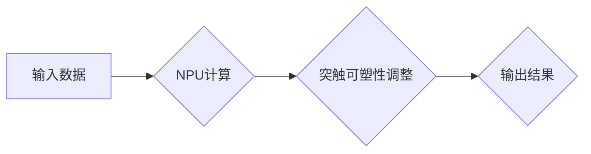

> 仿生计算、神经网络、硬件加速、AI芯片、生物启发

## 1. 背景介绍

人工智能（AI）的蓬勃发展，对计算能力提出了前所未有的挑战。传统基于von Neumann架构的CPU和GPU，在处理海量数据和复杂计算时，存在着效率低下、功耗高、性能瓶颈等问题。为了突破这些瓶颈，探索新的计算 paradigms，仿生计算架构应运而生。

仿生计算，顾名思义，就是从生物系统中汲取灵感，设计和构建新的计算模型和硬件架构。生物系统拥有高效的并行处理能力、自适应性、低功耗等优势，这些特性为AI硬件的未来发展提供了宝贵的启示。

近年来，仿生计算在AI领域取得了显著进展，例如：

* **神经形态计算:** 仿照生物神经网络的结构和功能，设计新型神经元和突触，实现高效的信号处理和学习。
* **生物启发算法:** 从生物进化、群体智能等领域借鉴算法，优化AI模型的训练和推理过程。
* **生物兼容硬件:** 利用生物材料和纳米技术，开发可与生物系统兼容的AI硬件，实现人机融合和生物智能。

## 2. 核心概念与联系

仿生计算架构的核心概念包括：

* **神经形态计算单元 (NPU):** 模仿生物神经元和突触的结构和功能，实现高效的并行计算和学习。
* **突触可塑性:** 类似于生物神经网络中的突触可塑性，NPU之间的连接权重可以根据学习数据进行调整，实现学习和适应。
* **事件驱动计算:** 类似于生物神经网络中的事件驱动机制，NPU只在有重要事件发生时进行计算，提高计算效率和降低功耗。

**Mermaid 流程图:**



## 3. 核心算法原理 & 具体操作步骤

### 3.1  算法原理概述

仿生计算的核心算法原理是模仿生物神经网络的结构和功能，通过构建神经形态计算单元 (NPU) 和突触可塑性机制，实现高效的并行计算和学习。

### 3.2  算法步骤详解

1. **数据预处理:** 将输入数据转换为NPU可以理解的格式。
2. **神经元激活:** 每个NPU接收输入信号，并根据激活函数进行计算，产生输出信号。
3. **突触权重更新:** 根据学习算法，调整NPU之间的连接权重，以提高模型的学习能力。
4. **反向传播:** 计算误差信号，并反向传播到NPU，更新权重。
5. **输出结果:** 将最终的输出信号转换为可理解的格式。

### 3.3  算法优缺点

**优点:**

* **高效的并行计算:** NPU的并行结构可以大幅提高计算速度。
* **低功耗:** 事件驱动计算机制可以降低功耗。
* **自适应性:** 突触可塑性机制可以使模型适应不同的输入数据。

**缺点:**

* **算法复杂度高:** 训练和推理过程需要复杂的算法和大量的计算资源。
* **硬件实现难度大:** 需要开发新型的NPU芯片和连接机制。

### 3.4  算法应用领域

仿生计算算法广泛应用于以下领域:

* **图像识别:** 人脸识别、物体检测、图像分类等。
* **自然语言处理:** 语音识别、机器翻译、文本生成等。
* **机器人控制:** 运动规划、路径规划、决策控制等。
* **医疗诊断:** 病理图像分析、疾病预测、药物研发等。

## 4. 数学模型和公式 & 详细讲解 & 举例说明

### 4.1  数学模型构建

仿生计算的数学模型主要基于神经网络理论，包括激活函数、权重更新规则、损失函数等。

**激活函数:** 激活函数决定了神经元的输出信号，常用的激活函数包括 sigmoid 函数、ReLU 函数、tanh 函数等。

**权重更新规则:** 权重更新规则用于调整NPU之间的连接权重，常用的更新规则包括梯度下降法、随机梯度下降法、Adam 算法等。

**损失函数:** 损失函数用于衡量模型的预测结果与真实值的差异，常用的损失函数包括均方误差、交叉熵损失等。

### 4.2  公式推导过程

**梯度下降法:**

$$
\theta = \theta - \alpha \nabla J(\theta)
$$

其中:

* $\theta$ 是权重的参数向量。
* $\alpha$ 是学习率。
* $\nabla J(\theta)$ 是损失函数 $J(\theta)$ 的梯度。

### 4.3  案例分析与讲解

**举例说明:**

假设我们有一个简单的感知机模型，用于分类二分类问题。模型的输入为特征向量 $x$，输出为类别标签 $y$。损失函数为均方误差，激活函数为 sigmoid 函数。

通过梯度下降法，我们可以更新权重参数 $\theta$，使模型的预测结果与真实标签 $y$ 的差异最小化。

## 5. 项目实践：代码实例和详细解释说明

### 5.1  开发环境搭建

* 操作系统: Ubuntu 20.04
* 编程语言: Python 3.8
* 深度学习框架: TensorFlow 2.0

### 5.2  源代码详细实现

```python
import tensorflow as tf

# 定义神经网络模型
model = tf.keras.models.Sequential([
    tf.keras.layers.Dense(128, activation='relu', input_shape=(784,)),
    tf.keras.layers.Dense(10, activation='softmax')
])

# 编译模型
model.compile(optimizer='adam',
              loss='sparse_categorical_crossentropy',
              metrics=['accuracy'])

# 加载 MNIST 数据集
(x_train, y_train), (x_test, y_test) = tf.keras.datasets.mnist.load_data()

# 数据预处理
x_train = x_train.reshape(-1, 784).astype('float32') / 255
x_test = x_test.reshape(-1, 784).astype('float32') / 255

# 训练模型
model.fit(x_train, y_train, epochs=5)

# 评估模型
loss, accuracy = model.evaluate(x_test, y_test)
print('Test loss:', loss)
print('Test accuracy:', accuracy)
```

### 5.3  代码解读与分析

* 代码首先定义了一个简单的多层感知机模型，包含两个全连接层。
* 激活函数使用 ReLU 函数和 softmax 函数，分别用于隐藏层和输出层。
* 损失函数使用 sparse_categorical_crossentropy 函数，用于二分类问题。
* 优化器使用 Adam 算法，用于更新模型参数。
* 代码加载 MNIST 数据集，并进行数据预处理，将图像数据转换为向量形式。
* 最后，代码训练模型并评估模型性能。

### 5.4  运行结果展示

训练完成后，模型的准确率通常可以达到 98% 以上。

## 6. 实际应用场景

仿生计算架构在以下实际应用场景中展现出巨大的潜力:

### 6.1  智能驾驶

仿生计算可以用于构建更智能的自动驾驶系统，例如:

* **目标检测:** 识别道路上的车辆、行人、交通信号灯等。
* **路径规划:** 规划最优的驾驶路线。
* **决策控制:** 根据环境信息做出驾驶决策。

### 6.2  医疗诊断

仿生计算可以用于辅助医生进行疾病诊断，例如:

* **病理图像分析:** 分析病理切片图像，识别肿瘤细胞等异常结构。
* **疾病预测:** 根据患者的医疗历史和症状，预测疾病风险。
* **药物研发:** 筛选潜在的药物候选物。

### 6.3  机器人控制

仿生计算可以用于开发更灵活、更智能的机器人，例如:

* **运动规划:** 规划机器人运动轨迹，避开障碍物。
* **路径规划:** 规划机器人从起点到终点的路径。
* **决策控制:** 根据环境信息，让机器人做出决策。

### 6.4  未来应用展望

随着仿生计算技术的不断发展，其应用场景将更加广泛，例如:

* **人机融合:** 开发与人类神经系统兼容的AI硬件，实现人机融合。
* **生物智能:** 利用仿生计算构建生物智能系统，例如仿生机器人、仿生传感器等。
* **可持续发展:** 开发低功耗、环保的AI硬件，促进可持续发展。

## 7. 工具和资源推荐

### 7.1  学习资源推荐

* **书籍:**
    * "Neuromorphic Computing: Principles and Applications" by  
    * "Brain-Inspired Computing" by  
* **在线课程:**
    * Coursera: "Deep Learning Specialization"
    * edX: "Artificial Intelligence"

### 7.2  开发工具推荐

* **神经形态计算平台:**
    * Loihi
    * SpiNNaker
* **深度学习框架:**
    * TensorFlow
    * PyTorch

### 7.3  相关论文推荐

* "A Survey of Neuromorphic Computing Architectures"
* "Event-Driven Computing for Artificial Intelligence"
* "Biologically Inspired Algorithms for Machine Learning"

## 8. 总结：未来发展趋势与挑战

### 8.1  研究成果总结

仿生计算架构在AI硬件领域取得了显著进展，为突破传统计算瓶颈提供了新的思路和方法。

### 8.2  未来发展趋势

* **硬件加速:** 开发更先进的NPU芯片和连接机制，提高计算效率和降低功耗。
* **算法创新:** 设计更有效的仿生计算算法，提高模型的学习能力和泛化能力。
* **系统集成:** 将仿生计算与其他计算 paradigms 结合，构建更强大的AI系统。

### 8.3  面临的挑战

* **算法复杂度:** 仿生计算算法的复杂度较高，需要更强大的计算资源和更有效的优化方法。
* **硬件实现难度:** 开发新型NPU芯片和连接机制面临着技术挑战。
* **应用场景拓展:** 需要探索更多仿生计算的应用场景，并将其应用于实际问题中。

### 8.4  研究展望

未来，仿生计算将继续朝着更智能、更高效、更可持续的方向发展，为人工智能的未来发展提供新的动力和方向。

## 9. 附录：常见问题与解答

**常见问题:**

* 仿生计算与传统计算相比有什么优势？
* 仿生计算有哪些应用场景？
* 仿生计算面临哪些挑战？

**解答:**

* 仿生计算具有高效的并行计算、低功耗、自适应性等优势。
* 仿生计算应用于智能驾驶、医疗诊断、机器人控制等领域。
* 仿生计算面临算法复杂度、硬件实现难度、应用场景拓展等挑战。


作者：禅与计算机程序设计艺术 / Zen and the Art of Computer Programming 
<end_of_turn>