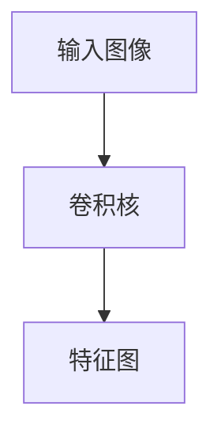
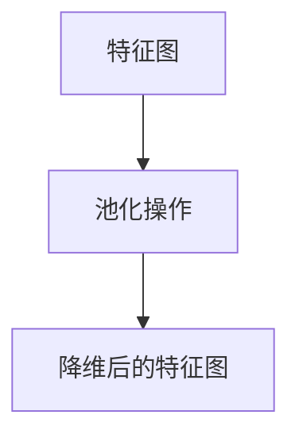
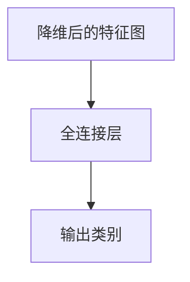

# Convolutional Neural Network

## 1.背景介绍

卷积神经网络（Convolutional Neural Network，简称CNN）是深度学习领域中最为重要和广泛应用的模型之一。它在图像识别、自然语言处理、语音识别等多个领域取得了显著的成果。CNN的成功不仅在于其强大的特征提取能力，还在于其能够有效地处理高维数据的特性。

### 1.1 深度学习的兴起

深度学习的兴起可以追溯到20世纪80年代，但真正的突破是在2012年，AlexNet在ImageNet竞赛中取得了压倒性的胜利。这一事件标志着深度学习，特别是卷积神经网络，开始在计算机视觉领域占据主导地位。

### 1.2 卷积神经网络的历史

卷积神经网络的概念最早由Yann LeCun等人在20世纪90年代提出，并应用于手写数字识别任务。随着计算能力的提升和大规模数据集的出现，CNN逐渐发展成为一种强大的工具，广泛应用于各种复杂的任务中。

### 1.3 传统神经网络的局限性

传统的全连接神经网络在处理高维数据时存在参数过多、计算复杂度高等问题。CNN通过引入卷积层和池化层，有效地减少了参数数量，提高了计算效率，同时保留了数据的空间结构信息。

## 2.核心概念与联系

卷积神经网络的核心在于其独特的结构设计，包括卷积层、池化层和全连接层。每一层都有其特定的功能和作用，共同构成了一个强大的特征提取和分类系统。

### 2.1 卷积层

卷积层是CNN的核心组件，通过卷积操作提取输入数据的局部特征。卷积操作本质上是一个滑动窗口，将滤波器（或称为卷积核）应用于输入数据，生成特征图。



### 2.2 池化层

池化层用于对特征图进行降维，减少计算量和参数数量，同时保留重要的特征信息。常见的池化操作包括最大池化和平均池化。



### 2.3 全连接层

全连接层通常位于网络的末端，用于将提取的特征映射到输出类别。每个神经元与前一层的所有神经元相连，形成一个密集的连接网络。



## 3.核心算法原理具体操作步骤

卷积神经网络的训练和推理过程可以分为以下几个步骤：

### 3.1 数据预处理

在进行训练之前，需要对输入数据进行预处理，包括归一化、数据增强等操作，以提高模型的泛化能力。

### 3.2 卷积操作

卷积操作是CNN的核心，通过滑动窗口将卷积核应用于输入数据，生成特征图。卷积核的参数通过反向传播算法进行学习。

### 3.3 激活函数

卷积操作后的特征图通常会通过激活函数进行非线性变换。常用的激活函数包括ReLU、Sigmoid和Tanh。

### 3.4 池化操作

池化操作用于对特征图进行降维，减少计算量和参数数量。常见的池化操作包括最大池化和平均池化。

### 3.5 全连接层

全连接层将提取的特征映射到输出类别，通常使用Softmax函数进行多分类任务的概率输出。

### 3.6 反向传播

反向传播算法用于更新网络的参数，通过计算损失函数的梯度，逐层调整卷积核和全连接层的权重。

## 4.数学模型和公式详细讲解举例说明

卷积神经网络的数学模型可以通过一系列公式进行描述。以下是一些关键的数学公式和概念。

### 4.1 卷积操作

卷积操作可以表示为：

$$
Y(i, j) = \sum_{m=0}^{M-1} \sum_{n=0}^{N-1} X(i+m, j+n) \cdot K(m, n)
$$

其中，$X$ 是输入图像，$K$ 是卷积核，$Y$ 是输出特征图，$M$ 和 $N$ 分别是卷积核的高度和宽度。

### 4.2 激活函数

常用的激活函数包括ReLU、Sigmoid和Tanh。ReLU函数的定义为：

$$
f(x) = \max(0, x)
$$

### 4.3 池化操作

最大池化操作可以表示为：

$$
Y(i, j) = \max_{0 \leq m < M, 0 \leq n < N} X(i+m, j+n)
$$

其中，$X$ 是输入特征图，$Y$ 是池化后的特征图，$M$ 和 $N$ 分别是池化窗口的高度和宽度。

### 4.4 全连接层

全连接层的输出可以表示为：

$$
Y = W \cdot X + b
$$

其中，$W$ 是权重矩阵，$X$ 是输入特征，$b$ 是偏置项，$Y$ 是输出。

### 4.5 反向传播

反向传播算法用于计算损失函数的梯度，并更新网络的参数。损失函数的梯度可以通过链式法则进行计算。

## 5.项目实践：代码实例和详细解释说明

为了更好地理解卷积神经网络的实际应用，我们将通过一个简单的项目实例来展示如何构建和训练一个CNN模型。

### 5.1 数据集准备

我们将使用经典的MNIST手写数字数据集进行训练和测试。该数据集包含60,000张训练图像和10,000张测试图像，每张图像为28x28像素的灰度图。

### 5.2 构建模型

我们将使用Python和TensorFlow框架来构建一个简单的CNN模型。

```python
import tensorflow as tf
from tensorflow.keras import layers, models

# 构建模型
model = models.Sequential()
model.add(layers.Conv2D(32, (3, 3), activation='relu', input_shape=(28, 28, 1)))
model.add(layers.MaxPooling2D((2, 2)))
model.add(layers.Conv2D(64, (3, 3), activation='relu'))
model.add(layers.MaxPooling2D((2, 2)))
model.add(layers.Conv2D(64, (3, 3), activation='relu'))

model.add(layers.Flatten())
model.add(layers.Dense(64, activation='relu'))
model.add(layers.Dense(10, activation='softmax'))
```

### 5.3 编译和训练模型

```python
# 编译模型
model.compile(optimizer='adam',
              loss='sparse_categorical_crossentropy',
              metrics=['accuracy'])

# 训练模型
model.fit(train_images, train_labels, epochs=5, batch_size=64, validation_data=(test_images, test_labels))
```

### 5.4 评估模型

```python
# 评估模型
test_loss, test_acc = model.evaluate(test_images, test_labels)
print(f'Test accuracy: {test_acc}')
```

## 6.实际应用场景

卷积神经网络在多个领域都有广泛的应用，以下是一些典型的应用场景。

### 6.1 图像识别

CNN在图像识别任务中表现出色，可以用于人脸识别、物体检测、图像分类等任务。

### 6.2 自然语言处理

在自然语言处理领域，CNN可以用于文本分类、情感分析等任务，通过卷积操作提取文本的局部特征。

### 6.3 语音识别

CNN在语音识别任务中也有广泛应用，可以用于语音命令识别、语音转文字等任务。

### 6.4 医学图像分析

在医学图像分析领域，CNN可以用于病灶检测、医学影像分类等任务，辅助医生进行诊断。

## 7.工具和资源推荐

为了更好地学习和应用卷积神经网络，以下是一些推荐的工具和资源。

### 7.1 开源框架

- TensorFlow: Google开发的开源深度学习框架，支持构建和训练各种神经网络模型。
- PyTorch: Facebook开发的开源深度学习框架，具有灵活的动态计算图和强大的社区支持。

### 7.2 在线课程

- Coursera: 提供多门深度学习相关课程，包括Andrew Ng教授的深度学习专项课程。
- edX: 提供多门深度学习和人工智能相关课程，由顶尖大学和机构提供。

### 7.3 书籍推荐

- 《深度学习》: Ian Goodfellow等人编写的经典教材，全面介绍了深度学习的理论和实践。
- 《神经网络与深度学习》: Michael Nielsen编写的在线书籍，适合初学者入门。

## 8.总结：未来发展趋势与挑战

卷积神经网络在过去的十年中取得了巨大的成功，但仍然面临一些挑战和发展机遇。

### 8.1 未来发展趋势

- 更深层次的网络结构: 随着计算能力的提升，越来越深的网络结构（如ResNet、DenseNet）将继续推动性能的提升。
- 自监督学习: 自监督学习方法可以在没有标签的数据上进行训练，具有广阔的应用前景。
- 多模态学习: 结合多种数据模态（如图像、文本、语音）进行联合学习，将进一步提升模型的表现。

### 8.2 挑战

- 数据依赖: CNN的性能高度依赖于大规模标注数据，获取高质量的数据集仍然是一个挑战。
- 计算资源: 训练深层次的CNN模型需要大量的计算资源，对于资源有限的研究者和企业来说是一个瓶颈。
- 可解释性: CNN模型的黑箱特性使得其决策过程难以解释，限制了其在某些领域的应用。

## 9.附录：常见问题与解答

### 9.1 什么是卷积神经网络？

卷积神经网络是一种特殊的神经网络结构，主要用于处理具有网格结构的数据（如图像）。它通过卷积操作提取局部特征，并通过池化操作进行降维。

### 9.2 卷积神经网络的优势是什么？

卷积神经网络具有参数共享和局部连接的特点，可以有效地减少参数数量，提高计算效率，同时保留数据的空间结构信息。

### 9.3 如何选择卷积核的大小？

卷积核的大小通常根据具体任务和数据集进行选择。常见的卷积核大小包括3x3、5x5等。较小的卷积核可以提取细节特征，而较大的卷积核可以提取全局特征。

### 9.4 如何防止过拟合？

防止过拟合的方法包括数据增强、正则化（如L2正则化、Dropout）、增加训练数据等。

### 9.5 卷积神经网络可以应用于哪些领域？

卷积神经网络可以应用于图像识别、自然语言处理、语音识别、医学图像分析等多个领域。

---

作者：禅与计算机程序设计艺术 / Zen and the Art of Computer Programming