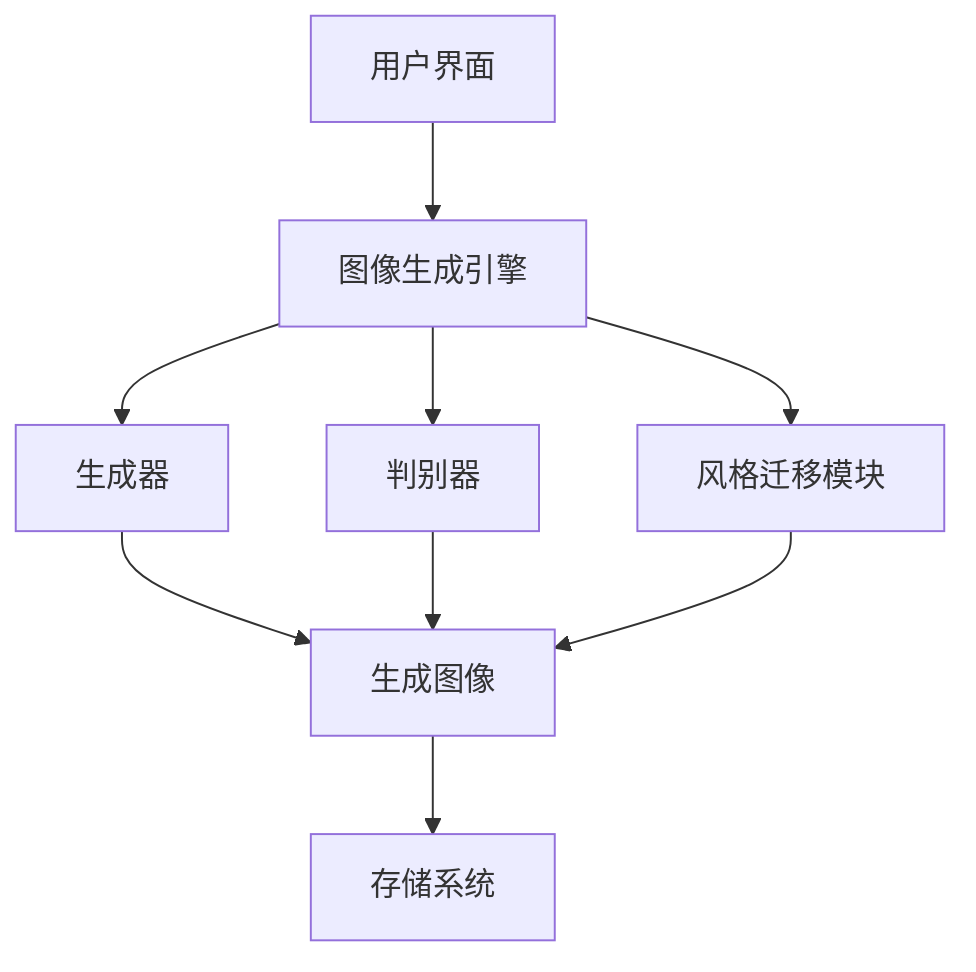

# 基于生成对抗网络的风格多样化图像生成平台

## 1.背景介绍

在当今的数字时代，图像生成技术已经成为了许多领域的核心技术之一。从娱乐业到医疗影像，从广告设计到虚拟现实，图像生成技术的应用范围广泛且深远。生成对抗网络（GANs）作为一种强大的生成模型，已经在图像生成领域取得了显著的成果。本文将探讨如何基于GANs构建一个风格多样化的图像生成平台。

## 2.核心概念与联系

### 2.1 生成对抗网络（GANs）

生成对抗网络由Ian Goodfellow等人在2014年提出，是一种通过两个神经网络相互竞争来生成数据的模型。GANs由生成器（Generator）和判别器（Discriminator）组成。生成器负责生成逼真的图像，而判别器则负责区分生成的图像和真实图像。

### 2.2 风格迁移

风格迁移是一种将一种图像的风格应用到另一种图像上的技术。通过风格迁移，我们可以将一幅图像的内容与另一幅图像的风格相结合，生成具有特定风格的图像。

### 2.3 图像生成平台

图像生成平台是一个集成了多种图像生成技术的系统，用户可以通过该平台生成各种风格的图像。该平台通常包括用户界面、图像生成引擎和存储系统。

## 3.核心算法原理具体操作步骤

### 3.1 GANs的工作原理

GANs的核心思想是通过生成器和判别器的对抗训练，使生成器能够生成逼真的图像。具体步骤如下：

1. **初始化**：随机初始化生成器和判别器的参数。
2. **生成图像**：生成器接收随机噪声作为输入，生成一幅图像。
3. **判别图像**：判别器接收生成的图像和真实图像，输出它们的真实性概率。
4. **计算损失**：根据判别器的输出，计算生成器和判别器的损失。
5. **更新参数**：使用反向传播算法更新生成器和判别器的参数。
6. **重复训练**：重复上述步骤，直到生成器能够生成逼真的图像。

### 3.2 风格迁移的实现

风格迁移通常使用卷积神经网络（CNN）来提取图像的内容和风格特征。具体步骤如下：

1. **提取特征**：使用预训练的CNN提取内容图像和风格图像的特征。
2. **计算损失**：计算内容损失和风格损失。
3. **生成图像**：通过最小化内容损失和风格损失，生成具有特定风格的图像。

### 3.3 平台架构设计

一个风格多样化图像生成平台的架构设计如下：



## 4.数学模型和公式详细讲解举例说明

### 4.1 GANs的数学模型

GANs的目标是通过最小化生成器的损失和最大化判别器的损失来训练模型。其数学公式如下：

$$
\min_G \max_D V(D, G) = \mathbb{E}_{x \sim p_{data}(x)}[\log D(x)] + \mathbb{E}_{z \sim p_z(z)}[\log(1 - D(G(z)))]
$$

其中，$G$ 是生成器，$D$ 是判别器，$p_{data}(x)$ 是真实数据的分布，$p_z(z)$ 是噪声的分布。

### 4.2 风格迁移的数学模型

风格迁移的目标是通过最小化内容损失和风格损失来生成图像。其数学公式如下：

$$
L_{total} = \alpha L_{content} + \beta L_{style}
$$

其中，$L_{content}$ 是内容损失，$L_{style}$ 是风格损失，$\alpha$ 和 $\beta$ 是权重参数。

内容损失的计算公式为：

$$
L_{content} = \frac{1}{2} \sum_{i,j} (F_{ij}^C - F_{ij}^G)^2
$$

风格损失的计算公式为：

$$
L_{style} = \sum_{l} w_l E_l
$$

其中，$E_l$ 是第 $l$ 层的风格损失，$w_l$ 是权重参数。

## 5.项目实践：代码实例和详细解释说明

### 5.1 GANs的实现

以下是一个简单的GANs实现示例：

```python
import torch
import torch.nn as nn
import torch.optim as optim

# 定义生成器
class Generator(nn.Module):
    def __init__(self):
        super(Generator, self).__init__()
        self.main = nn.Sequential(
            nn.Linear(100, 256),
            nn.ReLU(True),
            nn.Linear(256, 512),
            nn.ReLU(True),
            nn.Linear(512, 1024),
            nn.ReLU(True),
            nn.Linear(1024, 784),
            nn.Tanh()
        )

    def forward(self, x):
        return self.main(x)

# 定义判别器
class Discriminator(nn.Module):
    def __init__(self):
        super(Discriminator, self).__init__()
        self.main = nn.Sequential(
            nn.Linear(784, 1024),
            nn.LeakyReLU(0.2, inplace=True),
            nn.Linear(1024, 512),
            nn.LeakyReLU(0.2, inplace=True),
            nn.Linear(512, 256),
            nn.LeakyReLU(0.2, inplace=True),
            nn.Linear(256, 1),
            nn.Sigmoid()
        )

    def forward(self, x):
        return self.main(x)

# 初始化生成器和判别器
G = Generator()
D = Discriminator()

# 定义损失函数和优化器
criterion = nn.BCELoss()
optimizerG = optim.Adam(G.parameters(), lr=0.0002)
optimizerD = optim.Adam(D.parameters(), lr=0.0002)

# 训练GANs
for epoch in range(10000):
    # 训练判别器
    optimizerD.zero_grad()
    real_data = torch.randn(64, 784)
    real_label = torch.ones(64, 1)
    fake_data = G(torch.randn(64, 100))
    fake_label = torch.zeros(64, 1)
    real_output = D(real_data)
    fake_output = D(fake_data)
    lossD_real = criterion(real_output, real_label)
    lossD_fake = criterion(fake_output, fake_label)
    lossD = lossD_real + lossD_fake
    lossD.backward()
    optimizerD.step()

    # 训练生成器
    optimizerG.zero_grad()
    fake_data = G(torch.randn(64, 100))
    fake_output = D(fake_data)
    lossG = criterion(fake_output, real_label)
    lossG.backward()
    optimizerG.step()

    if epoch % 1000 == 0:
        print(f'Epoch [{epoch}/10000], Loss D: {lossD.item()}, Loss G: {lossG.item()}')
```

### 5.2 风格迁移的实现

以下是一个简单的风格迁移实现示例：

```python
import torch
import torch.nn as nn
import torch.optim as optim
from torchvision import models, transforms
from PIL import Image

# 加载图像
def load_image(image_path, transform=None, max_size=400, shape=None):
    image = Image.open(image_path)
    if max(transform is not None):
        image = transform(image).unsqueeze(0)
    return image

# 定义内容损失
class ContentLoss(nn.Module):
    def __init__(self, target):
        super(ContentLoss, self).__init__()
        self.target = target.detach()

    def forward(self, x):
        self.loss = nn.functional.mse_loss(x, self.target)
        return x

# 定义风格损失
class StyleLoss(nn.Module):
    def __init__(self, target):
        super(StyleLoss, self).__init__()
        self.target = self.gram_matrix(target).detach()

    def gram_matrix(self, x):
        b, c, h, w = x.size()
        features = x.view(b * c, h * w)
        G = torch.mm(features, features.t())
        return G.div(b * c * h * w)

    def forward(self, x):
        G = self.gram_matrix(x)
        self.loss = nn.functional.mse_loss(G, self.target)
        return x

# 加载预训练的VGG19模型
cnn = models.vgg19(pretrained=True).features

# 定义图像转换
transform = transforms.Compose([
    transforms.Resize((400, 400)),
    transforms.ToTensor(),
    transforms.Normalize(mean=[0.485, 0.456, 0.406], std=[0.229, 0.224, 0.225])
])

# 加载内容图像和风格图像
content_image = load_image('path_to_content_image.jpg', transform)
style_image = load_image('path_to_style_image.jpg', transform)

# 定义内容损失和风格损失
content_loss = ContentLoss(content_image)
style_loss = StyleLoss(style_image)

# 定义优化器
optimizer = optim.Adam([content_image.requires_grad_()], lr=0.01)

# 训练风格迁移模型
for epoch in range(1000):
    optimizer.zero_grad()
    content_loss(content_image)
    style_loss(content_image)
    loss = content_loss.loss + style_loss.loss
    loss.backward()
    optimizer.step()

    if epoch % 100 == 0:
        print(f'Epoch [{epoch}/1000], Loss: {loss.item()}')
```

## 6.实际应用场景

### 6.1 艺术创作

通过GANs和风格迁移技术，艺术家可以生成具有不同风格的艺术作品。这些技术可以帮助艺术家探索新的创作方式，激发创作灵感。

### 6.2 广告设计

在广告设计中，图像生成技术可以帮助设计师快速生成多样化的广告素材，从而提高工作效率。此外，风格迁移技术还可以将品牌的特定风格应用到广告素材中，增强品牌识别度。

### 6.3 医疗影像

在医疗影像领域，GANs可以用于生成高质量的医学图像，帮助医生进行诊断和治疗。例如，GANs可以生成高分辨率的MRI图像，帮助医生更准确地识别病变区域。

### 6.4 虚拟现实

在虚拟现实中，图像生成技术可以用于创建逼真的虚拟环境。通过GANs和风格迁移技术，开发者可以生成具有不同风格的虚拟场景，提升用户的沉浸感。

## 7.工具和资源推荐

### 7.1 开发工具

- **PyTorch**：一个开源的深度学习框架，支持动态计算图，适合于研究和开发。
- **TensorFlow**：一个开源的深度学习框架，支持静态计算图，适合于大规模生产环境。
- **Keras**：一个高级神经网络API，支持快速构建和训练深度学习模型。

### 7.2 数据集

- **MNIST**：一个手写数字数据集，常用于图像生成和分类任务。
- **CIFAR-10**：一个包含10类图像的数据集，常用于图像分类和生成任务。
- **COCO**：一个大规模图像数据集，包含丰富的图像和标注信息，适用于图像生成和目标检测任务。

### 7.3 参考文献

- Ian Goodfellow, et al. "Generative Adversarial Nets." Advances in Neural Information Processing Systems. 2014.
- Leon A. Gatys, et al. "A Neural Algorithm of Artistic Style." arXiv preprint arXiv:1508.06576. 2015.

## 8.总结：未来发展趋势与挑战

### 8.1 未来发展趋势

随着深度学习技术的不断发展，图像生成技术将会变得更加成熟和强大。未来，GANs和风格迁移技术可能会在以下几个方面取得突破：

- **更高的生成质量**：通过改进生成器和判别器的结构，GANs可以生成更加逼真的图像。
- **多模态生成**：未来的图像生成技术可能会支持多模态生成，即同时生成图像、文本、音频等多种数据。
- **实时生成**：通过优化算法和硬件，图像生成技术可能会实现实时生成，提升用户体验。

### 8.2 挑战

尽管图像生成技术取得了显著的进展，但仍然面临一些挑战：

- **训练不稳定**：GANs的训练过程容易出现不稳定现象，如模式崩溃和梯度消失。
- **数据依赖**：图像生成技术依赖于大量的高质量数据，获取和标注数据成本较高。
- **伦理问题**：图像生成技术可能会被滥用于生成虚假信息，带来伦理和法律问题。

## 9.附录：常见问题与解答

### 9.1 GANs的训练为什么不稳定？

GANs的训练不稳定主要是由于生成器和判别器的对抗训练过程。生成器和判别器的训练目标相反，容易导致梯度消失或爆炸。可以通过调整学习率、使用不同的优化器和损失函数来缓解训练不稳定的问题。

### 9.2 如何选择合适的风格迁移模型？

选择风格迁移模型时，可以根据具体应用场景和需求来选择。例如，如果需要生成高质量的艺术作品，可以选择基于VGG19的风格迁移模型。如果需要实时生成，可以选择轻量级的风格迁移模型。

### 9.3 图像生成技术的应用前景如何？

图像生成技术在多个领域具有广泛的应用前景，如艺术创作、广告设计、医疗影像和虚拟现实。随着技术的不断发展，图像生成技术将会变得更加成熟和强大，带来更多的应用机会。

---

作者：禅与计算机程序设计艺术 / Zen and the Art of Computer Programming