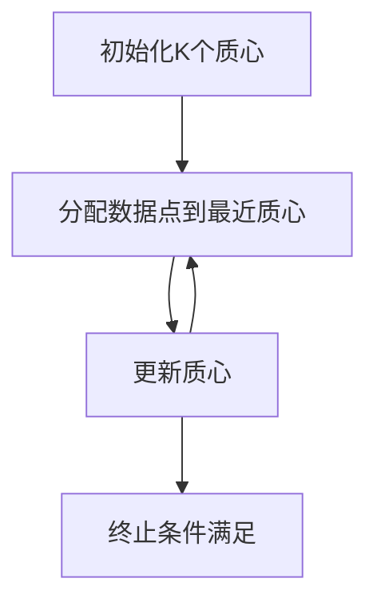
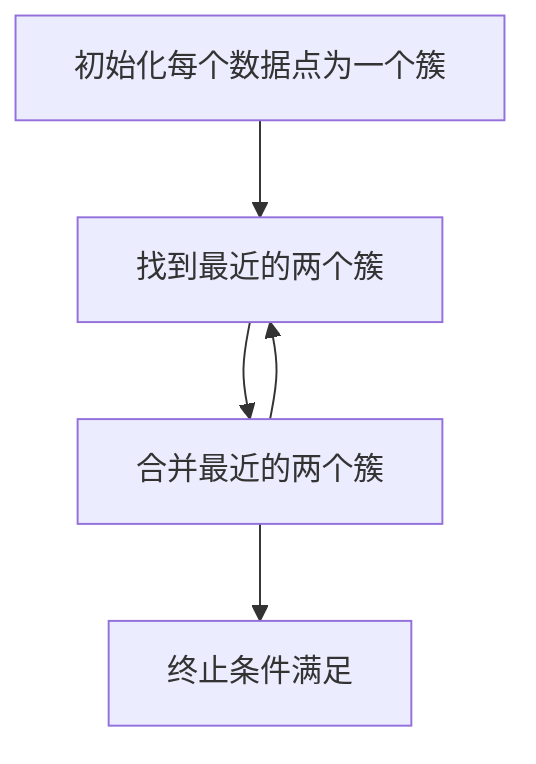
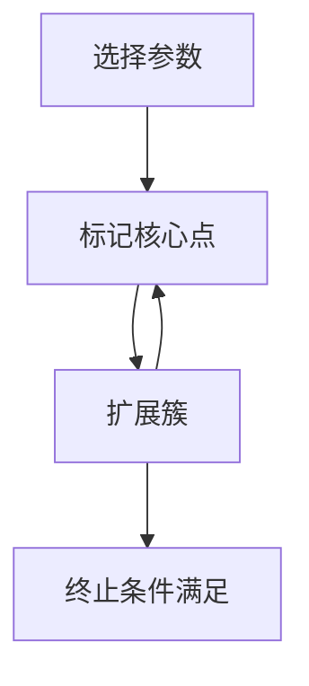

# 聚类算法(Clustering Algorithms) - 原理与代码实例讲解

## 1.背景介绍

聚类算法是机器学习和数据挖掘中的一种重要技术，广泛应用于图像处理、市场分析、生物信息学等领域。聚类的目标是将数据集划分为若干个组，使得同一组内的数据点相似度高，不同组间的数据点相似度低。本文将深入探讨聚类算法的核心概念、原理、数学模型、实际应用及代码实例，帮助读者全面理解和掌握这一重要技术。

## 2.核心概念与联系

### 2.1 聚类的定义

聚类是一种无监督学习方法，其目标是将数据集划分为若干个簇（Cluster），使得同一簇内的数据点相似度高，不同簇间的数据点相似度低。

### 2.2 聚类与分类的区别

分类是一种有监督学习方法，需要预先标注数据集，而聚类则不需要预先标注数据集。分类的目标是将新数据点分配到已有的类别中，而聚类的目标是发现数据集中的自然分组。

### 2.3 聚类算法的分类

聚类算法可以根据不同的划分标准进行分类，主要包括以下几类：

- **划分方法**：如K-means、K-medoids。
- **层次方法**：如层次聚类（Hierarchical Clustering）。
- **基于密度的方法**：如DBSCAN、OPTICS。
- **基于网格的方法**：如STING、CLIQUE。
- **基于模型的方法**：如高斯混合模型（GMM）。

## 3.核心算法原理具体操作步骤

### 3.1 K-means算法

K-means算法是一种经典的划分方法，操作步骤如下：

1. **初始化**：随机选择K个初始质心（Centroid）。
2. **分配数据点**：将每个数据点分配到最近的质心。
3. **更新质心**：重新计算每个簇的质心。
4. **重复步骤2和3**，直到质心不再变化或达到最大迭代次数。



### 3.2 层次聚类

层次聚类分为凝聚层次聚类和分裂层次聚类。以凝聚层次聚类为例，其操作步骤如下：

1. **初始化**：每个数据点作为一个簇。
2. **合并簇**：找到最近的两个簇并合并。
3. **重复步骤2**，直到所有数据点合并为一个簇或达到预定的簇数。



### 3.3 DBSCAN算法

DBSCAN是一种基于密度的聚类算法，操作步骤如下：

1. **选择参数**：选择半径参数 $\epsilon$ 和最小点数参数 MinPts。
2. **标记核心点**：标记密度大于 MinPts 的点为核心点。
3. **扩展簇**：从核心点开始，扩展包含所有密度可达点的簇。
4. **重复步骤3**，直到所有核心点都被处理。



## 4.数学模型和公式详细讲解举例说明

### 4.1 K-means算法的数学模型

K-means算法的目标是最小化簇内平方误差和（Within-Cluster Sum of Squares, WCSS），其数学表达式为：

$$
\text{WCSS} = \sum_{i=1}^{K} \sum_{x \in C_i} \| x - \mu_i \|^2
$$

其中，$K$ 是簇的数量，$C_i$ 是第 $i$ 个簇，$\mu_i$ 是第 $i$ 个簇的质心，$x$ 是数据点。

### 4.2 层次聚类的数学模型

层次聚类的关键在于定义簇间距离，常用的距离度量包括：

- **最小距离**（单链法）：$$ d(C_i, C_j) = \min_{x \in C_i, y \in C_j} \| x - y \| $$
- **最大距离**（全链法）：$$ d(C_i, C_j) = \max_{x \in C_i, y \in C_j} \| x - y \| $$
- **平均距离**：$$ d(C_i, C_j) = \frac{1}{|C_i| |C_j|} \sum_{x \in C_i} \sum_{y \in C_j} \| x - y \| $$

### 4.3 DBSCAN算法的数学模型

DBSCAN算法的核心概念包括：

- **$\epsilon$-邻域**：点 $p$ 的 $\epsilon$-邻域是指距离 $p$ 不超过 $\epsilon$ 的所有点的集合。
- **核心点**：如果点 $p$ 的 $\epsilon$-邻域内的点数不少于 MinPts，则 $p$ 是核心点。
- **密度可达**：如果存在点 $p_1, p_2, \ldots, p_n$，使得 $p_{i+1}$ 在 $p_i$ 的 $\epsilon$-邻域内，则点 $p_n$ 从点 $p_1$ 密度可达。

## 5.项目实践：代码实例和详细解释说明

### 5.1 K-means算法的代码实例

以下是使用Python实现K-means算法的代码示例：

```python
import numpy as np
from sklearn.datasets import make_blobs
import matplotlib.pyplot as plt

# 生成数据集
X, y = make_blobs(n_samples=300, centers=4, cluster_std=0.60, random_state=0)

# 初始化质心
def initialize_centroids(X, k):
    return X[np.random.choice(X.shape[0], k, replace=False)]

# 分配数据点到最近质心
def assign_clusters(X, centroids):
    distances = np.sqrt(((X - centroids[:, np.newaxis])**2).sum(axis=2))
    return np.argmin(distances, axis=0)

# 更新质心
def update_centroids(X, labels, k):
    return np.array([X[labels == i].mean(axis=0) for i in range(k)])

# K-means算法
def kmeans(X, k, max_iters=100):
    centroids = initialize_centroids(X, k)
    for _ in range(max_iters):
        labels = assign_clusters(X, centroids)
        new_centroids = update_centroids(X, labels, k)
        if np.all(centroids == new_centroids):
            break
        centroids = new_centroids
    return centroids, labels

# 运行K-means算法
k = 4
centroids, labels = kmeans(X, k)

# 可视化结果
plt.scatter(X[:, 0], X[:, 1], c=labels, s=50, cmap='viridis')
plt.scatter(centroids[:, 0], centroids[:, 1], c='red', s=200, alpha=0.75)
plt.show()
```

### 5.2 DBSCAN算法的代码实例

以下是使用Python实现DBSCAN算法的代码示例：

```python
import numpy as np
from sklearn.datasets import make_blobs
from sklearn.cluster import DBSCAN
import matplotlib.pyplot as plt

# 生成数据集
X, y = make_blobs(n_samples=300, centers=4, cluster_std=0.60, random_state=0)

# 运行DBSCAN算法
dbscan = DBSCAN(eps=0.5, min_samples=5)
labels = dbscan.fit_predict(X)

# 可视化结果
plt.scatter(X[:, 0], X[:, 1], c=labels, s=50, cmap='viridis')
plt.show()
```

## 6.实际应用场景

### 6.1 图像分割

聚类算法在图像分割中有广泛应用。例如，K-means算法可以用于将图像像素分割成不同的区域，从而实现图像分割。

### 6.2 市场分析

在市场分析中，聚类算法可以用于客户细分。通过将客户分成不同的群体，企业可以针对不同群体制定个性化的营销策略。

### 6.3 生物信息学

在生物信息学中，聚类算法可以用于基因表达数据分析。通过将基因分成不同的簇，研究人员可以发现具有相似表达模式的基因群体。

## 7.工具和资源推荐

### 7.1 工具推荐

- **Scikit-learn**：一个强大的Python机器学习库，提供了多种聚类算法的实现。
- **MATLAB**：一个广泛使用的科学计算软件，提供了丰富的聚类算法工具箱。
- **R**：一个用于统计计算和图形的编程语言，提供了多种聚类算法包。

### 7.2 资源推荐

- **《Pattern Recognition and Machine Learning》**：Christopher M. Bishop著，详细介绍了各种聚类算法及其应用。
- **Coursera上的机器学习课程**：由Andrew Ng教授讲授，涵盖了聚类算法的基本原理和应用。

## 8.总结：未来发展趋势与挑战

聚类算法在数据分析和机器学习中具有重要地位，未来的发展趋势包括：

- **大数据处理**：随着数据量的增加，如何高效处理大规模数据集是一个重要挑战。
- **高维数据聚类**：高维数据的聚类面临维度灾难问题，需要开发新的算法和技术。
- **在线聚类**：实时数据的聚类需求增加，在线聚类算法将成为研究热点。

## 9.附录：常见问题与解答

### 9.1 如何选择合适的聚类算法？

选择聚类算法时需要考虑数据的特点、算法的复杂度和应用场景。一般来说，K-means适用于簇形状较规则的数据，DBSCAN适用于具有噪声和不规则形状的簇。

### 9.2 如何确定K-means算法中的K值？

确定K值可以使用肘部法（Elbow Method）或轮廓系数（Silhouette Coefficient）等方法。肘部法通过绘制WCSS随K值变化的曲线，选择曲线拐点处的K值；轮廓系数通过评估聚类效果，选择使轮廓系数最大的K值。

### 9.3 聚类算法如何处理高维数据？

高维数据的聚类面临维度灾难问题，可以通过降维技术（如PCA、t-SNE）降低数据维度，然后再进行聚类。此外，基于子空间的聚类算法（如CLIQUE）也是一种有效的方法。

---

作者：禅与计算机程序设计艺术 / Zen and the Art of Computer Programming