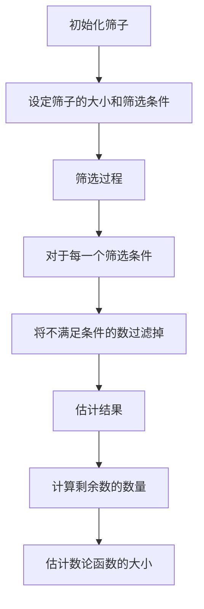

# 解析数论基础：大筛法型的特征和估计

## 1.背景介绍

大筛法（Large Sieve）是解析数论中的一种重要工具，广泛应用于素数分布、数论函数估计等领域。大筛法的核心思想是通过筛选技术来估计数论函数的大小和分布特性。本文将深入探讨大筛法的基本概念、算法原理、数学模型、实际应用以及未来发展趋势。

## 2.核心概念与联系

### 2.1 筛法简介

筛法是数论中用于找出素数或满足特定条件的数的一种方法。最著名的筛法是埃拉托色尼筛法，用于找出一定范围内的所有素数。大筛法则是筛法的一种扩展，主要用于估计数论函数的大小。

### 2.2 大筛法的基本思想

大筛法的基本思想是通过构造一个筛子，将不满足特定条件的数过滤掉，从而估计剩余数的数量。大筛法通常用于处理具有特定结构的数列，如素数、平方数等。

### 2.3 大筛法与其他筛法的联系

大筛法与其他筛法（如小筛法、线性筛法）在思想上有相似之处，但在应用范围和复杂度上有所不同。大筛法更适用于处理复杂的数论问题，尤其是涉及到数论函数估计的问题。

## 3.核心算法原理具体操作步骤

### 3.1 大筛法的基本步骤

1. **初始化筛子**：设定筛子的初始条件，如筛子的大小、筛选条件等。
2. **筛选过程**：通过筛选条件，将不满足条件的数过滤掉。
3. **估计结果**：根据筛选后的结果，估计数论函数的大小和分布特性。

### 3.2 具体操作步骤

#### 3.2.1 初始化筛子

设定筛子的大小 $N$ 和筛选条件 $P$。例如，对于素数筛选，$P$ 可以是所有小于 $N$ 的素数。

#### 3.2.2 筛选过程

对于每一个筛选条件 $p \in P$，将所有满足 $n \equiv 0 \pmod{p}$ 的数过滤掉。

#### 3.2.3 估计结果

根据筛选后的结果，计算剩余数的数量，并估计数论函数的大小。

### 3.3 Mermaid 流程图



## 4.数学模型和公式详细讲解举例说明

### 4.1 数学模型

大筛法的数学模型主要涉及数论函数的估计。设 $f(n)$ 是一个数论函数，$N$ 是筛子的大小，$P$ 是筛选条件，则大筛法的数学模型可以表示为：

$$
S(N, P) = \sum_{n \leq N} f(n) \cdot \prod_{p \in P} \left(1 - \frac{1}{p}\right)
$$

### 4.2 公式详细讲解

#### 4.2.1 筛子大小 $N$

筛子大小 $N$ 决定了筛选的范围。通常，$N$ 越大，筛选的精度越高，但计算复杂度也越高。

#### 4.2.2 筛选条件 $P$

筛选条件 $P$ 是一组满足特定条件的数，如素数、平方数等。筛选条件的选择直接影响筛选结果的准确性。

#### 4.2.3 数论函数 $f(n)$

数论函数 $f(n)$ 是一个定义在自然数上的函数，如 $\mu(n)$（莫比乌斯函数）、$\phi(n)$（欧拉函数）等。大筛法通过估计 $f(n)$ 的值来研究数论问题。

### 4.3 举例说明

#### 4.3.1 素数筛选

设 $f(n) = 1$，$P$ 是所有小于 $N$ 的素数，则大筛法的数学模型为：

$$
S(N, P) = \sum_{n \leq N} \prod_{p \in P} \left(1 - \frac{1}{p}\right)
$$

通过计算 $S(N, P)$，可以估计小于 $N$ 的素数数量。

## 5.项目实践：代码实例和详细解释说明

### 5.1 Python 实现大筛法

以下是一个使用 Python 实现大筛法的示例代码：

```python
def large_sieve(N, P):
    # 初始化筛子
    sieve = [True] * (N + 1)
    sieve[0] = sieve[1] = False
    
    # 筛选过程
    for p in P:
        if p * p > N:
            break
        if sieve[p]:
            for i in range(p * p, N + 1, p):
                sieve[i] = False
    
    # 估计结果
    result = sum(1 for i in range(N + 1) if sieve[i])
    return result

# 示例使用
N = 100
P = [2, 3, 5, 7]
print(f"小于 {N} 的素数数量估计为: {large_sieve(N, P)}")
```

### 5.2 代码详细解释

#### 5.2.1 初始化筛子

```python
sieve = [True] * (N + 1)
sieve[0] = sieve[1] = False
```

初始化一个大小为 $N+1$ 的布尔数组 `sieve`，并将索引 0 和 1 设为 `False`，表示 0 和 1 不是素数。

#### 5.2.2 筛选过程

```python
for p in P:
    if p * p > N:
        break
    if sieve[p]:
        for i in range(p * p, N + 1, p):
            sieve[i] = False
```

对于每一个筛选条件 $p \in P$，如果 $p^2 > N$，则停止筛选。否则，将所有满足 $n \equiv 0 \pmod{p}$ 的数过滤掉。

#### 5.2.3 估计结果

```python
result = sum(1 for i in range(N + 1) if sieve[i])
```

计算筛选后的剩余数的数量，即小于 $N$ 的素数数量。

## 6.实际应用场景

### 6.1 素数分布研究

大筛法广泛应用于素数分布的研究，通过估计素数的数量和分布特性，揭示素数的规律。

### 6.2 数论函数估计

大筛法可以用于估计各种数论函数的值，如莫比乌斯函数、欧拉函数等，帮助研究数论问题。

### 6.3 密码学应用

在密码学中，大筛法可以用于分析和估计密码算法的安全性，特别是涉及到素数分布和数论函数的算法。

## 7.工具和资源推荐

### 7.1 数学软件

- **Mathematica**：强大的数学计算软件，支持数论函数的计算和分析。
- **SageMath**：开源数学软件，提供丰富的数论工具和函数。

### 7.2 编程语言

- **Python**：简单易用，适合实现大筛法和数论函数的计算。
- **C++**：高效的编程语言，适合处理大规模数论计算。

### 7.3 在线资源

- **Project Euler**：提供大量数论相关的编程挑战，适合练习和应用大筛法。
- **Math Stack Exchange**：数学问答社区，可以获取数论相关的知识和解答。

## 8.总结：未来发展趋势与挑战

### 8.1 未来发展趋势

随着计算机技术的发展，大筛法在数论研究中的应用将更加广泛。未来，大筛法可能会与机器学习、人工智能等技术结合，进一步提高数论函数估计的精度和效率。

### 8.2 挑战

大筛法在处理大规模数论问题时，计算复杂度较高，如何优化算法、提高计算效率是一个重要的挑战。此外，大筛法在实际应用中需要处理大量数据，数据存储和处理能力也是一个需要解决的问题。

## 9.附录：常见问题与解答

### 9.1 大筛法与小筛法的区别是什么？

大筛法和小筛法在思想上有相似之处，但应用范围和复杂度不同。大筛法适用于处理复杂的数论问题，尤其是涉及数论函数估计的问题，而小筛法主要用于找出一定范围内的素数。

### 9.2 如何选择筛选条件 $P$？

筛选条件 $P$ 的选择取决于具体的数论问题。通常，$P$ 是一组满足特定条件的数，如素数、平方数等。选择合适的筛选条件可以提高筛选结果的准确性。

### 9.3 大筛法的计算复杂度如何？

大筛法的计算复杂度取决于筛子的大小 $N$ 和筛选条件 $P$ 的数量。通常，$N$ 越大，筛选条件 $P$ 越多，计算复杂度越高。优化算法和提高计算效率是大筛法研究中的一个重要方向。

---

作者：禅与计算机程序设计艺术 / Zen and the Art of Computer Programming