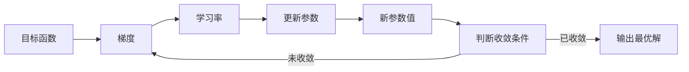

# 优化算法：梯度下降 (Gradient Descent) 原理与代码实例讲解

## 1. 背景介绍

### 1.1 问题的由来

在机器学习、深度学习以及数据科学等领域中，我们经常会遇到需要优化某个目标函数或者代价函数的情况。这些函数通常是高维、非线性和非凸的,很难直接求解出解析解。因此,我们需要一种迭代算法来逐步逼近最优解。梯度下降(Gradient Descent)算法就是这样一种广泛使用的优化算法。

### 1.2 研究现状

梯度下降算法源于18世纪的数学研究,最早由数学家夏多内斯克(Adrien-Marie Legendre)提出。随后,在19世纪,高斯(Carl Friedrich Gauss)和柯西(Augustin-Louis Cauchy)对该算法进行了进一步的发展。20世纪初,梯度下降算法被应用于最小二乘法的求解。直到近年来,随着机器学习和深度学习的兴起,梯度下降算法在这些领域得到了广泛的应用和研究。

### 1.3 研究意义

梯度下降算法是一种简单而有效的优化算法,它可以帮助我们找到目标函数的最小值或最大值。在机器学习和深度学习中,我们需要优化模型的参数,使得模型在训练数据上的损失函数(或代价函数)达到最小。梯度下降算法就是一种常用的优化模型参数的方法。此外,梯度下降算法还可以应用于其他领域,如数值优化、信号处理等。因此,深入理解梯度下降算法的原理和实现方式对于广大研究人员和工程师来说是非常重要的。

### 1.4 本文结构

本文将从以下几个方面详细介绍梯度下降算法:

1. 核心概念与联系
2. 核心算法原理与具体操作步骤
3. 数学模型和公式详细讲解与案例分析
4. 项目实践:代码实例和详细解释说明
5. 实际应用场景
6. 工具和资源推荐
7. 总结:未来发展趋势与挑战
8. 附录:常见问题与解答

## 2. 核心概念与联系

在介绍梯度下降算法之前,我们先来了解一些核心概念和它们之间的联系。

### 2.1 目标函数(Objective Function)

在优化问题中,我们通常会定义一个目标函数或代价函数(Cost Function),它描述了我们想要优化的目标。在机器学习中,这个目标函数通常是模型的损失函数(Loss Function),它衡量了模型的预测值与真实值之间的差异。我们的目标就是找到模型参数的值,使得损失函数达到最小。

### 2.2 梯度(Gradient)

梯度是一个向量,它指向目标函数在当前点处的增长最快的方向。梯度的每个分量表示目标函数沿该维度的变化率。如果我们沿着梯度的反方向移动,目标函数就会减小。因此,梯度为我们提供了一种调整参数以减小目标函数值的方式。

### 2.3 学习率(Learning Rate)

学习率决定了我们沿着梯度反方向移动的步长。一个较大的学习率可以加快收敛速度,但也可能导致无法收敛或发散。一个较小的学习率可以保证收敛,但收敛速度会变慢。因此,选择一个合适的学习率对于梯度下降算法的性能至关重要。

### 2.4 局部最小值(Local Minima)

由于目标函数通常是非凸的,梯度下降算法可能会陷入局部最小值,无法找到全局最小值。这是梯度下降算法的一个缺陷,需要通过一些技巧来避免,例如使用随机初始化、动量(Momentum)等方法。

### 2.5 收敛条件(Convergence Criteria)

我们需要设置一个收敛条件,以判断梯度下降算法何时应该停止迭代。常见的收敛条件包括:梯度的范数小于某个阈值、目标函数值的变化小于某个阈值、迭代次数达到上限等。

### 2.6 Mermaid 流程图

上图展示了梯度下降算法的核心概念及其之间的关系。我们首先定义一个目标函数,然后计算该函数在当前参数值处的梯度。根据梯度的方向和学习率,我们更新参数的值。重复这个过程,直到满足收敛条件,输出最优解。

## 3. 核心算法原理与具体操作步骤

### 3.1 算法原理概述

梯度下降算法的核心思想是:沿着目标函数的负梯度方向更新参数,使目标函数值不断减小,最终收敛到局部最小值。具体来说,算法的步骤如下:

1. 初始化参数的值,通常是随机初始化。
2. 计算目标函数在当前参数值处的梯度。
3. 根据梯度的方向和学习率,更新参数的值。
4. 重复步骤2和3,直到满足收敛条件。

梯度下降算法的数学表达式如下:

$$
\theta_{t+1} = \theta_t - \eta \nabla J(\theta_t)
$$

其中:
- $\theta_t$是当前的参数值
- $\eta$是学习率
- $\nabla J(\theta_t)$是目标函数$J$在$\theta_t$处的梯度

可以看出,参数的更新方向是沿着负梯度方向,步长由学习率决定。通过不断迭代,参数值会逐渐逼近目标函数的最小值。

### 3.2 算法步骤详解

下面我们详细解释一下梯度下降算法的具体步骤:

1. **初始化参数值**

   我们需要为参数赋予一个初始值,通常是随机初始化。初始值的选择会影响算法的收敛速度和是否陷入局部最小值。一种常见的做法是从一个较小的区间(如[-0.1, 0.1])中均匀随机采样初始值。

2. **计算梯度**

   梯度是目标函数对参数的偏导数,它指向目标函数在当前点处增长最快的方向。我们需要计算目标函数对每个参数的偏导数,组成一个梯度向量。

   对于一个包含$n$个参数的目标函数$J(\theta_1, \theta_2, \ldots, \theta_n)$,它的梯度为:

   $$
   \nabla J(\theta) = \begin{bmatrix}
     \frac{\partial J}{\partial \theta_1} \\
     \frac{\partial J}{\partial \theta_2} \\
     \vdots \\
     \frac{\partial J}{\partial \theta_n}
   \end{bmatrix}
   $$

   计算梯度的方法有多种,包括数值计算、符号计算和自动微分等。在深度学习中,通常使用反向传播算法(Backpropagation)来高效计算梯度。

3. **更新参数值**

   根据梯度的方向和学习率,我们更新参数的值:

   $$
   \theta_{t+1} = \theta_t - \eta \nabla J(\theta_t)
   $$

   其中$\eta$是学习率,它决定了我们沿梯度方向移动的步长。一个较大的学习率可以加快收敛速度,但也可能导致无法收敛或发散。一个较小的学习率可以保证收敛,但收敛速度会变慢。

   选择合适的学习率是梯度下降算法的一个关键点。常见的做法是使用一个较小的固定学习率,或者使用一些自适应学习率算法,如AdaGrad、RMSProp、Adam等。

4. **判断收敛条件**

   在每一次迭代后,我们需要判断是否满足收敛条件。常见的收敛条件包括:

   - 梯度范数小于某个阈值:$\|\nabla J(\theta_t)\| < \epsilon$
   - 目标函数值的变化小于某个阈值:$|J(\theta_{t+1}) - J(\theta_t)| < \epsilon$
   - 迭代次数达到上限:$t > t_{\max}$

   如果满足收敛条件,算法终止,输出当前的参数值作为最优解。否则,继续进行下一次迭代。

5. **重复迭代**

   重复步骤2~4,不断更新参数值,直到满足收敛条件。

### 3.3 算法优缺点

梯度下降算法的优点包括:

- 简单易懂,原理清晰
- 计算高效,可以处理大规模数据
- 可以并行计算,提高效率
- 适用于各种类型的目标函数

缺点包括:

- 可能陷入局部最小值,无法找到全局最优解
- 收敛速度较慢,尤其是在接近最小值时
- 对初始值、学习率等超参数敏感
- 对于高维稀疏数据,性能可能不佳

### 3.4 算法应用领域

梯度下降算法广泛应用于以下领域:

- **机器学习与深度学习**: 用于训练模型参数,最小化损失函数。
- **数值优化**: 求解各种优化问题的最优解。
- **信号处理**: 自适应滤波、波束形成等。
- **控制理论**: 最优控制问题的求解。
- **自然语言处理**: 词向量训练、语言模型等。
- **计算机视觉**: 图像分类、目标检测等。

## 4. 数学模型和公式详细讲解与举例说明

### 4.1 数学模型构建

在介绍梯度下降算法的数学模型之前,我们先来看一个简单的例子。假设我们有一个单变量函数$f(x) = x^2$,我们的目标是找到这个函数的最小值。

我们可以把这个优化问题形式化为:

$$
\begin{align*}
\min\limits_x \quad & f(x) \\
\text{s.t.} \quad & x \in \mathbb{R}
\end{align*}
$$

其中,$f(x)$是我们要优化的目标函数,约束条件是$x$是一个实数。

对于这个简单的例子,我们可以直接计算出解析解$x^* = 0$。但是对于更一般的情况,目标函数可能是多元的、非线性的、非凸的,很难直接求解。这时,我们就需要使用迭代优化算法,如梯度下降算法。

### 4.2 公式推导过程

现在,我们来推导一下梯度下降算法的数学公式。

对于一个多元目标函数$J(\theta_1, \theta_2, \ldots, \theta_n)$,我们的目标是找到参数$\theta$的值,使得$J(\theta)$达到最小值。根据泰勒级数展开式,在$\theta$附近,有:

$$
J(\theta + \Delta\theta) \approx J(\theta) + \nabla J(\theta)^T \Delta\theta + \mathcal{O}(\|\Delta\theta\|^2)
$$

其中,$\nabla J(\theta)$是$J$在$\theta$处的梯度向量,$\mathcal{O}(\|\Delta\theta\|^2)$是高阶无穷小项。

为了使$J(\theta + \Delta\theta)$减小,我们希望$\nabla J(\theta)^T \Delta\theta < 0$。一种简单的选择是让$\Delta\theta = -\eta \nabla J(\theta)$,其中$\eta$是一个正的常数,称为学习率。代入上式,我们得到:

$$
J(\theta - \eta \nabla J(\theta)) \approx J(\theta) - \eta \|\nabla J(\theta)\|^2 + \mathcal{O}(\eta^2)
$$

当$\eta$足够小时,高阶无穷小项可以忽略不计。这样,我们就得到了一个比$J(\theta)$更小的值。

通过不断迭代,我们可以更新参数$\theta$:

$$
\theta_{t+1} = \theta_t - \eta \nabla J(\theta_t)
$$

其中,$\theta_t$是第$t$次迭代时的参数值。重复这个过程,直到满足某个收敛条件,我们就可以得到一个局部最小值点。

### 4.3 案例分析与讲解