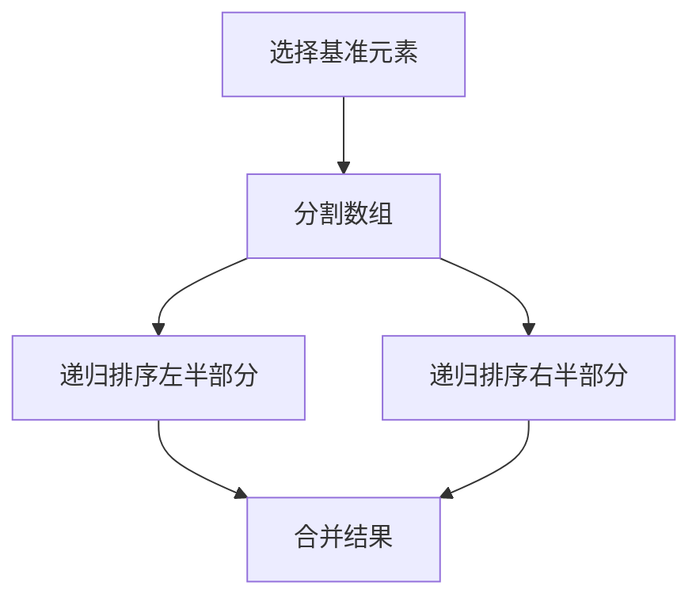

# 怎样培养扎实的编程能力，优秀的设计和代码品位

作者：禅与计算机程序设计艺术 / Zen and the Art of Computer Programming

## 1. 背景介绍

### 1.1 问题的由来

在当今信息技术飞速发展的时代，编程能力已经成为一项必备的技能。无论是软件开发、数据分析还是人工智能领域，扎实的编程能力都是成功的基石。然而，许多初学者和甚至一些有经验的程序员在编程过程中常常遇到各种问题，如代码质量不高、设计不合理、难以维护等。这些问题不仅影响了项目的进度和质量，还可能导致严重的技术债务。

### 1.2 研究现状

目前，关于如何提高编程能力和代码质量的研究已经取得了一定的成果。许多编程书籍、在线课程和技术博客都提供了丰富的学习资源。然而，这些资源往往侧重于某一特定语言或技术，缺乏系统性和全面性。此外，许多资源只关注技术细节，而忽略了编程思维和设计原则的重要性。

### 1.3 研究意义

本文旨在通过系统地介绍编程能力、设计原则和代码品位的培养方法，帮助读者全面提升编程水平。无论你是初学者还是有经验的程序员，都可以从本文中找到有价值的建议和指导。通过学习本文的内容，读者将能够编写出高质量、易维护、具有良好设计的代码，从而在职业生涯中取得更大的成功。

### 1.4 本文结构

本文将分为以下几个部分：

1. 核心概念与联系
2. 核心算法原理 & 具体操作步骤
3. 数学模型和公式 & 详细讲解 & 举例说明
4. 项目实践：代码实例和详细解释说明
5. 实际应用场景
6. 工具和资源推荐
7. 总结：未来发展趋势与挑战
8. 附录：常见问题与解答

## 2. 核心概念与联系

在开始深入探讨编程能力和设计原则之前，我们需要了解一些核心概念。这些概念不仅是编程的基础，也是理解高级编程技巧和设计模式的关键。

### 2.1 编程能力

编程能力不仅仅是指掌握某种编程语言的语法和基本操作，更重要的是解决问题的能力。这包括算法设计、数据结构选择、代码优化等方面。编程能力的培养需要长期的实践和不断的学习。

### 2.2 设计原则

设计原则是指导我们进行软件设计的基本准则。良好的设计原则可以帮助我们编写出高质量、易维护的代码。常见的设计原则包括SOLID原则、DRY原则、KISS原则等。

### 2.3 代码品位

代码品位是指编写出优雅、简洁、易读的代码的能力。代码品位不仅影响代码的可读性和可维护性，还反映了程序员的专业素养。培养代码品位需要不断地学习和借鉴优秀的代码范例。

### 2.4 核心概念之间的联系

编程能力、设计原则和代码品位是相互联系、相互影响的。扎实的编程能力是良好设计的基础，而良好的设计又能提升代码的品位。三者相辅相成，共同构成了高质量软件开发的核心要素。

## 3. 核心算法原理 & 具体操作步骤

在编程过程中，算法是解决问题的核心。理解和掌握常见的算法原理和具体操作步骤，是提升编程能力的重要途径。

### 3.1 算法原理概述

算法是解决特定问题的一系列步骤或规则。一个好的算法应该具有高效性、正确性和可读性。常见的算法包括排序算法、搜索算法、图算法等。

### 3.2 算法步骤详解

以快速排序算法为例，我们可以通过以下步骤来理解其具体操作：

1. 选择一个基准元素（pivot）。
2. 将数组分为两部分，一部分小于基准元素，另一部分大于基准元素。
3. 对两部分分别递归进行快速排序。
4. 合并排序结果。



### 3.3 算法优缺点

快速排序算法的优点是平均时间复杂度为 $O(n \log n)$，空间复杂度为 $O(\log n)$。然而，在最坏情况下（如数组已经有序），时间复杂度可能降为 $O(n^2)$。

### 3.4 算法应用领域

快速排序算法广泛应用于各种需要排序的场景，如数据库查询优化、数据分析等。此外，理解快速排序算法的原理和实现，有助于我们更好地掌握其他高级算法。

## 4. 数学模型和公式 & 详细讲解 & 举例说明

数学模型和公式是编程中的重要工具。通过构建数学模型，我们可以更好地理解问题的本质，并找到高效的解决方案。

### 4.1 数学模型构建

构建数学模型的第一步是明确问题的输入和输出。接下来，我们需要找到描述问题的数学关系或公式。例如，在图像处理领域，我们可以使用卷积运算来描述图像滤波过程。

### 4.2 公式推导过程

以卷积运算为例，其公式为：

$$
(f * g)(t) = \int_{-\infty}^{\infty} f(\tau) g(t - \tau) d\tau
$$

其中，$f$ 和 $g$ 分别是输入信号和滤波器，$t$ 是时间变量。通过推导该公式，我们可以理解卷积运算的本质，并应用于实际的图像处理任务中。

### 4.3 案例分析与讲解

假设我们需要对一幅图像进行边缘检测，可以使用Sobel算子进行卷积运算。Sobel算子的水平和垂直方向滤波器分别为：

$$
G_x = \begin{bmatrix}
-1 & 0 & 1 \\
-2 & 0 & 2 \\
-1 & 0 & 1
\end{bmatrix}
$$

$$
G_y = \begin{bmatrix}
-1 & -2 & -1 \\
0 & 0 & 0 \\
1 & 2 & 1
\end{bmatrix}
$$

通过对图像进行卷积运算，我们可以得到图像的边缘信息。

### 4.4 常见问题解答

在实际应用中，卷积运算可能会遇到边界处理、计算复杂度等问题。常见的解决方法包括填充边界、使用快速卷积算法等。

## 5. 项目实践：代码实例和详细解释说明

理论知识的学习需要通过实践来巩固。下面我们将通过一个具体的项目实例，详细介绍代码的实现和解释。

### 5.1 开发环境搭建

首先，我们需要搭建开发环境。以Python为例，我们可以使用以下命令安装所需的库：

```bash
pip install numpy opencv-python
```

### 5.2 源代码详细实现

接下来，我们编写一个简单的图像边缘检测程序：

```python
import cv2
import numpy as np

# 读取图像
image = cv2.imread('image.jpg', cv2.IMREAD_GRAYSCALE)

# 定义Sobel算子
Gx = np.array([[-1, 0, 1], [-2, 0, 2], [-1, 0, 1]])
Gy = np.array([[-1, -2, -1], [0, 0, 0], [1, 2, 1]])

# 进行卷积运算
sobel_x = cv2.filter2D(image, -1, Gx)
sobel_y = cv2.filter2D(image, -1, Gy)

# 计算梯度幅值
gradient_magnitude = np.sqrt(sobel_x**2 + sobel_y**2)

# 显示结果
cv2.imshow('Edge Detection', gradient_magnitude)
cv2.waitKey(0)
cv2.destroyAllWindows()
```

### 5.3 代码解读与分析

上述代码首先读取了一幅灰度图像，然后定义了Sobel算子。接着，通过卷积运算计算图像的水平和垂直梯度。最后，计算梯度幅值并显示结果。

### 5.4 运行结果展示

运行上述代码后，我们可以看到图像的边缘信息。通过调整Sobel算子的参数，我们可以进一步优化边缘检测的效果。

## 6. 实际应用场景

编程能力和设计原则在实际应用中具有广泛的应用场景。下面我们将介绍几个典型的应用场景。

### 6.1 软件开发

在软件开发过程中，扎实的编程能力和良好的设计原则可以帮助我们编写出高质量、易维护的代码。例如，在开发一个大型的企业级应用时，我们需要考虑模块化设计、代码复用、性能优化等问题。

### 6.2 数据分析

在数据分析领域，编程能力是必不可少的。通过编写高效的数据处理和分析代码，我们可以从海量数据中提取有价值的信息。例如，在金融数据分析中，我们可以使用Python编写数据清洗、特征提取和模型训练的代码。

### 6.3 人工智能

人工智能领域对编程能力和设计原则的要求更高。无论是机器学习模型的训练，还是深度学习网络的设计，都需要扎实的编程基础和良好的设计思维。例如，在图像分类任务中，我们需要设计合理的神经网络结构，并编写高效的训练代码。

### 6.4 未来应用展望

随着技术的不断发展，编程能力和设计原则的应用场景将更加广泛。例如，在物联网、区块链、量子计算等新兴领域，编程能力和设计原则将发挥重要作用。

## 7. 工具和资源推荐

学习编程和设计原则需要借助各种工具和资源。下面我们将推荐一些常用的学习资源和开发工具。

### 7.1 学习资源推荐

1. **书籍**：《代码大全》、《设计模式》、《算法导论》
2. **在线课程**：Coursera、edX、Udacity
3. **技术博客**：Medium、Dev.to、Hacker Noon

### 7.2 开发工具推荐

1. **集成开发环境**：Visual Studio Code、PyCharm、Eclipse
2. **版本控制工具**：Git、SVN
3. **调试工具**：GDB、PDB

### 7.3 相关论文推荐

1. **《A Survey of Software Design Patterns》**
2. **《An Empirical Study of Code Smells in Open Source Software》**
3. **《Deep Learning for Image Classification: A Review》**

### 7.4 其他资源推荐

1. **编程竞赛**：LeetCode、Codeforces、HackerRank
2. **开源项目**：GitHub、GitLab
3. **技术社区**：Stack Overflow、Reddit

## 8. 总结：未来发展趋势与挑战

在本文中，我们系统地介绍了如何培养扎实的编程能力、优秀的设计和代码品位。通过学习和实践，读者可以全面提升编程水平，并在职业生涯中取得更大的成功。

### 8.1 研究成果总结

本文从核心概念、算法原理、数学模型、项目实践、实际应用等方面，详细介绍了编程能力和设计原则的培养方法。通过理论与实践相结合，读者可以更好地理解和掌握编程技巧。

### 8.2 未来发展趋势

随着技术的不断发展，编程能力和设计原则的应用场景将更加广泛。例如，在物联网、区块链、量子计算等新兴领域，编程能力和设计原则将发挥重要作用。

### 8.3 面临的挑战

在未来的发展中，编程能力和设计原则的培养将面临一些挑战。例如，技术更新速度快、学习资源繁多、实际应用复杂等。为了应对这些挑战，程序员需要不断学习和实践，保持对新技术的敏感性。

### 8.4 研究展望

未来的研究可以进一步探讨如何更高效地培养编程能力和设计原则。例如，利用人工智能技术开发智能编程助手，帮助程序员更快地编写高质量代码。此外，研究如何在团队协作中应用设计原则，提高团队的开发效率和代码质量，也是一个重要的方向。

## 9. 附录：常见问题与解答

### 9.1 如何选择适合自己的编程语言？

选择编程语言应根据具体的应用场景和个人兴趣。例如，Python适合数据分析和人工智能，Java适合企业级应用开发，C++适合系统编程和游戏开发。

### 9.2 如何提高代码的可读性？

提高代码可读性的方法包括使用有意义的变量名、遵循代码风格规范、添加适当的注释、避免过于复杂的逻辑等。

### 9.3 如何进行代码优化？

代码优化的方法包括算法优化、数据结构优化、减少不必要的计算、使用高效的库和工具等。

### 9.4 如何保持对新技术的敏感性？

保持对新技术的敏感性需要不断学习和实践。可以通过阅读技术书籍、参加在线课程、参与开源项目、参加技术会议等方式，保持对新技术的了解和掌握。

通过本文的学习，读者可以系统地了解如何培养扎实的编程能力、优秀的设计和代码品位。希望本文能对读者的编程学习和职业发展有所帮助。