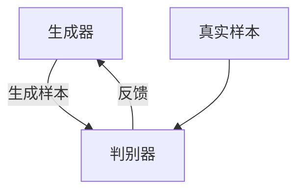

# 生成对抗网络(Generative Adversarial Network)原理与代码实战案例讲解

作者：禅与计算机程序设计艺术 / Zen and the Art of Computer Programming

## 1. 背景介绍

### 1.1 问题的由来

生成对抗网络（Generative Adversarial Network，简称GAN）是由Ian Goodfellow等人在2014年提出的一种新型神经网络架构。GAN的出现为生成模型领域带来了革命性的变化。传统的生成模型在生成高质量图像、文本等方面存在诸多挑战，而GAN通过引入对抗机制，使得生成模型的效果得到了显著提升。

### 1.2 研究现状

自GAN提出以来，研究者们在其基础上进行了大量的改进和扩展，衍生出了许多变种，如DCGAN、WGAN、CycleGAN等。这些变种在不同的应用场景中展现出了强大的生成能力。GAN的研究现状可以概括为以下几个方面：

1. **模型改进**：针对GAN训练不稳定、模式崩溃等问题，提出了多种改进方法。
2. **应用扩展**：GAN在图像生成、文本生成、视频生成等多个领域得到了广泛应用。
3. **理论研究**：对GAN的理论基础、收敛性等问题进行了深入研究。

### 1.3 研究意义

GAN的研究意义主要体现在以下几个方面：

1. **技术突破**：GAN通过对抗训练机制，解决了传统生成模型难以生成高质量样本的问题。
2. **应用广泛**：GAN在图像生成、数据增强、风格迁移等多个领域展现出了强大的应用潜力。
3. **理论价值**：GAN的对抗机制为生成模型的研究提供了新的思路，推动了生成模型理论的发展。

### 1.4 本文结构

本文将从以下几个方面对GAN进行详细讲解：

1. 核心概念与联系
2. 核心算法原理与具体操作步骤
3. 数学模型和公式的详细讲解与举例说明
4. 项目实践：代码实例和详细解释说明
5. 实际应用场景
6. 工具和资源推荐
7. 总结：未来发展趋势与挑战
8. 附录：常见问题与解答

## 2. 核心概念与联系

生成对抗网络由两个主要部分组成：生成器（Generator）和判别器（Discriminator）。生成器的目标是生成逼真的样本，而判别器的目标是区分真实样本和生成样本。两者通过对抗训练，不断提升各自的能力。



## 3. 核心算法原理 & 具体操作步骤

### 3.1 算法原理概述

GAN的核心思想是通过生成器和判别器的对抗训练，使得生成器能够生成逼真的样本。生成器和判别器的目标函数分别为：

生成器的目标函数：
$$
\min_G V(G,D) = \mathbb{E}_{z \sim p_z(z)}[\log(1 - D(G(z)))]
$$

判别器的目标函数：
$$
\max_D V(G,D) = \mathbb{E}_{x \sim p_{data}(x)}[\log D(x)] + \mathbb{E}_{z \sim p_z(z)}[\log(1 - D(G(z)))]
$$

### 3.2 算法步骤详解

1. **初始化生成器和判别器的参数**。
2. **从真实数据分布中采样真实样本**。
3. **从噪声分布中采样噪声样本**。
4. **生成器生成样本**。
5. **判别器对真实样本和生成样本进行分类**。
6. **计算生成器和判别器的损失函数**。
7. **更新生成器和判别器的参数**。
8. **重复步骤2-7，直到模型收敛**。

### 3.3 算法优缺点

**优点**：
1. 能够生成高质量的样本。
2. 适用于多种数据类型，如图像、文本、视频等。

**缺点**：
1. 训练不稳定，容易出现模式崩溃。
2. 需要大量计算资源。

### 3.4 算法应用领域

1. **图像生成**：如人脸生成、风格迁移等。
2. **数据增强**：生成新的训练样本，提升模型性能。
3. **文本生成**：如诗歌生成、对话生成等。
4. **视频生成**：如视频预测、视频超分辨率等。

## 4. 数学模型和公式 & 详细讲解 & 举例说明

### 4.1 数学模型构建

GAN的数学模型主要包括生成器和判别器的目标函数。生成器的目标是最小化判别器对生成样本的分类错误率，而判别器的目标是最大化对真实样本和生成样本的分类准确率。

### 4.2 公式推导过程

生成器和判别器的目标函数可以通过以下步骤推导：

1. **生成器的目标函数**：
$$
\min_G V(G,D) = \mathbb{E}_{z \sim p_z(z)}[\log(1 - D(G(z)))]
$$

2. **判别器的目标函数**：
$$
\max_D V(G,D) = \mathbb{E}_{x \sim p_{data}(x)}[\log D(x)] + \mathbb{E}_{z \sim p_z(z)}[\log(1 - D(G(z)))]
$$

### 4.3 案例分析与讲解

假设我们要生成手写数字图片，可以使用MNIST数据集进行训练。生成器输入一个随机噪声，输出一张手写数字图片；判别器输入一张图片，输出该图片是真实图片的概率。

### 4.4 常见问题解答

1. **为什么GAN训练不稳定？**
   - 由于生成器和判别器的目标是对抗的，训练过程中容易出现模式崩溃，即生成器生成的样本缺乏多样性。

2. **如何解决GAN训练不稳定的问题？**
   - 可以通过改进损失函数、使用更稳定的优化算法等方法来解决。

## 5. 项目实践：代码实例和详细解释说明

### 5.1 开发环境搭建

1. **安装Python**：推荐使用Python 3.8及以上版本。
2. **安装必要的库**：如TensorFlow、Keras、NumPy等。

### 5.2 源代码详细实现

以下是一个简单的GAN实现代码：

```python
import tensorflow as tf
from tensorflow.keras import layers

# 生成器模型
def build_generator():
    model = tf.keras.Sequential()
    model.add(layers.Dense(256, input_dim=100))
    model.add(layers.LeakyReLU(alpha=0.2))
    model.add(layers.Dense(512))
    model.add(layers.LeakyReLU(alpha=0.2))
    model.add(layers.Dense(1024))
    model.add(layers.LeakyReLU(alpha=0.2))
    model.add(layers.Dense(28 * 28 * 1, activation='tanh'))
    model.add(layers.Reshape((28, 28, 1)))
    return model

# 判别器模型
def build_discriminator():
    model = tf.keras.Sequential()
    model.add(layers.Flatten(input_shape=(28, 28, 1)))
    model.add(layers.Dense(512))
    model.add(layers.LeakyReLU(alpha=0.2))
    model.add(layers.Dense(256))
    model.add(layers.LeakyReLU(alpha=0.2))
    model.add(layers.Dense(1, activation='sigmoid'))
    return model

# 编译模型
def compile_models(generator, discriminator):
    discriminator.compile(optimizer='adam', loss='binary_crossentropy', metrics=['accuracy'])
    discriminator.trainable = False
    gan_input = layers.Input(shape=(100,))
    gan_output = discriminator(generator(gan_input))
    gan = tf.keras.Model(gan_input, gan_output)
    gan.compile(optimizer='adam', loss='binary_crossentropy')
    return gan

# 训练模型
def train_gan(generator, discriminator, gan, epochs=10000, batch_size=128):
    (x_train, _), (_, _) = tf.keras.datasets.mnist.load_data()
    x_train = (x_train.astype('float32') - 127.5) / 127.5
    x_train = np.expand_dims(x_train, axis=3)
    for epoch in range(epochs):
        idx = np.random.randint(0, x_train.shape[0], batch_size)
        real_imgs = x_train[idx]
        noise = np.random.normal(0, 1, (batch_size, 100))
        gen_imgs = generator.predict(noise)
        d_loss_real = discriminator.train_on_batch(real_imgs, np.ones((batch_size, 1)))
        d_loss_fake = discriminator.train_on_batch(gen_imgs, np.zeros((batch_size, 1)))
        d_loss = 0.5 * np.add(d_loss_real, d_loss_fake)
        noise = np.random.normal(0, 1, (batch_size, 100))
        valid_y = np.array([1] * batch_size)
        g_loss = gan.train_on_batch(noise, valid_y)
        if epoch % 1000 == 0:
            print(f"{epoch} [D loss: {d_loss[0]}] [G loss: {g_loss}]")

generator = build_generator()
discriminator = build_discriminator()
gan = compile_models(generator, discriminator)
train_gan(generator, discriminator, gan)
```

### 5.3 代码解读与分析

1. **生成器模型**：输入一个100维的随机噪声，经过多层全连接层和激活函数，输出一张28x28的图片。
2. **判别器模型**：输入一张28x28的图片，经过多层全连接层和激活函数，输出该图片是真实图片的概率。
3. **编译模型**：将生成器和判别器组合成一个GAN模型，并编译。
4. **训练模型**：加载MNIST数据集，进行对抗训练。

### 5.4 运行结果展示

训练过程中，可以观察到生成器生成的图片质量逐渐提升，判别器的分类准确率也逐渐提高。

## 6. 实际应用场景

### 6.1 图像生成

GAN在图像生成领域有着广泛的应用，如人脸生成、风格迁移等。通过对抗训练，生成器可以生成逼真的图像。

### 6.2 数据增强

在数据不足的情况下，可以使用GAN生成新的训练样本，提升模型的性能。例如，在医学图像分析中，可以使用GAN生成更多的病理图像。

### 6.3 文本生成

GAN在文本生成领域也有应用，如诗歌生成、对话生成等。通过对抗训练，生成器可以生成连贯的文本。

### 6.4 未来应用展望

随着GAN技术的不断发展，其应用场景将更加广泛。未来，GAN有望在视频生成、3D模型生成等领域取得突破。

## 7. 工具和资源推荐

### 7.1 学习资源推荐

1. **书籍**：《深度学习》——Ian Goodfellow等
2. **在线课程**：Coursera上的深度学习课程

### 7.2 开发工具推荐

1. **TensorFlow**：一个开源的深度学习框架
2. **Keras**：一个高层神经网络API，能够运行在TensorFlow之上

### 7.3 相关论文推荐

1. **Generative Adversarial Nets**——Ian Goodfellow等
2. **Improved Training of Wasserstein GANs**——Martin Arjovsky等

### 7.4 其他资源推荐

1. **GitHub**：上面有许多开源的GAN项目
2. **arXiv**：可以找到最新的GAN相关论文

## 8. 总结：未来发展趋势与挑战

### 8.1 研究成果总结

GAN通过对抗训练机制，解决了传统生成模型难以生成高质量样本的问题。其在图像生成、数据增强、文本生成等多个领域展现出了强大的应用潜力。

### 8.2 未来发展趋势

未来，GAN有望在视频生成、3D模型生成等领域取得突破。同时，随着计算资源的提升，GAN的训练效率和生成质量也将不断提高。

### 8.3 面临的挑战

1. **训练不稳定**：GAN训练过程中容易出现模式崩溃等问题。
2. **计算资源需求高**：GAN的训练需要大量的计算资源。

### 8.4 研究展望

未来的研究可以集中在以下几个方面：

1. **改进训练算法**：提高GAN的训练稳定性。
2. **优化模型结构**：提升GAN的生成质量。
3. **扩展应用场景**：探索GAN在更多领域的应用。

## 9. 附录：常见问题与解答

1. **GAN的生成器和判别器如何选择？**
   - 生成器和判别器的选择需要根据具体的应用场景进行调整。一般来说，生成器需要能够生成高质量的样本，判别器需要能够准确区分真实样本和生成样本。

2. **如何解决GAN训练不稳定的问题？**
   - 可以通过改进损失函数、使用更稳定的优化算法等方法来解决。

3. **GAN的应用场景有哪些？**
   - GAN在图像生成、数据增强、文本生成、视频生成等多个领域有着广泛的应用。

4. **GAN的未来发展方向是什么？**
   - 未来，GAN有望在视频生成、3D模型生成等领域取得突破。同时，随着计算资源的提升，GAN的训练效率和生成质量也将不断提高。