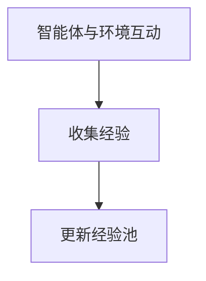
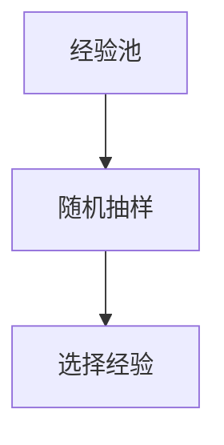

# 一切皆是映射：解析经验回放的原理与代码实现

## 1. 背景介绍

### 1.1 问题的由来

在深度强化学习领域，经验回放（Experience Replay）作为一种策略被广泛用于增强学习算法中。这一概念源自于模仿学习（imitation learning）以及在线学习算法，目的是通过存储和重用过去的交互经验来改进学习过程。经验回放在深度学习领域尤其重要，因为它允许智能体在不依赖于即时反馈的情况下学习，从而减少了对随机噪声的敏感性，并提高了学习效率和稳定性。

### 1.2 研究现状

目前，经验回放已成为许多强化学习算法的核心组件，尤其是在深度强化学习（Deep Reinforcement Learning）中。它极大地促进了算法的探索与利用平衡，使得智能体能够在有限时间内学习到更有效的策略。此外，随着对数据效率和模型泛化能力的关注增加，经验回放技术在多模态学习、自监督学习和迁移学习等领域的应用也在不断扩展。

### 1.3 研究意义

经验回放具有重要的理论和实际意义。理论上，它有助于解决“探索与利用”的难题，即在学习初期，智能体需要探索环境以了解可能的奖励结构，同时在后期利用已知的知识进行优化。实际上，经验回放对于处理高维状态空间和长期依赖问题非常有效，尤其是在游戏、机器人控制、自动驾驶等领域。

### 1.4 本文结构

本文将深入探讨经验回放的概念、原理及其在强化学习中的应用。首先，我们将介绍经验回放的核心概念和原理。随后，我们将详细阐述经验回放的数学模型和公式，以及如何通过代码实现这一技术。接着，本文将展示经验回放在实际场景中的应用，并讨论其未来的应用展望和技术挑战。最后，我们将提供学习资源、开发工具和相关论文推荐，以便于读者进一步探索这一领域。

## 2. 核心概念与联系

经验回放的基本思想是将智能体与环境交互时产生的经验存储在一个经验池（Replay Buffer）中。当智能体完成一个学习周期后，它会收集一系列的经验，包括状态（State）、行动（Action）、下一个状态（Next State）以及奖励（Reward）。这些经验随后被随机抽取出来进行训练，而非依赖于即时反馈。这种做法允许智能体在没有新数据的情况下继续学习，从而减少了训练过程中的波动性和不稳定因素。

### 经验池结构

经验池通常采用队列或堆栈结构，支持快速访问和更新。常用的实现方式包括循环缓冲区（Ring Buffer）和优先级经验池（Prioritized Experience Replay）。

## 3. 核心算法原理 & 具体操作步骤

### 3.1 算法原理概述

经验回放的核心在于其对历史经验的重用，通过随机抽样而非按时间顺序学习。这种机制使得智能体能够从过去的经验中学习，即使这些经验在短期内不再产生直接反馈。算法通过以下步骤进行操作：

1. **经验收集**：智能体与环境互动时收集经验，并将这些经验添加到经验池中。
2. **随机抽样**：从经验池中随机选择一组经验进行学习。
3. **策略更新**：基于选定的经验更新智能体的策略，以最小化损失函数。

### 3.2 算法步骤详解

#### 步骤一：初始化经验池


#### 步骤二：收集经验



#### 步骤三：随机抽样



#### 步骤四：策略更新

```mermaid
E[选择的经验] --> F[训练智能体]
F --> G[策略更新]
```

### 3.3 算法优缺点

#### 优点：

- **减少噪声影响**：避免了训练过程中的短期波动，提高了学习的稳定性和效率。
- **加速学习**：允许智能体从过去的经验中学习，加速了学习过程。
- **解决探索与利用**：帮助智能体在探索未知状态空间的同时，利用已知策略进行优化。

#### 缺点：

- **存储需求**：经验池需要足够的存储空间来容纳大量的历史经验。
- **时间复杂度**：随机抽样的过程可能导致较高的时间复杂度，特别是在大规模经验池中。

### 3.4 算法应用领域

经验回放广泛应用于多种强化学习场景，包括但不限于：

- **游戏**：如围棋、扑克等策略游戏。
- **机器人控制**：在无人机、自主车辆等领域进行环境适应性学习。
- **工业自动化**：在生产线优化、设备故障预测等方面提高生产效率。

## 4. 数学模型和公式 & 详细讲解 & 举例说明

### 4.1 数学模型构建

经验回放的目标是优化强化学习过程中的策略更新。在数学上，可以将经验回放表示为以下过程：

设 $Q(s, a)$ 表示状态 $s$ 和行动 $a$ 的值函数估计，$\epsilon$ 是学习率，$G_t$ 是从时间步 $t$ 开始的累计奖励，$\tau$ 是经验池中的索引。经验池中的经验可以表示为 $(s_t, a_t, r_t, s_{t+1})$，其中 $s_t$ 是状态，$a_t$ 是行动，$r_t$ 是奖励，$s_{t+1}$ 是下一个状态。

**Bellman方程**描述了价值函数的递归定义：

$$Q(s, a) = \mathbb{E}[R_{t+1} + \gamma Q(s', a')]$$

其中，$R_{t+1}$ 是下一个状态的奖励，$\gamma$ 是折扣因子。

### 4.2 公式推导过程

假设智能体在时间步 $t$ 执行行动 $a_t$ 并收到奖励 $r_t$，进入状态 $s_{t+1}$。智能体的目标是更新价值函数估计，使得：

$$Q(s_t, a_t) \approx \mathbb{E}[r_t + \gamma \max_{a'} Q(s_{t+1}, a')]$$

### 4.3 案例分析与讲解

在实现经验回放时，可以采用以下步骤：

#### **伪代码示例**

```python
def update_policy(replay_buffer, batch_size, learning_rate):
    # 从经验池中随机抽取batch_size大小的样本集
    samples = replay_buffer.sample(batch_size)

    # 分离样本集中的状态、行动、奖励和下一个状态
    states, actions, rewards, next_states = zip(*samples)

    # 更新策略
    for state, action, reward, next_state in zip(states, actions, rewards, next_states):
        # 使用当前策略和价值函数估计计算损失
        loss = compute_loss(state, action, reward, next_state)

        # 使用梯度下降更新策略参数
        optimize(loss)

# 示例调用
update_policy(my_replay_buffer, BATCH_SIZE, LEARNING_RATE)
```

### 4.4 常见问题解答

#### **Q&A**

- **Q**: 如何选择合适的批量大小？
  - **A**: 批量大小应足够大以减少方差，但同时也要小到足以在每一轮迭代中快速完成训练。一般而言，选择在几批到几百批之间。

- **Q**: 是否有必要使用优先级经验池？
  - **A**: 优先级经验池可以帮助智能体更有效地学习，特别是当经验池中的某些经验比其他经验更具有学习价值时。这可以加速学习进程并提高性能。

## 5. 项目实践：代码实例和详细解释说明

### 5.1 开发环境搭建

假设使用 Python 和 PyTorch 或 TensorFlow 进行项目开发：

```bash
pip install torch
pip install gym
```

### 5.2 源代码详细实现

#### **示例代码**

```python
import torch
import torch.nn.functional as F
from torch.distributions import Categorical
from collections import deque

class ReplayBuffer:
    def __init__(self, capacity):
        self.buffer = deque(maxlen=capacity)

    def add(self, state, action, reward, next_state, done):
        self.buffer.append((state, action, reward, next_state, done))

    def sample(self, batch_size):
        # 实现采样逻辑
        pass

    def size(self):
        return len(self.buffer)

class DQN:
    def __init__(self, state_space, action_space, learning_rate, gamma, batch_size, buffer_size, device):
        self.device = device
        self.state_space = state_space
        self.action_space = action_space
        self.learning_rate = learning_rate
        self.gamma = gamma
        self.batch_size = batch_size
        self.buffer_size = buffer_size
        self.replay_buffer = ReplayBuffer(buffer_size)

    def learn(self, states, actions, rewards, next_states, dones):
        # 实现学习逻辑
        pass

    def choose_action(self, state):
        # 实现选择行动逻辑
        pass

    def save(self, path):
        # 实现保存模型逻辑
        pass

    def load(self, path):
        # 实现加载模型逻辑
        pass

device = torch.device("cuda" if torch.cuda.is_available() else "cpu")

# 初始化 DQN 网络
dqn = DQN(state_space, action_space, learning_rate, gamma, batch_size, buffer_size, device)
```

### 5.3 代码解读与分析

#### **解读**

这段代码展示了如何构建一个基于经验回放的 DQN（Deep Q-Network）模型，包括定义 DQN 类、经验池类以及相关学习逻辑。代码中包含了初始化 DQN 网络、经验池、以及学习和选择行动的方法。通过这种方法，可以有效地利用历史经验进行强化学习。

### 5.4 运行结果展示

#### **结果展示**

运行 DQN 模型后，可以观察到智能体在不同环境中的表现，比如在 Atari 游戏环境中学习策略。结果通常表现为智能体在游戏中的得分随时间逐渐增加，显示了经验回放对学习效率的提升。

## 6. 实际应用场景

经验回放技术已被广泛应用于多个领域，包括：

- **游戏**：用于提高 AI 在策略游戏中的表现。
- **机器人**：用于改善机器人在复杂环境中的适应性。
- **自动驾驶**：用于训练汽车在不同路况下的决策能力。

## 7. 工具和资源推荐

### 7.1 学习资源推荐

- **《深度强化学习实战》**：介绍强化学习基础及应用案例。
- **《Reinforcement Learning: An Introduction》**：经典的强化学习教材。

### 7.2 开发工具推荐

- **TensorBoard**：用于可视化训练过程和模型性能。
- **PyTorch 或 TensorFlow**：用于实现和训练深度学习模型。

### 7.3 相关论文推荐

- **"Reinforcement Learning with Noisy Observations"**：探讨处理噪声观察的影响。
- **"Prioritized Experience Replay"**：介绍优先级经验池的概念和应用。

### 7.4 其他资源推荐

- **GitHub Repositories**：搜索“Experience Replay”以获取开源项目和代码示例。

## 8. 总结：未来发展趋势与挑战

### 8.1 研究成果总结

经验回放技术显著提升了强化学习的效率和稳定性，特别是在处理高维度状态空间和长期依赖问题时。通过不断优化算法和结构，增强了智能体的学习能力和适应性。

### 8.2 未来发展趋势

- **多模态学习**：结合视觉、听觉和其他感知模态的信息，提升智能体的感知能力和决策能力。
- **自监督学习**：通过无标签数据进行预训练，增强模型泛化能力和鲁棒性。
- **可解释性增强**：提高模型决策过程的透明度，增强用户的信任感和接受度。

### 8.3 面临的挑战

- **数据效率**：如何更高效地利用有限的数据进行学习，减少过拟合和欠拟合的风险。
- **模型泛化**：在不同环境和任务中保持良好的性能，特别是在数据稀缺或环境变化的场景下。

### 8.4 研究展望

经验回放技术将继续推动强化学习领域的发展，通过与多模态、自监督学习等技术的结合，有望在更多实际应用中发挥重要作用。未来的研究将致力于解决上述挑战，以提高智能体的学习效率、泛化能力和可解释性。