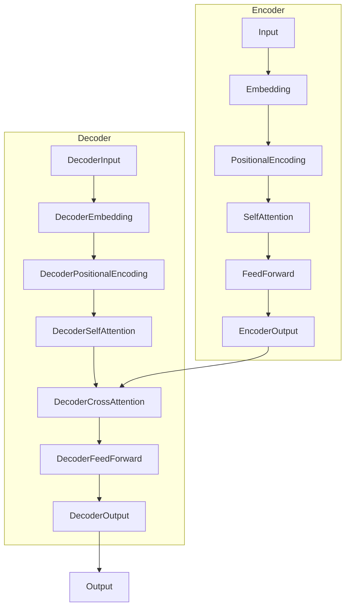

# Transformer大模型实战 BART模型的架构

## 1. 背景介绍

### 1.1 问题的由来

在自然语言处理(NLP)领域,机器翻译、文本摘要、对话系统等任务一直是研究的热点和难点。传统的序列到序列(Seq2Seq)模型由于长距离依赖问题和计算复杂度高等缺陷,在处理长文本时往往表现不佳。2017年,Transformer模型的提出为解决这些问题带来了新的思路。

Transformer是第一个完全基于注意力机制(Attention Mechanism)的模型,摒弃了传统RNN/LSTM结构,使用多头自注意力(Multi-Head Self-Attention)来捕捉输入序列中的长程依赖关系。这种全新的架构设计大大提升了模型的并行计算能力,缓解了长期依赖问题,取得了令人瞩目的成果。

### 1.2 研究现状

自从Transformer模型问世以来,其卓越的表现推动了NLP领域的飞速发展。大型预训练语言模型如BERT、GPT、XLNet等均是基于Transformer的变体模型。通过在大规模无标注语料上预训练,这些模型可以学习到丰富的语义和上下文知识,并将其迁移到下游的NLP任务中,取得了非常优异的成绩。

然而,现有的Transformer模型大多专注于单一的生成或理解任务,而忽视了两者的统一。BART(Bidirectional and Auto-Regressive Transformer)模型应运而生,旨在统一文本生成和理解的能力,为序列到序列的生成任务提供更有力的支持。

### 1.3 研究意义

BART模型的提出具有重要的理论和实践意义:

1. **统一生成和理解能力**:BART是第一个将自回归(auto-regressive)和自编码(auto-encoding)统一起来的序列到序列生成模型,为NLP任务提供了更全面的解决方案。

2. **泛化能力强**:通过预训练和微调,BART可以在多种生成任务上取得优异表现,如机器翻译、摘要、对话等,展现出极强的泛化能力。

3. **模型压缩**:BART采用了一种新颖的模型压缩方法,在保持性能的同时大幅降低了模型大小,有利于部署和应用。

4. **长文本处理**:与RNN/LSTM相比,Transformer结构使BART能更好地捕捉长距离依赖关系,在处理长文本时表现出色。

综上所述,BART模型的出现不仅丰富了Transformer的理论发展,也为NLP实践任务提供了更有力的工具,具有广阔的应用前景。

### 1.4 本文结构

本文将全面介绍BART模型的架构原理、训练过程、应用实践等内容。具体来说,包括以下几个部分:

1. 核心概念与联系
2. 核心算法原理与具体操作步骤
3. 数学模型和公式详细讲解及案例分析
4. 项目实践:代码实例和详细解释说明
5. 实际应用场景
6. 工具和资源推荐
7. 总结:未来发展趋势与挑战
8. 附录:常见问题与解答

接下来,我们首先了解BART模型的核心概念及其与其他模型的联系。

## 2. 核心概念与联系

BART模型的核心思想是将自回归(auto-regressive)和自编码(auto-encoding)两种建模范式统一起来,实现文本生成与理解的双向能力。为了更好地理解这一思想,我们有必要先了解自回归和自编码的概念。

**自回归(Auto-Regressive)**: 自回归建模是指模型在生成序列时,每个时间步的输出仅依赖于之前的输入和输出。换言之,生成序列是一个自回归的过程。自回归模型通常用于生成任务,如机器翻译、文本生成等。典型的自回归模型有:

- 序列到序列(Seq2Seq)模型
- 变种自编码器(VAE)
- 生成对抗网络(GAN)
- GPT(Generative Pre-trained Transformer)

**自编码(Auto-Encoding)**: 自编码建模则是指对输入序列进行有损压缩再解压缩的过程,旨在学习数据的潜在表示。自编码模型通常用于序列理解任务,如机器阅读理解、文本分类等。典型的自编码模型有:

- 自编码器(Auto-Encoder)
- 变分自编码器(VAE)
- BERT(Bidirectional Encoder Representations from Transformers)
- ALBERT(A Lite BERT)

传统的Seq2Seq、VAE、BERT等模型只关注单一的生成或理解任务。而BART则将两种建模范式有机结合,实现了生成和理解的统一。具体来说,BART的Encoder对输入序列进行双向编码(自编码),Decoder则对输出序列进行自回归生成。通过预训练和微调,BART可以在多种序列到序列的生成任务上取得优异表现。

BART模型的提出不仅丰富了Transformer的理论发展,也为NLP实践任务提供了更有力的工具。接下来我们深入探讨BART模型的核心算法原理。

## 3. 核心算法原理与具体操作步骤

### 3.1 算法原理概述

BART模型的核心算法原理可以概括为三个关键点:

1. **Transformer编码器-解码器架构**
2. **损失函数的创新组合**
3. **双向交叉注意力**

我们先来看BART模型的整体架构:

如上图所示,BART模型采用了标准的Transformer编码器-解码器结构。编码器对输入序列进行双向编码,解码器则对输出序列进行自回归生成。值得注意的是,解码器中引入了双向交叉注意力机制,使其能够同时关注编码器的输出和自身的输出。

在损失函数方面,BART模型创新性地组合了两种不同的损失函数:

1. **自回归交叉熵损失函数**,用于指导解码器生成目标序列。
2. **自编码器的重构损失函数**,用于指导编码器重构输入序列。

通过预训练时交替优化这两种损失函数,BART模型能够同时学习生成和理解的能力。在下游任务的微调阶段,只需保留自回归交叉熵损失函数,根据任务标签进行监督学习即可。

接下来,我们对BART模型的核心算法步骤进行详细分析。

### 3.2 算法步骤详解

BART模型的训练分为两个阶段:预训练(Pre-training)和微调(Fine-tuning)。我们先来看预训练阶段的算法步骤:

**输入**:大规模无标注语料库 $\mathcal{D} = \{ X_1, X_2, \cdots, X_n \}$

**输出**:预训练的BART模型参数 $\theta$

1. **数据构造**: 对每个输入样本 $X_i$,执行以下操作:
    - 以概率 $p$ 保留原始样本,作为自编码器重构目标
    - 以概率 $1-p$ 对样本执行某种噪声转换(如Token Masking、Token Deletion等),得到噪声样本 $\tilde{X_i}$

2. **编码器前向传播**:
    $$z = \text{Encoder}(X_i; \theta_\text{enc})$$
    其中 $\theta_\text{enc}$ 为编码器参数

3. **解码器前向传播**:
    - 自编码器重构目标:
        $$\hat{X_i} = \text{Decoder}(z, X_i; \theta_\text{dec})$$
    - 自回归生成目标:
        $$\hat{\tilde{X}_i} = \text{Decoder}(z, \tilde{X}_i; \theta_\text{dec})$$
    其中 $\theta_\text{dec}$ 为解码器参数

4. **损失函数计算**:
    $$\mathcal{L} = (1-\lambda) \cdot \mathcal{L}_\text{ar}(\hat{\tilde{X}_i}, \tilde{X}_i) + \lambda \cdot \mathcal{L}_\text{ae}(\hat{X_i}, X_i)$$
    其中:
    - $\mathcal{L}_\text{ar}$ 为自回归交叉熵损失函数
    - $\mathcal{L}_\text{ae}$ 为自编码器重构损失函数
    - $\lambda$ 为损失函数组合系数,控制两个损失的权重

5. **模型参数更新**:
    $$\theta \leftarrow \theta - \eta \nabla_\theta \mathcal{L}$$
    其中 $\eta$ 为学习率

6. **重复步骤2-5**,遍历完整个语料库,完成一个epoch

7. **重复步骤1-6**,直至达到预设的最大epoch数或其他终止条件

预训练完成后,我们对BART模型进行下游任务的微调,算法步骤如下:

**输入**:标注的下游任务数据集 $\mathcal{D}_\text{task} = \{ (X_1, Y_1), (X_2, Y_2), \cdots, (X_m, Y_m) \}$

**输出**:微调后的BART模型参数 $\theta'$

1. 加载预训练的BART模型参数 $\theta$

2. **编码器前向传播**:
    $$z = \text{Encoder}(X_i; \theta_\text{enc})$$

3. **解码器前向传播**:
    $$\hat{Y_i} = \text{Decoder}(z, Y_i; \theta_\text{dec})$$

4. **损失函数计算**:
    $$\mathcal{L}_\text{task} = \mathcal{L}_\text{ar}(\hat{Y_i}, Y_i)$$
    其中 $\mathcal{L}_\text{ar}$ 为自回归交叉熵损失函数

5. **模型参数更新**:
    $$\theta' \leftarrow \theta' - \eta \nabla_{\theta'} \mathcal{L}_\text{task}$$

6. **重复步骤2-5**,遍历完整个下游任务数据集,完成一个epoch

7. **重复步骤1-6**,直至达到预设的最大epoch数或其他终止条件

通过上述两个阶段的训练,BART模型能够同时学习生成和理解的能力,并将这些知识迁移到下游的序列到序列生成任务中,取得优异的性能表现。

### 3.3 算法优缺点

**优点**:

1. **统一生成和理解能力**:BART是第一个将自回归和自编码统一起来的序列到序列生成模型,为NLP任务提供了更全面的解决方案。

2. **泛化能力强**:通过预训练和微调,BART可以在多种生成任务上取得优异表现,展现出极强的泛化能力。

3. **长文本处理能力强**:Transformer结构使BART能更好地捕捉长距离依赖关系,在处理长文本时表现出色。

4. **模型压缩**:BART采用了一种新颖的模型压缩方法,在保持性能的同时大幅降低了模型大小,有利于部署和应用。

**缺点**:

1. **训练成本高**:BART模型的预训练和微调都需要消耗大量的计算资源,对硬件要求较高。

2. **生成质量参差不齐**:虽然BART在多数任务上表现优异,但在某些特定任务上生成质量可能不尽如人意。

3. **缺乏解释性**:作为一种黑盒模型,BART的内部机理缺乏透明度,对模型行为的解释性较差。

4. **数据依赖性强**:BART模型的性能在很大程度上依赖于预训练语料的质量和数量,对数据的要求较高。

总的来说,BART模型凭借其统一的生成和理解能力、强大的泛化性能以及长文本处理能力,在NLP序列到序列生成任务中表现出众。但同时也存在一些需要进一步改进的不