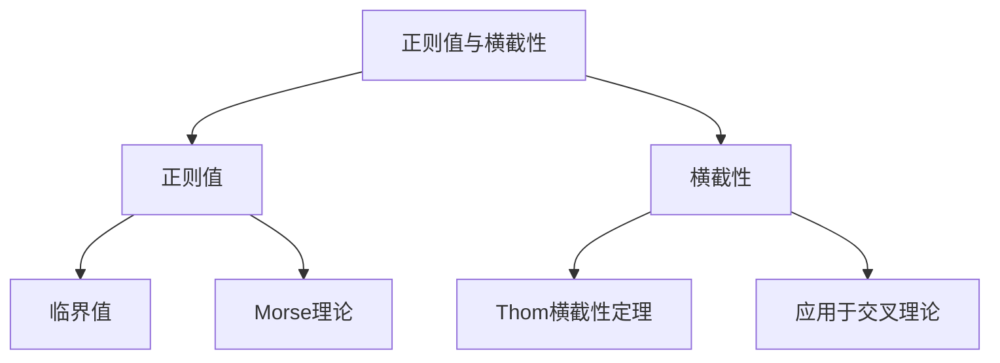

# 流形拓扑学：正则值与横截性

## 1. 背景介绍

### 1.1 问题的由来

在数学领域中,流形拓扑学是一个研究流形及其性质的分支。流形是一种在局部看起来像欧几里得空间的拓扑空间。它们在几何学、物理学、分析等领域扮演着重要角色。然而,研究流形的性质并非一件易事,因为它们通常存在于高维空间中,使得直观理解变得困难。

正则值(Regular Value)和横截性(Transversality)是流形拓扑学中两个关键概念,它们为研究流形的局部和全局性质提供了强有力的工具。正则值描述了一个光滑映射在某一点的行为,而横截性则描述了两个流形在它们的交集处的相对位置。这些概念不仅在纯数学研究中扮演着重要角色,同时也在许多应用领域中有着广泛的应用,例如微分方程、动力系统、控制论等。

### 1.2 研究现状  

正则值和横截性理论自20世纪60年代兴起以来,已经成为流形拓扑学的核心部分。数学家们对这些概念进行了深入的研究,并取得了许多重要的理论成果。例如,Thom映射定理描述了正则值集合的拓扑性质;Thom横截性定理则给出了判断两个流形是否横截的一个充分必要条件。

然而,尽管取得了长足的进展,正则值和横截性理论仍然存在一些未解决的问题和挑战。例如,对于特殊类型的流形和映射,我们需要更精确的结构描述;在应用领域中,如何有效地计算和近似正则值集合仍然是一个挑战。

### 1.3 研究意义

正则值和横截性理论在数学和应用科学领域都有着重要的意义:

- 数学意义:它们为研究流形的局部和全局性质提供了强有力的工具,是流形拓扑学的核心部分。许多重要的数学定理和结果都依赖于这些概念。
- 应用意义:正则值和横截性广泛应用于微分方程、动力系统、控制论等领域。它们为分析这些系统的性质和行为提供了有力的理论支持。

因此,深入研究正则值和横截性理论不仅可以丰富我们对流形拓扑学的理解,同时也有助于解决应用科学中的实际问题。

### 1.4 本文结构  

本文将系统地介绍正则值和横截性的基本概念、理论基础和应用。文章的主要结构如下:

1. 背景介绍
2. 核心概念与联系
3. 核心算法原理与具体操作步骤  
4. 数学模型和公式详细讲解及举例说明
5. 项目实践:代码实例和详细解释说明
6. 实际应用场景
7. 工具和资源推荐
8. 总结:未来发展趋势与挑战
9. 附录:常见问题与解答

## 2. 核心概念与联系

正则值(Regular Value)和横截性(Transversality)是流形拓扑学中两个密切相关的核心概念:

- **正则值**描述了一个光滑映射在某一点的局部行为。具体来说,如果一个光滑映射在某一点的导数是满秩的,那么该点就是该映射的正则值。正则值的概念与临界值(Critical Value)相对,临界值指导数在该点失去满秩性。正则值理论为研究流形的局部性质提供了重要工具,例如Morse理论。

- **横截性**描述了两个流形在它们的交集处的相对位置。如果两个流形在交集处"正交",那么它们就被称为是横截的。横截性理论为研究流形的全局性质提供了强有力的工具,例如Thom横截性定理描述了判断两个流形是否横截的一个充分必要条件。横截性概念也广泛应用于交叉理论(Intersection Theory)中。

正则值和横截性这两个概念密切相关,共同为研究流形的局部和全局性质提供了理论基础。例如,正则值理论可以用于研究横截流形的局部结构,而横截性理论则可以用于研究正则值集合的全局拓扑性质。因此,深入理解这两个概念及其联系,对于掌握流形拓扑学的核心内容至关重要。

## 3. 核心算法原理与具体操作步骤

### 3.1 算法原理概述

对于研究正则值和横截性,我们需要一些基本的算法和计算工具。这些算法主要包括:

1. **计算导数和判断满秩性**:判断一个点是否为正则值的关键在于计算该点处的导数,并判断其是否满秩。

2. **计算流形的切空间和法空间**:研究两个流形是否横截需要计算它们在交点处的切空间和法空间,并检查它们是否"正交"。

3. **计算横截理论中的各种不变量**:横截理论中有许多重要的不变量,例如Thom多项式、Porteous公式等,需要有效的算法来计算它们。

4. **数值计算和近似**:在实际应用中,我们通常需要对正则值集合和横截集合进行数值计算和近似。

这些算法的核心思想主要来自于微分几何、代数拓扑和数值分析等数学分支。下面我们将详细介绍其中的一些关键算法原理和具体操作步骤。

### 3.2 算法步骤详解  

#### 3.2.1 判断正则值算法

判断一个点是否为正则值的关键步骤如下:

1. 给定一个光滑映射 $f: M \rightarrow N$ 和一点 $p \in M$。
2. 计算 $f$ 在点 $p$ 处的导数 $df_p: T_pM \rightarrow T_{f(p)}N$。
3. 检查 $df_p$ 是否满秩,即它的秩是否等于 $\min\{\dim M, \dim N\}$。
4. 如果满秩,则 $p$ 是 $f$ 的正则值;否则 $p$ 是临界值。

这个算法的关键步骤是计算导数 $df_p$ 及其秩。在实际计算中,我们通常使用局部坐标表示来计算导数,即:

$$
df_p = \begin{pmatrix}
\frac{\partial f^1}{\partial x^1}(p) & \cdots & \frac{\partial f^1}{\partial x^m}(p)\
\vdots & \ddots & \vdots\
\frac{\partial f^n}{\partial x^1}(p) & \cdots & \frac{\partial f^n}{\partial x^m}(p)
\end{pmatrix}
$$

其中 $(x^1, \ldots, x^m)$ 和 $(f^1, \ldots, f^n)$ 分别是 $M$ 和 $N$ 在 $p$ 和 $f(p)$ 处的局部坐标。然后我们可以计算这个矩阵的秩,即它的非零特征值的个数,来判断 $p$ 是否为正则值。

#### 3.2.2 判断横截性算法  

判断两个流形是否横截的关键步骤如下:

1. 给定两个流形 $M$ 和 $N$,以及它们的一个交点 $p \in M \cap N$。
2. 计算 $M$ 和 $N$ 在 $p$ 处的切空间 $T_pM$ 和 $T_pN$。
3. 计算它们的直和 $T_pM + T_pN$,以及它在 $\mathbb{R}^n$ 中的正交补空间 $(T_pM + T_pN)^\perp$。
4. 如果 $(T_pM + T_pN)^\perp = \{0\}$,则 $M$ 和 $N$ 在 $p$ 处是横截的;否则它们不是横截的。

这个算法的关键步骤是计算切空间及其直和和正交补。在实际计算中,我们通常使用局部坐标表示来计算切空间。例如,对于 $M$,如果它在 $p$ 处的局部坐标为 $(x^1, \ldots, x^m)$,那么它的切空间由下面的向量张成:

$$
T_pM = \text{span}\left\{\frac{\partial}{\partial x^1}\Bigg|_p, \ldots, \frac{\partial}{\partial x^m}\Bigg|_p\right\}
$$

然后我们可以计算 $T_pM$ 和 $T_pN$ 的直和及其正交补,从而判断它们是否横截。

这些算法为研究正则值和横截性提供了基本的计算工具。在实际应用中,我们还需要结合具体的问题,设计更高效和稳定的算法。

### 3.3 算法优缺点

上述算法具有以下优点:

- **理论基础扎实**:这些算法直接源自于微分几何和代数拓扑的基本理论,因此具有坚实的数学基础。
- **操作步骤清晰**:算法的步骤清晰,易于理解和实现。
- **适用范围广泛**:这些算法适用于各种光滑映射和流形,可以广泛用于不同的应用场景。

然而,它们也存在一些缺点和局限性:

- **计算复杂度较高**:特别是在高维情况下,计算导数、切空间等步骤的复杂度会急剧增加。
- **数值不稳定性**:由于涉及矩阵运算,这些算法在实际计算中可能会遇到数值不稳定的问题。
- **缺乏结构信息**:这些算法只能判断正则值和横截性,但无法给出更多的结构信息,例如正则值集合的拓扑类型等。

因此,在实际应用中,我们需要根据具体问题的特点,设计更高效、更稳定、能够提供更多信息的专门算法。这也是该领域未来研究的一个重要方向。

### 3.4 算法应用领域

正则值和横截性理论及相关算法在许多领域都有重要应用,例如:

- **微分方程和动力系统**:正则值和横截性理论为研究微分方程和动力系统的性质(如bifurcation、chaos等)提供了有力的工具。
- **控制理论**:在控制系统的设计和分析中,横截性条件被广泛用于确保系统的可控性和观测性。
- **代数几何和代数拓扑**:正则值理论和横截理论是研究代数varietiess和映射的重要工具。
- **计算机图形学和计算机视觉**:正则值集合和横截集合的计算在曲面重构、曲面细分等问题中扮演着重要角色。
- **数据分析**:横截性理论可用于研究高维数据集的拓扑和几何结构。

总的来说,正则值和横截性理论为研究许多复杂系统的本质性质提供了有力的理论基础和计算工具,是一个活跃的跨学科研究领域。

## 4. 数学模型和公式详细讲解及举例说明

### 4.1 数学模型构建

在研究正则值和横截性时,我们需要构建一些基本的数学模型。这些模型主要来自于微分流形、矢量丛和Jet丛等概念。

#### 4.1.1 微分流形

微分流形是流形拓扑学研究的基本对象。一个 $n$ 维微分流形 $M$ 是一个拓扑空间,在局部看起来像 $\mathbb{R}^n$,并且可以用坐标卡片 $\{(U_\alpha, \varphi_\alpha)\}$ 覆盖,其中 $\varphi_\alpha: U_\alpha \rightarrow \mathbb{R}^n$ 是一个同胚映射。

在流形 $M$ 上,我们可以定义光滑函数、光滑映射、切丛 $TM$ 等重要概念。切丛 $TM$ 是流形 $M$ 上所有切向量的集合,在每一点 $p \in M$ 处切空间 $T_pM$ 都是 $TM$ 的一个纤维。

#### 4.1.2 矢量丛

矢量丛是一种广义化的切丛,它描述了两个流形之间的线性映射。设 $\pi: E \rightarrow M$