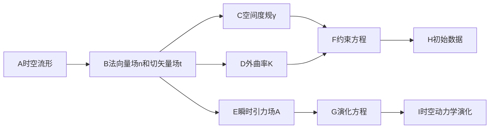

# 微分几何入门与广义相对论：时空的3+1分解

关键词：微分几何、广义相对论、时空、3+1分解、Einstein方程、Gauss-Codazzi方程、约束方程、演化方程

## 1. 背景介绍
### 1.1  问题的由来
广义相对论是20世纪最伟大的物理理论之一,它彻底改变了我们对时空、引力以及宇宙的认识。然而,由于广义相对论使用了高度抽象的微分几何语言,对于初学者来说往往难以理解其深刻内涵。为了更好地理解和应用广义相对论,物理学家和数学家引入了时空的3+1分解方法,将四维时空分解为三维空间加一维时间,使得广义相对论的动力学更加直观。

### 1.2  研究现状
时空3+1分解最早由Arnowitt、Deser和Misner在20世纪60年代提出,简称ADM分解。此后,这一方法被广泛应用于数值相对论、量子引力、宇宙学等领域。近年来,随着引力波的直接探测,时空3+1分解在引力波数值模拟中发挥了重要作用。同时,这一方法也为求解Einstein方程提供了新的视角。

### 1.3  研究意义
深入理解时空3+1分解对于掌握广义相对论的数学结构和物理内涵具有重要意义。通过这一方法,我们可以更清晰地看到时空的几何与物质分布之间的联系,理解Einstein方程的初始值问题,并为数值求解Einstein方程奠定基础。此外,这一方法在研究黑洞、引力波、宇宙学等前沿领域也有广泛应用。

### 1.4  本文结构
本文将从微分几何的基本概念出发,系统介绍时空3+1分解的数学原理和物理意义。全文分为以下几个部分:

1. 背景介绍
2. 核心概念与联系
3. 核心算法原理与具体操作步骤
4. 数学模型和公式详细讲解举例说明
5. 项目实践:代码实例和详细解释说明
6. 实际应用场景
7. 工具和资源推荐
8. 总结:未来发展趋势与挑战
9. 附录:常见问题与解答

## 2. 核心概念与联系

要理解时空3+1分解,首先需要掌握一些微分几何的基本概念:

- 流形(manifold):一个局部类似欧氏空间的拓扑空间。时空可以看作一个四维伪 Riemann 流形。
- 度规张量(metric tensor):定义流形上的"距离"和"角度"。在广义相对论中,度规张量编码了时空的几何性质。
- 联络(connection):定义了流形上的平行移动和协变导数。Christoffel符号是联络的一种常用表示。
- 曲率张量(curvature tensor):刻画了流形的内禀曲率。Riemann 曲率张量、Ricci张量和标量曲率都可以由度规张量计算得到。
- Einstein方程:描述了时空几何与物质分布之间的关系,是广义相对论的核心方程。

时空3+1分解的基本思想是将四维时空流形(M,g)分解为一系列三维空间超曲面Σ_t和一维时间t的直积。通过引入法向量场n和切矢量场t,我们可以定义空间度规γ、外曲率K、瞬时引力场A等几何量,并将Einstein方程分解为约束方程和演化方程。约束方程限制了初始时刻的数据,而演化方程则决定了时空的动力学演化。

下图展示了时空3+1分解的核心概念之间的联系:

## 3. 核心算法原理 & 具体操作步骤

### 3.1 算法原理概述

时空3+1分解的核心是将Einstein方程分解为约束方程和演化方程。约束方程包括Hamiltonian约束和momentum约束,分别对应于时空的能量密度和动量密度。演化方程则描述了空间度规γ和外曲率K随时间的演化。通过求解约束方程获得初始数据,再利用演化方程进行时间演化,就可以得到时空的完整动力学描述。

### 3.2 算法步骤详解

1. 选择时空流形M上的一个时间函数t和空间坐标系{x^i},将时空分解为一系列空间超曲面Σ_t的集合。

2. 引入单位法向量场n和切矢量场t,满足n·n=-1,n·t=0。

3. 定义空间度规γ_ij=g_ij+n_in_j,诱导了超曲面Σ_t上的度规。

4. 定义外曲率K_ij=-γ_i^kγ_j^l∇_kn_l,刻画了超曲面Σ_t在时空中的嵌入曲率。

5. 定义瞬时引力场A_i=γ_i^jt^k∇_kn_j,描述了法向量场n相对于超曲面Σ_t的变化率。

6. 将Einstein方程分解为约束方程和演化方程:
   - Hamiltonian约束:R-K_ijK^ij+K^2=16πρ
   - Momentum约束:D_jK^j_i-D_iK=8πJ_i
   - 演化方程:∂_tγ_ij=-2αK_ij+D_iβ_j+D_jβ_i
   - 演化方程:∂_tK_ij=α(R_ij-2K_ikK^k_j+KK_ij)-D_iD_jα+β^kD_kK_ij+K_ikD_jβ^k+K_jkD_iβ^k-8πα(S_ij-12γ_ijS)

   其中R、D、ρ、J、S分别表示空间曲率、空间协变导数、能量密度、动量密度和应力张量,α和β是用于调节时空坐标的自由函数。

7. 给定初始时刻t_0的数据(γ_ij,K_ij),求解约束方程得到初始值。

8. 利用演化方程,将初始数据向时间方向演化,得到后续时刻的(γ_ij,K_ij)。

9. 重复步骤7-8,得到完整的时空演化。

### 3.3 算法优缺点

优点:
- 将时间和空间分离,使得动力学更加直观。
- 约束方程和演化方程的形式更加简洁,易于数值求解。
- 为研究黑洞、引力波等复杂时空提供了有力工具。

缺点:
- 引入了额外的自由度(如α和β),需要合适的选择。
- 数值实现时可能遇到不稳定性问题,需要特殊处理。

### 3.4 算法应用领域
- 数值相对论:模拟黑洞碰撞、引力波辐射等过程。
- 量子引力:为量子引力理论的建立提供了新视角。
- 宇宙学:研究早期宇宙的演化、结构形成等问题。

## 4. 数学模型和公式 & 详细讲解 & 举例说明

### 4.1 数学模型构建

时空3+1分解的数学模型基于以下几何量:

- 时空度规:$g_{\mu\nu}$
- 法向量场:$n^\mu$,满足$n_\mu n^\mu=-1$
- 切矢量场:$t^\mu$,满足$t_\mu n^\mu=0$
- 诱导空间度规:$\gamma_{\mu\nu}=g_{\mu\nu}+n_\mu n_\nu$
- 外曲率:$K_{\mu\nu}=-\gamma_\mu^\alpha\gamma_\nu^\beta\nabla_\alpha n_\beta$
- 瞬时引力场:$A_\mu=\gamma_\mu^\nu t^\alpha\nabla_\alpha n_\nu$

Einstein方程$G_{\mu\nu}=8\pi T_{\mu\nu}$在3+1分解下可以写成约束方程和演化方程的形式:

- Hamiltonian约束:$\mathcal{H}\equiv R-K_{\mu\nu}K^{\mu\nu}+K^2-16\pi\rho=0$
- Momentum约束:$\mathcal{M}_\mu\equiv D_\nu K^\nu_\mu-D_\mu K-8\pi J_\mu=0$
- 演化方程:$\partial_t\gamma_{\mu\nu}=-2\alpha K_{\mu\nu}+D_\mu\beta_\nu+D_\nu\beta_\mu$
- 演化方程:$\partial_tK_{\mu\nu}=\alpha(R_{\mu\nu}-2K_{\mu\alpha}K^\alpha_\nu+KK_{\mu\nu})-D_\mu D_\nu\alpha+\beta^\alpha D_\alpha K_{\mu\nu}+K_{\mu\alpha}D_\nu\beta^\alpha+K_{\nu\alpha}D_\mu\beta^\alpha-8\pi\alpha(S_{\mu\nu}-\frac{1}{2}\gamma_{\mu\nu}S)$

其中$\rho$、$J_\mu$、$S_{\mu\nu}$分别是能量密度、动量密度和应力张量,$\alpha$和$\beta^\mu$是用于调节时空坐标的自由函数。

### 4.2 公式推导过程

1. 将时空度规$g_{\mu\nu}$分解为法向量场$n^\mu$和切矢量场$t^\mu$的贡献:

$$g_{\mu\nu}=-n_\mu n_\nu+\gamma_{\mu\nu}$$

2. 计算外曲率$K_{\mu\nu}$:

$$K_{\mu\nu}=-\gamma_\mu^\alpha\gamma_\nu^\beta\nabla_\alpha n_\beta=-\frac{1}{2}\mathcal{L}_n\gamma_{\mu\nu}$$

其中$\mathcal{L}_n$表示沿$n^\mu$方向的Lie导数。

3. 计算瞬时引力场$A_\mu$:

$$A_\mu=\gamma_\mu^\nu t^\alpha\nabla_\alpha n_\nu=\gamma_\mu^\nu\nabla_\nu\ln\alpha$$

4. 将Einstein方程$G_{\mu\nu}=8\pi T_{\mu\nu}$投影到法向量$n^\mu$和切矢量$t^\mu$上,得到约束方程:

$$\mathcal{H}\equiv R-K_{\mu\nu}K^{\mu\nu}+K^2-16\pi\rho=0$$
$$\mathcal{M}_\mu\equiv D_\nu K^\nu_\mu-D_\mu K-8\pi J_\mu=0$$

5. 利用Gauss-Codazzi方程,将Einstein方程分解为演化方程:

$$\partial_t\gamma_{\mu\nu}=-2\alpha K_{\mu\nu}+D_\mu\beta_\nu+D_\nu\beta_\mu$$
$$\partial_tK_{\mu\nu}=\alpha(R_{\mu\nu}-2K_{\mu\alpha}K^\alpha_\nu+KK_{\mu\nu})-D_\mu D_\nu\alpha+\beta^\alpha D_\alpha K_{\mu\nu}+K_{\mu\alpha}D_\nu\beta^\alpha+K_{\nu\alpha}D_\mu\beta^\alpha-8\pi\alpha(S_{\mu\nu}-\frac{1}{2}\gamma_{\mu\nu}S)$$

### 4.3 案例分析与讲解

考虑一个简单的时空:平直的Minkowski时空,其度规为

$$ds^2=-dt^2+dx^2+dy^2+dz^2$$

选择时间函数$t$和空间坐标$(x,y,z)$,则法向量场为$n^\mu=(1,0,0,0)$,切矢量场为$t^\mu=(1,0,0,0)$。

诱导空间度规为

$$\gamma_{ij}=\mathrm{diag}(1,1,1)$$

外曲率$K_{ij}=0$,瞬时引力场$A_i=0$。

约束方程变为

$$R=0$$
$$D_jK^j_i=0$$

演化方程简化为

$$\partial_t\gamma_{ij}=0$$
$$\partial_tK_{ij}=0$$

可见,对于平直时空,空间度规和外曲率都是时间独立的,这与我们的直觉相符。

### 4.4 常见问题解答

Q:为什么要引入时空3+1分解?
A:时空3+1分解将时间和空间分离,使