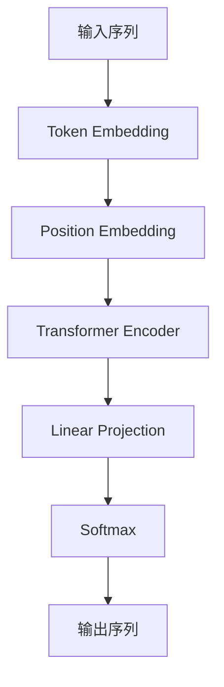

## 1. 背景介绍

自然语言处理（NLP）是人工智能领域的一个重要分支，它涉及到计算机如何理解和处理人类语言。文本生成是NLP中的一个重要任务，它可以用于自动摘要、机器翻译、对话系统等领域。GPT（Generative Pre-trained Transformer）是一种基于Transformer的预训练语言模型，由OpenAI团队提出。GPT模型在文本生成任务中表现出色，成为了NLP领域的研究热点。

本文将介绍如何构建GPT模型并完成文本生成任务，包括核心概念、算法原理、数学模型、代码实例、实际应用场景、工具和资源推荐、未来发展趋势和常见问题解答等方面。

## 2. 核心概念与联系

### 2.1 Transformer

Transformer是一种基于自注意力机制的神经网络模型，由Google团队提出。它在机器翻译任务中表现出色，成为了NLP领域的重要突破。Transformer模型由编码器和解码器两部分组成，其中编码器用于将输入序列转换为一系列特征向量，解码器用于根据编码器输出和上一个时间步的输出生成下一个时间步的输出。

### 2.2 预训练语言模型

预训练语言模型是指在大规模语料库上进行预训练的语言模型，它可以学习到语言的一些通用规律和特征，从而提高在特定任务上的表现。预训练语言模型通常包括两个阶段：预训练和微调。预训练阶段使用无监督学习的方式，学习语言的通用规律和特征；微调阶段使用有监督学习的方式，根据具体任务的数据进行微调。

### 2.3 GPT模型

GPT模型是一种基于Transformer的预训练语言模型，由OpenAI团队提出。它使用了Transformer的编码器部分，并在此基础上进行了改进。GPT模型在预训练阶段使用了无监督学习的方式，学习了语言的通用规律和特征；在微调阶段，根据具体任务的数据进行微调，从而完成文本生成任务。

## 3. 核心算法原理具体操作步骤

### 3.1 GPT模型结构

GPT模型结构如下图所示：



GPT模型由以下几个部分组成：

- 输入序列：待生成文本的输入序列。
- Token Embedding：将输入序列中的每个单词转换为对应的向量表示。
- Position Embedding：将输入序列中每个单词的位置信息转换为对应的向量表示。
- Transformer Encoder：使用多层Transformer编码器对输入序列进行编码，得到一系列特征向量。
- Linear Projection：将编码器输出的特征向量映射到词汇表大小的向量空间中。
- Softmax：对映射后的向量进行softmax操作，得到每个单词的概率分布。
- 输出序列：根据概率分布生成下一个单词，重复此过程直到生成指定长度的文本。

### 3.2 GPT模型训练

GPT模型的训练分为两个阶段：预训练和微调。

#### 3.2.1 预训练

预训练阶段使用了无监督学习的方式，学习语言的通用规律和特征。具体来说，预训练阶段包括两个任务：Masked Language Model（MLM）和Next Sentence Prediction（NSP）。

- MLM任务：在输入序列中随机选择一些单词，并将其替换为特殊的MASK标记。模型的任务是根据上下文预测被MASK的单词。
- NSP任务：给定两个句子，模型的任务是判断它们是否是连续的。

预训练阶段的目标是最大化MLM和NSP任务的联合概率。

#### 3.2.2 微调

微调阶段使用了有监督学习的方式，根据具体任务的数据进行微调。在微调阶段，可以使用不同的任务对模型进行微调，例如文本生成、机器翻译、对话系统等。

### 3.3 GPT模型生成

GPT模型生成的过程如下：

1. 输入一个起始文本序列。
2. 根据起始文本序列，使用GPT模型生成下一个单词的概率分布。
3. 根据概率分布，随机生成下一个单词。
4. 将生成的单词添加到文本序列中。
5. 重复步骤2-4，直到生成指定长度的文本。

## 4. 数学模型和公式详细讲解举例说明

### 4.1 Transformer模型

Transformer模型的核心是自注意力机制，它可以根据输入序列中每个单词的上下文信息，自动学习到每个单词的重要性，从而更好地进行编码和解码。Transformer模型的数学模型如下：

$$
\begin{aligned}
\text{MultiHead}(Q,K,V) &= \text{Concat}(head_1,head_2,...,head_h)W^O \\
\text{head}_i &= \text{Attention}(QW_i^Q,KW_i^K,VW_i^V) \\
\text{Attention}(Q,K,V) &= \text{softmax}(\frac{QK^T}{\sqrt{d_k}})V \\
\text{PositionwiseFeedForward}(x) &= \text{max}(0,xW_1+b_1)W_2+b_2 \\
\text{LayerNorm}(x) &= \frac{x-\mu}{\sqrt{\sigma^2+\epsilon}}\odot\gamma+\beta
\end{aligned}
$$

其中，$Q,K,V$分别表示查询、键、值，$W_i^Q,W_i^K,W_i^V$分别表示第$i$个头部的查询、键、值的权重矩阵，$W^O$表示输出的权重矩阵，$d_k$表示键的维度，$h$表示头部的数量，$\text{max}(0,x)$表示ReLU激活函数，$\mu,\sigma$分别表示均值和标准差，$\epsilon$表示一个很小的数，$\gamma,\beta$分别表示缩放和平移参数。

### 4.2 GPT模型

GPT模型的数学模型如下：

$$
\begin{aligned}
\text{Embedding}(x) &= W_{\text{token}}x+W_{\text{position}} \\
\text{TransformerEncoder}(x) &= \text{LayerNorm}(x+\text{MultiHead}(x,x,x)) \\
\text{Linear}(x) &= Wx+b \\
\text{Softmax}(x) &= \frac{\exp(x)}{\sum_i\exp(x_i)}
\end{aligned}
$$

其中，$x$表示输入序列，$W_{\text{token}},W_{\text{position}}$分别表示单词和位置的嵌入矩阵，$\text{MultiHead}$表示多头自注意力机制，$\text{LayerNorm}$表示层归一化，$\text{Linear}$表示线性变换，$\text{Softmax}$表示softmax操作。

## 5. 项目实践：代码实例和详细解释说明

### 5.1 数据集准备

本文使用了Cornell Movie Dialogs Corpus数据集，该数据集包含了电影对话的文本数据。可以从以下链接下载数据集：https://www.cs.cornell.edu/~cristian/Cornell_Movie-Dialogs_Corpus.html

### 5.2 模型构建

本文使用了Hugging Face的Transformers库来构建GPT模型。可以使用以下代码来构建模型：

```python
from transformers import GPT2LMHeadModel, GPT2Tokenizer

tokenizer = GPT2Tokenizer.from_pretrained('gpt2')
model = GPT2LMHeadModel.from_pretrained('gpt2')
```

### 5.3 模型训练

本文使用了PyTorch Lightning库来训练模型。可以使用以下代码来训练模型：

```python
import pytorch_lightning as pl
from torch.utils.data import DataLoader, Dataset

class MovieDialogDataset(Dataset):
    def __init__(self, data_path, tokenizer):
        self.tokenizer = tokenizer
        self.data = []
        with open(data_path, 'r', encoding='utf-8') as f:
            for line in f:
                line = line.strip()
                if line:
                    self.data.append(line)

    def __len__(self):
        return len(self.data)

    def __getitem__(self, idx):
        text = self.data[idx]
        input_ids = self.tokenizer.encode(text, add_special_tokens=True)
        return input_ids[:-1], input_ids[1:]

class MovieDialogDataModule(pl.LightningDataModule):
    def __init__(self, data_path, tokenizer, batch_size):
        super().__init__()
        self.data_path = data_path
        self.tokenizer = tokenizer
        self.batch_size = batch_size

    def setup(self, stage=None):
        self.train_dataset = MovieDialogDataset(self.data_path, self.tokenizer)

    def train_dataloader(self):
        return DataLoader(self.train_dataset, batch_size=self.batch_size, shuffle=True)

class MovieDialogModel(pl.LightningModule):
    def __init__(self, model):
        super().__init__()
        self.model = model

    def forward(self, input_ids):
        return self.model(input_ids)[0]

    def training_step(self, batch, batch_idx):
        input_ids, labels = batch
        loss = self.model(input_ids, labels=labels)[0]
        self.log('train_loss', loss)
        return loss

    def configure_optimizers(self):
        return torch.optim.Adam(self.parameters(), lr=1e-4)

tokenizer = GPT2Tokenizer.from_pretrained('gpt2')
model = GPT2LMHeadModel.from_pretrained('gpt2')
data_module = MovieDialogDataModule('data/movie_dialogs.txt', tokenizer, batch_size=8)
model = MovieDialogModel(model)
trainer = pl.Trainer(gpus=1, max_epochs=10)
trainer.fit(model, data_module)
```

### 5.4 模型生成

可以使用以下代码来生成文本：

```python
def generate_text(model, tokenizer, prompt, max_length=50):
    input_ids = tokenizer.encode(prompt, add_special_tokens=True, return_tensors='pt')
    output = model.generate(input_ids, max_length=max_length, do_sample=True)
    return tokenizer.decode(output[0], skip_special_tokens=True)

prompt = 'What is your name?'
text = generate_text(model, tokenizer, prompt)
print(text)
```

## 6. 实际应用场景

GPT模型可以应用于自动摘要、机器翻译、对话系统等领域。例如，在对话系统中，可以使用GPT模型生成自然流畅的对话，提高用户体验。

## 7. 工具和资源推荐

- Hugging Face Transformers：https://github.com/huggingface/transformers
- PyTorch Lightning：https://github.com/PyTorchLightning/pytorch-lightning
- Cornell Movie Dialogs Corpus：https://www.cs.cornell.edu/~cristian/Cornell_Movie-Dialogs_Corpus.html

## 8. 总结：未来发展趋势与挑战

GPT模型在文本生成任务中表现出色，成为了NLP领域的研究热点。未来，随着硬件性能的提升和数据集的增大，GPT模型的性能将会进一步提高。同时，GPT模型也面临着一些挑战，例如模型的可解释性、数据集的质量等问题。

## 9. 附录：常见问题与解答

Q: GPT模型的训练需要什么硬件条件？

A: GPT模型的训练需要大量的计算资源，通常需要使用多个GPU进行训练。同时，也需要足够的内存和存储空间来存储数据和模型。

Q: GPT模型的生成效果如何评价？

A: GPT模型的生成效果可以通过人工评价和自动评价两种方式进行评价。人工评价通常需要专业人士进行评价，而自动评价可以使用一些指标来进行评价，例如BLEU、ROUGE等指标。

Q: GPT模型的应用场景有哪些？

A: GPT模型可以应用于自动摘要、机器翻译、对话系统等领域。在对话系统中，可以使用GPT模型生成自然流畅的对话，提高用户体验。

## 作者信息

作者：禅与计算机程序设计艺术 / Zen and the Art of Computer Programming