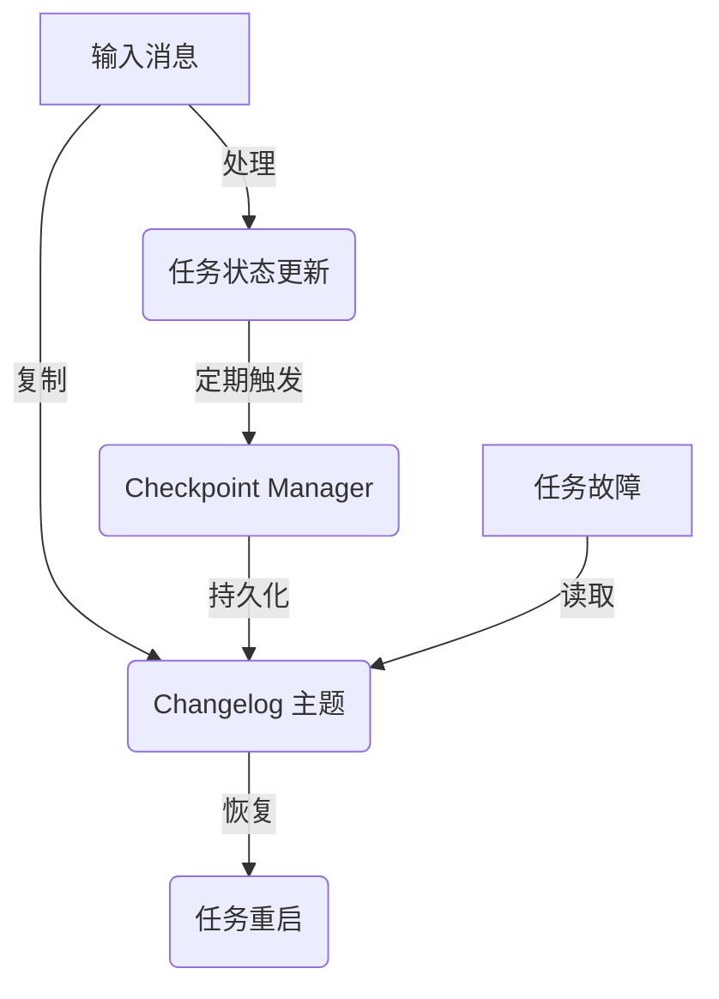

# Samza Checkpoint 原理与代码实例讲解

## 1. 背景介绍

### 1.1 Apache Samza 简介

Apache Samza 是一个分布式流处理系统,旨在提供一种简单、无缝的方式来处理来自 Kafka 等消息系统的实时数据流。Samza 基于 Apache Kafka 构建,并使用 Apache Yarn 来提供容错、资源隔离和安全性。它支持有状态的本地化流处理,并提供了一个简单的 API 来开发流处理应用程序。

### 1.2 Checkpoint 机制概述

在分布式流处理系统中,容错是一个关键的需求。由于流处理任务通常是无限运行的,因此必须能够从故障中恢复,并保证处理的一致性和正确性。Checkpoint 机制是 Samza 用于实现容错和状态一致性的核心机制。

Checkpoint 机制的主要作用是定期将任务的状态数据持久化到持久存储中(如 Kafka 主题),以便在发生故障时能够从最近的一致状态点恢复。通过 Checkpoint,Samza 可以保证至少一次处理语义,即任务在发生故障后重启时,不会丢失或重复处理任何消息。

## 2. 核心概念与联系

### 2.1 Samza 作业模型

在 Samza 中,一个流处理应用程序被称为一个"作业"(Job)。作业由多个"任务"(Task)组成,每个任务负责处理数据流的一部分。任务是 Samza 的基本执行单元,由一个或多个"容器"(Container)来运行。

容器是 Samza 中的资源隔离单元,每个容器都运行在一个独立的 YARN 容器中。容器负责管理和执行它所包含的任务。

### 2.2 Checkpoint 相关概念

- **Checkpoint:** 一个 Checkpoint 是任务状态在某个时间点的快照,包含了任务所有状态数据的副本。
- **Changelog:** Changelog 是一个 Kafka 主题,用于存储任务的 Checkpoint 数据。每个任务都有一个专用的 Changelog 主题。
- **Checkpoint Manager:** Checkpoint Manager 是 Samza 中负责协调 Checkpoint 过程的组件。它负责触发 Checkpoint、将状态数据写入 Changelog,以及在任务重启时从 Changelog 中恢复状态。

### 2.3 Checkpoint 的核心作用

Checkpoint 机制在 Samza 中扮演着至关重要的角色,它确保了以下几个核心功能:

1. **容错性:** 通过将任务状态持久化到持久存储(Changelog),Checkpoint 使得任务能够在发生故障后从最近的一致状态点恢复,避免数据丢失或重复处理。
2. **状态一致性:** Checkpoint 保证了任务状态的一致性,即在任何给定时间点,所有任务的状态都是一致的。这对于支持有状态的流处理非常重要。
3. **重新分区:** 当任务数量发生变化时(如扩展或缩减),Checkpoint 机制可以确保状态数据在新的任务分区之间正确地重新分布。
4. **容器故障隔离:** 由于每个容器都是独立运行的,Checkpoint 机制可以确保一个容器的故障不会影响其他容器中任务的执行。

## 3. 核心算法原理具体操作步骤

Samza 的 Checkpoint 机制基于一种称为"输入流复制"(Input Stream Replication)的技术。该技术的核心思想是将任务的输入数据流复制到一个持久存储(Changelog 主题),并在发生故障时从该存储中恢复状态。

Checkpoint 过程可以分为以下几个主要步骤:

### 3.1 输入数据复制

在处理每条输入消息之前,Samza 会将该消息复制到任务对应的 Changelog 主题中。这样,即使任务发生故障,输入数据也不会丢失,因为它已经被持久化到了 Changelog 中。

### 3.2 状态更新

当任务处理输入消息时,它会根据消息内容更新自身的内部状态。这些状态更新操作是在内存中进行的,以提高性能。

### 3.3 Checkpoint 触发

Checkpoint Manager 会定期触发 Checkpoint 操作,将任务的当前内存状态持久化到 Changelog 主题中。Checkpoint 的频率可以根据需要进行配置,通常设置为几分钟一次。

### 3.4 状态持久化

在 Checkpoint 过程中,任务会将当前内存中的状态数据序列化,并将其写入到对应的 Changelog 主题中。这个过程也称为"状态日志压缩"(State Log Compaction),因为它会将多个状态更新合并为一个最终状态。

### 3.5 故障恢复

当任务发生故障并重新启动时,它会从对应的 Changelog 主题中读取最近的 Checkpoint 数据,并将状态恢复到该 Checkpoint 点。然后,任务会重新处理 Changelog 中从该 Checkpoint 点开始的所有输入消息,以重建内存状态。

这种"输入流复制"的方式确保了任务在发生故障后能够从最近的一致状态点恢复,而不会丢失或重复处理任何消息。

## 4. 数学模型和公式详细讲解举例说明

在 Samza 的 Checkpoint 机制中,有一个关键的问题需要解决:如何确定任务的状态在某个时间点是一致的?换句话说,如何确保在进行 Checkpoint 时,所有任务的状态都是基于相同的输入数据集计算得到的?

为了解决这个问题,Samza 引入了一个称为"批次"(Batch)的概念。每个批次都有一个唯一的 ID,用于标识一组相关的输入消息。Samza 保证同一批次内的所有消息都将被所有相关任务处理,并且在进行 Checkpoint 之前,所有任务都已经完成对该批次的处理。

这个过程可以用以下数学模型来表示:

设有 $n$ 个任务 $T_1, T_2, \ldots, T_n$,每个任务处理一部分输入数据流。在时间 $t$,有一批次 $B_t$ 包含了 $m$ 条输入消息 $\{m_1, m_2, \ldots, m_m\}$。

我们定义一个函数 $f_i(B_t)$ 表示任务 $T_i$ 在处理批次 $B_t$ 时的状态转换函数。即:

$$
s_i^{t+1} = f_i(B_t, s_i^t)
$$

其中 $s_i^t$ 和 $s_i^{t+1}$ 分别表示任务 $T_i$ 在时间 $t$ 和 $t+1$ 时的状态。

为了确保在进行 Checkpoint 时所有任务的状态都是一致的,Samza 要求满足以下条件:

$$
\forall i, j \in \{1, 2, \ldots, n\}, f_i(B_t, s_i^t) = f_j(B_t, s_j^t)
$$

也就是说,对于同一批次 $B_t$,所有任务的状态转换函数都应该产生相同的结果。只有在这个条件满足时,Samza 才会触发 Checkpoint 操作,将所有任务的状态持久化到 Changelog 中。

通过这种方式,Samza 可以保证在任何给定时间点,所有任务的状态都是一致的,并且基于相同的输入数据集计算得到。这为实现容错和状态一致性提供了坚实的理论基础。

## 5. 项目实践: 代码实例和详细解释说明

为了更好地理解 Samza 的 Checkpoint 机制,我们来看一个简单的代码示例。在这个示例中,我们将创建一个简单的流处理任务,它统计每个单词在输入数据流中出现的次数。

### 5.1 定义流处理任务

首先,我们需要定义一个 `WordCountTask` 类,它继承自 `StreamTask` 并实现了 `process` 方法:

```java
public class WordCountTask implements StreamTask<String>, InitableTask {
    private Map<String, Integer> wordCounts = new HashMap<>();

    @Override
    public void process(IncomingMessageEnvelope envelope, MessageCollector collector, TaskCoordinator coordinator) {
        String message = envelope.getMessage();
        String[] words = message.split("\s+");
        for (String word : words) {
            wordCounts.put(word, wordCounts.getOrDefault(word, 0) + 1);
        }
    }

    @Override
    public void init(Config config, TaskContext context) {
        // 初始化任务状态
    }
}
```

在 `process` 方法中,我们将输入消息拆分为单词,并更新 `wordCounts` 映射中每个单词的计数。

### 5.2 配置 Checkpoint 相关参数

接下来,我们需要配置 Samza 作业,包括设置 Checkpoint 相关参数:

```properties
# 输入和输出系统
task.input.streams=kafka.input-topic
task.checkpoint.system=kafka

# Checkpoint 相关配置
task.checkpoint.replication.factor=2
task.checkpoint.state.store.factory=org.apache.samza.storage.kv.RocksDbKeyValueStorageEngineFactory
task.checkpoint.manager.factory=org.apache.samza.checkpoint.kafka.KafkaCheckpointManagerFactory

# 其他配置
...
```

这里我们指定了输入和输出系统为 Kafka,并配置了 Checkpoint 相关参数,如复制因子、状态存储引擎和 Checkpoint Manager 工厂。

### 5.3 运行 Samza 作业

最后,我们可以使用 Samza 提供的命令行工具来运行我们的作业:

```bash
bin/run-job.sh \
  --config-factory=org.apache.samza.config.factories.PropertiesConfigFactory \
  --config-path=config/wordcount.properties
```

在运行过程中,Samza 会自动进行 Checkpoint 操作,将任务的状态持久化到 Kafka 主题中。如果任务发生故障,它将从最近的 Checkpoint 点恢复状态并继续处理。

### 5.4 Mermaid 流程图

下面是 Samza Checkpoint 机制的 Mermaid 流程图,它展示了 Checkpoint 过程中的关键步骤:



1. 输入消息被复制到 Changelog 主题中。
2. 任务处理输入消息并更新内存状态。
3. Checkpoint Manager 定期触发 Checkpoint 操作。
4. 任务将当前状态持久化到 Changelog 主题中。
5. 当任务发生故障时,它会从 Changelog 主题中读取最近的 Checkpoint 数据。
6. 任务从 Checkpoint 点开始重新处理输入消息,恢复内存状态。

## 6. 实际应用场景

Samza 的 Checkpoint 机制为构建可靠的流处理应用程序提供了坚实的基础。以下是一些 Samza 的实际应用场景:

### 6.1 实时数据处理

Samza 非常适合处理来自各种来源的实时数据流,如网络日志、传感器数据、社交媒体数据等。通过 Checkpoint 机制,Samza 可以确保在发生故障时不会丢失或重复处理任何数据。

### 6.2 事件驱动架构

在事件驱动架构中,应用程序通过响应各种事件来执行操作。Samza 可以作为事件处理引擎,实时处理来自 Kafka 等消息系统的事件流,并执行相应的业务逻辑。

### 6.3 实时数据分析

Samza 可以用于实时数据分析,如实时监控、异常检测、实时推荐等。通过对实时数据流进行处理和分析,Samza 可以提供及时的洞察和反馈。

### 6.4 物联网数据处理

在物联网领域,大量的传感器和设备会产生海量的实时数据流。Samza 可以用于处理和分析这些数据,支持实时监控、预测维护等应用场景。

### 6.5 金融风险管理

在金融领域,实时风险管理是一个关键需求。Samza 可以用于实时监控交易数据,检测潜在的风险和欺诈行为,并及时采取相应的措施。

## 7. 工具和资源推荐

### 7.1 Apache Kafka

Apache Kafka 是 Samza 的核心依赖项之一,用于存储输入数据流和 Checkpoint 数据。熟悉 Kafka 的工作原理和管理对