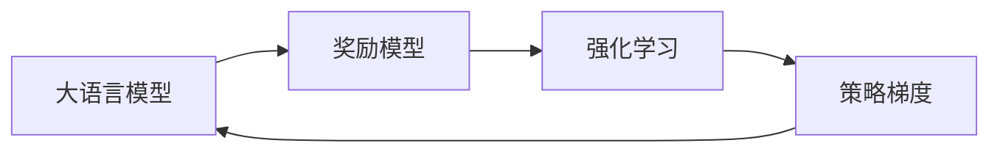

# 大语言模型原理与工程实践：奖励模型

## 1.背景介绍

近年来，随着深度学习技术的飞速发展，大语言模型（Large Language Model, LLM）在自然语言处理领域取得了令人瞩目的成就。从 GPT-3 到 PaLM、Chinchilla 等模型，大语言模型展现出了强大的语言理解和生成能力，在问答、对话、文本生成等任务上取得了突破性进展。然而，传统的大语言模型在训练过程中主要采用最大似然估计（Maximum Likelihood Estimation, MLE）的方法，存在一定的局限性。为了进一步提升大语言模型的性能，研究者们提出了奖励模型（Reward Model）的概念，通过引入奖励函数来优化模型的训练过程，使其生成更加符合人类偏好的输出。

本文将深入探讨奖励模型在大语言模型中的原理和实践，揭示其核心概念、算法原理、数学模型以及工程实现。同时，我们还将通过实际的代码示例和应用场景，帮助读者更好地理解和掌握奖励模型的使用方法。最后，我们将展望奖励模型的未来发展趋势和挑战，为读者提供前瞻性的思考和启发。

## 2.核心概念与联系

### 2.1 大语言模型

大语言模型是指在大规模文本数据上训练的语言模型，通过学习文本的统计规律和语义关系，能够生成连贯、流畅且符合人类语言习惯的文本。常见的大语言模型包括 GPT 系列、BERT、T5 等。这些模型通常采用 Transformer 架构，利用自注意力机制和前馈神经网络来建模文本序列。

### 2.2 奖励模型

奖励模型是一种用于优化大语言模型训练过程的技术。与传统的最大似然估计方法不同，奖励模型引入了一个奖励函数，用于评估生成文本的质量。奖励函数可以根据不同的任务和需求进行设计，例如相关性、流畅性、多样性等。通过最大化奖励函数的期望值，模型可以学习生成更加符合人类偏好的文本。

### 2.3 强化学习

奖励模型的核心思想源自强化学习（Reinforcement Learning）。在强化学习中，智能体（Agent）通过与环境交互，根据环境反馈的奖励信号来优化自身的策略，以获得最大的累积奖励。在奖励模型中，大语言模型扮演着智能体的角色，生成的文本被视为智能体的动作，而奖励函数则提供了环境反馈的奖励信号。

### 2.4 策略梯度

策略梯度（Policy Gradient）是强化学习中常用的优化算法之一。它通过估计策略梯度来更新策略参数，使得智能体能够朝着获得更高奖励的方向优化。在奖励模型中，策略梯度算法被用于优化大语言模型的参数，使其生成的文本能够获得更高的奖励。

下面是核心概念之间的联系示意图：



## 3.核心算法原理具体操作步骤

奖励模型的核心算法是策略梯度算法，具体操作步骤如下：

1. 初始化大语言模型的参数 $\theta$。
2. 根据当前的模型参数 $\theta$，使用大语言模型生成一批文本序列 $\{x_1, x_2, ..., x_n\}$。
3. 对于每个生成的文本序列 $x_i$，使用奖励函数 $r(x_i)$ 计算其奖励值。
4. 计算每个文本序列的对数概率 $\log p(x_i|\theta)$。
5. 计算策略梯度的估计值：

$$\nabla_\theta J(\theta) \approx \frac{1}{n} \sum_{i=1}^n r(x_i) \nabla_\theta \log p(x_i|\theta)$$

6. 使用梯度上升算法更新模型参数：

$$\theta \leftarrow \theta + \alpha \nabla_\theta J(\theta)$$

其中，$\alpha$ 是学习率。

7. 重复步骤 2-6，直到模型收敛或达到预设的迭代次数。

通过不断迭代优化，大语言模型将逐步学习生成高奖励的文本序列，从而提升其生成质量和符合人类偏好的程度。

## 4.数学模型和公式详细讲解举例说明

### 4.1 大语言模型的概率分布

大语言模型本质上是一个条件概率分布 $p(x|c;\theta)$，其中 $x$ 表示生成的文本序列，$c$ 表示给定的上下文，$\theta$ 表示模型参数。模型的目标是最大化生成文本序列的概率：

$$\arg\max_\theta \prod_{i=1}^n p(x_i|c;\theta)$$

其中，$n$ 是训练样本的数量。

### 4.2 奖励函数

奖励函数 $r(x)$ 用于评估生成文本序列 $x$ 的质量。常见的奖励函数设计包括：

- 相关性奖励：衡量生成文本与参考文本之间的相似度，例如使用 ROUGE 或 BLEU 等指标。
- 流畅性奖励：评估生成文本的语法正确性和可读性，可以使用语言模型的困惑度（Perplexity）来度量。
- 多样性奖励：鼓励模型生成多样化的文本，避免重复或泛化的内容。可以使用 n-gram 重复率等指标来衡量。

举例来说，假设我们使用 ROUGE-L 作为相关性奖励，对于生成的文本序列 $x$ 和参考文本 $y$，奖励函数可以定义为：

$$r(x) = \text{ROUGE-L}(x, y)$$

### 4.3 策略梯度估计

在奖励模型中，我们需要估计策略梯度 $\nabla_\theta J(\theta)$ 来优化模型参数。策略梯度的数学形式为：

$$\nabla_\theta J(\theta) = \mathbb{E}_{x \sim p(x|\theta)}[r(x) \nabla_\theta \log p(x|\theta)]$$

其中，$\mathbb{E}_{x \sim p(x|\theta)}$ 表示对于从概率分布 $p(x|\theta)$ 中采样得到的文本序列 $x$ 求期望。

由于直接计算期望值较为困难，我们通常使用蒙特卡洛估计来近似策略梯度：

$$\nabla_\theta J(\theta) \approx \frac{1}{n} \sum_{i=1}^n r(x_i) \nabla_\theta \log p(x_i|\theta)$$

其中，$\{x_1, x_2, ..., x_n\}$ 是从当前模型参数 $\theta$ 生成的一批文本序列。

通过不断迭代更新模型参数，使其朝着获得更高奖励的方向优化，最终得到一个能够生成高质量文本的大语言模型。

## 5.项目实践：代码实例和详细解释说明

下面我们通过一个简单的代码实例来演示如何使用 PyTorch 实现奖励模型。

```python
import torch
import torch.nn as nn
import torch.optim as optim

# 定义大语言模型
class LanguageModel(nn.Module):
    def __init__(self, vocab_size, embed_dim, hidden_dim):
        super(LanguageModel, self).__init__()
        self.embed = nn.Embedding(vocab_size, embed_dim)
        self.lstm = nn.LSTM(embed_dim, hidden_dim, batch_first=True)
        self.linear = nn.Linear(hidden_dim, vocab_size)

    def forward(self, x):
        x = self.embed(x)
        x, _ = self.lstm(x)
        x = self.linear(x)
        return x

# 定义奖励函数
def reward_function(generated_text, reference_text):
    # 使用 ROUGE-L 作为奖励函数
    rouge = calculate_rouge_l(generated_text, reference_text)
    return rouge

# 训练奖励模型
def train_reward_model(model, optimizer, data_loader, num_epochs):
    for epoch in range(num_epochs):
        for batch in data_loader:
            # 生成文本序列
            generated_text = model.generate(batch['input_text'])

            # 计算奖励
            reward = reward_function(generated_text, batch['reference_text'])

            # 计算对数概率和策略梯度
            log_probs = model(batch['input_text'])
            loss = -reward * log_probs

            # 反向传播和优化
            optimizer.zero_grad()
            loss.backward()
            optimizer.step()

# 主函数
def main():
    # 设置超参数
    vocab_size = 10000
    embed_dim = 128
    hidden_dim = 256
    num_epochs = 10
    learning_rate = 0.001

    # 加载数据集
    data_loader = load_dataset()

    # 初始化模型和优化器
    model = LanguageModel(vocab_size, embed_dim, hidden_dim)
    optimizer = optim.Adam(model.parameters(), lr=learning_rate)

    # 训练奖励模型
    train_reward_model(model, optimizer, data_loader, num_epochs)

if __name__ == '__main__':
    main()
```

在上述代码中，我们定义了一个简单的 LSTM 语言模型 `LanguageModel`，并使用 ROUGE-L 作为奖励函数。在训练过程中，我们通过生成文本序列并计算其奖励值，然后使用策略梯度算法更新模型参数。

具体步骤如下：

1. 定义大语言模型 `LanguageModel`，包括词嵌入层、LSTM 层和线性输出层。
2. 定义奖励函数 `reward_function`，使用 ROUGE-L 指标计算生成文本与参考文本之间的相似度作为奖励值。
3. 定义训练函数 `train_reward_model`，遍历数据集的每个批次，生成文本序列并计算奖励值，然后计算对数概率和策略梯度，使用梯度上升算法更新模型参数。
4. 在主函数 `main` 中，设置超参数，加载数据集，初始化模型和优化器，并调用训练函数进行奖励模型的训练。

通过以上步骤，我们就可以使用 PyTorch 实现一个简单的奖励模型，并对其进行训练和优化。在实际应用中，我们可以根据具体任务和需求，选择合适的奖励函数和优化算法，并对模型结构进行调整和改进。

## 6.实际应用场景

奖励模型在自然语言处理领域有广泛的应用场景，下面列举几个典型的应用：

### 6.1 对话系统

在对话系统中，奖励模型可以用于生成更加自然、流畅和符合人类偏好的回复。通过设计合适的奖励函数，如相关性、多样性和用户满意度等，可以优化对话模型的生成质量，提升用户体验。

### 6.2 文本摘要

奖励模型可以应用于文本摘要任务，生成简洁、准确且覆盖关键信息的摘要。通过引入相关性奖励和信息覆盖率奖励，可以使生成的摘要更加贴近原文的主旨，同时避免遗漏重要内容。

### 6.3 机器翻译

在机器翻译任务中，奖励模型可以用于优化翻译的流畅性和忠实度。通过设计合适的奖励函数，如 BLEU 得分和语义相似度，可以使翻译结果更加符合目标语言的语法和语义，提高翻译质量。

### 6.4 内容生成

奖励模型在内容生成领域也有广泛应用，如新闻写作、故事生成、诗歌创作等。通过引入创意性奖励和主题相关性奖励，可以使生成的内容更加新颖、有趣且符合特定主题或风格。

### 6.5 代码生成

奖励模型还可以应用于代码生成任务，如自动编程和代码补全。通过设计合适的奖励函数，如代码可执行性、代码质量和代码风格等，可以使生成的代码更加正确、高效且符合编码规范。

## 7.工具和资源推荐

以下是一些常用的工具和资源，可以帮助您更好地理解和实践奖励模型：

1. PyTorch（https://pytorch.org/）：一个流行的深度学习框架，提供了丰富的工具和库，方便