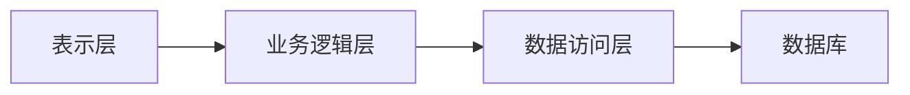

# 网上教学平台的设计与实现

## 1. 背景介绍

### 1.1 网络教育的兴起

随着互联网技术的不断发展和普及,网络教育作为一种新兴的教育形式逐渐兴起。网络教育打破了传统教育的时间和空间限制,为学习者提供了更加灵活便捷的学习方式。通过网络教学平台,学习者可以根据自身的需求和进度自主安排学习时间,选择感兴趣的课程内容,实现个性化学习。

### 1.2 网上教学平台的重要性

网上教学平台是网络教育的核心载体,是实现在线教学、学习资源共享、师生互动交流的关键基础设施。一个高效、稳定、功能完善的网上教学平台,不仅可以提高教学质量,优化学习体验,还能促进教育资源的合理配置,实现教育公平。因此,设计和实现一个优秀的网上教学平台,对于推动网络教育的发展至关重要。

## 2. 核心概念与联系

### 2.1 网上教学平台的核心概念

网上教学平台是一个集成了多种功能模块的综合性在线教育系统,主要包括以下核心概念:

1. **课程管理**:包括课程的创建、编辑、发布、维护等功能,确保课程内容的组织和更新。
2. **学习管理**:提供学习资源浏览、课程学习、作业提交、考试测评等功能,支持学习者的自主学习。
3. **教学管理**:包括教学计划制定、教学进度管理、教学互动等功能,方便教师组织和监控教学活动。
4. **用户管理**:实现用户注册、身份认证、权限控制等功能,保证系统的安全性和可管理性。
5. **资源管理**:提供教学资源的上传、存储、检索、分享等功能,实现资源的共享和重用。
6. **数据分析**:收集和分析学习行为数据,为教学决策提供数据支持。

### 2.2 核心概念之间的联系

上述核心概念相互关联、相互作用,构成了网上教学平台的完整体系。其中:

- 课程管理是网上教学平台的核心,为学习管理和教学管理提供基础内容支持。
- 学习管理和教学管理分别面向学习者和教师,共同围绕课程展开教与学的活动。
- 用户管理为不同角色的用户提供身份认证和权限控制,确保系统的安全运行。
- 资源管理为课程管理、学习管理和教学管理提供必要的资源支持。
- 数据分析基于平台中产生的各种教学数据,为优化教学决策提供数据依据。

## 3. 核心算法原理具体操作步骤

### 3.1 用户身份认证算法

用户身份认证是网上教学平台的基础安全机制,通常采用基于密码的认证算法。具体操作步骤如下:

1. 用户输入用户名和密码。
2. 将用户输入的密码使用安全散列算法(如SHA-256)进行哈希运算,得到密码哈希值。
3. 从用户数据库中查询该用户名对应的密码哈希值。
4. 比较用户输入的密码哈希值和数据库中存储的密码哈希值是否一致。
5. 如果一致,则认证通过,否则认证失败。

该算法的关键在于不存储明文密码,而是存储经过不可逆转的哈希运算后的密码哈希值,从而提高了密码的安全性。

### 3.2 课程推荐算法

为了提高学习者的学习体验,网上教学平台通常会采用课程推荐算法,根据学习者的兴趣爱好、学习历史等数据,推荐合适的课程。常见的课程推荐算法包括:

1. **基于内容的推荐算法**:根据课程内容的文本描述,计算课程内容与学习者兴趣的相似度,推荐相似度高的课程。
2. **协同过滤算法**:根据学习者之间的行为相似度,推荐与相似学习者偏好的课程。
3. **基于知识图谱的推荐算法**:构建课程知识图谱,根据学习者的知识结构,推荐相关的课程。

这些算法可以单独使用,也可以相互结合,形成混合推荐算法,以提高推荐的准确性和多样性。

### 3.3 自动阅卷算法

对于客观题(如选择题、填空题等),网上教学平台可以采用自动阅卷算法,自动批改学生的答案,提高阅卷效率。自动阅卷算法的具体步骤如下:

1. 从题库中获取题目的参考答案。
2. 对学生的答案和参考答案进行文本预处理,如去除多余空格、转换大小写等。
3. 比较学生答案与参考答案的相似度,可采用字符串编辑距离、语义相似度等算法。
4. 根据相似度阈值判断答案是否正确。
5. 统计正确答案数,计算得分。

对于主观题(如问答题、编程题等),由于答案的多样性,自动阅卷算法的准确性有限,通常需要人工批改作为辅助。

## 4. 数学模型和公式详细讲解举例说明

### 4.1 课程内容相似度计算

在基于内容的课程推荐算法中,需要计算课程内容与学习者兴趣的相似度。常用的相似度计算模型是余弦相似度(Cosine Similarity)。

假设课程内容和学习者兴趣都可以用向量表示,分别记为 $\vec{c}$ 和 $\vec{u}$,则它们的余弦相似度定义为:

$$\text{sim}(\vec{c}, \vec{u}) = \frac{\vec{c} \cdot \vec{u}}{||\vec{c}|| \times ||\vec{u}||}$$

其中 $\vec{c} \cdot \vec{u}$ 表示向量的点积,  $||\vec{c}||$ 和 $||\vec{u}||$ 分别表示向量的模长。余弦相似度的取值范围在 $[0, 1]$ 之间,值越大表示相似度越高。

在实际应用中,可以使用 TF-IDF 等文本表示模型将课程内容和用户兴趣转换为向量,然后计算它们的余弦相似度,从而实现课程推荐。

### 4.2 基于图的推荐算法

在基于知识图谱的推荐算法中,需要构建课程知识图谱,并在图上进行相似度计算和推荐。知识图谱可以用图 $G = (V, E)$ 表示,其中 $V$ 表示节点集合(课程、知识点等),  $E$ 表示边集合(课程之间的先修关系等)。

对于给定的学习者 $u$,已学习的课程集合记为 $V_u \subseteq V$,则推荐的课程集合 $R_u$ 可以定义为:

$$R_u = \{v \in V \backslash V_u | \exists u' \in V_u, \text{sim}(u, u') \geq \theta\}$$

其中 $\text{sim}(u, u')$ 表示节点 $u$ 和 $u'$ 在图上的相似度,可以使用随机游走、PersonalRank 等算法计算;  $\theta$ 是相似度阈值。

该模型的核心思想是,如果学习者 $u$ 已学习的课程 $u'$,与待推荐课程 $v$ 在知识图谱上的相似度足够高,则将 $v$ 推荐给 $u$。通过图模型,可以很好地捕捉课程之间的关联关系,提高推荐的准确性。

## 5. 项目实践:代码实例和详细解释说明

为了更好地理解网上教学平台的设计与实现,我们提供了一个简化的 Python 项目示例。该示例包括用户认证、课程管理和学习记录等核心功能模块。

### 5.1 系统架构

该项目采用经典的三层架构设计,包括表示层(视图)、业务逻辑层(控制器)和数据访问层(模型)。具体架构如下所示:



### 5.2 用户认证模块

用户认证模块实现了基于密码的用户登录功能,采用 SHA-256 算法对密码进行哈希运算。相关代码如下:

```python
import hashlib

def hash_password(password):
    """Hash a password using SHA-256."""
    sha256 = hashlib.sha256()
    sha256.update(password.encode('utf-8'))
    return sha256.hexdigest()

def authenticate(username, password):
    """Authenticate a user by checking the password hash."""
    user = User.get(username=username)
    if user and user.password_hash == hash_password(password):
        return True
    return False
```

在用户注册时,密码会被哈希存储在数据库中;在用户登录时,输入的密码会被哈希后与数据库中的密码哈希值进行比对,从而实现身份认证。

### 5.3 课程管理模块

课程管理模块提供了创建、修改和查询课程的功能。以下是创建课程的代码示例:

```python
def create_course(name, description, instructor):
    """Create a new course."""
    course = Course(name=name, description=description, instructor=instructor)
    course.save()
    return course
```

在该示例中,我们定义了一个 `Course` 模型类,包含了课程名称、描述和讲师等属性。通过调用 `save()` 方法,可以将课程信息持久化到数据库中。

### 5.4 学习记录模块

学习记录模块用于记录学习者的学习进度,包括已学习的课程、完成的作业等信息。以下是记录学习进度的代码示例:

```python
def record_progress(user, course, progress):
    """Record a user's progress in a course."""
    learning_record = LearningRecord.get_or_create(user=user, course=course)
    learning_record.progress = progress
    learning_record.save()
```

在该示例中,我们定义了一个 `LearningRecord` 模型类,用于存储学习者、课程和学习进度等信息。通过 `get_or_create()` 方法,我们可以获取或创建一个新的学习记录实例,然后更新学习进度并保存到数据库中。

该项目示例仅包含了网上教学平台的核心功能模块,在实际开发中还需要考虑其他模块的设计和实现,如教学互动、资源管理、数据分析等。同时,还需要注重系统的可扩展性、安全性和性能优化等方面的设计。

## 6. 实际应用场景

网上教学平台在实际应用中有着广泛的场景,包括但不限于以下几个方面:

### 6.1 在线课程平台

像 Coursera、edX、Udemy 等知名的在线课程平台,就是典型的网上教学平台应用。这些平台提供了海量的在线课程资源,涵盖了各个学科领域,吸引了来自世界各地的学习者。通过这些平台,学习者可以根据自身的兴趣和需求选择合适的课程,按照自己的节奏学习。

### 6.2 企业内训平台

许多大型企业都建立了自己的内部培训平台,作为员工在线学习和技能提升的重要渠道。这些企业内训平台不仅提供了与企业业务相关的专业课程,还包括了通用的管理、领导力等培训内容。通过内训平台,企业可以高效地组织员工培训,提高员工的专业能力和综合素质。

### 6.3 远程教育平台

一些大学和教育机构建立了远程教育平台,为学生提供在线学习的机会。这种模式下,学生可以在家中或任何地方通过网络参加课程学习,与老师和其他同学进行在线互动。远程教育平台扩大了教育的覆盖范围,为偏远地区或特殊群体提供了更多的教育资源。

### 6.4 社区学习平台

除了专业的教育机构,一些社区组织或个人也开发了自己的网上教学平台,为特定群体提供学习资源和交流空间。这些平台通常聚焦于某个特定的主题或领域,如编程、语言学习、手工艺等,为相关爱好者提供了一个在线学习和交流的平台。

## 7. 工