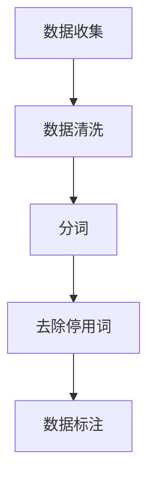
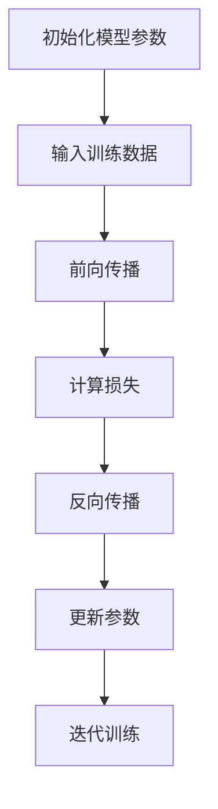
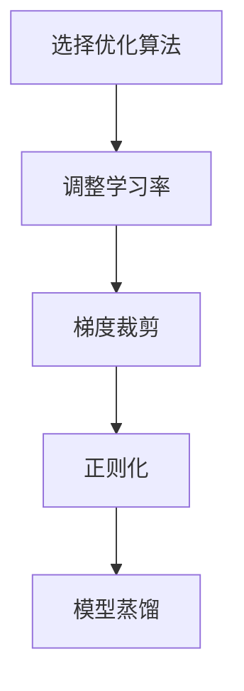

# 大语言模型原理与工程实践：LLaMA 系列

## 1.背景介绍

在过去的几年中，人工智能领域取得了显著的进展，特别是在自然语言处理（NLP）方面。大语言模型（Large Language Models, LLMs）如GPT-3、BERT等已经展示了其在生成文本、翻译、问答等任务中的强大能力。LLaMA（Large Language Model Architecture）系列作为新一代大语言模型，进一步推动了这一领域的发展。本文将深入探讨LLaMA系列的原理与工程实践，帮助读者理解其核心概念、算法原理、数学模型、实际应用以及未来发展趋势。

## 2.核心概念与联系

### 2.1 大语言模型的定义

大语言模型是基于深度学习的模型，能够理解和生成自然语言文本。它们通常由数十亿甚至数千亿个参数组成，通过在大规模文本数据上进行训练，学习语言的语法、语义和上下文关系。

### 2.2 LLaMA 系列的特点

LLaMA系列模型在以下几个方面具有显著特点：
- **规模**：LLaMA模型通常具有更大的参数规模，能够捕捉更复杂的语言模式。
- **训练数据**：使用更大规模和多样化的训练数据，提升模型的泛化能力。
- **架构优化**：在模型架构上进行优化，提高训练效率和推理速度。

### 2.3 与其他大语言模型的联系

LLaMA系列与其他大语言模型如GPT-3、BERT等在基本原理上相似，但在具体实现和优化上有所不同。LLaMA系列通过引入新的训练方法和架构改进，进一步提升了模型性能。

## 3.核心算法原理具体操作步骤

### 3.1 数据预处理

数据预处理是训练大语言模型的第一步。包括数据清洗、分词、去除停用词等步骤。以下是数据预处理的基本流程：



### 3.2 模型训练

模型训练是大语言模型的核心步骤。LLaMA系列通常采用自监督学习方法，通过预测下一个词或填补缺失词来进行训练。以下是模型训练的基本流程：



### 3.3 模型优化

模型优化是提升大语言模型性能的重要步骤。LLaMA系列通过引入新的优化算法和架构改进，提升了模型的训练效率和推理速度。以下是模型优化的基本流程：



## 4.数学模型和公式详细讲解举例说明

### 4.1 语言模型的数学定义

语言模型的目标是估计一个给定序列 $w_1, w_2, ..., w_T$ 的联合概率分布 $P(w_1, w_2, ..., w_T)$。通常使用链式法则将其分解为条件概率的乘积：

$$
P(w_1, w_2, ..., w_T) = \prod_{t=1}^{T} P(w_t | w_1, w_2, ..., w_{t-1})
$$

### 4.2 自注意力机制

自注意力机制是大语言模型的核心组件。其基本思想是通过计算输入序列中每个词与其他词的相关性来生成新的表示。自注意力机制的计算公式如下：

$$
\text{Attention}(Q, K, V) = \text{softmax}\left(\frac{QK^T}{\sqrt{d_k}}\right)V
$$

其中，$Q$、$K$、$V$ 分别表示查询、键和值矩阵，$d_k$ 表示键的维度。

### 4.3 损失函数

大语言模型通常使用交叉熵损失函数来衡量预测结果与真实标签之间的差异。交叉熵损失函数的定义如下：

$$
L = -\sum_{i=1}^{N} y_i \log(\hat{y}_i)
$$

其中，$y_i$ 表示真实标签，$\hat{y}_i$ 表示模型预测的概率。

## 5.项目实践：代码实例和详细解释说明

### 5.1 数据预处理代码示例

以下是一个简单的数据预处理代码示例，使用Python和NLTK库进行分词和去除停用词：

```python
import nltk
from nltk.corpus import stopwords
from nltk.tokenize import word_tokenize

# 下载停用词
nltk.download('stopwords')
nltk.download('punkt')

# 示例文本
text = "LLaMA系列模型在自然语言处理领域表现出色。"

# 分词
words = word_tokenize(text)

# 去除停用词
filtered_words = [word for word in words if word.lower() not in stopwords.words('english')]

print(filtered_words)
```

### 5.2 模型训练代码示例

以下是一个简单的模型训练代码示例，使用PyTorch进行模型训练：

```python
import torch
import torch.nn as nn
import torch.optim as optim

# 定义简单的LSTM模型
class SimpleLSTM(nn.Module):
    def __init__(self, input_size, hidden_size, output_size):
        super(SimpleLSTM, self).__init__()
        self.lstm = nn.LSTM(input_size, hidden_size)
        self.fc = nn.Linear(hidden_size, output_size)

    def forward(self, x):
        out, _ = self.lstm(x)
        out = self.fc(out[-1])
        return out

# 初始化模型、损失函数和优化器
model = SimpleLSTM(input_size=10, hidden_size=20, output_size=1)
criterion = nn.MSELoss()
optimizer = optim.Adam(model.parameters(), lr=0.001)

# 示例训练数据
inputs = torch.randn(5, 1, 10)
targets = torch.randn(5, 1)

# 训练模型
for epoch in range(100):
    model.train()
    outputs = model(inputs)
    loss = criterion(outputs, targets)
    optimizer.zero_grad()
    loss.backward()
    optimizer.step()

    if (epoch+1) % 10 == 0:
        print(f'Epoch [{epoch+1}/100], Loss: {loss.item():.4f}')
```

### 5.3 模型优化代码示例

以下是一个简单的模型优化代码示例，使用学习率调度器进行学习率调整：

```python
from torch.optim.lr_scheduler import StepLR

# 初始化学习率调度器
scheduler = StepLR(optimizer, step_size=30, gamma=0.1)

# 训练模型并调整学习率
for epoch in range(100):
    model.train()
    outputs = model(inputs)
    loss = criterion(outputs, targets)
    optimizer.zero_grad()
    loss.backward()
    optimizer.step()
    scheduler.step()

    if (epoch+1) % 10 == 0:
        print(f'Epoch [{epoch+1}/100], Loss: {loss.item():.4f}, LR: {scheduler.get_last_lr()[0]:.6f}')
```

## 6.实际应用场景

### 6.1 文本生成

LLaMA系列模型在文本生成任务中表现出色，可以用于自动写作、新闻生成、对话系统等应用。例如，使用LLaMA模型生成新闻报道：

```python
from transformers import GPT2LMHeadModel, GPT2Tokenizer

# 加载预训练模型和分词器
model = GPT2LMHeadModel.from_pretrained('gpt2')
tokenizer = GPT2Tokenizer.from_pretrained('gpt2')

# 输入文本
input_text = "LLaMA系列模型在自然语言处理领域表现出色。"

# 生成文本
input_ids = tokenizer.encode(input_text, return_tensors='pt')
output = model.generate(input_ids, max_length=100, num_return_sequences=1)

# 输出生成的文本
print(tokenizer.decode(output[0], skip_special_tokens=True))
```

### 6.2 机器翻译

LLaMA系列模型可以用于机器翻译任务，将一种语言的文本翻译成另一种语言。例如，使用LLaMA模型进行中英文翻译：

```python
from transformers import MarianMTModel, MarianTokenizer

# 加载预训练模型和分词器
model_name = 'Helsinki-NLP/opus-mt-zh-en'
model = MarianMTModel.from_pretrained(model_name)
tokenizer = MarianTokenizer.from_pretrained(model_name)

# 输入文本
input_text = "LLaMA系列模型在自然语言处理领域表现出色。"

# 翻译文本
input_ids = tokenizer.encode(input_text, return_tensors='pt')
output = model.generate(input_ids, max_length=100)
translated_text = tokenizer.decode(output[0], skip_special_tokens=True)

print(translated_text)
```

### 6.3 问答系统

LLaMA系列模型可以用于构建智能问答系统，回答用户提出的问题。例如，使用LLaMA模型进行问答：

```python
from transformers import pipeline

# 加载预训练模型
qa_pipeline = pipeline('question-answering', model='distilbert-base-uncased-distilled-squad')

# 输入文本和问题
context = "LLaMA系列模型在自然语言处理领域表现出色。"
question = "LLaMA系列模型在哪个领域表现出色？"

# 获取答案
result = qa_pipeline(question=question, context=context)

print(f"Answer: {result['answer']}")
```

## 7.工具和资源推荐

### 7.1 开源框架

- **Transformers**：由Hugging Face提供的开源库，支持多种预训练语言模型。
- **PyTorch**：一个流行的深度学习框架，广泛用于大语言模型的训练和推理。
- **TensorFlow**：另一个流行的深度学习框架，提供了丰富的工具和资源。

### 7.2 数据集

- **Common Crawl**：一个大规模的网页抓取数据集，常用于训练大语言模型。
- **Wikipedia**：一个广泛使用的文本数据源，包含丰富的知识和信息。
- **OpenWebText**：一个开源的高质量文本数据集，常用于语言模型的训练。

### 7.3 在线资源

- **ArXiv**：一个开放获取的学术论文预印本平台，包含大量关于大语言模型的最新研究。
- **GitHub**：一个代码托管平台，提供了丰富的开源项目和代码示例。
- **Kaggle**：一个数据科学竞赛平台，提供了丰富的数据集和竞赛机会。

## 8.总结：未来发展趋势与挑战

### 8.1 未来发展趋势

- **模型规模继续扩大**：随着计算资源的增加和算法的改进，大语言模型的规模将继续扩大，捕捉更复杂的语言模式。
- **多模态学习**：未来的大语言模型将不仅限于文本数据，还将结合图像、音频等多种模态数据，提升模型的理解和生成能力。
- **个性化和定制化**：未来的大语言模型将更加注重个性化和定制化，能够根据用户的需求和偏好生成个性化的内容。

### 8.2 面临的挑战

- **计算资源需求**：大语言模型的训练和推理需要大量的计算资源，如何高效利用计算资源是一个重要挑战。
- **数据隐私和安全**：大语言模型的训练需要大量的数据，如何保护数据隐私和安全是一个重要问题。
- **模型解释性**：大语言模型的内部机制复杂，如何提高模型的解释性和透明度是一个重要研究方向。

## 9.附录：常见问题与解答

### 9.1 大语言模型的训练需要多长时间？

大语言模型的训练时间取决于模型的规模、训练数据的量以及计算资源的配置。通常需要数周甚至数月的时间。

### 9.2 如何选择合适的优化算法？

选择优化算法时需要考虑模型的规模、训练数据的特性以及计算资源的限制。常用的优化算法包括Adam、SGD等。

### 9.3 如何评估大语言模型的性能？

大语言模型的性能评估通常使用困惑度（Perplexity）、BLEU、ROUGE等指标。不同任务可能需要使用不同的评估指标。

### 9.4 如何处理大语言模型的过拟合问题？

处理过拟合问题的方法包括使用正则化、数据增强、早停等技术。此外，可以通过增加训练数据量来缓解过拟合问题。

### 9.5 大语言模型的应用有哪些限制？

大语言模型的应用限制包括计算资源需求高、数据隐私和安全问题、模型解释性差等。此外，大语言模型在处理特定领域的专业知识时可能表现不佳。

---

作者：禅与计算机程序设计艺术 / Zen and the Art of Computer Programming