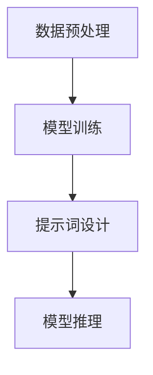

# 大语言模型原理与工程实践：提示词的基础要素

## 1.背景介绍

大语言模型（Large Language Model, LLM）是近年来人工智能领域的一个重要突破。它们通过大量的文本数据进行训练，能够生成高质量的自然语言文本，完成各种复杂的语言任务，如翻译、摘要、对话生成等。提示词（Prompt）作为与大语言模型交互的关键要素，决定了模型输出的质量和效果。

### 1.1 大语言模型的发展历程

大语言模型的发展可以追溯到早期的统计语言模型，如n-gram模型。随着计算能力和数据量的增加，基于神经网络的语言模型逐渐成为主流。特别是自从Transformer架构的提出，BERT、GPT等模型相继问世，推动了大语言模型的快速发展。

### 1.2 提示词的重要性

提示词是用户与大语言模型交互的桥梁。一个好的提示词能够引导模型生成符合预期的输出，而不良的提示词则可能导致模型输出不相关或低质量的内容。因此，理解和设计有效的提示词是使用大语言模型的关键。

## 2.核心概念与联系

在深入探讨提示词之前，我们需要了解一些核心概念及其相互关系。

### 2.1 大语言模型

大语言模型是基于深度学习的模型，通常包含数亿到数千亿个参数。它们通过大量的文本数据进行训练，能够理解和生成自然语言。

### 2.2 提示词

提示词是用户输入给大语言模型的一段文本，用于引导模型生成特定的输出。提示词的设计直接影响模型的表现。

### 2.3 生成任务与理解任务

大语言模型可以执行生成任务（如文本生成、对话生成）和理解任务（如文本分类、情感分析）。提示词在这两类任务中的作用有所不同。

### 2.4 预训练与微调

大语言模型通常先进行预训练，然后在特定任务上进行微调。提示词在预训练和微调阶段都起到重要作用。

## 3.核心算法原理具体操作步骤

大语言模型的核心算法基于Transformer架构，以下是其具体操作步骤。

### 3.1 数据预处理

数据预处理包括文本清洗、分词、编码等步骤。预处理后的数据将作为模型的输入。

### 3.2 模型训练

模型训练包括前向传播、损失计算和反向传播。通过不断调整模型参数，使得模型能够更好地拟合训练数据。

### 3.3 提示词设计

提示词设计是使用大语言模型的关键步骤。一个好的提示词能够引导模型生成高质量的输出。

### 3.4 模型推理

模型推理是指在给定提示词的情况下，模型生成输出的过程。推理过程通常包括解码策略的选择，如贪心搜索、束搜索等。



## 4.数学模型和公式详细讲解举例说明

大语言模型的核心是基于Transformer架构的神经网络。以下是一些关键的数学公式和概念。

### 4.1 自注意力机制

自注意力机制是Transformer的核心。它通过计算输入序列中每个位置的注意力权重，捕捉序列中的长距离依赖关系。

$$
\text{Attention}(Q, K, V) = \text{softmax}\left(\frac{QK^T}{\sqrt{d_k}}\right)V
$$

其中，$Q$、$K$、$V$分别表示查询矩阵、键矩阵和值矩阵，$d_k$是键向量的维度。

### 4.2 位置编码

由于Transformer不包含循环结构，需要通过位置编码来引入序列的位置信息。

$$
PE_{(pos, 2i)} = \sin\left(\frac{pos}{10000^{2i/d_{model}}}\right)
$$

$$
PE_{(pos, 2i+1)} = \cos\left(\frac{pos}{10000^{2i/d_{model}}}\right)
$$

### 4.3 损失函数

大语言模型的训练目标是最小化预测输出与真实输出之间的差异，通常使用交叉熵损失函数。

$$
L = -\sum_{i=1}^{N} y_i \log(\hat{y}_i)
$$

其中，$y_i$是实际标签，$\hat{y}_i$是模型预测的概率。

## 5.项目实践：代码实例和详细解释说明

为了更好地理解提示词的设计和使用，我们通过一个具体的代码实例来说明。

### 5.1 环境配置

首先，我们需要配置环境，安装必要的库。

```bash
pip install transformers
```

### 5.2 加载预训练模型

接下来，我们加载一个预训练的大语言模型。

```python
from transformers import GPT2LMHeadModel, GPT2Tokenizer

model_name = 'gpt2'
model = GPT2LMHeadModel.from_pretrained(model_name)
tokenizer = GPT2Tokenizer.from_pretrained(model_name)
```

### 5.3 提示词设计

设计一个简单的提示词，用于生成文本。

```python
prompt = "Once upon a time"
input_ids = tokenizer.encode(prompt, return_tensors='pt')
```

### 5.4 模型推理

使用模型生成文本。

```python
output = model.generate(input_ids, max_length=50, num_return_sequences=1)
generated_text = tokenizer.decode(output[0], skip_special_tokens=True)
print(generated_text)
```

### 5.5 结果分析

分析生成的文本，评估提示词的效果。

```python
# 输出生成的文本
print(generated_text)
```

## 6.实际应用场景

大语言模型和提示词在多个实际应用场景中发挥着重要作用。

### 6.1 文本生成

大语言模型可以用于生成高质量的文本，如新闻报道、小说创作等。提示词的设计直接影响生成文本的风格和内容。

### 6.2 对话系统

在对话系统中，提示词用于引导模型生成合适的回复。通过设计不同的提示词，可以实现多种对话风格和功能。

### 6.3 机器翻译

提示词在机器翻译中用于指定源语言和目标语言。通过优化提示词，可以提高翻译的准确性和流畅性。

### 6.4 文本摘要

大语言模型可以用于生成文本摘要。提示词用于指定需要摘要的文本和摘要的长度。

## 7.工具和资源推荐

为了更好地使用大语言模型和设计提示词，以下是一些推荐的工具和资源。

### 7.1 Transformers库

Transformers库是一个强大的工具，提供了多种预训练的大语言模型和便捷的接口。

### 7.2 Hugging Face社区

Hugging Face社区是一个活跃的社区，提供了丰富的资源和支持，帮助用户更好地使用大语言模型。

### 7.3 在线教程和文档

在线教程和文档是学习大语言模型和提示词设计的重要资源。推荐阅读官方文档和社区提供的教程。

## 8.总结：未来发展趋势与挑战

大语言模型和提示词设计在未来有着广阔的发展前景，但也面临一些挑战。

### 8.1 发展趋势

随着计算能力和数据量的增加，大语言模型将变得更加强大。提示词设计也将更加智能化和自动化。

### 8.2 挑战

大语言模型的训练和推理需要大量的计算资源，提示词设计的效果也难以保证一致性。如何提高模型的效率和提示词的稳定性是未来的研究重点。

## 9.附录：常见问题与解答

### 9.1 如何选择合适的提示词？

选择合适的提示词需要根据具体任务和模型的特点进行调整。可以通过实验和调优来找到最佳的提示词。

### 9.2 如何提高模型的生成质量？

提高模型的生成质量可以通过优化提示词、调整解码策略和微调模型等方法实现。

### 9.3 大语言模型的局限性是什么？

大语言模型虽然强大，但也存在一些局限性，如对长文本的处理能力有限、生成内容的可控性差等。

---

作者：禅与计算机程序设计艺术 / Zen and the Art of Computer Programming