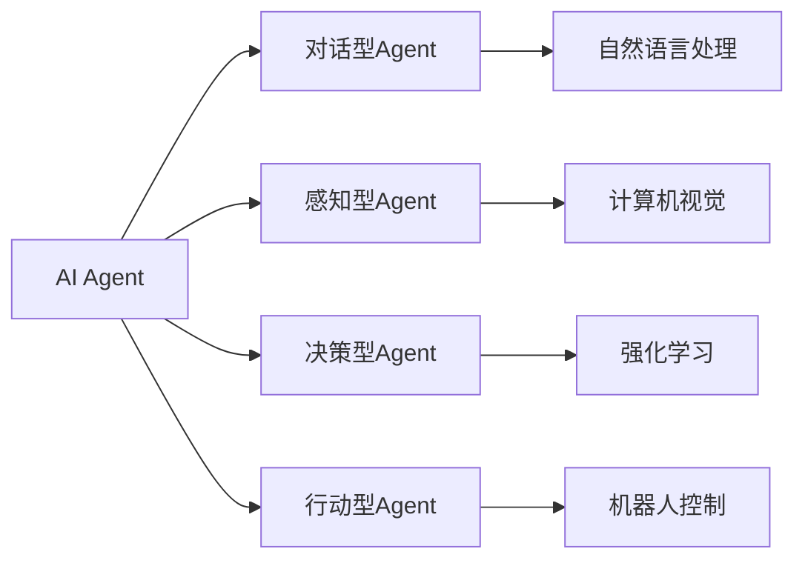

# AI Agent: AI的下一个风口 典型案例和商业应用

## 1.背景介绍
### 1.1 人工智能发展的新阶段
人工智能(Artificial Intelligence,AI)经过70多年的发展,已经进入了一个新的阶段。从早期的专家系统、机器学习,到如今的深度学习、强化学习等技术,AI正在以前所未有的速度发展,并在各行各业得到广泛应用。

### 1.2 AI Agent的兴起
在AI发展的新阶段,一个值得关注的风口就是AI Agent。AI Agent是一种能够自主感知环境、做出决策并采取行动的智能体,可以执行特定的任务或目标。相比传统的AI系统,AI Agent具有更强的自主性、适应性和交互性。

### 1.3 AI Agent的应用前景
AI Agent在智能客服、智能助理、无人驾驶、智能制造等领域有广阔的应用前景。越来越多的企业开始重视AI Agent技术,将其作为提升效率、优化业务流程的重要手段。可以预见,AI Agent将成为未来人工智能商业化落地的重要方向。

## 2.核心概念与联系
### 2.1 AI Agent的定义
AI Agent是一种能够感知环境并做出自主决策和行动的人工智能系统。它具有以下特点:
- 自主性:能够独立地执行任务,无需人工干预
- 交互性:能够与环境、用户进行交互
- 适应性:能够根据环境的变化调整自身行为
- 目标导向:具有明确的目标,并为实现目标而行动

### 2.2 AI Agent与其他AI技术的关系
AI Agent与机器学习、深度学习、自然语言处理、计算机视觉等AI技术密切相关。这些技术为AI Agent的感知、决策、行动提供了基础支持。同时,AI Agent也推动了这些技术的发展和应用。

### 2.3 AI Agent的分类
根据应用场景和任务类型,AI Agent可分为以下几类:
- 对话型Agent:主要应用于客服、助理等场景,通过自然语言交互完成任务
- 感知型Agent:主要应用于无人驾驶、智能监控等场景,通过传感器感知环境信息
- 决策型Agent:主要应用于智能调度、智能交易等场景,根据环境状态做出最优决策
- 行动型Agent:主要应用于机器人控制、智能家居等场景,根据指令执行物理动作

下图展示了不同类型AI Agent之间的关系:



## 3.核心算法原理具体操作步骤
### 3.1 强化学习
强化学习是实现AI Agent自主决策的核心算法之一。其基本原理是Agent通过与环境的交互,根据环境反馈的奖励或惩罚来优化自身的决策策略,最终获得最大的累积奖励。

强化学习的主要步骤如下:
1. Agent根据当前状态选择一个动作
2. 环境根据Agent的动作给出下一个状态和即时奖励
3. Agent根据即时奖励和下一个状态更新价值函数
4. 重复步骤1-3,直到达到终止状态
5. 多次迭代上述过程,不断优化价值函数,得到最优策略

常用的强化学习算法包括Q-Learning、SARSA、DQN等。下面以Q-Learning为例,给出其核心公式:

$$Q(s,a) \leftarrow Q(s,a)+\alpha [r+\gamma \max _{a^{\prime }}Q(s^{\prime },a^{\prime })-Q(s,a)]$$

其中,$Q(s,a)$表示在状态$s$下采取动作$a$的价值,$\alpha$是学习率,$\gamma$是折扣因子,$r$是即时奖励,$s^{\prime}$和$a^{\prime}$分别是下一个状态和动作。

### 3.2 深度学习
深度学习是AI Agent感知、决策的另一个重要技术手段。通过构建多层神经网络,深度学习能够自动提取数据的高层特征,实现复杂模式的识别和预测。

深度学习在AI Agent中的主要应用包括:
- 感知:通过卷积神经网络(CNN)实现图像、语音等感知数据的特征提取和分类
- 决策:通过深度Q网络(DQN)、深度确定性策略梯度(DDPG)等算法实现基于深度学习的强化学习决策
- 生成:通过生成对抗网络(GAN)实现逼真的图像、语音等内容的生成

下面以CNN为例,给出其核心原理:

CNN通过卷积层和池化层交替堆叠的方式,逐层提取数据的局部特征和全局特征。卷积层通过卷积核对输入数据进行卷积操作,得到特征图谱;池化层通过下采样操作减小特征图谱的尺寸,提取主要特征。多个卷积层和池化层堆叠后,再经过全连接层处理,最终得到分类或预测结果。

卷积操作的数学表达如下:

$$(f*g)(i,j)=\sum_m \sum_n f(m,n)g(i-m,j-n)$$

其中,$f$为输入数据,$g$为卷积核。

## 4.数学模型和公式详细讲解举例说明
前面介绍了AI Agent的两个核心算法:强化学习和深度学习。这里我们再通过一个具体例子,来详细讲解其中的数学模型和公式。

以强化学习中的Q-Learning算法为例。假设一个机器人需要在一个10x10的网格环境中寻找目标,每个格子有4个可选动作:上、下、左、右。机器人执行一个动作后,环境会反馈一个即时奖励(找到目标为+100,其他为-1),并转移到下一个状态。机器人的目标是通过不断尝试,学习一个最优策略,使得从任意起始状态开始,都能获得最大累积奖励。

我们可以用Q-Learning算法来解决这个问题。首先定义Q值表$Q(s,a)$,表示在状态$s$下采取动作$a$的价值。初始时,Q值表中所有元素初始化为0。然后,机器人开始与环境交互,不断更新Q值表:

1. 在当前状态$s$,选择一个动作$a$(e-greedy策略)
2. 执行动作$a$,环境反馈即时奖励$r$,并转移到下一个状态$s^{\prime}$
3. 根据公式更新$Q(s,a)$:

$$Q(s,a) \leftarrow Q(s,a)+\alpha [r+\gamma \max _{a^{\prime }}Q(s^{\prime },a^{\prime })-Q(s,a)]$$

其中$\alpha=0.1, \gamma=0.9$

4. $s \leftarrow s^{\prime}$,重复步骤1-4直至终止

例如,假设机器人当前位于(2,3),选择"右"移动到(2,4),环境反馈即时奖励-1,则Q值更新如下:

$$Q((2,3),右) \leftarrow -0.1 + 0.9 * \max(Q((2,4),上),Q((2,4),下),Q((2,4),左),Q((2,4),右))$$

假设$\max(Q((2,4),上),Q((2,4),下),Q((2,4),左),Q((2,4),右))=0$,则:

$$Q((2,3),右) \leftarrow -0.1 + 0.9 * 0 = -0.1$$

经过多轮迭代,Q值表最终收敛,得到最优策略对应的Q值函数。此时,机器人只需根据当前状态,选择Q值最大的动作,就能获得最优策略。

这个例子展示了强化学习的数学本质:通过价值函数的迭代更新,逐步逼近最优策略。Q-Learning算法巧妙地将价值函数与贝尔曼方程相结合,实现了无模型、异策略、离线式的强化学习。

## 5.项目实践:代码实例和详细解释说明

下面我们通过一个简单的Python代码实例,来演示如何用Q-Learning算法实现一个网格世界寻宝机器人。

首先定义环境类`GridWorld`:

```python
import numpy as np

class GridWorld:
    def __init__(self, width, height, start, goal, obstacles):
        self.width = width
        self.height = height
        self.start = start
        self.goal = goal
        self.obstacles = obstacles
        self.agent_pos = start

    def reset(self):
        self.agent_pos = self.start
        return self.agent_pos

    def step(self, action):
        next_pos = self.agent_pos + action
        if (next_pos < 0).any() or (next_pos >= [self.height, self.width]).any() or (tuple(next_pos) in self.obstacles):
            reward = -1
            done = False
        elif tuple(next_pos) == self.goal:
            reward = 100
            done = True
        else:
            reward = -1
            done = False

        if not done:
            self.agent_pos = next_pos

        return next_pos, reward, done
```

- `__init__`方法初始化环境,包括地图大小、起点、终点、障碍物位置等
- `reset`方法重置环境,将Agent放回起点
- `step`方法执行一个动作,返回下一个状态、即时奖励和是否终止

接下来定义Agent类`QLearningAgent`:

```python
class QLearningAgent:
    def __init__(self, env, alpha=0.1, gamma=0.9, epsilon=0.1):
        self.env = env
        self.alpha = alpha
        self.gamma = gamma
        self.epsilon = epsilon
        self.q_table = np.zeros((env.height, env.width, 4))

    def choose_action(self, state):
        if np.random.uniform() < self.epsilon:
            action = np.random.choice(4)
        else:
            action = np.argmax(self.q_table[tuple(state)])
        return action

    def learn(self, state, action, reward, next_state, done):
        q_predict = self.q_table[tuple(state)][action]
        if done:
            q_target = reward
        else:
            q_target = reward + self.gamma * np.max(self.q_table[tuple(next_state)])
        self.q_table[tuple(state)][action] += self.alpha * (q_target - q_predict)
```

- `__init__`方法初始化Agent,包括Q值表、学习率、折扣因子、探索概率等
- `choose_action`方法根据e-greedy策略选择动作
- `learn`方法根据Q-Learning公式更新Q值表

最后,我们编写训练循环,让Agent与环境交互并学习:

```python
env = GridWorld(5, 5, start=(0, 0), goal=(4, 4), obstacles=[(1,1), (2,2), (3,3)])
agent = QLearningAgent(env)

for episode in range(1000):
    state = env.reset()
    done = False
    while not done:
        action = agent.choose_action(state)
        next_state, reward, done = env.step(np.array([0, 1, 0, -1])[action])
        agent.learn(state, action, reward, next_state, done)
        state = next_state

print(np.argmax(agent.q_table, axis=2))
```

- 外层循环控制训练轮数
- 内层循环控制每轮交互,直到达到终止状态
- 每次交互,Agent选择动作,环境反馈下一个状态和奖励,Agent更新Q值表
- 训练结束后,打印最优策略对应的动作

这个简单的例子展示了如何用百来行Python代码,实现一个完整的Q-Learning智能体。通过不断与环境交互并更新Q值表,Agent最终学会了在网格世界中寻找宝藏的最优路径。

当然,实际应用中的AI Agent往往需要处理更加复杂的状态空间和动作空间,这就需要引入深度学习等技术,将Q值函数近似为一个深度神经网络。代表算法有DQN、DDPG等。但其核心思想与上述Q-Learning一脉相承。

## 6.实际应用场景

AI Agent技术在许多领域都有广泛应用,下面列举几个典型场景。

### 6.1 智能客服
传统客服需要人工应答大量重复性问题,效率低下。采用AI Agent后,可以通过自然语言交互,自动解答用户的常见问题,大幅提升服务效率。当遇到AI无法回答的问题时,再转人工处理。典型案例有阿里小蜜、苹果Siri等。

### 6.2 智能助理
智能音箱、智能手表等终端设备中,往往内置AI助理,可以帮助用