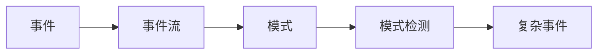
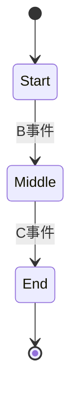

# Flink CEP原理与代码实例讲解

## 1.背景介绍
### 1.1 复杂事件处理(CEP)概述
复杂事件处理(Complex Event Processing, CEP)是一种用于分析实时数据流并识别有意义的事件模式的技术。CEP能够从大量的事件数据中提取有价值的信息,帮助企业快速做出决策和响应。

### 1.2 Apache Flink简介
Apache Flink是一个开源的分布式流处理和批处理框架,具有低延迟、高吞吐、准确性和容错性等特点。Flink提供了DataStream API用于流处理,同时也支持了复杂事件处理(CEP)库。

### 1.3 Flink CEP的优势
Flink CEP库建立在Flink DataStream API之上,继承了Flink的诸多优点,例如:
- 低延迟、高吞吐的流式处理
- 事件时间(event time)支持,处理乱序事件
- 状态管理,保证exactly-once语义
- 高可用性,支持checkpoint容错
- 基于SQL的分析功能(Flink SQL)

同时Flink CEP还提供了丰富的模式API,可以灵活地定义事件的匹配规则和处理逻辑,大大简化了复杂事件处理的实现。

## 2.核心概念与联系
### 2.1 事件(Event)
事件是CEP的基本组成单位,可以看作是一个包含时间戳的记录。事件通常携带时间信息(如事件发生的时间)和属性信息(如事件的类型、值等)。在Flink CEP中,事件可以是Flink DataStream中的元素。

### 2.2 事件流(Event Stream)
事件流是一系列连续的、时间有序的事件构成的数据流。在Flink CEP中,事件流通过Flink DataStream来表示。

### 2.3 模式(Pattern)
模式定义了我们感兴趣的一系列满足特定条件的事件,用于从事件流中提取和匹配有意义的事件序列。Flink CEP提供了Pattern API来声明事件的模式。

### 2.4 模式检测(Pattern Detection)
模式检测就是在输入的事件流上进行模式匹配,识别出符合定义模式的事件序列。Flink CEP在DataStream上应用定义好的Pattern,输出匹配到的复杂事件。

### 2.5 关系图
下图展示了Flink CEP的核心概念之间的关系:



从图中可以看出,定义的模式应用在输入的事件流上进行模式检测,产生输出的复杂事件。

## 3.核心算法原理具体操作步骤
Flink CEP的核心算法是NFA(非确定有限自动机),主要步骤如下:

### 3.1 定义事件模式
首先使用Pattern API定义感兴趣的事件模式,描述事件之间的关系、条件、时间约束等。例如:

```java
Pattern<Event, ?> pattern = Pattern.<Event>begin("start")
    .where(event -> event.getType().equals("A"))
    .next("middle")
    .where(event -> event.getType().equals("B"))
    .followedBy("end")
    .where(event -> event.getType().equals("C"));
```

该模式定义了"start"(A事件)、"middle"(B事件)和"end"(C事件)三个事件的先后顺序。

### 3.2 构建共享缓冲区
Flink CEP会为每个模式的每个状态创建一个共享缓冲区,用于存储潜在匹配的事件。

### 3.3 事件处理
对于流中的每个事件,Flink CEP会执行以下操作:

1. 根据事件的属性,将事件放入对应状态的缓冲区中
2. 检查缓冲区中的事件序列是否匹配定义的模式
3. 如果找到匹配,则将匹配的事件序列作为复杂事件输出
4. 根据策略(如超时时间)清理缓冲区中过期的事件

### 3.4 输出结果
通过`select`或`flatSelect`方法定义对匹配事件序列的处理逻辑,输出结果。

```java
PatternStream<Event> patternStream = CEP.pattern(eventStream, pattern);

OutputTag<String> outputTag = new OutputTag<String>("side-output"){};

SingleOutputStreamOperator<ComplexEvent> result = patternStream.flatSelect(
    outputTag,
    (pattern, collector) -> collector.collect(pattern.toString()),
    (pattern, collector) -> collector.collect(new ComplexEvent())
);
```

## 4.数学模型和公式详细讲解举例说明
Flink CEP的模式匹配可以用状态机模型来表示。每个状态对应模式中的一个事件条件,状态之间的转移对应事件的先后关系。

例如前面定义的模式可以表示为如下状态机:



形式化地,状态机可以表示为一个五元组 $M=(S,\Sigma,\delta,s_0,F)$:
- $S$ 是有限状态集合,每个状态对应一个事件条件
- $\Sigma$ 是有限字母表,这里对应事件的类型
- $\delta$ 是转移函数,$\delta: S \times \Sigma \to S$,定义了状态之间的转移关系
- $s_0$ 是初始状态,即模式的起始事件
- $F$ 是终止状态集合,表示模式匹配成功

对于一个事件序列 $w=\langle e_1,e_2,...,e_n \rangle$,如果存在状态序列 $\langle s_0,s_1,...,s_n \rangle$,满足:
$$
s_{i+1}=\delta(s_i, e_{i+1}), i=0,1,...,n-1
$$
且 $s_n \in F$,则称事件序列 $w$ 匹配了该模式。

## 5.项目实践：代码实例和详细解释说明
下面通过一个实际的代码示例来说明如何使用Flink CEP进行模式匹配。

### 5.1 定义事件类
首先定义事件类`Event`,包含事件的类型和时间戳:

```java
public class Event {
    private String type;
    private long timestamp;

    public Event(String type, long timestamp) {
        this.type = type;
        this.timestamp = timestamp;
    }
    // 省略getter和setter方法
}
```

### 5.2 创建输入流
创建一个Flink DataStream作为输入事件流:

```java
StreamExecutionEnvironment env = StreamExecutionEnvironment.getExecutionEnvironment();
DataStream<Event> eventStream = env.fromElements(
    new Event("A", 1000L),
    new Event("B", 2000L),
    new Event("C", 3000L),
    new Event("B", 4000L),
    new Event("A", 5000L),
    new Event("C", 6000L)
);
```

### 5.3 定义事件模式
使用Pattern API定义事件模式:

```java
Pattern<Event, ?> pattern = Pattern.<Event>begin("start")
    .where(event -> event.getType().equals("A"))
    .next("middle")
    .where(event -> event.getType().equals("B"))
    .followedBy("end")
    .where(event -> event.getType().equals("C"));
```

该模式表示:先匹配一个类型为A的事件,然后严格紧邻一个B事件,最后再匹配一个C事件。

### 5.4 应用模式
将定义好的模式应用到输入事件流上:

```java
PatternStream<Event> patternStream = CEP.pattern(eventStream, pattern);
```

### 5.5 处理匹配结果
定义`select`或`flatSelect`方法来处理匹配到的事件序列:

```java
OutputTag<String> outputTag = new OutputTag<String>("side-output"){};

SingleOutputStreamOperator<String> result = patternStream.flatSelect(
    outputTag,
    (pattern, collector) -> collector.collect(pattern.toString()),
    (pattern, collector) -> {
        StringBuilder builder = new StringBuilder();
        builder.append("匹配到事件序列: ");
        for (Map.Entry<String, List<Event>> entry : pattern.entrySet()) {
            builder.append("[").append(entry.getKey()).append(": ");
            builder.append(entry.getValue()).append("] ");
        }
        collector.collect(builder.toString());
    }
);

result.getSideOutput(outputTag).print();
result.print();
```

这里使用`flatSelect`同时定义了侧输出流和主输出流。侧输出流输出匹配的模式,主输出流输出匹配到的详细事件序列。

### 5.6 运行程序
最后执行env.execute()运行Flink程序:

```java
env.execute();
```

运行结果如下:

```
匹配到事件序列: [start: [Event{type='A', timestamp=1000}]] [middle: [Event{type='B', timestamp=2000}]] [end: [Event{type='C', timestamp=3000}]]
匹配到事件序列: [start: [Event{type='A', timestamp=5000}]] [middle: [Event{type='B', timestamp=4000}]] [end: [Event{type='C', timestamp=6000}]]
```

可以看到,Flink CEP成功地识别出了输入流中两个匹配"A->B->C"模式的事件序列。

## 6.实际应用场景
Flink CEP可以应用于多个领域,用于实时地检测事件流中有意义的模式和趋势。一些典型的应用场景包括:

### 6.1 实时欺诈检测
在金融领域,Flink CEP可以用于检测信用卡的欺诈交易。例如,定义多个阶段的模式(如多次小额交易、大额境外交易等),识别出可疑的交易序列,实时预警。

### 6.2 设备故障预测
在工业场景,Flink CEP可以分析设备的日志和指标数据,定义故障的前兆模式(如异常的参数变化趋势),提前发现设备的异常,进行预测性维护。

### 6.3 用户行为分析
在电商和广告领域,Flink CEP可以用于分析用户的行为序列(如浏览、搜索、下单等),挖掘用户的行为模式,进行个性化推荐和营销。

### 6.4 物联网事件监控
在物联网场景,Flink CEP可以实时处理海量传感器数据,定义异常的事件模式(如温度骤升、湿度骤降等),实现智能报警和预警。

## 7.工具和资源推荐
- [Flink官网](https://flink.apache.org/): Flink官方网站,提供了全面的文档和教程。
- [Flink CEP文档](https://ci.apache.org/projects/flink/flink-docs-release-1.12/dev/libs/cep.html): Flink CEP的官方文档,详细介绍了CEP的API和原理。
- [Flink CEP Patterns](https://flink.apache.org/2020/07/28/flink-cep-1.11-release-announcement.html): Flink CEP 1.11版本的新特性介绍,包括模式的量化、组合等高级功能。
- [Flink SQL CEP](https://flink-packages.org/packages/cep-io-flink-sql-cep): 一个基于Flink SQL的CEP库,允许使用SQL来定义事件模式。
- [Apache Beam](https://beam.apache.org/): 另一个支持CEP的流处理框架,与Flink CEP的API类似。

## 8.总结：未来发展趋势与挑战
Flink CEP使得在Flink上进行复杂事件处理变得简单和高效,在事件驱动的流处理领域有广阔的应用前景。未来Flink CEP的发展趋势和面临的挑战包括:

- 支持更丰富、更灵活的模式定义,如模式的嵌套、组合、否定等
- 提高CEP的性能和可扩展性,支持更大规模的事件吞吐和状态存储
- 加强CEP与机器学习的结合,实现智能化的模式挖掘和预测
- 简化CEP的使用,提供更多的高层API(如SQL)和可视化工具
- 扩展CEP的应用领域,在更多行业中探索CEP的业务价值

总之,Flink CEP是流处理领域一个强大的工具,其发展离不开社区的共同努力和创新。

## 9.附录：常见问题与解答
### Q1: Flink CEP支持哪些类型的模式?
Flink CEP提供了以下常见的模式类型:
- 单例模式(Individual Patterns): 匹配单个事件,如`start.where()`
- 连续性模式(Contiguity Patterns): 匹配连续的事件,如`start.next()`
- 非确定性松散连续模式(Non-Deterministic Relaxed Contiguity Patterns): 忽略匹配过程中的不匹配事件,如`start.followedBy()`
-