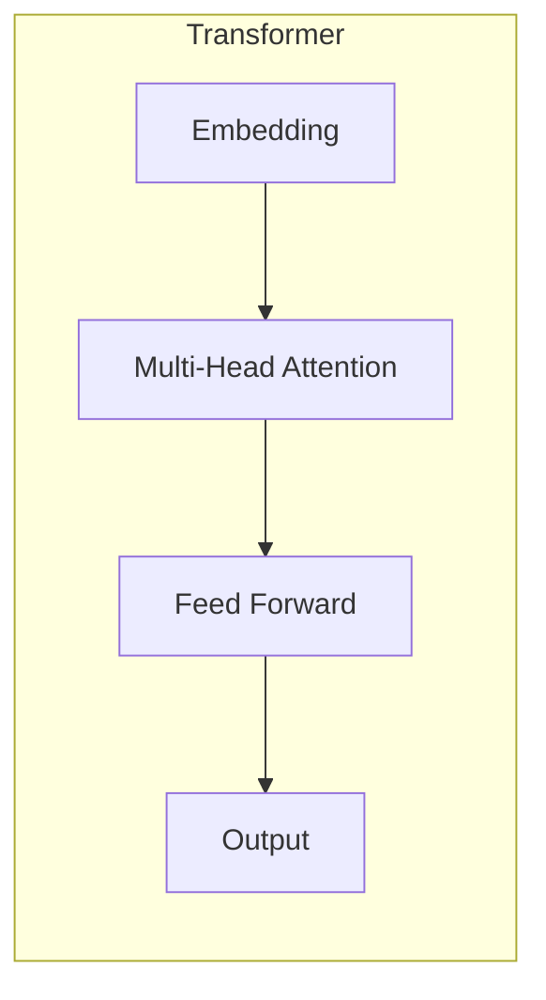
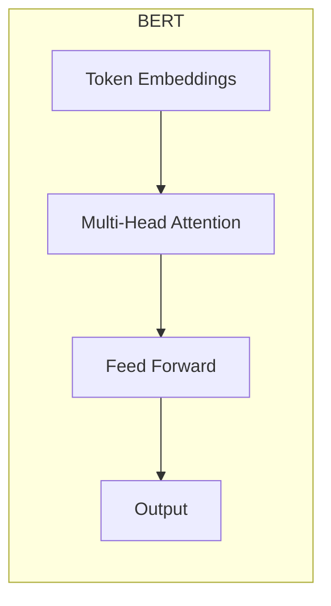

# Transformer大模型实战 了解BERT模型

## 1.背景介绍

### 1.1 自然语言处理的重要性

在当今的数字时代,自然语言处理(NLP)已经成为一个非常重要的研究领域。它涉及计算机理解、操纵和生成人类语言的能力,广泛应用于机器翻译、语音识别、问答系统、文本分类和情感分析等领域。随着人工智能技术的快速发展,NLP也取得了长足的进步,其中BERT模型就是一个里程碑式的突破。

### 1.2 NLP发展历程

早期的NLP系统主要基于规则和统计方法,效果有限。2010年后,深度学习技术在NLP领域大放异彩,特别是词向量和神经网络模型的应用,极大提高了NLP的性能。2017年,Transformer模型应运而生,它完全基于注意力机制,摆脱了RNN的局限,在机器翻译等任务中表现出色。2018年,BERT模型作为Transformer在预训练语言模型方面的杰出代表,取得了革命性的成就。

### 1.3 BERT模型的重要意义

BERT(Bidirectional Encoder Representations from Transformers)是一种基于Transformer的双向编码器表示,能够更好地理解语言的上下文关系。它通过预训练的方式学习到了大量的语言知识,可以有效地应用到下游的NLP任务中,大幅提高了性能。BERT模型在多项NLP任务上打破了记录,成为NLP领域的新标杆,也推动了预训练语言模型的研究热潮。

## 2.核心概念与联系

### 2.1 Transformer模型

Transformer是一种全新的基于注意力机制的序列到序列模型,主要由编码器(Encoder)和解码器(Decoder)组成。它完全舍弃了RNN结构,使用多头自注意力机制来捕捉输入序列中任意两个位置之间的依赖关系,从而更好地建模长期依赖。



### 2.2 BERT模型架构

BERT的基本思想是通过预训练的方式学习一个通用的语言表示模型,然后将其应用于下游的NLP任务中进行微调(fine-tuning)。它的核心架构包括编码器和预训练任务:

1. **编码器**:采用Transformer的编码器结构,使用多头自注意力机制对输入进行编码。
2. **预训练任务**:包括掩码语言模型(Masked LM)和下一句预测(Next Sentence Prediction)两个无监督预训练任务。



### 2.3 BERT的创新点

BERT模型的创新之处主要体现在以下几个方面:

1. **双向编码**:与传统单向语言模型不同,BERT使用Transformer的编码器对上下文进行双向编码,从而更好地捕捉语义关系。
2. **深度双向表示**:BERT在预训练阶段就学习到了深度的上下文语义表示,为下游任务提供了强大的语义表示能力。
3. **无监督预训练**:BERT采用了掩码语言模型和下一句预测两个无监督预训练任务,有效利用了大规模的未标注语料。
4. **通用性**:预训练后的BERT模型可以通过简单的微调(fine-tuning)应用于多种下游NLP任务,展现出极强的通用性。

## 3.核心算法原理具体操作步骤

### 3.1 输入表示

BERT的输入由三部分组成:Token Embeddings、Segment Embeddings和Position Embeddings。

1. **Token Embeddings**:将输入的词元(token)转化为embedding向量表示。
2. **Segment Embeddings**:区分输入序列属于不同的句子,对于双句输入(如问答对)很有用。
3. **Position Embeddings**:编码每个token在序列中的位置信息。

上述三种embedding相加,构成BERT的最终输入表示。

### 3.2 Transformer编码器

BERT使用了标准的Transformer编码器结构,主要包括多头自注意力(Multi-Head Attention)和前馈神经网络(Feed Forward)两个子层。

1. **多头自注意力**:允许每个token通过注意力机制关注到其他token,捕捉输入序列的长程依赖关系。
2. **前馈神经网络**:对每个token的表示进行非线性变换,提供"编码"能力。

通过堆叠多个这样的编码器层,BERT可以学习到越来越抽象的语义表示。

### 3.3 预训练任务

BERT采用了两种无监督预训练任务:掩码语言模型(Masked LM)和下一句预测(Next Sentence Prediction)。

1. **掩码语言模型**:随机将输入序列中的一些token用`[MASK]`标记替换,然后让模型预测被掩码的token。这样可以学习到双向的语言表示。
2. **下一句预测**:判断两个句子是否为连续的句子,有助于学习句子之间的关系和表示。

通过在大规模语料上预训练这两个任务,BERT可以学习到通用的语言表示知识。

### 3.4 微调(Fine-tuning)

预训练完成后,BERT可以通过在特定NLP任务上进行微调(fine-tuning)来完成迁移学习。具体操作如下:

1. 将预训练好的BERT模型加载为初始模型。
2. 根据下游任务构建输入和标签数据。
3. 在特定任务的训练数据上微调BERT模型的所有参数。
4. 在验证集上评估模型性能,选择最优模型。

通过微调,BERT可以快速适应新的NLP任务,充分利用预训练获得的语言知识。

## 4.数学模型和公式详细讲解举例说明

### 4.1 注意力机制(Attention Mechanism)

注意力机制是Transformer和BERT模型的核心,它允许模型动态地关注输入序列中的不同部分,捕捉长程依赖关系。具体来说,对于一个查询向量$q$和一组键值对$(k_i, v_i)$,注意力机制的计算公式如下:

$$\mathrm{Attention}(Q, K, V) = \mathrm{softmax}\left(\frac{QK^T}{\sqrt{d_k}}\right)V$$

其中,$Q$、$K$、$V$分别表示查询(Query)、键(Key)和值(Value)的矩阵;$d_k$是缩放因子,用于防止内积过大导致梯度消失。

在多头自注意力(Multi-Head Attention)中,注意力机制会被并行执行$h$次,每次使用不同的线性投影,最后将结果拼接起来:

$$\mathrm{MultiHead}(Q, K, V) = \mathrm{Concat}(\mathrm{head}_1, \dots, \mathrm{head}_h)W^O$$
$$\mathrm{head}_i = \mathrm{Attention}(QW_i^Q, KW_i^K, VW_i^V)$$

其中,$W_i^Q$、$W_i^K$、$W_i^V$和$W^O$是可学习的线性投影参数。

通过注意力机制,BERT能够自动关注输入序列中对当前token有影响的部分,从而建模长程依赖关系。

### 4.2 掩码语言模型(Masked Language Model)

BERT的掩码语言模型任务是这样定义的:给定一个输入序列$\boldsymbol{x} = (x_1, x_2, \dots, x_n)$,我们随机将其中的一些token替换为特殊标记`[MASK]`,得到掩码序列$\boldsymbol{\hat{x}}$。模型的目标是基于上下文,预测被掩码的token的原始值。

具体来说,对于每个被掩码的位置$i$,我们需要最大化如下条件概率:

$$\log P(x_i | \boldsymbol{\hat{x}}) = \boldsymbol{e}_i^\top \boldsymbol{h}_i + b_{x_i}$$

其中,$\boldsymbol{h}_i$是BERT编码器在位置$i$的输出向量表示;$\boldsymbol{e}_i$和$b_{x_i}$是对应于token $x_i$的embedding向量和偏置项。

通过最小化掩码语言模型的负对数似然损失函数,BERT可以学习到双向的语言表示,捕捉上下文的语义信息。

## 5.项目实践:代码实例和详细解释说明

在这一部分,我们将使用Python和Hugging Face的Transformers库,演示如何使用预训练的BERT模型进行文本分类任务。

### 5.1 导入必要的库

```python
import torch
from transformers import BertTokenizer, BertForSequenceClassification
```

### 5.2 加载预训练模型和分词器

```python
model_name = "bert-base-uncased"
tokenizer = BertTokenizer.from_pretrained(model_name)
model = BertForSequenceClassification.from_pretrained(model_name)
```

我们加载了`bert-base-uncased`预训练模型,它是BERT的基础版本,不区分大小写。`BertTokenizer`用于将文本转换为BERT可以处理的token序列,`BertForSequenceClassification`是一个已经微调过的BERT模型,可以用于文本分类任务。

### 5.3 文本预处理

```python
text = "This is a great movie!"
inputs = tokenizer(text, return_tensors="pt")
```

我们使用`tokenizer`将文本转换为BERT可以处理的输入,包括token ids、attention mask和token type ids等。`return_tensors="pt"`表示返回PyTorch张量格式。

### 5.4 模型预测

```python
outputs = model(**inputs)
logits = outputs.logits
```

我们将预处理后的输入传递给BERT模型,获得输出的logits(未经过softmax的原始分数)。

### 5.5 结果解析

```python
predicted_class = logits.argmax().item()
print(f"Predicted class: {model.config.id2label[predicted_class]}")
```

我们取logits中分数最高的那一项,就是模型预测的类别。`model.config.id2label`是一个映射字典,可以将数字标签转换为实际的类别名称。

通过上述代码,我们演示了如何使用预训练的BERT模型进行文本分类任务。当然,在实际应用中,你还需要对模型进行微调,以获得更好的性能。

## 6.实际应用场景

BERT模型凭借其强大的语言表示能力,在多个NLP任务中取得了卓越的表现,广泛应用于以下场景:

1. **文本分类**:可用于情感分析、新闻分类、垃圾邮件检测等任务。
2. **问答系统**:通过微调,BERT可以学习回答基于文本的问题。
3. **机器翻译**:BERT可以作为编码器,与Transformer解码器结合,构建高质量的机器翻译系统。
4. **自然语言推理**:判断一个假设是否可以从前提中推导出来。
5. **文本生成**:通过特殊的微调,BERT也可以用于文本生成任务。
6. **信息抽取**:从非结构化文本中提取关键信息,如命名实体识别、关系抽取等。

除了上述应用场景,BERT模型还被广泛用于其他NLP相关领域,如对话系统、知识图谱构建等,展现出了巨大的潜力和价值。

## 7.工具和资源推荐

如果你想进一步学习和使用BERT模型,以下是一些有用的工具和资源:

1. **Hugging Face Transformers**:提供了BERT和其他Transformer模型的预训练权重,以及用于微调和部署的代码库。
2. **Google AI BERT**:BERT模型的官方代码库,由Google AI团队维护。
3. **BERT资源清单**:一个收集了BERT相关论文、代码、数据集和教程的列表。
4. **Stanford CS224N**:斯坦福大学的自然语言处理公开课,包含BERT模型的讲解和实践。
5. **BERT相关书籍**:如《Natural Language Processing with Transformers》等,深入探讨BERT模型的原理和应用。

利用这些资源,你可以更好地理解BERT模型,掌握相关的编程技能,并将其应用于实际的NLP任务中。

## 8.总结:未来发展趋势与挑战

BERT模型的出现,标志着NLP领域进入了一个新的里程碑。它展现了预训练语言模型的强大