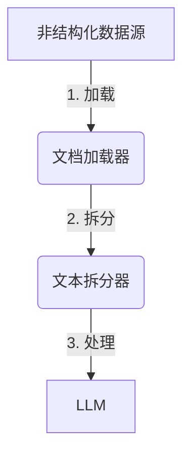

# 【LangChain编程：从入门到实践】文档预处理过程

## 1. 背景介绍

### 1.1. 什么是LangChain?

LangChain是一个用于构建应用程序的框架,旨在与大型语言模型(LLM)进行交互。它提供了一种标准化和模块化的方式来组合LLM、数据源和其他组件,从而构建复杂的应用程序。LangChain的核心思想是将LLM视为一种新型计算内核,并为开发人员提供了一种标准化的方式来利用这种强大的计算能力。

### 1.2. 文档预处理的重要性

在与LLM进行交互时,通常需要将非结构化数据(如文本、PDF、网页等)转换为LLM可以理解和处理的格式。这个过程被称为文档预处理。有效的文档预处理对于获得高质量的LLM输出至关重要,因为它确保LLM可以访问和理解相关信息。

## 2. 核心概念与联系

### 2.1. 文本拆分器(Text Splitter)

文本拆分器用于将较大的文本块分割成LLM可以处理的较小块。这是必要的,因为大多数LLM都有输入长度的限制。LangChain提供了多种文本拆分器,例如:

- `CharacterTextSplitter`: 基于字符数量进行拆分
- `TokenTextSplitter`: 基于标记数量进行拆分
- `NLTKTextSplitter`: 使用NLTK库进行语义拆分
- `RegexTextSplitter`: 使用正则表达式进行拆分

### 2.2. 文档加载器(Document Loaders)

文档加载器用于从各种来源(如文件、网页、数据库等)加载非结构化数据。LangChain提供了多种文档加载器,例如:

- `TextLoader`: 加载纯文本文件
- `PDFLoader`: 加载PDF文件
- `CSVLoader`: 加载CSV文件
- `WebLoader`: 加载网页内容

### 2.3. 文本拆分器与文档加载器的关系

文本拆分器和文档加载器密切相关。通常,我们首先使用文档加载器从数据源加载非结构化数据,然后使用文本拆分器将其拆分为LLM可以处理的较小块。



## 3. 核心算法原理具体操作步骤

LangChain中文档预处理的核心算法原理可以概括为以下步骤:

1. **加载数据**:使用适当的文档加载器从数据源(如文件、网页等)加载非结构化数据。

2. **数据清理**:对加载的数据进行必要的清理和预处理,如删除HTML标记、去除无关内容等。

3. **文本拆分**:使用文本拆分器将较大的文本块分割成LLM可以处理的较小块。拆分算法因拆分器类型而异,但通常基于字符数、标记数或语义边界进行拆分。

4. **创建文档**:将拆分后的文本块封装为文档对象,以便LLM可以处理和理解。

5. **向量化(可选)**:对文档进行向量化,以支持语义搜索和相似性比较。这通常使用向量数据库,如FAISS或Qdrant。

以下是一个使用`TextLoader`和`CharacterTextSplitter`进行文档预处理的示例:

```python
from langchain.document_loaders import TextLoader
from langchain.text_splitter import CharacterTextSplitter

# 1. 加载数据
loader = TextLoader('path/to/file.txt')
data = loader.load()

# 2. 文本拆分
text_splitter = CharacterTextSplitter(chunk_size=1000, chunk_overlap=200)
texts = text_splitter.split_documents(data)

# 3. 创建文档
docs = texts

# 4. 向量化(可选)
# ...
```

## 4. 数学模型和公式详细讲解举例说明

在文本拆分过程中,一个关键参数是`chunk_size`,它决定了每个文本块的最大长度。选择合适的`chunk_size`对于获得高质量的LLM输出至关重要。过大的`chunk_size`可能会导致LLM无法处理整个文本块,而过小的`chunk_size`可能会破坏文本的语义连贯性。

一种确定合适`chunk_size`的方法是基于LLM的最大输入长度。例如,如果LLM的最大输入长度为512个标记,我们可以将`chunk_size`设置为一个较小的值,例如300个字符,以确保每个文本块在经过标记化后不会超过LLM的限制。

我们可以使用以下公式来估计合适的`chunk_size`:

$$chunk\_size = \frac{max\_input\_length}{average\_tokens\_per\_character} \times safety\_factor$$

其中:

- $max\_input\_length$是LLM的最大输入长度(以标记为单位)
- $average\_tokens\_per\_character$是每个字符平均对应的标记数,通常在英文中约为0.3,中文中约为1.5
- $safety\_factor$是一个安全系数,通常取值在0.7到0.9之间,以确保文本块不会超过LLM的限制

例如,对于一个最大输入长度为512个标记的LLM,如果处理英文文本,我们可以计算:

$$chunk\_size = \frac{512}{0.3} \times 0.8 \approx 1365$$

因此,我们可以将`chunk_size`设置为1365个字符。

需要注意的是,这只是一个粗略的估计,实际情况可能会因文本内容和LLM的tokenizer而有所不同。因此,建议在实际应用中进行一些实验,以确定最佳的`chunk_size`值。

## 5. 项目实践:代码实例和详细解释说明

以下是一个使用LangChain进行文档预处理的完整示例,包括加载PDF文件、文本拆分和创建文档:

```python
from langchain.document_loaders import PyPDFLoader
from langchain.text_splitter import CharacterTextSplitter

# 加载PDF文件
loader = PyPDFLoader("path/to/file.pdf")
data = loader.load()

# 文本拆分
text_splitter = CharacterTextSplitter(chunk_size=1000, chunk_overlap=200)
texts = text_splitter.split_documents(data)

# 创建文档
docs = texts

# 打印文档
for doc in docs:
    print(doc.page_content)
```

让我们逐步解释这段代码:

1. **加载PDF文件**:我们使用`PyPDFLoader`从指定路径加载一个PDF文件。`loader.load()`方法返回一个`Document`对象列表,每个对象代表PDF中的一页内容。

2. **文本拆分**:我们创建一个`CharacterTextSplitter`实例,将`chunk_size`设置为1000个字符,`chunk_overlap`设置为200个字符。`chunk_overlap`确保相邻文本块之间有一些重叠,以保持语义连贯性。

   我们调用`split_documents`方法,将原始`Document`对象列表拆分为较小的文本块。该方法返回一个新的`Document`对象列表,每个对象代表一个文本块。

3. **创建文档**:我们将拆分后的`Document`对象列表赋值给`docs`变量,以便后续处理。

4. **打印文档**:最后,我们遍历`docs`列表,打印每个文档的`page_content`属性,即文本块的内容。

通过这个示例,您可以看到如何使用LangChain加载PDF文件、进行文本拆分,并准备好用于LLM处理的文档。您可以根据需要调整`chunk_size`和`chunk_overlap`的值,或使用其他文本拆分器和文档加载器。

## 6. 实际应用场景

文档预处理是许多基于LLM的应用程序的关键步骤,例如:

1. **问答系统**:通过预处理知识库中的文档,可以为LLM提供相关信息,从而生成准确的答案。

2. **文本摘要**:对长文本进行预处理和拆分,可以让LLM生成高质量的文本摘要。

3. **内容分析**:预处理各种来源的文本数据,可以让LLM进行情感分析、主题提取等任务。

4. **文档搜索**:通过预处理和向量化文档,可以构建基于语义的搜索引擎。

5. **自动写作辅助**:预处理相关资料,可以为LLM提供背景知识,从而生成更加连贯和信息丰富的文本。

总的来说,有效的文档预处理是利用LLM强大能力的关键,它为LLM提供了必要的信息和上下文,从而产生高质量的输出。

## 7. 工具和资源推荐

在LangChain中进行文档预处理时,以下工具和资源可能会有所帮助:

1. **LangChain文档**:LangChain的官方文档(https://python.langchain.com/en/latest/index.html)提供了详细的API参考和示例,是学习和使用LangChain的重要资源。

2. **Hugging Face Transformers**:LangChain与Hugging Face的Transformers库紧密集成,可以方便地使用各种预训练语言模型。Transformers库的文档(https://huggingface.co/docs/transformers/index)提供了丰富的信息。

3. **NLTK**:NLTK(Natural Language Toolkit)是一个用于处理人类语言数据的Python库,可用于文本预处理和拆分。NLTK的文档(https://www.nltk.org/)包含了丰富的资源和示例。

4. **向量数据库**:如果需要对文档进行向量化,可以考虑使用向量数据库,如FAISS或Qdrant。它们的官方文档和社区资源可以提供指导和支持。

5. **LangChain社区**:LangChain拥有一个活跃的社区,包括GitHub上的问题跟踪器、Discord服务器和各种在线论坛。在这些平台上,您可以寻求帮助、分享经验并了解最新动态。

利用这些工具和资源,您可以更好地掌握文档预处理的技能,并为您的LangChain项目做好准备。

## 8. 总结:未来发展趋势与挑战

文档预处理是LangChain和基于LLM的应用程序的关键组成部分。随着LLM技术的不断发展,文档预处理也面临着新的机遇和挑战:

1. **更智能的文本拆分**:未来的文本拆分算法可能会更加智能,能够根据语义和上下文信息进行拆分,而不仅仅依赖字符数或标记数。这将有助于保持文本块的语义连贯性,从而提高LLM输出的质量。

2. **多模态预处理**:除了文本数据,未来的预处理可能需要处理图像、视频和其他多模态数据,以支持更广泛的应用场景。这将需要新的预处理技术和工具。

3. **实时预处理**:在某些情况下,可能需要实时预处理数据流,例如在对话系统中。这对预处理算法的效率和低延迟提出了新的挑战。

4. **隐私和安全性**:随着越来越多的敏感数据被用于LLM应用程序,确保预处理过程中数据的隐私和安全性将变得至关重要。可能需要引入新的加密和匿名化技术。

5. **可解释性和可靠性**:提高预处理过程的可解释性和可靠性,将有助于构建更加透明和可信赖的LLM应用程序。这可能需要新的可视化和解释技术。

总的来说,文档预处理将继续是LangChain和基于LLM的应用程序的关键组成部分。通过持续的创新和改进,我们可以期待预处理技术在未来能够更好地支持LLM的强大能力,并推动更广泛的应用场景。

## 9. 附录:常见问题与解答

1. **为什么需要文档预处理?**
   文档预处理是将非结构化数据转换为LLM可以理解和处理的格式的必要步骤。它确保LLM可以访问和理解相关信息,从而产生高质量的输出。

2. **如何选择合适的文本拆分器?**
   选择合适的文本拆分器取决于您的具体需求和数据特征。如果您的数据具有明确的语义边界(如段落或标题),则可以考虑使用基于语义的拆分器,如`NLTKTextSplitter`。如果您的数据没有明确的语义结构,则可以使用