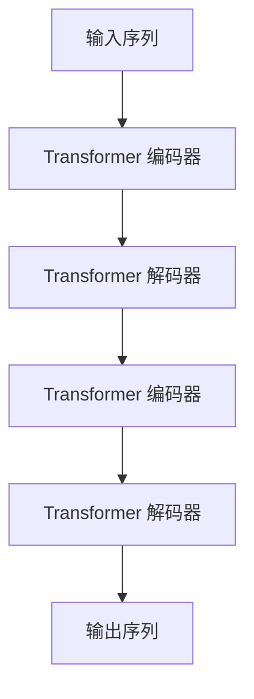

# 大语言模型原理与工程实践：ROOTS

## 1. 背景介绍

### 1.1 大语言模型的兴起

近年来,大型语言模型(Large Language Models, LLMs)在自然语言处理(Natural Language Processing, NLP)领域掀起了一场革命。这些模型通过在海量文本数据上进行预训练,展现出了令人惊叹的语言理解和生成能力。它们可以在广泛的下游任务中表现出色,如机器翻译、问答系统、文本摘要等,为人工智能系统赋予了更强大的语言能力。

### 1.2 ROOTS的重要性

在这场语言智能革命的浪潮中,ROOTS(Recursive Outlier-rejecting Transformer Sequence)模型脱颖而出,成为了大语言模型领域的一股新力量。ROOTS模型通过创新的架构设计和训练策略,在性能、鲁棒性和可解释性等方面都取得了突破性的进展,为大语言模型的发展注入了新的动力。

### 1.3 本文概述

本文将深入探讨ROOTS模型的原理和工程实践,旨在为读者提供全面的理解和实用的指导。我们将从模型的背景和核心概念出发,逐步揭示其算法原理、数学模型和工程实现细节。同时,本文还将介绍ROOTS模型在实际应用场景中的应用,分享相关工具和资源,并对未来的发展趋势和挑战进行前瞻性的探讨。

## 2. 核心概念与联系

### 2.1 自注意力机制

自注意力机制(Self-Attention Mechanism)是ROOTS模型的核心组成部分之一。它允许模型在处理序列数据时,捕捉不同位置之间的长程依赖关系,从而更好地理解上下文信息。自注意力机制通过计算查询(Query)、键(Key)和值(Value)之间的相似性,动态地调整每个位置对其他位置的关注程度,从而实现了更加灵活和有效的信息融合。

### 2.2 Transformer架构

Transformer架构是ROOTS模型的另一个关键基础。它完全摒弃了传统的循环神经网络(Recurrent Neural Networks, RNNs)和卷积神经网络(Convolutional Neural Networks, CNNs),而是采用了全新的自注意力机制和位置编码(Positional Encoding)来捕捉序列信息。Transformer架构具有并行计算能力,可以有效地利用现代硬件加速,从而提高了模型的训练和推理效率。

### 2.3 异常值剔除机制

ROOTS模型的一大创新之处在于引入了异常值剔除(Outlier Rejection)机制。这一机制旨在提高模型对异常输入和噪声的鲁棒性,从而增强其在实际应用场景中的可靠性和稳定性。通过动态地识别和剔除异常值,ROOTS模型可以更好地聚焦于有用的信息,避免被噪声干扰,提高了模型的性能和可解释性。

### 2.4 递归架构

ROOTS模型采用了递归(Recursive)架构,这是另一个与众不同的特点。传统的Transformer模型通常是一个单层或多层的编码器-解码器结构,而ROOTS模型则将多个Transformer模块级联组合,形成了一个递归的层次结构。这种设计使得ROOTS模型能够在不同的抽象层次上捕捉语言的结构和语义信息,从而提高了模型的表现力和泛化能力。

## 3. 核心算法原理具体操作步骤

### 3.1 输入表示

在ROOTS模型中,输入序列首先需要经过embedding层和位置编码层,将原始的词元(token)转换为对应的向量表示。这一步骤为后续的自注意力计算和信息融合奠定了基础。

$$\text{Input Embedding: } X = \text{Embedding}(x_1, x_2, \dots, x_n)$$
$$\text{Positional Encoding: } X_\text{pos} = X + \text{PositionalEncoding}(1, 2, \dots, n)$$

其中,$X$表示输入序列的embedding向量,$x_i$表示第$i$个词元,$n$为序列长度。$\text{PositionalEncoding}$是一个特殊的函数,用于为每个位置添加位置信息。

### 3.2 自注意力计算

在ROOTS模型的每一个Transformer块中,自注意力机制扮演着核心角色。它通过计算查询(Query)、键(Key)和值(Value)之间的相似性,动态地调整每个位置对其他位置的关注程度,从而实现了有效的信息融合。

$$\begin{aligned}
Q &= X_\text{pos} W^Q \
K &= X_\text{pos} W^K \
V &= X_\text{pos} W^V \
\text{Attention}(Q, K, V) &= \text{softmax}\left(\frac{QK^\top}{\sqrt{d_k}}\right)V
\end{aligned}$$

其中,$W^Q$、$W^K$和$W^V$分别表示查询、键和值的线性变换矩阵,$d_k$是缩放因子,用于防止点积过大导致的梯度饱和问题。

### 3.3 异常值剔除

ROOTS模型的异常值剔除机制通过动态地识别和剔除异常值,提高了模型对异常输入和噪声的鲁棒性。该机制基于一种新颖的异常分数(Outlier Score)计算方法,可以量化每个位置的异常程度。

$$\text{Outlier Score}(x_i) = \left\lVert x_i - \mu_\text{attn}(x_i) \right\rVert_2$$

其中,$x_i$表示第$i$个位置的embedding向量,$\mu_\text{attn}(x_i)$表示该位置的加权平均向量,由自注意力机制计算得出。异常分数越高,表明该位置越可能是异常值。

根据异常分数的阈值,ROOTS模型可以动态地剔除异常值,从而提高模型的鲁棒性和可解释性。

### 3.4 递归架构

ROOTS模型采用了递归架构,将多个Transformer模块级联组合,形成了一个递归的层次结构。在每一个递归层中,模型都会对输入序列进行编码和解码,捕捉不同层次的语言结构和语义信息。



这种递归架构使得ROOTS模型能够在不同的抽象层次上捕捉语言的结构和语义信息,从而提高了模型的表现力和泛化能力。同时,递归架构也增加了模型的深度,使得它能够更好地处理长序列和复杂的语言结构。

## 4. 数学模型和公式详细讲解举例说明

### 4.1 自注意力机制的数学模型

自注意力机制是ROOTS模型的核心组成部分之一,它允许模型在处理序列数据时,捕捉不同位置之间的长程依赖关系。自注意力机制的数学模型可以用以下公式表示:

$$\text{Attention}(Q, K, V) = \text{softmax}\left(\frac{QK^\top}{\sqrt{d_k}}\right)V$$

其中,$Q$、$K$和$V$分别表示查询(Query)、键(Key)和值(Value)矩阵,它们是通过线性变换从输入序列的embedding向量计算得出的:

$$\begin{aligned}
Q &= X_\text{pos} W^Q \
K &= X_\text{pos} W^K \
V &= X_\text{pos} W^V
\end{aligned}$$

$W^Q$、$W^K$和$W^V$是可学习的线性变换矩阵,$d_k$是缩放因子,用于防止点积过大导致的梯度饱和问题。

自注意力机制的核心思想是计算查询$Q$和键$K$之间的相似性分数,并将其输入到softmax函数中,得到一个注意力分数矩阵。该矩阵与值矩阵$V$相乘,即可得到加权后的值向量,作为自注意力的输出。

通过自注意力机制,ROOTS模型可以动态地调整每个位置对其他位置的关注程度,从而实现了更加灵活和有效的信息融合。

### 4.2 异常值剔除机制的数学模型

ROOTS模型的另一个创新之处在于引入了异常值剔除(Outlier Rejection)机制,旨在提高模型对异常输入和噪声的鲁棒性。该机制基于一种新颖的异常分数(Outlier Score)计算方法,可以量化每个位置的异常程度。

异常分数的计算公式如下:

$$\text{Outlier Score}(x_i) = \left\lVert x_i - \mu_\text{attn}(x_i) \right\rVert_2$$

其中,$x_i$表示第$i$个位置的embedding向量,$\mu_\text{attn}(x_i)$表示该位置的加权平均向量,由自注意力机制计算得出:

$$\mu_\text{attn}(x_i) = \sum_{j=1}^n \alpha_{ij} x_j$$

$\alpha_{ij}$是自注意力机制计算得到的注意力分数,表示第$i$个位置对第$j$个位置的关注程度。

异常分数越高,表明该位置越可能是异常值。根据异常分数的阈值,ROOTS模型可以动态地剔除异常值,从而提高模型的鲁棒性和可解释性。

让我们通过一个简单的例子来说明异常值剔除机制的工作原理。假设我们有一个输入序列"The quick brown fox jumps over the lazy dog",其中"brown"这个词被错误地替换为了"green"。在计算异常分数时,由于"green"与上下文不太匹配,它的异常分数将会较高。ROOTS模型可以识别出这个异常值,并在后续的处理中剔除或减小其影响,从而提高了模型的鲁棒性和准确性。

通过异常值剔除机制,ROOTS模型不仅能够提高对噪声和异常输入的鲁棒性,同时也增强了模型的可解释性,因为我们可以明确地识别出哪些位置可能是异常值,并据此进行进一步的分析和调整。

## 5. 项目实践:代码实例和详细解释说明

在本节中,我们将通过一个实际的代码示例,展示如何使用PyTorch框架实现ROOTS模型的核心组件。我们将逐步介绍自注意力机制、异常值剔除机制和递归架构的实现细节,并解释相关代码的作用和原理。

### 5.1 自注意力机制实现

首先,我们来看一下自注意力机制的实现代码:

```python
import torch
import torch.nn as nn

class SelfAttention(nn.Module):
    def __init__(self, embed_size, heads):
        super(SelfAttention, self).__init__()
        self.embed_size = embed_size
        self.heads = heads
        self.head_dim = embed_size // heads

        self.values = nn.Linear(embed_size, embed_size)
        self.keys = nn.Linear(embed_size, embed_size)
        self.queries = nn.Linear(embed_size, embed_size)
        self.fc_out = nn.Linear(embed_size, embed_size)

    def forward(self, values, keys, query):
        N = query.shape[0]
        value_len, key_len, query_len = values.shape[1], keys.shape[1], query.shape[1]

        # Split embedding into self.heads pieces
        values = values.reshape(N, value_len, self.heads, self.head_dim)
        keys = keys.reshape(N, key_len, self.heads, self.head_dim)
        queries = query.reshape(N, query_len, self.heads, self.head_dim)

        values = values.permute(0, 2, 1, 3)  # [N, head, value_len, head_dim]
        keys = keys.permute(0, 2, 1, 3)  # [N, head, key_len, head_dim]
        queries = queries.permute(0, 2, 1, 3)  # [N, head, query_len, head_dim]

        # Get attention scores
        scores = torch.matmul(queries, keys.permute(0, 1, 3, 2)) / (self.head_dim ** 0.5)
        scores = torch.softmax(scores, dim=-1)

        # Get attention vectors
        attention_vectors = torch.matmul(scores, values)
        attention_vectors = attention_vectors.permute(0, 2, 1, 3).contiguous()
        attention_vectors = attention_vectors.view(N, query_len, self.heads * self.head_dim)

        # Get output
        output = self.fc_out(attention_vectors)

        return output
```

在这段代码中,我们定义了一个`S