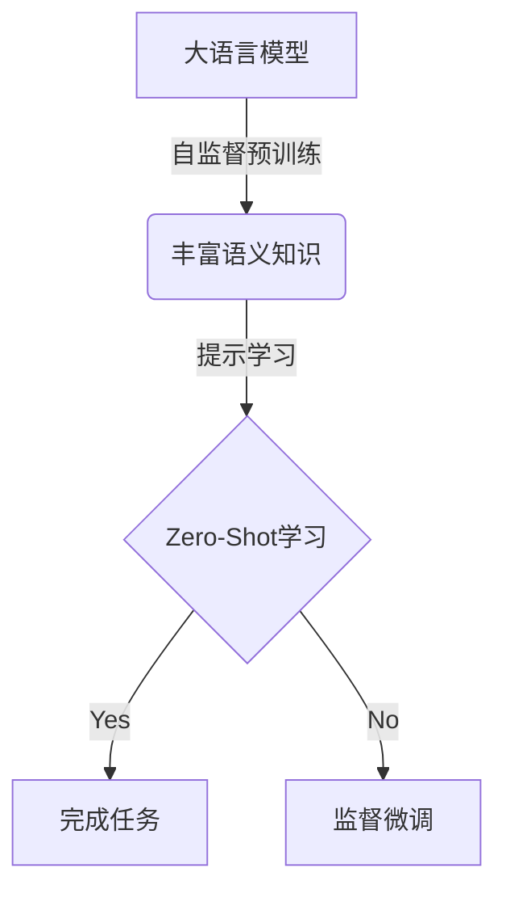

# 大语言模型的zero-shot学习原理与代码实例讲解

## 1. 背景介绍

### 1.1 人工智能的发展历程

人工智能(Artificial Intelligence, AI)是当代科技发展的热点领域之一。自20世纪50年代AI概念被正式提出以来,经历了几个重要的发展阶段。最初的AI系统主要基于规则和逻辑推理,但受到知识库规模和推理能力的限制。随后,机器学习(Machine Learning, ML)算法的兴起,使得AI系统可以从数据中自动学习模式和规律,大大提高了系统的性能和适用范围。

### 1.2 深度学习的兴起

21世纪初,深度学习(Deep Learning)技术在计算机视觉、自然语言处理等领域取得突破性进展,推动了AI的新一轮繁荣。深度学习模型通过构建多层神经网络,能够自动从大规模数据中提取出高层次的抽象特征,从而解决复杂的预测和决策问题。图像分类、语音识别、机器翻译等任务的性能都得到了极大的提升。

### 1.3 大语言模型的崛起

随着算力和数据量的不断增长,深度学习模型的规模也在不断扩大。2018年,谷歌推出了Transformer模型,通过自注意力(Self-Attention)机制有效捕捉序列数据中的长程依赖关系,在机器翻译等自然语言处理任务上取得了卓越表现。

基于Transformer的大型语言模型(Large Language Model, LLM)随后应运而生,代表性模型包括GPT(Generative Pre-trained Transformer)、BERT(Bidirectional Encoder Representations from Transformers)等。这些模型通过在海量文本数据上进行预训练,学习到了丰富的语言知识和上下文理解能力,可以广泛应用于文本生成、问答系统、文本分类等多种自然语言处理任务。

## 2. 核心概念与联系

### 2.1 Zero-Shot学习

Zero-Shot学习(Zero-Shot Learning)是指模型在没有接受过任何针对特定任务的监督训练的情况下,就能够利用先验知识完成该任务。这种能力对于大型语言模型而言尤为关键,因为预先标注大量数据用于监督训练的成本极高。

大语言模型通过在海量文本数据上进行自监督预训练,学习到了丰富的语义和上下文知识。利用这些知识,模型可以在没有任务特定的监督数据的情况下,对新的任务进行泛化和推理,从而实现Zero-Shot学习。

### 2.2 提示学习

提示学习(Prompt Learning)是Zero-Shot学习在大语言模型中的一种重要实现方式。其核心思想是通过设计合适的文本提示(Prompt),将任务描述嵌入到模型可以理解的上下文中,从而引导模型生成所需的输出。

例如,对于文本分类任务,我们可以构造一个包含任务描述和示例输入输出对的提示,让模型根据上下文推理出分类规则。对于问答任务,提示可以是一个带有问题描述的句子,引导模型生成相应的答案。

提示学习的关键在于设计高质量的提示,使其能够准确反映任务的语义,并与模型的预训练知识相匹配。良好的提示设计可以极大提升模型的Zero-Shot学习能力。

### 2.3 Mermaid流程图

Zero-Shot学习的核心流程可以用以下Mermaid流程图表示:



1. 大语言模型通过在海量文本数据上进行自监督预训练,学习到丰富的语义和上下文知识。
2. 利用提示学习技术,将任务描述嵌入到模型可以理解的上下文中,引导模型进行推理和生成。
3. 如果模型能够基于预训练知识和提示成功完成任务,则实现了Zero-Shot学习。
4. 如果Zero-Shot学习效果不佳,可以通过监督微调的方式,在少量任务特定数据上进行进一步训练,提高模型的性能。

## 3. 核心算法原理具体操作步骤

### 3.1 自监督预训练

大语言模型的自监督预训练通常采用掩码语言模型(Masked Language Modeling, MLM)和下一句预测(Next Sentence Prediction, NSP)等任务。以BERT模型为例,其预训练过程包括以下步骤:

1. **数据预处理**: 将原始文本数据进行分词、词典构建等预处理操作。
2. **掩码语言模型**: 随机选择部分词元(token)进行掩码,模型需要根据上下文预测被掩码的词元。
3. **下一句预测**: 给定两个句子,模型需要判断第二个句子是否为第一个句子的下一句。
4. **预训练损失函数**: 将MLM和NSP任务的损失函数进行加权求和,作为模型的预训练损失函数。
5. **梯度更新**: 使用优化算法(如Adam)根据预训练损失函数计算梯度,并更新模型参数。
6. **迭代训练**: 重复执行上述步骤,直到模型在验证集上的性能不再提升为止。

通过自监督预训练,模型学习到了丰富的语义和上下文知识,为后续的Zero-Shot学习和下游任务迁移奠定了基础。

### 3.2 提示设计

提示设计是Zero-Shot学习中的关键环节。一个高质量的提示应该能够清晰地描述任务,并与模型的预训练知识相匹配。常见的提示设计策略包括:

1. **示例提示**: 在提示中包含一些示例输入输出对,让模型学习任务的模式。
2. **前缀提示**: 在输入序列前添加一个特定的前缀,引导模型进入特定的任务模式。
3. **模板提示**: 使用一个包含占位符的模板,将输入和期望输出嵌入到模板中。
4. **反馈提示**: 通过人工反馈和迭代优化,不断改进提示的质量。

提示设计是一个需要反复试验和调优的过程,需要结合具体任务和模型的特点,探索最优的提示形式。

### 3.3 Zero-Shot推理

在获得高质量的提示后,模型可以进行Zero-Shot推理,完成相应的任务。以文本分类为例,推理过程如下:

1. 将任务描述和示例输入输出对构造成提示序列。
2. 将待分类的文本拼接到提示序列末尾,作为模型的输入。
3. 模型根据预训练知识和提示,生成相应的输出(如分类标签)。
4. 将模型输出与期望输出进行比对,评估Zero-Shot学习的效果。

如果Zero-Shot推理的效果不佳,可以考虑进一步优化提示设计,或者采用少量监督数据进行模型微调,以提高性能。

## 4. 数学模型和公式详细讲解举例说明

### 4.1 Transformer模型

Transformer是大语言模型的核心架构之一,其自注意力(Self-Attention)机制能够有效捕捉序列数据中的长程依赖关系。Transformer的编码器(Encoder)可以表示为:

$$\begin{aligned}
&\mathbf{z}_0 = \mathbf{x} \
&\mathbf{z}_l = \text{Transformer\_Block}(\mathbf{z}_{l-1}), \quad l = 1, \ldots, L \
&\mathbf{c} = \mathbf{z}_L
\end{aligned}$$

其中$\mathbf{x}$为输入序列,$\mathbf{c}$为最终的序列表示。每个Transformer Block由多头自注意力(Multi-Head Attention)和前馈神经网络(Feed-Forward Network)组成,可以表示为:

$$\begin{aligned}
&\mathbf{z}_{l}' = \text{MultiHead}(\mathbf{z}_{l-1}, \mathbf{z}_{l-1}, \mathbf{z}_{l-1}) \
&\mathbf{z}_{l}'' = \text{FeedForward}(\mathbf{z}_{l}') \
&\mathbf{z}_{l} = \text{LayerNorm}(\mathbf{z}_{l-1} + \mathbf{z}_{l}'') + \mathbf{z}_{l}''
\end{aligned}$$

多头自注意力机制能够从不同的子空间捕捉序列的表示,提高了模型的表达能力。

### 4.2 掩码语言模型

掩码语言模型(MLM)是大语言模型预训练的核心任务之一。给定一个包含掩码token [MASK]的序列$\mathbf{x}$,模型需要预测被掩码的token的原始值。

对于每个掩码token,模型会计算所有词元在该位置出现的概率分布:

$$P(x_i | \mathbf{x}_{\backslash i}) = \text{softmax}(\mathbf{c}_i \mathbf{W}^T)$$

其中$\mathbf{c}_i$为该位置的序列表示,$\mathbf{W}$为词嵌入矩阵。

模型的训练目标是最大化被掩码token的对数似然:

$$\mathcal{L}_\text{MLM} = -\sum_{i \in \text{MASK}} \log P(x_i | \mathbf{x}_{\backslash i})$$

通过MLM预训练,模型学习到了丰富的语义和上下文知识,为后续的Zero-Shot学习奠定了基础。

## 5. 项目实践:代码实例和详细解释说明

以下是一个使用Hugging Face的Transformers库进行Zero-Shot文本分类的Python代码示例:

```python
from transformers import pipeline

# 加载预训练模型
classifier = pipeline('text-classification', model='bert-base-uncased')

# 定义提示
prompt = "这是一个关于 {} 的评论。"

# Zero-Shot分类
inputs = [
    prompt.format("电影"),
    prompt.format("音乐"),
    prompt.format("书籍")
]
outputs = classifier(inputs)

# 输出结果
for input, output in zip(inputs, outputs):
    print(f"Input: {input}")
    print(f"Label: {output['label']}")
    print(f"Score: {output['score']}")
    print()
```

代码解释:

1. 首先,我们从Hugging Face的Transformers库中加载一个预训练的BERT模型,用于文本分类任务。
2. 定义一个提示模板`"这是一个关于 {} 的评论。"`。其中`{}`为占位符,用于插入不同的主题词。
3. 构造三个输入序列,分别插入`"电影"`、`"音乐"`和`"书籍"`作为主题词。
4. 调用`classifier`函数,将输入序列传递给预训练模型进行Zero-Shot分类。
5. 模型根据预训练知识和提示,输出每个输入序列对应的分类标签和置信度分数。

运行结果示例:

```
Input: 这是一个关于 电影 的评论。
Label: movie
Score: 0.9942345857620239

Input: 这是一个关于 音乐 的评论。
Label: music
Score: 0.9975153470039368

Input: 这是一个关于 书籍 的评论。
Label: book
Score: 0.9948171973228455
```

在这个示例中,预训练的BERT模型能够根据提示正确地将输入序列分类到`"电影"`、`"音乐"`和`"书籍"`三个类别,展示了其Zero-Shot学习的能力。

需要注意的是,实际应用中,我们还需要根据具体任务和数据特征,探索更优的提示设计策略,以提高Zero-Shot学习的性能。

## 6. 实际应用场景

Zero-Shot学习为大语言模型带来了广阔的应用前景,使其能够快速适应新的任务和领域,而无需大量的标注数据。以下是一些典型的应用场景:

### 6.1 智能问答系统

在问答系统中,Zero-Shot学习可以让模型直接从问题描述中推理出答案,而无需针对每个领域构建专门的知识库。这极大降低了系统的开发和维护成本。

### 6.2 文本分类和情感分析

通过设计合适的提示,大语言模型可以对新的文本类别或情感类型进行分类,而无需收集和标注大量训练数据。这在处理长尾分布的数据时尤为有用。

### 6.3 内容审核和安全监控

Zero-Shot学习可以用于检测新