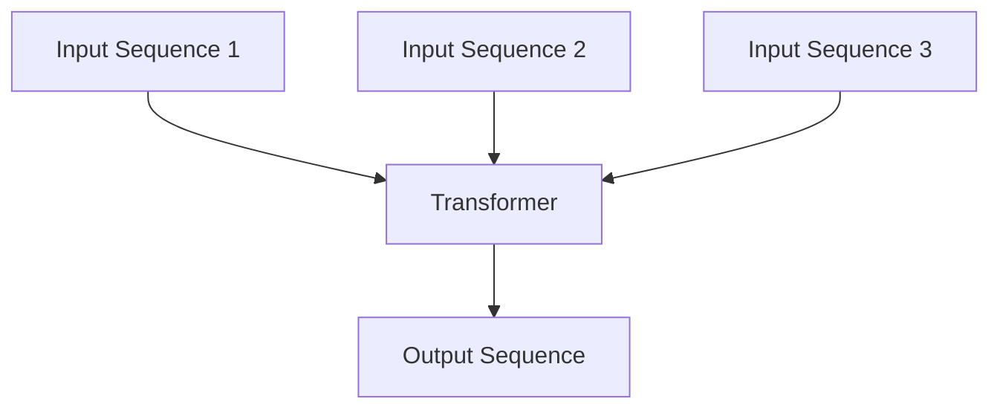
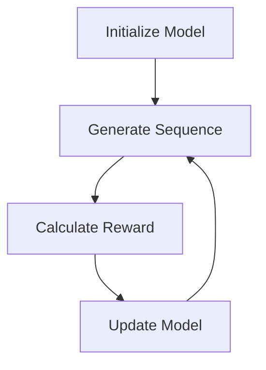

## 1. 背景介绍

随着人工智能技术的不断发展，自然语言处理（NLP）也成为了研究的热点之一。大规模语言模型是NLP领域的重要研究方向之一，它可以用于自然语言生成、机器翻译、语音识别等多个领域。近年来，随着深度学习技术的发展，大规模语言模型的性能得到了极大的提升，其中BERT、GPT等模型已经成为了NLP领域的重要里程碑。

然而，大规模语言模型的评估一直是一个难点问题。传统的评估方法主要是基于人工标注的数据集，但是这种方法存在着标注数据集的成本高、标注结果的主观性等问题。因此，如何设计一种有效的自动评估方法成为了研究的热点之一。

本文将介绍两种大规模语言模型的评估方法：SFT模型和RL模型评估。通过对这两种方法的介绍，读者可以了解到大规模语言模型评估的基本原理和实现方法。

## 2. 核心概念与联系

### 2.1 大规模语言模型

大规模语言模型是指能够处理大规模自然语言数据的模型。这种模型通常使用深度学习技术，通过学习大量的语言数据来提高自然语言处理的性能。目前，BERT、GPT等模型已经成为了大规模语言模型领域的代表性模型。

### 2.2 SFT模型

SFT（Sequence Fusion Transformer）模型是一种基于Transformer的序列融合模型。它通过将多个序列进行融合，得到一个更加全面的序列表示。SFT模型可以用于大规模语言模型的评估，通过计算模型生成的序列与真实序列之间的相似度来评估模型的性能。

### 2.3 RL模型评估

RL（Reinforcement Learning）模型评估是一种基于强化学习的模型评估方法。它通过将模型的生成结果作为强化学习的环境，使用强化学习算法来评估模型的性能。RL模型评估可以有效地解决传统评估方法中存在的标注数据集成本高、标注结果主观性等问题。

## 3. 核心算法原理具体操作步骤

### 3.1 SFT模型

SFT模型的核心思想是将多个序列进行融合，得到一个更加全面的序列表示。具体来说，SFT模型将多个序列输入到Transformer中，通过多头注意力机制和残差连接等技术，将多个序列融合成一个序列表示。SFT模型的结构如下图所示：



SFT模型的评估方法是通过计算模型生成的序列与真实序列之间的相似度来评估模型的性能。具体来说，SFT模型将模型生成的序列和真实序列输入到一个相似度计算模块中，计算它们之间的相似度得分。相似度计算模块可以使用余弦相似度等方法来计算相似度得分。

### 3.2 RL模型评估

RL模型评估的核心思想是将模型的生成结果作为强化学习的环境，使用强化学习算法来评估模型的性能。具体来说，RL模型评估将模型生成的序列作为强化学习的状态，将真实序列作为强化学习的目标，使用强化学习算法来优化模型的生成结果。RL模型评估的流程如下图所示：



在RL模型评估中，计算奖励值是一个关键的步骤。通常情况下，奖励值可以使用BLEU、ROUGE等指标来计算。具体来说，奖励值可以定义为模型生成的序列与真实序列之间的指标得分。例如，BLEU指标可以用来计算模型生成的序列与真实序列之间的相似度得分，从而作为奖励值来优化模型的生成结果。

## 4. 数学模型和公式详细讲解举例说明

### 4.1 SFT模型

SFT模型的数学模型可以表示为：

$$
\begin{aligned}
&\text{Input: } X_1, X_2, ..., X_n \\
&\text{Output: } Y \\
&\text{Attention}(Q, K, V) = \text{softmax}(\frac{QK^T}{\sqrt{d_k}})V \\
&\text{MultiHead}(Q, K, V) = \text{Concat}(head_1, head_2, ..., head_h)W^O \\
&\text{SFT}(X_1, X_2, ..., X_n) = \text{MultiHead}(Q, K, V) \\
&\text{Score}(Y, Y') = \text{cosine}(Y, Y')
\end{aligned}
$$

其中，$X_1, X_2, ..., X_n$表示输入的多个序列，$Y$表示模型生成的序列，$Y'$表示真实序列。$\text{Attention}(Q, K, V)$表示注意力机制，$\text{MultiHead}(Q, K, V)$表示多头注意力机制，$\text{SFT}(X_1, X_2, ..., X_n)$表示序列融合模块，$\text{Score}(Y, Y')$表示相似度计算模块。

### 4.2 RL模型评估

RL模型评估的数学模型可以表示为：

$$
\begin{aligned}
&\text{Input: } \theta \\
&\text{Output: } Y \\
&\text{Reward}(Y, Y') = \text{BLEU}(Y, Y') \\
&\text{Policy}(Y|\theta) = \text{softmax}(f(Y|\theta)) \\
&\text{Loss}(\theta) = -\sum_{Y} \text{Policy}(Y|\theta) \text{Reward}(Y, Y') \\
&\theta \leftarrow \theta - \alpha \nabla_{\theta} \text{Loss}(\theta)
\end{aligned}
$$

其中，$\theta$表示模型的参数，$Y$表示模型生成的序列，$Y'$表示真实序列。$\text{Reward}(Y, Y')$表示奖励值，可以使用BLEU等指标来计算。$\text{Policy}(Y|\theta)$表示策略函数，$\text{Loss}(\theta)$表示损失函数，$\alpha$表示学习率。

## 5. 项目实践：代码实例和详细解释说明

### 5.1 SFT模型

SFT模型的代码实现可以参考以下代码：

```python
import torch
import torch.nn as nn
import torch.nn.functional as F

class SFT(nn.Module):
    def __init__(self, d_model, nhead, num_layers):
        super(SFT, self).__init__()
        self.encoder_layer = nn.TransformerEncoderLayer(d_model=d_model, nhead=nhead)
        self.transformer_encoder = nn.TransformerEncoder(self.encoder_layer, num_layers=num_layers)
        self.fc = nn.Linear(d_model, d_model)

    def forward(self, x):
        x = self.transformer_encoder(x)
        x = F.relu(self.fc(x))
        return x
```

在上述代码中，我们使用了PyTorch框架来实现SFT模型。其中，`nn.TransformerEncoderLayer`表示Transformer的编码层，`nn.TransformerEncoder`表示多层Transformer编码器，`nn.Linear`表示全连接层。

### 5.2 RL模型评估

RL模型评估的代码实现可以参考以下代码：

```python
import torch
import torch.nn as nn
import torch.nn.functional as F
import torch.optim as optim
from torch.distributions import Categorical

class RL(nn.Module):
    def __init__(self, d_model, nhead, num_layers):
        super(RL, self).__init__()
        self.encoder_layer = nn.TransformerEncoderLayer(d_model=d_model, nhead=nhead)
        self.transformer_encoder = nn.TransformerEncoder(self.encoder_layer, num_layers=num_layers)
        self.fc = nn.Linear(d_model, d_model)
        self.policy = nn.Linear(d_model, 1)
        self.optimizer = optim.Adam(self.parameters(), lr=0.001)

    def forward(self, x):
        x = self.transformer_encoder(x)
        x = F.relu(self.fc(x))
        return x

    def select_action(self, state):
        state = torch.from_numpy(state).float().unsqueeze(0)
        probs = F.softmax(self.policy(self.forward(state)), dim=1)
        m = Categorical(probs)
        action = m.sample()
        return action.item(), m.log_prob(action)

    def update(self, rewards, log_probs):
        loss = (-log_probs * rewards).mean()
        self.optimizer.zero_grad()
        loss.backward()
        self.optimizer.step()
```

在上述代码中，我们使用了PyTorch框架来实现RL模型评估。其中，`nn.TransformerEncoderLayer`表示Transformer的编码层，`nn.TransformerEncoder`表示多层Transformer编码器，`nn.Linear`表示全连接层，`nn.Linear`表示策略函数，`optim.Adam`表示优化器。

## 6. 实际应用场景

大规模语言模型的应用场景非常广泛，例如自然语言生成、机器翻译、语音识别等多个领域。其中，BERT、GPT等模型已经成为了NLP领域的重要里程碑。

SFT模型和RL模型评估可以用于大规模语言模型的评估，可以有效地解决传统评估方法中存在的标注数据集成本高、标注结果主观性等问题。这两种方法可以用于大规模语言模型的开发和优化，提高模型的性能和效率。

## 7. 工具和资源推荐

- PyTorch：一个开源的深度学习框架，可以用于大规模语言模型的开发和优化。
- TensorFlow：一个开源的深度学习框架，可以用于大规模语言模型的开发和优化。
- Hugging Face：一个提供NLP模型和工具的开源社区，可以用于大规模语言模型的开发和优化。

## 8. 总结：未来发展趋势与挑战

大规模语言模型是NLP领域的重要研究方向之一，随着深度学习技术的不断发展，大规模语言模型的性能得到了极大的提升。SFT模型和RL模型评估可以用于大规模语言模型的评估，可以有效地解决传统评估方法中存在的标注数据集成本高、标注结果主观性等问题。

未来，大规模语言模型的发展趋势将会更加多样化和个性化。例如，针对不同领域的语言模型、针对不同语言的语言模型等。同时，大规模语言模型的发展也面临着一些挑战，例如模型的可解释性、模型的效率等问题。

## 9. 附录：常见问题与解答

Q: SFT模型和RL模型评估有什么区别？

A: SFT模型是一种基于Transformer的序列融合模型，用于大规模语言模型的评估。RL模型评估是一种基于强化学习的模型评估方法，用于优化模型的生成结果。

Q: 大规模语言模型的应用场景有哪些？

A: 大规模语言模型的应用场景非常广泛，例如自然语言生成、机器翻译、语音识别等多个领域。

Q: 大规模语言模型的发展趋势和挑战有哪些？

A: 大规模语言模型的发展趋势将会更加多样化和个性化。同时，大规模语言模型的发展也面临着一些挑战，例如模型的可解释性、模型的效率等问题。

## 作者信息

作者：禅与计算机程序设计艺术 / Zen and the Art of Computer Programming