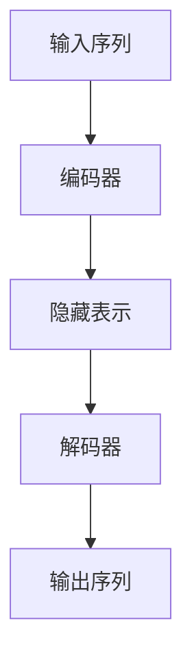

# 大规模语言模型从理论到实践 模型训练

## 1.背景介绍

大规模语言模型（Large Language Models, LLMs）近年来在自然语言处理（NLP）领域取得了显著的进展。诸如GPT-3、BERT等模型在各种任务中表现出色，从文本生成到机器翻译，再到情感分析和问答系统。这些模型的成功不仅依赖于其复杂的架构，还依赖于大规模的数据和计算资源。

### 1.1 语言模型的演变

语言模型的演变可以追溯到简单的n-gram模型，逐步发展到基于神经网络的模型，如RNN、LSTM和GRU。随着计算能力的提升和数据量的增加，Transformer架构的引入标志着一个新的时代。Transformer模型通过自注意力机制（Self-Attention）实现了更高效的并行计算和更长的依赖关系捕捉。

### 1.2 大规模语言模型的定义

大规模语言模型通常指参数量在数亿到数千亿之间的模型。这些模型通过在大规模文本数据上进行预训练，学习到丰富的语言表示，然后通过微调（Fine-tuning）在特定任务上进行优化。

### 1.3 训练大规模语言模型的挑战

训练大规模语言模型面临诸多挑战，包括计算资源的需求、数据处理的复杂性、模型的优化和调参等。此外，如何有效地利用预训练模型进行下游任务的微调也是一个重要的研究方向。

## 2.核心概念与联系

在深入探讨大规模语言模型的训练之前，我们需要理解一些核心概念和它们之间的联系。

### 2.1 预训练与微调

预训练（Pre-training）是指在大规模未标注数据上训练模型，使其学习到通用的语言表示。微调（Fine-tuning）则是在特定任务上进一步训练模型，使其适应特定的应用场景。

### 2.2 自注意力机制

自注意力机制是Transformer架构的核心，通过计算输入序列中每个位置的注意力权重，捕捉序列中不同位置之间的依赖关系。自注意力机制的计算复杂度为$O(n^2)$，其中$n$为序列长度。

### 2.3 Transformer架构

Transformer架构由编码器（Encoder）和解码器（Decoder）组成。编码器负责将输入序列转换为隐藏表示，解码器则根据隐藏表示生成输出序列。每个编码器和解码器层都包含多头自注意力机制和前馈神经网络。



### 2.4 损失函数与优化

损失函数用于衡量模型预测与真实标签之间的差距，常用的损失函数包括交叉熵损失（Cross-Entropy Loss）和均方误差（Mean Squared Error）。优化算法如Adam、SGD等用于最小化损失函数，从而优化模型参数。

## 3.核心算法原理具体操作步骤

训练大规模语言模型涉及多个步骤，从数据准备到模型训练，再到模型评估和部署。以下是具体的操作步骤。

### 3.1 数据准备

数据准备是训练大规模语言模型的第一步。需要收集大规模的文本数据，并进行清洗和预处理。常见的预处理步骤包括去除噪声、分词、去停用词等。

### 3.2 模型架构设计

选择合适的模型架构是训练大规模语言模型的关键。Transformer架构是目前最常用的选择。需要确定模型的层数、每层的隐藏单元数、注意力头数等超参数。

### 3.3 预训练

预训练阶段在大规模未标注数据上进行。常用的预训练任务包括语言模型任务（如GPT的自回归语言模型）和掩码语言模型任务（如BERT的掩码语言模型）。

### 3.4 微调

微调阶段在特定任务的标注数据上进行。通过微调，模型可以适应特定的应用场景，如文本分类、问答系统等。

### 3.5 模型评估

模型评估是训练过程中的重要环节。常用的评估指标包括准确率、精确率、召回率、F1分数等。需要在验证集和测试集上进行评估，以确保模型的泛化能力。

### 3.6 模型部署

模型训练完成后，需要将模型部署到生产环境中。常见的部署方式包括RESTful API、gRPC等。需要考虑模型的响应时间、吞吐量等性能指标。

## 4.数学模型和公式详细讲解举例说明

在这一部分，我们将详细讲解大规模语言模型的数学原理和公式，并通过具体例子进行说明。

### 4.1 自注意力机制的数学原理

自注意力机制通过计算输入序列中每个位置的注意力权重，捕捉序列中不同位置之间的依赖关系。具体来说，给定输入序列$X = [x_1, x_2, ..., x_n]$，自注意力机制的计算过程如下：

1. 计算查询（Query）、键（Key）和值（Value）矩阵：
   $$
   Q = XW_Q, \quad K = XW_K, \quad V = XW_V
   $$
   其中，$W_Q, W_K, W_V$是可训练的权重矩阵。

2. 计算注意力权重：
   $$
   \text{Attention}(Q, K, V) = \text{softmax}\left(\frac{QK^T}{\sqrt{d_k}}\right)V
   $$
   其中，$d_k$是键向量的维度。

### 4.2 Transformer编码器的数学原理

Transformer编码器由多层自注意力机制和前馈神经网络组成。每层的计算过程如下：

1. 自注意力机制：
   $$
   \text{Attention}(Q, K, V) = \text{softmax}\left(\frac{QK^T}{\sqrt{d_k}}\right)V
   $$

2. 前馈神经网络：
   $$
   \text{FFN}(x) = \text{ReLU}(xW_1 + b_1)W_2 + b_2
   $$
   其中，$W_1, W_2, b_1, b_2$是可训练的权重和偏置。

### 4.3 损失函数与优化

以交叉熵损失为例，给定预测概率分布$\hat{y}$和真实标签$y$，交叉熵损失的计算公式为：
$$
\text{Cross-Entropy Loss} = -\sum_{i=1}^n y_i \log(\hat{y}_i)
$$

优化算法如Adam的更新公式为：
$$
m_t = \beta_1 m_{t-1} + (1 - \beta_1) g_t
$$
$$
v_t = \beta_2 v_{t-1} + (1 - \beta_2) g_t^2
$$
$$
\hat{m}_t = \frac{m_t}{1 - \beta_1^t}
$$
$$
\hat{v}_t = \frac{v_t}{1 - \beta_2^t}
$$
$$
\theta_t = \theta_{t-1} - \alpha \frac{\hat{m}_t}{\sqrt{\hat{v}_t} + \epsilon}
$$
其中，$m_t$和$v_t$分别是梯度的一阶和二阶动量，$\alpha$是学习率，$\beta_1$和$\beta_2$是动量参数，$\epsilon$是一个小常数。

## 5.项目实践：代码实例和详细解释说明

在这一部分，我们将通过具体的代码实例，展示如何训练一个大规模语言模型。

### 5.1 数据准备

首先，我们需要准备训练数据。假设我们使用的是一个文本数据集，可以使用以下代码进行数据预处理：

```python
import re
import nltk
from nltk.corpus import stopwords

# 下载停用词表
nltk.download('stopwords')

# 加载数据
with open('data.txt', 'r') as file:
    data = file.read()

# 数据清洗
def clean_text(text):
    text = re.sub(r'\W', ' ', text)
    text = re.sub(r'\s+', ' ', text)
    text = text.lower()
    return text

cleaned_data = clean_text(data)

# 分词
tokens = nltk.word_tokenize(cleaned_data)

# 去停用词
filtered_tokens = [word for word in tokens if word not in stopwords.words('english')]

# 保存预处理后的数据
with open('cleaned_data.txt', 'w') as file:
    file.write(' '.join(filtered_tokens))
```

### 5.2 模型架构设计

接下来，我们设计一个基于Transformer的模型架构。以下是一个简单的Transformer编码器的实现：

```python
import torch
import torch.nn as nn
import torch.optim as optim

class TransformerEncoder(nn.Module):
    def __init__(self, input_dim, hidden_dim, num_heads, num_layers):
        super(TransformerEncoder, self).__init__()
        self.embedding = nn.Embedding(input_dim, hidden_dim)
        self.encoder_layers = nn.TransformerEncoderLayer(hidden_dim, num_heads)
        self.transformer_encoder = nn.TransformerEncoder(self.encoder_layers, num_layers)
        self.fc = nn.Linear(hidden_dim, input_dim)

    def forward(self, src):
        src = self.embedding(src)
        output = self.transformer_encoder(src)
        output = self.fc(output)
        return output

# 超参数设置
input_dim = 10000  # 词汇表大小
hidden_dim = 512
num_heads = 8
num_layers = 6

# 初始化模型
model = TransformerEncoder(input_dim, hidden_dim, num_heads, num_layers)
```

### 5.3 预训练

在预训练阶段，我们使用大规模未标注数据进行训练。以下是预训练的代码示例：

```python
# 加载预处理后的数据
with open('cleaned_data.txt', 'r') as file:
    data = file.read().split()

# 将数据转换为索引
word_to_idx = {word: idx for idx, word in enumerate(set(data))}
idx_to_word = {idx: word for word, idx in word_to_idx.items()}
data_idx = [word_to_idx[word] for word in data]

# 创建数据加载器
batch_size = 32
seq_length = 50

def create_batches(data, batch_size, seq_length):
    num_batches = len(data) // (batch_size * seq_length)
    data = data[:num_batches * batch_size * seq_length]
    data = torch.tensor(data).view(batch_size, -1)
    for i in range(0, data.size(1), seq_length):
        x = data[:, i:i+seq_length]
        y = data[:, (i+1):(i+1)+seq_length]
        yield x, y

# 定义损失函数和优化器
criterion = nn.CrossEntropyLoss()
optimizer = optim.Adam(model.parameters(), lr=0.001)

# 训练模型
num_epochs = 10

for epoch in range(num_epochs):
    for x, y in create_batches(data_idx, batch_size, seq_length):
        optimizer.zero_grad()
        output = model(x)
        loss = criterion(output.view(-1, input_dim), y.view(-1))
        loss.backward()
        optimizer.step()
    print(f'Epoch {epoch+1}, Loss: {loss.item()}')
```

### 5.4 微调

在微调阶段，我们使用特定任务的标注数据进行训练。以下是微调的代码示例：

```python
# 加载标注数据
with open('labeled_data.txt', 'r') as file:
    labeled_data = file.read().split()

# 将标注数据转换为索引
labeled_data_idx = [word_to_idx[word] for word in labeled_data]

# 创建数据加载器
def create_labeled_batches(data, batch_size, seq_length):
    num_batches = len(data) // (batch_size * seq_length)
    data = data[:num_batches * batch_size * seq_length]
    data = torch.tensor(data).view(batch_size, -1)
    for i in range(0, data.size(1), seq_length):
        x = data[:, i:i+seq_length]
        y = data[:, (i+1):(i+1)+seq_length]
        yield x, y

# 训练模型
for epoch in range(num_epochs):
    for x, y in create_labeled_batches(labeled_data_idx, batch_size, seq_length):
        optimizer.zero_grad()
        output = model(x)
        loss = criterion(output.view(-1, input_dim), y.view(-1))
        loss.backward()
        optimizer.step()
    print(f'Epoch {epoch+1}, Loss: {loss.item()}')
```

### 5.5 模型评估

在模型评估阶段，我们使用验证集和测试集进行评估。以下是评估的代码示例：

```python
# 加载验证数据
with open('validation_data.txt', 'r') as file:
    validation_data = file.read().split()

# 将验证数据转换为索引
validation_data_idx = [word_to_idx[word] for word in validation_data]

# 创建数据加载器
def create_validation_batches(data, batch_size, seq_length):
    num_batches = len(data) // (batch_size * seq_length)
    data = data[:num_batches * batch_size * seq_length]
    data = torch.tensor(data).view(batch_size, -1)
    for i in range(0, data.size(1), seq_length):
        x = data[:, i:i+seq_length]
        y = data[:, (i+1):(i+1)+seq_length]
        yield x, y

# 评估模型
model.eval()
total_loss = 0

with torch.no_grad():
    for x, y in create_validation_batches(validation_data_idx, batch_size, seq_length):
        output = model(x)
        loss = criterion(output.view(-1, input_dim), y.view(-1))
        total_loss += loss.item()

average_loss = total_loss / len(validation_data_idx)
print(f'Validation Loss: {average_loss}')
```

### 5.6 模型部署

在模型部署阶段，我们将训练好的模型部署到生产环境中。以下是一个简单的RESTful API部署示例：

```python
from flask import Flask, request, jsonify

app = Flask(__name__)

# 加载训练好的模型
model.load_state_dict(torch.load('model.pth'))
model.eval()

@app.route('/predict', methods=['POST'])
def predict():
    data = request.json['data']
    data_idx = [word_to_idx[word] for word in data.split()]
    data_tensor = torch.tensor(data_idx).unsqueeze(0)
    with torch.no_grad():
        output = model(data_tensor)
    predicted_idx = torch.argmax(output, dim=-1).squeeze().tolist()
    predicted_words = [idx_to_word[idx] for idx in predicted_idx]
    return jsonify({'prediction': ' '.join(predicted_words)})

if __name__ == '__main__':
    app.run(debug=True)
```

## 6.实际应用场景

大规模语言模型在多个实际应用场景中表现出色，以下是一些典型的应用场景。

### 6.1 文本生成

大规模语言模型可以用于生成高质量的文本内容，如新闻报道、小说、技术文档等。通过预训练和微调，模型可以生成符合特定风格和主题的文本。

### 6.2 机器翻译

大规模语言模型在机器翻译任务中表现出色。通过在大规模平行语料上进行预训练，模型可以学习到不同语言之间的映射关系，从而实现高质量的翻译。

### 6.3 问答系统

大规模语言模型可以用于构建智能问答系统。通过在问答数据集上进行微调，模型可以理解用户的问题并生成准确的答案。

### 6.4 情感分析

大规模语言模型可以用于情感分析任务。通过在情感标注数据上进行微调，模型可以识别文本中的情感倾向，如正面、负面或中性。

### 6.5 文本分类

大规模语言模型可以用于文本分类任务。通过在分类数据集上进行微调，模型可以将文本分类到不同的类别，如垃圾邮件检测、新闻分类等。

## 7.工具和资源推荐

在训练大规模语言模型的过程中，有许多工具和资源可以帮助我们提高效率和效果。以下是一些推荐的工具和资源。

### 7.1 编程语言和框架

- **Python**：Python是训练大规模语言模型的首选编程语言，拥有丰富的库和工具支持。
- **PyTorch**：PyTorch是一个流行的深度学习框架，提供了灵活的模型定义和训练接口。
- **TensorFlow**：TensorFlow是另一个流行的深度学习框架，适用于大规模分布式训练。

### 7.2 数据集

- **Common Crawl**：Common Crawl是一个大规模的网页抓取数据集，适用于预训练大规模语言模型。
- **Wikipedia**：Wikipedia是一个高质量的文本数据源，适用于预训练和微调。
- **OpenAI GPT-3 Dataset**：OpenAI提供了用于训练GPT-3的大规模数据集，适用于预训练。

### 7.3 计算资源

- **Google Colab**：Google Colab提供免费的GPU计算资源，适用于小规模实验和模型训练。
- **AWS EC2**：AWS EC2提供按需的计算资源，适用于大规模模型训练。
- **Azure ML**：Azure ML提供全面的机器学习服务，适用于大规模模型训练和部署。

### 7.4 预训练模型

- **Hugging Face Transformers**：Hugging Face提供了丰富的预