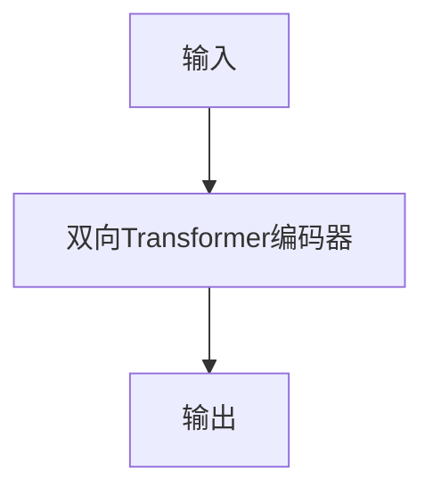
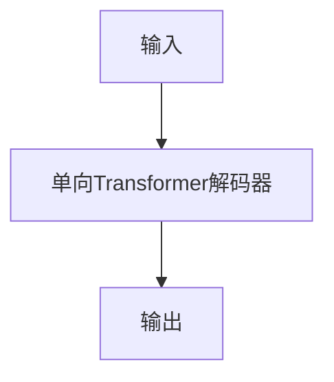

## 1. 背景介绍

自然语言处理（NLP）是人工智能领域的一个重要分支，它涉及到计算机对人类语言的理解和生成。在NLP中，语言模型是一个重要的概念，它是指计算机对语言的概率分布进行建模的一种方法。大语言模型是指能够处理大规模语料库的语言模型，它在自然语言处理中扮演着重要的角色。

在过去的几年中，随着深度学习技术的发展，大语言模型的性能得到了显著提升。其中最著名的是Google的BERT模型和OpenAI的GPT模型。这些模型的成功得益于数据的丰富和算法的创新，其中数据并行是一种重要的技术手段。

本文将介绍大语言模型的基础原理和前沿技术，重点介绍数据并行技术在大语言模型中的应用。

## 2. 核心概念与联系

### 2.1 语言模型

语言模型是指计算机对语言的概率分布进行建模的一种方法。它可以用来评估一个句子的合理性，并且可以用来生成新的句子。语言模型的核心思想是给定一个句子的前面的一些词，预测下一个词出现的概率。语言模型可以用来解决很多自然语言处理问题，例如机器翻译、语音识别、文本生成等。

### 2.2 大语言模型

大语言模型是指能够处理大规模语料库的语言模型。在过去的几年中，随着深度学习技术的发展，大语言模型的性能得到了显著提升。其中最著名的是Google的BERT模型和OpenAI的GPT模型。这些模型的成功得益于数据的丰富和算法的创新。

### 2.3 数据并行

数据并行是指将大规模数据分成多个小批次，分别在不同的计算设备上进行计算，最后将结果进行合并的一种并行计算方法。数据并行可以有效地利用多个计算设备的计算能力，加速计算过程。在深度学习中，数据并行是一种常用的加速方法。

## 3. 核心算法原理具体操作步骤

### 3.1 BERT模型

BERT（Bidirectional Encoder Representations from Transformers）是一种基于Transformer的双向编码器，由Google在2018年提出。BERT模型的核心思想是使用双向Transformer编码器来学习上下文相关的词向量表示。BERT模型的训练过程包括两个阶段：预训练和微调。预训练阶段使用大规模无标注的语料库进行训练，微调阶段使用有标注的数据进行微调。

BERT模型的输入是一个句子，输出是每个词的向量表示。BERT模型的结构如下图所示：



### 3.2 GPT模型

GPT（Generative Pre-trained Transformer）是一种基于Transformer的生成模型，由OpenAI在2018年提出。GPT模型的核心思想是使用单向Transformer解码器来生成文本。GPT模型的训练过程只有一个阶段，使用大规模有标注的语料库进行训练。

GPT模型的输入是一个前缀，输出是一个完整的句子。GPT模型的结构如下图所示：



### 3.3 数据并行

数据并行是一种常用的加速方法，可以有效地利用多个计算设备的计算能力。在大语言模型中，数据并行可以用来加速模型的训练和推理过程。数据并行的具体操作步骤如下：

1. 将大规模数据分成多个小批次。
2. 将每个小批次分配到不同的计算设备上。
3. 在每个计算设备上进行计算。
4. 将计算结果进行合并。

## 4. 数学模型和公式详细讲解举例说明

### 4.1 BERT模型

BERT模型的数学模型和公式如下：

$$
\begin{aligned}
\text{Attention}(Q,K,V) &= \text{softmax}(\frac{QK^T}{\sqrt{d_k}})V \\
\text{MultiHead}(Q,K,V) &= \text{Concat}(\text{head}_1,\dots,\text{head}_h)W^O \\
\text{head}_i &= \text{Attention}(QW_i^Q,KW_i^K,VW_i^V) \\
\text{BERT}(x) &= \text{Transformer}(x)
\end{aligned}
$$

其中，$Q,K,V$分别表示查询、键、值，$d_k$表示键的维度，$W_i^Q,W_i^K,W_i^V$分别表示第$i$个头的查询、键、值的权重矩阵，$W^O$表示输出的权重矩阵。

### 4.2 GPT模型

GPT模型的数学模型和公式如下：

$$
\begin{aligned}
\text{Attention}(Q,K,V) &= \text{softmax}(\frac{QK^T}{\sqrt{d_k}})V \\
\text{MultiHead}(Q,K,V) &= \text{Concat}(\text{head}_1,\dots,\text{head}_h)W^O \\
\text{head}_i &= \text{Attention}(QW_i^Q,KW_i^K,VW_i^V) \\
\text{GPT}(x) &= \text{Transformer}(x)
\end{aligned}
$$

其中，$Q,K,V$分别表示查询、键、值，$d_k$表示键的维度，$W_i^Q,W_i^K,W_i^V$分别表示第$i$个头的查询、键、值的权重矩阵，$W^O$表示输出的权重矩阵。

## 5. 项目实践：代码实例和详细解释说明

### 5.1 BERT模型

以下是使用PyTorch实现BERT模型的代码：

```python
import torch
import torch.nn as nn
from transformers import BertModel

class BertClassifier(nn.Module):
    def __init__(self, num_classes):
        super(BertClassifier, self).__init__()
        self.bert = BertModel.from_pretrained('bert-base-uncased')
        self.dropout = nn.Dropout(0.1)
        self.fc = nn.Linear(768, num_classes)

    def forward(self, input_ids, attention_mask):
        outputs = self.bert(input_ids=input_ids, attention_mask=attention_mask)
        pooled_output = outputs[1]
        pooled_output = self.dropout(pooled_output)
        logits = self.fc(pooled_output)
        return logits
```

以上代码定义了一个BertClassifier类，它继承自nn.Module类。在构造函数中，我们使用了预训练的BERT模型，并添加了一个dropout层和一个全连接层。在前向传播函数中，我们首先使用BERT模型对输入进行编码，然后使用全连接层对编码结果进行分类。

### 5.2 GPT模型

以下是使用PyTorch实现GPT模型的代码：

```python
import torch
import torch.nn as nn
from transformers import GPT2Model

class GptGenerator(nn.Module):
    def __init__(self):
        super(GptGenerator, self).__init__()
        self.gpt = GPT2Model.from_pretrained('gpt2')

    def forward(self, input_ids):
        outputs = self.gpt(input_ids=input_ids)
        logits = outputs[0]
        return logits
```

以上代码定义了一个GptGenerator类，它继承自nn.Module类。在构造函数中，我们使用了预训练的GPT模型。在前向传播函数中，我们使用GPT模型对输入进行解码，然后返回生成的文本。

## 6. 实际应用场景

大语言模型在自然语言处理中有着广泛的应用，例如：

- 机器翻译：使用大语言模型可以提高机器翻译的准确率和流畅度。
- 语音识别：使用大语言模型可以提高语音识别的准确率和鲁棒性。
- 文本生成：使用大语言模型可以生成高质量的文本，例如文章、对话等。
- 问答系统：使用大语言模型可以提高问答系统的准确率和覆盖率。

## 7. 工具和资源推荐

以下是一些常用的大语言模型工具和资源：

- PyTorch：一个常用的深度学习框架，支持大语言模型的训练和推理。
- TensorFlow：一个常用的深度学习框架，支持大语言模型的训练和推理。
- Hugging Face Transformers：一个常用的自然语言处理库，提供了许多预训练的大语言模型。
- GLUE：一个常用的自然语言理解评测基准，用于评估大语言模型的性能。
- SQuAD：一个常用的问答数据集，用于评估大语言模型的问答能力。

## 8. 总结：未来发展趋势与挑战

随着深度学习技术的不断发展，大语言模型在自然语言处理中的应用越来越广泛。未来，大语言模型将继续发挥重要作用，但也面临着一些挑战，例如：

- 训练数据的质量和规模：大语言模型需要大规模的高质量训练数据，但这些数据并不容易获取。
- 计算资源的需求：大语言模型需要大量的计算资源进行训练和推理，这对计算资源的要求很高。
- 模型的可解释性：大语言模型的内部结构非常复杂，很难解释模型的决策过程。

## 9. 附录：常见问题与解答

### 9.1 什么是语言模型？

语言模型是指计算机对语言的概率分布进行建模的一种方法。它可以用来评估一个句子的合理性，并且可以用来生成新的句子。

### 9.2 什么是大语言模型？

大语言模型是指能够处理大规模语料库的语言模型。在过去的几年中，随着深度学习技术的发展，大语言模型的性能得到了显著提升。

### 9.3 什么是数据并行？

数据并行是指将大规模数据分成多个小批次，分别在不同的计算设备上进行计算，最后将结果进行合并的一种并行计算方法。

### 9.4 BERT模型和GPT模型有什么区别？

BERT模型是一种双向编码器，用于学习上下文相关的词向量表示；GPT模型是一种单向解码器，用于生成文本。

### 9.5 大语言模型有哪些应用场景？

大语言模型在自然语言处理中有着广泛的应用，例如机器翻译、语音识别、文本生成、问答系统等。

### 9.6 如何评估大语言模型的性能？

常用的评估方法包括GLUE和SQuAD等自然语言理解评测基准，用于评估大语言模型的性能。

### 9.7 大语言模型面临哪些挑战？

大语言模型面临着训练数据的质量和规模、计算资源的需求、模型的可解释性等挑战。