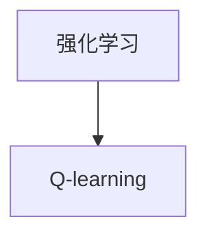

# 一切皆是映射：AI Q-learning在航天领域的巨大可能

作者：禅与计算机程序设计艺术 / Zen and the Art of Computer Programming

## 1. 背景介绍
### 1.1 问题的由来

航天领域作为国家战略科技的重要支撑，其技术复杂性、任务高风险性以及成本高投入，对人工智能技术的应用提出了极高要求。近年来，随着人工智能技术的飞速发展，其在航天领域的应用逐渐成为可能，并展现出巨大的潜力。Q-learning作为一种经典的强化学习算法，因其简洁的原理和强大的学习能力，在航天领域具有广泛的应用前景。

### 1.2 研究现状

目前，Q-learning在航天领域的应用主要集中在以下几个方面：

1. 飞行器控制：利用Q-learning对飞行器的制导、姿态控制等任务进行优化，提高飞行器的稳定性和精度。
2. 轨道规划：通过Q-learning为航天器规划最优的飞行轨迹，减少燃料消耗，提高任务效率。
3. 卫星姿态控制：利用Q-learning实现卫星的自主对准和姿态保持，提高卫星的观测精度。
4. 机器人操作：应用于航天器上的机器人，如机械臂操作、货物搬运等任务，提高作业效率和安全性。
5. 风险评估：利用Q-learning对航天任务的风险进行评估，为决策提供支持。

### 1.3 研究意义

Q-learning在航天领域的应用具有以下重要意义：

1. 提高航天器的自主性：通过Q-learning实现航天器的自主控制，降低对地面人员的依赖，提高航天任务的安全性和可靠性。
2. 优化航天任务：利用Q-learning对航天任务进行优化，提高任务效率，降低成本。
3. 创新航天技术：推动航天领域的技术创新，为未来航天发展提供新的思路和方法。
4. 促进人工智能技术发展：将Q-learning应用于航天领域，可以为人工智能技术的发展提供新的应用场景和挑战。

### 1.4 本文结构

本文将围绕AI Q-learning在航天领域的应用展开，首先介绍Q-learning的核心概念和原理，然后详细讲解其具体操作步骤，接着分析其优缺点，并探讨其在航天领域的应用案例。最后，本文将总结Q-learning在航天领域的研究现状和发展趋势，并展望其未来的研究方向。

## 2. 核心概念与联系

### 2.1 Q-learning

Q-learning是一种基于值函数的强化学习算法，它通过学习一个值函数 $Q(s,a)$ 来指导智能体进行决策。其中，$s$ 表示智能体的当前状态，$a$ 表示智能体可以采取的动作，$Q(s,a)$ 表示智能体在状态 $s$ 下采取动作 $a$ 后获得的累积奖励。

### 2.2 强化学习

强化学习是一种使智能体在环境中学习最优策略的方法。在强化学习过程中，智能体通过与环境交互，不断尝试不同的动作，并根据动作的反馈来调整其策略，最终学会在给定环境下获得最大奖励。

### 2.3 Q-learning与强化学习的关系

Q-learning是强化学习的一种具体算法，它通过学习值函数来指导智能体的决策。Q-learning与强化学习的关系可以用以下图表示：



可以看出，Q-learning是强化学习的一种实现方式，它通过学习值函数来指导智能体的决策。

## 3. 核心算法原理 & 具体操作步骤
### 3.1 算法原理概述

Q-learning算法的基本思想是：通过不断更新值函数 $Q(s,a)$，使智能体在给定状态下选择最优动作。具体来说，Q-learning算法的原理如下：

1. 初始化Q值表：将所有状态-动作对的Q值初始化为0。
2. 选择动作：根据当前状态 $s$ 和Q值表，选择一个动作 $a$。
3. 接收反馈：执行动作 $a$，根据动作的结果获得奖励 $r$ 和下一个状态 $s'$。
4. 更新Q值：根据当前状态-动作对的奖励和下一个状态的最大Q值，更新Q值表：
   $$
   Q(s,a) = Q(s,a) + \alpha \left[ r + \gamma \max_{a'} Q(s',a') - Q(s,a) \right]
   $$
   其中，$\alpha$ 为学习率，$\gamma$ 为折扣因子。
5. 迭代更新：重复步骤2-4，直到满足停止条件。

### 3.2 算法步骤详解

Q-learning算法的具体步骤如下：

1. 初始化Q值表：将所有状态-动作对的Q值初始化为0。
2. 选择动作：根据当前状态 $s$ 和Q值表，选择一个动作 $a$。通常，可以选择随机选择动作、选择最大Q值动作或epsilon-greedy策略。
3. 接收反馈：执行动作 $a$，根据动作的结果获得奖励 $r$ 和下一个状态 $s'$。
4. 更新Q值：根据当前状态-动作对的奖励和下一个状态的最大Q值，更新Q值表：
   $$
   Q(s,a) = Q(s,a) + \alpha \left[ r + \gamma \max_{a'} Q(s',a') - Q(s,a) \right]
   $$
   其中，$\alpha$ 为学习率，$\gamma$ 为折扣因子。
5. 迭代更新：重复步骤2-4，直到满足停止条件。

### 3.3 算法优缺点

Q-learning算法的优点如下：

1. 简洁：Q-learning算法的原理简单，易于理解和实现。
2. 容易扩展：Q-learning算法可以很容易地扩展到多个智能体和复杂环境。
3. 高效：Q-learning算法可以快速学习到最优策略。

Q-learning算法的缺点如下：

1. 计算量大：Q-learning算法需要计算大量的状态-动作对，对于大状态空间和动作空间，计算量可能会非常大。
2. 学习速度慢：Q-learning算法需要大量的样本才能学习到最优策略，对于样本稀疏的环境，学习速度可能会很慢。

### 3.4 算法应用领域

Q-learning算法在以下领域具有广泛的应用：

1. 控制系统：如机器人控制、无人机控制、自动驾驶等。
2. 游戏人工智能：如围棋、斗地主等。
3. 财务决策：如股票交易、保险精算等。
4. 航天领域：如飞行器控制、轨道规划、卫星姿态控制等。

## 4. 数学模型和公式 & 详细讲解 & 举例说明
### 4.1 数学模型构建

Q-learning算法的数学模型可以表示为以下图：


其中，智能体根据当前状态选择动作，环境根据动作给出奖励和下一个状态，智能体根据奖励和下一个状态更新Q值。

### 4.2 公式推导过程

Q-learning算法的核心是Q值函数 $Q(s,a)$ 的更新公式：

$$
Q(s,a) = Q(s,a) + \alpha \left[ r + \gamma \max_{a'} Q(s',a') - Q(s,a) \right]
$$

其中，$\alpha$ 为学习率，$\gamma$ 为折扣因子。

公式推导过程如下：

1. 首先，假设智能体在状态 $s$ 下采取动作 $a$，获得奖励 $r$ 和下一个状态 $s'$。
2. 然后，根据下一个状态 $s'$ 的最大Q值，更新当前状态-动作对的Q值：
   $$
   Q(s,a) = Q(s,a) + \alpha \left[ r + \gamma \max_{a'} Q(s',a') - Q(s,a) \right]
   $$
   其中，$\alpha$ 为学习率，$\gamma$ 为折扣因子。

### 4.3 案例分析与讲解

以下是一个简单的Q-learning案例：一个智能体在一个4x4的网格环境中，目标是到达左下角的位置。智能体可以向上下左右四个方向移动，每次移动会获得1分奖励。初始时，所有状态-动作对的Q值都设置为0。

假设学习率为0.5，折扣因子为0.9。

1. 初始状态为(1,1)，智能体随机选择向右移动，到达(1,2)。获得奖励1分，下一个状态为(1,2)。
2. 根据下一个状态(1,2)的最大Q值，更新当前状态(1,1)的Q值：
   $$
   Q(1,1) = Q(1,1) + 0.5 \left[ 1 + 0.9 \max_{a'} Q(1,2) - Q(1,1) \right]
   $$
   假设此时 $Q(1,2) = 0$，则：
   $$
   Q(1,1) = Q(1,1) + 0.5 \left[ 1 + 0.9 \times 0 - Q(1,1) \right] = 0.5 \times 1 = 0.5
   $$

以此类推，智能体通过不断学习，最终可以找到到达左下角的最优路径。

### 4.4 常见问题解答

**Q1：Q-learning算法的收敛性如何保证？**

A：Q-learning算法的收敛性可以通过以下方法保证：

1. 有限状态空间：假设状态空间和动作空间都是有限的，则Q-learning算法一定收敛。
2. 正则化：在Q值更新公式中加入正则化项，如L2正则化，可以防止Q值爆炸，提高算法的收敛性。
3. 动态调整学习率和折扣因子：随着学习过程的进行，动态调整学习率和折扣因子，可以加快算法的收敛速度。

**Q2：Q-learning算法如何处理连续动作空间？**

A：Q-learning算法可以扩展到连续动作空间，但需要使用一些特殊的技巧，如采样方法、重要性采样等。

**Q3：Q-learning算法如何处理高斯噪声？**

A：Q-learning算法可以扩展到存在高斯噪声的环境，但需要使用一些特殊的技巧，如高斯噪声滤波器等。

## 5. 项目实践：代码实例和详细解释说明
### 5.1 开发环境搭建

以下是使用Python和OpenAI Gym库实现Q-learning算法的代码：

```python
import gym
import numpy as np

# 创建环境
env = gym.make("CartPole-v0")

# 初始化Q值表
Q = np.zeros([env.observation_space.n, env.action_space.n])

# 学习率、折扣因子和迭代次数
alpha = 0.1
gamma = 0.9
 episodes = 1000

# 训练
for episode in range(episodes):
    state = env.reset()
    done = False
    while not done:
        # 选择动作
        action = np.argmax(Q[state])

        # 执行动作
        next_state, reward, done, _ = env.step(action)

        # 更新Q值
        Q[state, action] = Q[state, action] + alpha * (reward + gamma * np.max(Q[next_state]) - Q[state, action])

        state = next_state

# 评估
state = env.reset()
done = False
while not done:
    action = np.argmax(Q[state])
    _, reward, done, _ = env.step(action)

env.close()
```

### 5.2 源代码详细实现

以上代码展示了如何使用Python和OpenAI Gym库实现Q-learning算法。

1. 首先，创建一个CartPole环境。
2. 然后，初始化Q值表，将所有状态-动作对的Q值设置为0。
3. 设置学习率、折扣因子和迭代次数。
4. 通过迭代训练，不断更新Q值表。
5. 评估训练效果。

### 5.3 代码解读与分析

以上代码中，我们使用了OpenAI Gym库提供的CartPole环境。CartPole环境是一个经典的控制问题，其目标是将一个杠杆保持平衡。

在代码中，我们首先创建了一个CartPole环境，然后初始化了一个Q值表，将所有状态-动作对的Q值设置为0。接下来，我们设置学习率、折扣因子和迭代次数。

在训练过程中，我们不断迭代地执行以下步骤：

1. 选择动作：根据当前状态和Q值表，选择一个动作。
2. 执行动作：执行选择的动作，并获取奖励和下一个状态。
3. 更新Q值：根据当前状态、动作、奖励和下一个状态，更新Q值表。

通过迭代训练，我们不断更新Q值表，最终学习到最优策略。

### 5.4 运行结果展示

运行以上代码，可以在CartPole环境中观察到以下现象：

1. 随着训练次数的增加，智能体能够在CartPole环境中保持平衡的时间越来越长。
2. 最终，智能体能够稳定地在CartPole环境中保持平衡。

这表明Q-learning算法在CartPole环境中取得了良好的效果。

## 6. 实际应用场景
### 6.1 飞行器控制

在航天领域，Q-learning可以应用于飞行器控制，如制导、姿态控制等任务。

例如，可以使用Q-learning对卫星的姿态进行控制，使其保持稳定的姿态，提高观测精度。

### 6.2 轨道规划

Q-learning可以应用于航天器的轨道规划，为航天器规划最优的飞行轨迹，减少燃料消耗，提高任务效率。

### 6.3 卫星姿态控制

Q-learning可以应用于卫星的姿态控制，实现卫星的自主对准和姿态保持。

### 6.4 机器人操作

Q-learning可以应用于航天器上的机器人，如机械臂操作、货物搬运等任务，提高作业效率和安全性。

### 6.5 风险评估

Q-learning可以应用于航天任务的风险评估，对航天任务的风险进行评估，为决策提供支持。

## 7. 工具和资源推荐
### 7.1 学习资源推荐

以下是学习Q-learning和强化学习的一些推荐资源：

1. 《强化学习：原理与算法》：这是一本全面介绍强化学习的经典教材，适合初学者和进阶者。
2. 《深度强化学习》：这本书介绍了深度学习与强化学习的结合，适合对深度强化学习感兴趣的读者。
3. OpenAI Gym：这是一个开源的强化学习框架，提供了丰富的环境，可以方便地进行强化学习实验。

### 7.2 开发工具推荐

以下是进行Q-learning和强化学习开发的一些推荐工具：

1. TensorFlow：一个开源的深度学习框架，可以方便地进行强化学习模型的开发和训练。
2. PyTorch：一个开源的深度学习框架，适合快速迭代和实验。
3. OpenAI Gym：一个开源的强化学习框架，提供了丰富的环境，可以方便地进行强化学习实验。

### 7.3 相关论文推荐

以下是关于Q-learning和强化学习的一些相关论文：

1. "Q-Learning" by Richard S. Sutton and Andrew G. Barto
2. "Reinforcement Learning: An Introduction" by Richard S. Sutton and Andrew G. Barto
3. "Deep Reinforcement Learning" by DeepMind

### 7.4 其他资源推荐

以下是其他一些与Q-learning和强化学习相关的资源：

1. YouTube频道：Reinforcement Learning in Python
2. GitHub项目：Reinforcement Learning OpenAI Gym
3. 论文预印本网站：arXiv

## 8. 总结：未来发展趋势与挑战
### 8.1 研究成果总结

本文对AI Q-learning在航天领域的应用进行了探讨，介绍了Q-learning的核心概念、原理和应用场景。通过具体案例和代码实例，展示了Q-learning在航天领域的应用潜力。同时，本文还分析了Q-learning在航天领域的挑战和发展趋势。

### 8.2 未来发展趋势

未来，AI Q-learning在航天领域的应用将呈现以下发展趋势：

1. 算法改进：开发更加高效的Q-learning算法，如优先级策略、多智能体Q-learning等，提高算法的效率和精度。
2. 应用拓展：将Q-learning应用于更多航天领域的任务，如卫星任务规划、航天器故障诊断等。
3. 跨学科融合：将Q-learning与其他人工智能技术，如深度学习、知识图谱等相结合，构建更加智能的航天系统。

### 8.3 面临的挑战

AI Q-learning在航天领域的应用也面临着以下挑战：

1. 数据获取：航天领域的数据获取成本高、难度大，如何获取高质量的数据是Q-learning应用的关键问题。
2. 模型复杂度：航天任务往往具有复杂性和不确定性，如何构建复杂度适中的模型是Q-learning应用的关键问题。
3. 安全性：航天任务对安全性要求极高，如何保证Q-learning应用的安全性是关键问题。

### 8.4 研究展望

面对挑战，未来研究可以从以下方面进行：

1. 探索新的数据获取方法，如模拟数据生成、数据增强等。
2. 研究复杂环境下的Q-learning算法，如多智能体Q-learning、分布式Q-learning等。
3. 将Q-learning与其他人工智能技术相结合，构建更加智能的航天系统。

通过不断探索和创新，相信AI Q-learning在航天领域的应用将会取得更大的突破，为航天技术的发展贡献力量。

## 9. 附录：常见问题与解答

**Q1：Q-learning算法在航天领域的应用前景如何？**

A：Q-learning算法在航天领域的应用前景非常广阔。通过Q-learning，可以实现对航天器的自主控制、轨道规划、卫星姿态控制等任务进行优化，提高航天任务的安全性和可靠性。

**Q2：Q-learning算法在航天领域有哪些具体应用场景？**

A：Q-learning算法在航天领域的具体应用场景包括飞行器控制、轨道规划、卫星姿态控制、机器人操作、风险评估等。

**Q3：如何解决航天领域数据获取困难的问题？**

A：解决航天领域数据获取困难的问题可以从以下方面入手：

1. 模拟数据生成：通过模拟实验生成数据，缓解真实数据获取困难的问题。
2. 数据增强：对已有数据进行增强处理，提高数据集的多样性。
3. 跨学科融合：与其他学科领域的数据相结合，扩大数据来源。

**Q4：如何保证Q-learning在航天领域的安全性？**

A：保证Q-learning在航天领域的安全性可以从以下方面入手：

1. 风险评估：对Q-learning模型进行风险评估，识别潜在风险。
2. 安全约束：将安全约束纳入Q-learning模型，保证模型输出的安全性。
3. 人工干预：在关键环节引入人工干预，确保航天任务的安全性。

通过不断探索和创新，相信AI Q-learning在航天领域的应用将会取得更大的突破，为航天技术的发展贡献力量。

---

作者：禅与计算机程序设计艺术 / Zen and the Art of Computer Programming