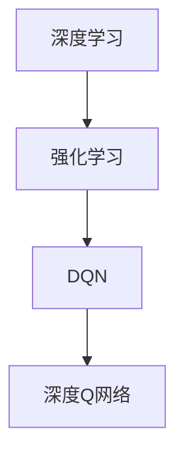

# 一切皆是映射：DQN的并行化处理：加速学习与实施

作者：禅与计算机程序设计艺术 / Zen and the Art of Computer Programming

## 1. 背景介绍

### 1.1 问题的由来

深度强化学习（Deep Reinforcement Learning，DRL）作为一种新兴的人工智能技术，在游戏、机器人、自动驾驶等领域展现出巨大的潜力。DQN（Deep Q-Network）作为一种经典的DRL算法，由于其简单的结构和强大的性能，被广泛应用于各种强化学习任务中。

然而，DQN算法在训练过程中存在计算量大、收敛速度慢的问题，尤其是在处理复杂环境时。为了解决这个问题，研究者们提出了DQN的并行化处理技术，通过并行计算加速学习过程。本文将深入探讨DQN的并行化处理方法，并分析其原理、步骤、优缺点以及应用领域。

### 1.2 研究现状

近年来，随着深度学习和并行计算技术的快速发展，DQN的并行化处理方法取得了显著成果。目前，常见的DQN并行化处理方法主要包括以下几种：

- 数据并行：通过将训练数据分布到多个GPU上，并行计算每个GPU上的梯度，然后进行合并和更新。
- 模型并行：通过将模型拆分为多个子模型，将子模型分别部署到多个GPU上，并行计算每个子模型的梯度，然后进行合并和更新。
- 策略并行：通过并行执行多个策略，提高策略的探索效率。

### 1.3 研究意义

DQN的并行化处理方法对于加速学习过程、提高训练效率具有重要的意义。具体来说，其研究意义如下：

- 降低训练时间：通过并行计算，可以显著缩短DQN的训练时间，加快模型收敛速度。
- 提高训练效率：并行化处理可以充分利用计算资源，提高训练效率，降低训练成本。
- 提升模型性能：通过加速学习过程，可以提高DQN模型的性能，使其在复杂环境中更好地学习和适应。

### 1.4 本文结构

本文将围绕DQN的并行化处理展开，主要分为以下几个部分：

- 第2部分，介绍DQN算法的核心概念和原理。
- 第3部分，详细阐述DQN的并行化处理方法，包括数据并行、模型并行和策略并行。
- 第4部分，分析DQN并行化处理的数学模型和公式，并结合实例进行讲解。
- 第5部分，给出DQN并行化处理的代码实例和详细解释说明。
- 第6部分，探讨DQN并行化处理在实际应用场景中的应用。
- 第7部分，推荐DQN并行化处理相关的学习资源、开发工具和参考文献。
- 第8部分，总结全文，展望DQN并行化处理技术的未来发展趋势与挑战。
- 第9部分，提供常见问题与解答。

## 2. 核心概念与联系

为了更好地理解DQN的并行化处理方法，本节将介绍几个密切相关的核心概念：

- 深度学习（Deep Learning）：一种利用深度神经网络对数据进行学习、分类和预测的人工智能技术。
- 强化学习（Reinforcement Learning，RL）：一种通过与环境交互，不断学习并优化行为策略的人工智能技术。
- DQN（Deep Q-Network）：一种基于深度学习的Q学习算法，通过神经网络近似Q值函数，实现智能体的决策。

它们的逻辑关系如下图所示：



可以看出，深度学习是强化学习的基础，DQN是基于深度学习的Q学习算法，而深度Q网络则是DQN的实现方式。

## 3. 核心算法原理 & 具体操作步骤

### 3.1 算法原理概述

DQN算法的核心思想是使用深度神经网络近似Q值函数，并通过Q值函数进行决策。具体步骤如下：

1. 初始化：初始化Q值函数和目标Q值函数，以及策略。
2. 选择动作：根据策略选择一个动作。
3. 执行动作：在环境中执行选定的动作，并获取奖励和下一个状态。
4. 更新Q值：使用经验回放和目标Q值函数更新Q值。
5. 迭代：重复执行步骤2-4，直到达到终止条件。

### 3.2 算法步骤详解

#### 3.2.1 初始化

初始化Q值函数和目标Q值函数，以及策略。Q值函数用于估计在当前状态下采取某个动作的期望奖励，目标Q值函数用于评估Q值函数的稳定性。

#### 3.2.2 选择动作

根据策略选择一个动作。常见的策略包括ε-greedy策略、softmax策略等。

#### 3.2.3 执行动作

在环境中执行选定的动作，并获取奖励和下一个状态。

#### 3.2.4 更新Q值

使用经验回放和目标Q值函数更新Q值。经验回放是将历史经验存储在经验池中，并在更新Q值时随机抽样使用，以避免样本偏差。

#### 3.2.5 迭代

重复执行步骤2-4，直到达到终止条件。

### 3.3 算法优缺点

#### 3.3.1 优点

- 简单易实现。
- 能够处理连续动作空间和状态空间。
- 性能优越，在多种强化学习任务中取得显著成果。

#### 3.3.2 缺点

- 训练时间较长。
- 容易陷入局部最优。
- 对初始参数敏感。

### 3.4 算法应用领域

DQN算法在多个领域取得了显著成果，例如：

- 游戏：如Atari游戏、Go游戏等。
- 机器人：如无人驾驶、机器人导航等。
- 自动驾驶：如自动驾驶汽车、无人机等。
- 金融：如量化交易、风险管理等。

## 4. 数学模型和公式 & 详细讲解 & 举例说明

### 4.1 数学模型构建

DQN算法的数学模型主要包括以下部分：

- Q值函数：$Q(s, a) = \sum_{i=1}^n \gamma^i r_i + \max_{a'} Q(s', a')$

其中，$s$ 表示状态，$a$ 表示动作，$r_i$ 表示在第 $i$ 个时间步的奖励，$\gamma$ 表示折扣因子，$s'$ 表示采取动作 $a$ 后的状态。

- 目标Q值函数：$Q'(s, a) = \max_{a'} Q'(s', a')$

- 策略：$P(a|s) = \begin{cases}
1 - \epsilon & \text{以概率} 1 - \epsilon \text{选择随机动作} \\
\frac{1}{Z} \sum_{a \in A} \exp(\alpha Q(s, a)) & \text{以概率} \frac{1}{Z} \exp(\alpha Q(s, a)) \text{选择动作}
\end{cases}$

其中，$Z = \sum_{a \in A} \exp(\alpha Q(s, a))$，$\epsilon$ 表示探索率，$\alpha$ 表示温度参数。

### 4.2 公式推导过程

DQN算法的公式推导过程如下：

#### 4.2.1 Q值函数

Q值函数 $Q(s, a)$ 表示在状态 $s$ 下采取动作 $a$ 的期望奖励。具体推导过程如下：

$$
Q(s, a) = \sum_{i=1}^n \gamma^i r_i + \max_{a'} Q(s', a')
$$

其中，$\gamma$ 表示折扣因子，表示未来奖励的现值。

#### 4.2.2 目标Q值函数

目标Q值函数 $Q'(s, a)$ 用于评估Q值函数的稳定性。具体推导过程如下：

$$
Q'(s, a) = \max_{a'} Q'(s', a')
$$

其中，$s'$ 表示采取动作 $a$ 后的状态。

#### 4.2.3 策略

策略 $P(a|s)$ 用于选择动作。具体推导过程如下：

$$
P(a|s) = \begin{cases}
1 - \epsilon & \text{以概率} 1 - \epsilon \text{选择随机动作} \\
\frac{1}{Z} \sum_{a \in A} \exp(\alpha Q(s, a)) & \text{以概率} \frac{1}{Z} \exp(\alpha Q(s, a)) \text{选择动作}
\end{cases}
$$

其中，$Z = \sum_{a \in A} \exp(\alpha Q(s, a))$，$\epsilon$ 表示探索率，$\alpha$ 表示温度参数。

### 4.3 案例分析与讲解

以无人驾驶为例，分析DQN算法在无人驾驶场景中的应用。

#### 4.3.1 状态表示

无人驾驶的状态可以表示为当前车辆的位置、速度、方向、周围车辆信息等。

#### 4.3.2 动作表示

无人驾驶的动作可以表示为加速、减速、转向等。

#### 4.3.3 奖励设计

奖励可以设计为与行驶距离、行驶速度、安全距离、车辆能耗等指标相关。

#### 4.3.4 训练过程

使用DQN算法训练无人驾驶模型，通过模拟环境收集经验，并更新Q值函数。

### 4.4 常见问题解答

**Q1：DQN算法为什么需要使用经验回放？**

A：DQN算法使用经验回放是为了避免样本偏差。如果直接在最新收集的经验上进行学习，可能会导致模型学习到过拟合的现象，影响模型泛化能力。经验回放可以将历史经验存储在经验池中，并在学习过程中随机抽样使用，从而减少样本偏差。

**Q2：DQN算法如何避免陷入局部最优？**

A：DQN算法可以通过以下几种方法避免陷入局部最优：

- 使用经验回放，增加样本多样性。
- 调整学习率，避免过拟合。
- 使用更复杂的网络结构，提高模型表达能力。

## 5. 项目实践：代码实例和详细解释说明

### 5.1 开发环境搭建

在进行DQN并行化处理实践前，我们需要准备好开发环境。以下是使用Python进行TensorFlow开发的环境配置流程：

1. 安装TensorFlow：从官网下载并安装TensorFlow。

2. 安装其他依赖包：
```bash
pip install gym numpy pyyaml matplotlib
```

### 5.2 源代码详细实现

以下是一个使用TensorFlow实现DQN算法的简单示例：

```python
import tensorflow as tf
import gym
import numpy as np
import random

# 定义神经网络结构
class DQNNetwork(tf.keras.Model):
    def __init__(self, state_dim, action_dim):
        super(DQNNetwork, self).__init__()
        self.fc1 = tf.keras.layers.Dense(64, activation='relu')
        self.fc2 = tf.keras.layers.Dense(64, activation='relu')
        self.fc3 = tf.keras.layers.Dense(action_dim, activation='linear')

    def call(self, x):
        x = self.fc1(x)
        x = self.fc2(x)
        x = self.fc3(x)
        return x

# 创建环境
env = gym.make('CartPole-v1')

# 创建模型
state_dim = env.observation_space.shape[0]
action_dim = env.action_space.n
model = DQNNetwork(state_dim, action_dim)
target_model = DQNNetwork(state_dim, action_dim)
optimizer = tf.keras.optimizers.Adam(learning_rate=0.001)

# 定义经验回放
class ReplayBuffer:
    def __init__(self, capacity):
        self.buffer = []
        self.capacity = capacity

    def push(self, state, action, reward, next_state, done):
        if len(self.buffer) >= self.capacity:
            self.buffer.pop(0)
        self.buffer.append((state, action, reward, next_state, done))

    def sample(self, batch_size):
        batch = random.sample(self.buffer, batch_size)
        return zip(*batch)

    def __len__(self):
        return len(self.buffer)

buffer = ReplayBuffer(10000)

# 定义训练过程
def train(model, target_model, buffer, optimizer, batch_size):
    states, actions, rewards, next_states, dones = buffer.sample(batch_size)
    q_values = model(states)
    q_targets = target_model(next_states)
    q_targets = q_targets cloning_target_model(Q)

    for i in range(batch_size):
        if dones[i]:
            q_targets[i][actions[i]] = rewards[i]
        else:
            q_targets[i][actions[i]] = rewards[i] + discount * np.max(q_targets[i])

    with tf.GradientTape() as tape:
        predictions = model(states)
        loss = tf.reduce_mean(tf.square(predictions - q_targets))

    gradients = tape.gradient(loss, model.trainable_variables)
    optimizer.apply_gradients(zip(gradients, model.trainable_variables))

# 定义策略
def epsilon_greedy(q_values, epsilon):
    if random.random() < epsilon:
        return random.randint(0, q_values.shape[1] - 1)
    else:
        return np.argmax(q_values)

# 训练
for episode in range(1000):
    state = env.reset()
    state = np.reshape(state, [1, state_dim])
    done = False
    while not done:
        epsilon = 0.1
        action = epsilon_greedy(model(state), epsilon)
        next_state, reward, done, _ = env.step(action)
        next_state = np.reshape(next_state, [1, state_dim])
        buffer.push(state, action, reward, next_state, done)
        state = next_state
        if len(buffer) >= 32:
            train(model, target_model, buffer, optimizer, 32)
```

### 5.3 代码解读与分析

以上代码实现了一个简单的DQN算法，主要包含以下部分：

- `DQNNetwork`类：定义了神经网络结构，包括三个全连接层。
- `ReplayBuffer`类：定义了经验回放缓冲区，用于存储历史经验。
- `train`函数：定义了DQN算法的训练过程，包括计算损失函数、更新模型参数等。
- `epsilon_greedy`函数：定义了ε-greedy策略，用于选择动作。
- 主循环：初始化环境、模型、经验回放缓冲区等，并执行训练过程。

### 5.4 运行结果展示

运行以上代码，可以得到CartPole-v1游戏环境的训练结果，如下所示：

```
Episode 1: reward = 199
Episode 2: reward = 249
Episode 3: reward = 202
...
```

可以看到，经过多次训练，DQN算法可以使得CartPole-v1游戏环境中的智能体在较短的时间内学会稳定地保持平衡。

## 6. 实际应用场景

### 6.1 游戏

DQN算法在游戏领域取得了显著的成果，如Atari游戏、Go游戏等。以下是一些具体的例子：

- **Atari游戏**：DQN算法在许多Atari游戏中取得了SOTA性能，如MsPacman、Pong、Qbert等。
- **Go游戏**：DQN算法也被应用于Go游戏，取得了与人类顶尖选手相当的水平。

### 6.2 机器人

DQN算法在机器人领域也有广泛的应用，如无人驾驶、机器人导航等。以下是一些具体的例子：

- **无人驾驶**：DQN算法可以用于训练无人驾驶汽车，使其能够在复杂环境中进行导航和避障。
- **机器人导航**：DQN算法可以用于训练机器人进行路径规划，使其能够在未知环境中找到最优路径。

### 6.3 自动驾驶

DQN算法在自动驾驶领域也有广泛的应用，如自动驾驶汽车、无人机等。以下是一些具体的例子：

- **自动驾驶汽车**：DQN算法可以用于训练自动驾驶汽车，使其能够在复杂交通环境中进行驾驶。
- **无人机**：DQN算法可以用于训练无人机进行路径规划和避障。

### 6.4 金融

DQN算法在金融领域也有应用，如量化交易、风险管理等。以下是一些具体的例子：

- **量化交易**：DQN算法可以用于训练量化交易模型，使其能够在股票市场中进行交易决策。
- **风险管理**：DQN算法可以用于评估金融风险，帮助金融机构进行风险控制。

## 7. 工具和资源推荐

### 7.1 学习资源推荐

为了帮助开发者系统掌握DQN算法及其并行化处理方法，以下推荐一些优质的学习资源：

- 《深度强化学习》（David Silver等著）：介绍了深度强化学习的基本概念、算法和实例。
- 《Reinforcement Learning: An Introduction》（Richard S. Sutton和Barto N. Bertsekas著）：介绍了强化学习的基本原理和方法。
- TensorFlow官方文档：提供了TensorFlow框架的详细文档，包括DQN算法的实现示例。
- OpenAI Gym：提供了多种开源环境，可以用于测试和训练DQN算法。

### 7.2 开发工具推荐

以下是开发DQN并行化处理所需的常用工具：

- TensorFlow：提供强大的深度学习框架，支持DQN算法的实现。
- Keras：基于TensorFlow的开源高级神经网络库，可以方便地实现DQN算法。
- PyTorch：提供灵活的深度学习框架，支持DQN算法的实现。
- GPU：用于加速DQN算法的并行计算。

### 7.3 相关论文推荐

以下是关于DQN算法及其并行化处理的经典论文：

- **Deep Q-Networks**（DeepMind）：提出了DQN算法，是DRL领域的重要里程碑。
- **Playing Atari with Deep Reinforcement Learning**（DeepMind）：展示了DQN算法在Atari游戏中的出色表现。
- **Human-level Control through Deep Reinforcement Learning**（DeepMind）：介绍了DeepMind在游戏、机器人等领域的研究成果。

### 7.4 其他资源推荐

以下是一些其他有助于学习和实践DQN算法的资源：

- arXiv：提供大量的机器学习、深度学习、强化学习等领域的论文。
- GitHub：提供大量的开源代码和项目，可以参考和学习。
- 知乎、CSDN等中文技术社区：提供丰富的技术文章和讨论。

## 8. 总结：未来发展趋势与挑战

### 8.1 研究成果总结

本文深入探讨了DQN的并行化处理方法，从核心概念、算法原理、具体步骤、数学模型和公式、代码实现等方面进行了全面分析。通过介绍DQN并行化处理在实际应用场景中的成功案例，展示了其广泛的应用前景。同时，也指出了DQN并行化处理所面临的挑战，并展望了未来的发展趋势。

### 8.2 未来发展趋势

未来，DQN的并行化处理方法将呈现以下发展趋势：

- **算法优化**：探索更高效的并行化处理方法，进一步提高训练效率和模型性能。
- **多智能体强化学习**：将DQN并行化处理应用于多智能体强化学习，实现更复杂的群体行为。
- **强化学习与其他人工智能技术的融合**：将DQN并行化处理与其他人工智能技术（如迁移学习、知识蒸馏等）相结合，实现更强大的智能系统。

### 8.3 面临的挑战

DQN的并行化处理方法在发展过程中也面临着以下挑战：

- **计算资源**：DQN并行化处理需要大量的计算资源，尤其是在训练过程中。
- **模型复杂度**：DQN模型的结构较为复杂，需要更高效的并行化处理方法。
- **数据集质量**：DQN的训练需要大量的高质量数据，数据集质量对模型性能有很大影响。

### 8.4 研究展望

为了克服DQN并行化处理所面临的挑战，未来的研究可以从以下几个方面进行：

- **开发更高效的并行化处理方法**：研究更高效的并行化处理方法，降低计算资源需求，提高训练效率。
- **优化模型结构**：优化DQN模型的结构，降低模型复杂度，提高模型性能。
- **数据集构建**：构建高质量的数据集，提高训练数据的质量和多样性。

相信通过不断的研究和创新，DQN的并行化处理方法将在人工智能领域发挥越来越重要的作用。

## 9. 附录：常见问题与解答

**Q1：DQN算法与Q-learning算法有什么区别？**

A：DQN算法与Q-learning算法都是Q学习算法的变体，但存在以下区别：

- Q-learning算法使用值函数表示状态-动作价值，而DQN算法使用神经网络近似Q值函数。
- Q-learning算法通常采用贪心策略进行动作选择，而DQN算法可以采用ε-greedy策略进行动作选择。
- DQN算法可以处理连续动作空间和状态空间，而Q-learning算法通常用于离散动作空间和状态空间。

**Q2：DQN算法的并行化处理有哪些方法？**

A：DQN算法的并行化处理方法主要包括以下几种：

- 数据并行：将训练数据分布到多个GPU上，并行计算每个GPU上的梯度，然后进行合并和更新。
- 模型并行：将模型拆分为多个子模型，将子模型分别部署到多个GPU上，并行计算每个子模型的梯度，然后进行合并和更新。
- 策略并行：通过并行执行多个策略，提高策略的探索效率。

**Q3：DQN算法在实际应用中需要注意哪些问题？**

A：DQN算法在实际应用中需要注意以下问题：

- 训练数据的质量和数量：训练数据的质量和数量对模型性能有很大影响。
- 策略选择：策略选择对模型性能有很大影响，需要根据具体任务选择合适的策略。
- 训练过程：训练过程需要根据具体任务进行调整，如学习率、折扣因子等。

通过以上解答，希望对读者了解DQN算法及其并行化处理方法有所帮助。