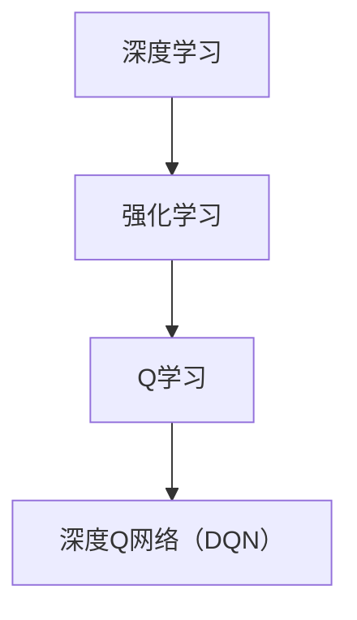

# 一切皆是映射：DQN在机器人控制中的应用：挑战与策略

## 1. 背景介绍
### 1.1 问题的由来

机器人控制作为人工智能领域的一个重要分支，近年来取得了长足的进步。从早期的基于规则的专家系统，到如今基于深度学习的智能控制方法，机器人控制技术不断演进。其中，深度Q网络（Deep Q-Network，DQN）作为一种基于深度学习的强化学习算法，在机器人控制领域展现出巨大的潜力。

然而，将DQN应用于机器人控制并非一帆风顺。由于机器人控制任务的复杂性和不确定性，DQN在应用过程中面临着诸多挑战，如数据量庞大、样本稀疏、动作空间爆炸等。如何有效应对这些挑战，成为DQN在机器人控制应用中的关键问题。

### 1.2 研究现状

近年来，研究者们针对DQN在机器人控制中的应用进行了广泛的研究，取得了一系列成果。以下是一些典型的应用领域：

1. **路径规划**：DQN在路径规划任务中，通过学习环境到动作的映射，使机器人能够在复杂环境中找到最优路径。

2. **抓取与放置**：DQN在抓取与放置任务中，通过学习物体到动作的映射，使机器人能够准确抓取和放置物体。

3. **行走控制**：DQN在行走控制任务中，通过学习地面到动作的映射，使机器人能够在不同地形上稳定行走。

4. **避障**：DQN在避障任务中，通过学习障碍物到动作的映射，使机器人能够避开障碍物。

### 1.3 研究意义

将DQN应用于机器人控制具有重要意义：

1. **提高控制精度**：DQN能够学习到复杂环境的映射关系，从而提高机器人控制的精度和稳定性。

2. **拓展应用领域**：DQN能够应用于各种机器人控制任务，推动机器人技术的应用领域不断拓展。

3. **促进人工智能发展**：DQN在机器人控制中的应用，有助于推动人工智能技术的进步。

### 1.4 本文结构

本文将围绕DQN在机器人控制中的应用展开，主要包括以下几个部分：

- 第2部分：介绍DQN的核心概念与联系。
- 第3部分：详细阐述DQN的算法原理和具体操作步骤。
- 第4部分：分析DQN的数学模型和公式，并结合实例进行讲解。
- 第5部分：给出DQN在机器人控制中的项目实践案例，并进行详细解释说明。
- 第6部分：探讨DQN在实际应用场景中的应用和案例。
- 第7部分：推荐DQN相关的学习资源、开发工具和参考文献。
- 第8部分：总结DQN在机器人控制中的应用现状、未来发展趋势和面临的挑战。
- 第9部分：提供DQN的常见问题与解答。

## 2. 核心概念与联系

为更好地理解DQN在机器人控制中的应用，本节将介绍几个密切相关的核心概念：

- **深度学习**：一种通过学习大量数据中的模式来提取特征和进行预测的机器学习方法。
- **强化学习**：一种通过与环境交互来学习最优策略的机器学习方法。
- **Q学习**：一种基于价值函数的强化学习方法，通过学习状态-动作价值函数来预测最优动作。
- **深度Q网络（DQN）**：一种结合了深度学习和Q学习思想的强化学习算法，通过学习状态-动作价值函数的神经网络来预测最优动作。

它们之间的逻辑关系如下图所示：



可以看出，DQN是深度学习和强化学习的结合，通过学习状态-动作价值函数的神经网络，实现了在复杂环境中的最优决策。

## 3. 核心算法原理 & 具体操作步骤
### 3.1 算法原理概述

DQN是一种基于深度学习的强化学习算法，通过学习状态-动作价值函数来预测最优动作。其核心思想是将状态-动作价值函数表示为一个深度神经网络，并通过与环境交互来不断优化该神经网络。

### 3.2 算法步骤详解

DQN的基本步骤如下：

1. **初始化**：初始化深度神经网络Q函数，并设置超参数，如学习率、探索率等。

2. **选择动作**：根据当前状态，使用ε-贪婪策略选择动作。

3. **执行动作**：执行选择的动作，并观察环境反馈。

4. **更新Q值**：根据新的状态和奖励，更新Q值。

5. **重复步骤2-4**：不断与环境交互，更新Q值，直到达到终止条件。

### 3.3 算法优缺点

DQN的优点：

1. **高效**：DQN能够高效地学习状态-动作价值函数，适应复杂环境。

2. **通用性强**：DQN适用于各种强化学习任务。

3. **可扩展性**：DQN可以扩展到多智能体系统。

DQN的缺点：

1. **样本效率低**：DQN需要大量的样本来学习状态-动作价值函数。

2. **方差大**：DQN的学习过程容易受到随机性的影响。

### 3.4 算法应用领域

DQN在以下机器人控制任务中取得了显著的应用：

1. **路径规划**：DQN可以学习到从起点到终点的最优路径。

2. **抓取与放置**：DQN可以学习到抓取和放置物体的最优动作序列。

3. **行走控制**：DQN可以学习到在不同地形上稳定行走的动作序列。

4. **避障**：DQN可以学习到避开障碍物的动作序列。

## 4. 数学模型和公式 & 详细讲解 & 举例说明
### 4.1 数学模型构建

DQN的数学模型如下：

$$
Q(s,a;\theta) = \sum_{r,s'} \gamma^{|s'-s|} r + \lambda \max_a Q(s',a;\theta)
$$

其中，$Q(s,a;\theta)$ 为状态 $s$ 和动作 $a$ 的价值函数，$\theta$ 为神经网络参数，$\gamma$ 为折扣因子，$\lambda$ 为目标网络参数。

### 4.2 公式推导过程

DQN的目标是最大化期望回报：

$$
J(\theta) = \mathbb{E}[\sum_{t=0}^\infty \gamma^t R_t]
$$

其中，$R_t$ 为第 $t$ 时刻的回报。

根据动态规划的理论，最优策略下的期望回报可以表示为：

$$
J^*(\theta) = \mathbb{E}[\sum_{t=0}^\infty \gamma^t Q(s,a;\theta)]
$$

因此，DQN的目标是最大化 $Q(s,a;\theta)$，即：

$$
J(\theta) = \mathbb{E}[\sum_{t=0}^\infty \gamma^t R_t] = \mathbb{E}[\sum_{t=0}^\infty \gamma^t Q(s,a;\theta)]
$$

通过最大化 $Q(s,a;\theta)$，DQN可以学习到最优策略。

### 4.3 案例分析与讲解

以下是一个简单的DQN案例，演示如何在PyTorch中实现一个简单的Q网络：

```python
import torch
import torch.nn as nn

class QNetwork(nn.Module):
    def __init__(self, input_size, output_size):
        super(QNetwork, self).__init__()
        self.fc1 = nn.Linear(input_size, 128)
        self.fc2 = nn.Linear(128, output_size)

    def forward(self, x):
        x = torch.relu(self.fc1(x))
        return self.fc2(x)
```

在这个案例中，我们定义了一个简单的全连接神经网络Q网络，包含两个全连接层。输入层的大小为输入状态的特征数，输出层的大小为动作空间的大小。

### 4.4 常见问题解答

**Q1：DQN如何处理连续动作空间？**

A：DQN通常使用线性层或卷积层来处理连续动作空间。对于高维动作空间，可以使用多个线性层进行压缩。

**Q2：如何解决DQN的样本效率低和方差大问题？**

A：可以采用以下策略：
1. **经验回放**：将历史经验存储在经验回放池中，随机抽取经验进行学习，减少样本方差。
2. **目标网络**：使用目标网络来稳定Q值的更新，减少样本方差。
3. **优先级回放**：根据经验的重要性进行加权回放，提高样本效率。

## 5. 项目实践：代码实例和详细解释说明
### 5.1 开发环境搭建

在进行DQN项目实践前，我们需要准备好开发环境。以下是使用Python进行PyTorch开发的环境配置流程：

1. 安装Anaconda：从官网下载并安装Anaconda，用于创建独立的Python环境。

2. 创建并激活虚拟环境：
```bash
conda create -n dqn-env python=3.8
conda activate dqn-env
```

3. 安装PyTorch：根据CUDA版本，从官网获取对应的安装命令。例如：
```bash
conda install pytorch torchvision torchaudio cudatoolkit=11.1 -c pytorch -c conda-forge
```

4. 安装其他依赖：
```bash
pip install gym numpy matplotlib
```

完成上述步骤后，即可在`dqn-env`环境中开始DQN项目实践。

### 5.2 源代码详细实现

以下是一个简单的DQN项目示例，演示如何使用PyTorch实现一个简单的CartPole环境：

```python
import gym
import torch
import torch.nn as nn
import torch.optim as optim
from collections import deque

class DQN:
    def __init__(self, state_dim, action_dim):
        self.state_dim = state_dim
        self.action_dim = action_dim
        self.epsilon = 0.1
        self.gamma = 0.99
        self.memory = deque(maxlen=2000)
        self.model = QNetwork(state_dim, action_dim)
        self.target_model = QNetwork(state_dim, action_dim)
        self.optimizer = optim.Adam(self.model.parameters(), lr=0.001)

    def remember(self, state, action, reward, next_state, done):
        self.memory.append((state, action, reward, next_state, done))

    def act(self, state):
        if torch.rand(1) < self.epsilon:
            return torch.randint(self.action_dim, (1,)).item()
        state = torch.from_numpy(state).float().unsqueeze(0)
        state = self.preprocess_state(state)
        with torch.no_grad():
            action = self.model(state).argmax()
        return action

    def preprocess_state(self, state):
        # TODO: 实现状态预处理
        return state

    def replay(self, batch_size):
        states, actions, rewards, next_states, dones = zip(*random.sample(self.memory, batch_size))
        states = torch.from_numpy(np.array(states)).float().unsqueeze(0)
        next_states = torch.from_numpy(np.array(next_states)).float().unsqueeze(0)
        actions = torch.from_numpy(np.array(actions)).long()
        rewards = torch.from_numpy(np.array(rewards)).float()
        dones = torch.from_numpy(np.array(dones)).float()
        states = self.preprocess_state(states)
        next_states = self.preprocess_state(next_states)
        Q_values = self.model(states).gather(1, actions.unsqueeze(1)).squeeze(1)
        Q_values_next = self.target_model(next_states).max(1)[0]
        Q_targets = rewards + (1 - dones) * self.gamma * Q_values_next
        loss = F.mse_loss(Q_values, Q_targets)
        self.optimizer.zero_grad()
        loss.backward()
        self.optimizer.step()

    def update_target(self):
        self.target_model.load_state_dict(self.model.state_dict())
```

### 5.3 代码解读与分析

在这个示例中，我们定义了一个DQN类，实现了DQN的基本功能。以下是代码的关键部分：

- **初始化**：初始化状态空间大小、动作空间大小、探索率、折扣因子等参数，并创建模型、目标模型和优化器。

- **记忆存储**：将状态、动作、奖励、下一个状态和是否完成存储在经验回放池中。

- **选择动作**：根据当前状态，使用ε-贪婪策略选择动作。

- **执行动作**：执行选择的动作，并观察环境反馈。

- **更新Q值**：根据新的状态和奖励，更新Q值。

- **回放经验**：从经验回放池中随机抽取经验进行学习，更新Q网络。

- **更新目标网络**：将Q网络的参数复制到目标网络，保持目标网络与Q网络稳定。

### 5.4 运行结果展示

以下是在CartPole环境中运行DQN的示例：

```python
env = gym.make('CartPole-v1')
dqn = DQN(state_dim=4, action_dim=2)
episodes = 1000
max_steps = 100

for episode in range(episodes):
    state = env.reset()
    for step in range(max_steps):
        action = dqn.act(state)
        next_state, reward, done, _ = env.step(action)
        dqn.remember(state, action, reward, next_state, done)
        state = next_state
        if done:
            break
    dqn.replay(64)
    print(f"Episode {episode+1}, score: {step}")
```

在这个示例中，我们使用CartPole环境对DQN进行训练。通过多次迭代训练，DQN能够在CartPole环境中稳定运行。

## 6. 实际应用场景
### 6.1 自动驾驶

自动驾驶是DQN在机器人控制中应用的重要场景。DQN可以学习到从道路环境到驾驶动作的映射，使自动驾驶汽车能够安全行驶。

### 6.2 工业机器人

工业机器人可以应用DQN进行路径规划、抓取和放置等任务，提高生产效率。

### 6.3 服务机器人

服务机器人可以应用DQN进行路径规划、避障和交互等任务，为用户提供更好的服务。

### 6.4 未来应用展望

随着DQN技术的不断发展和完善，其应用领域将不断拓展。以下是DQN在未来应用中可能面临的机遇：

1. **更复杂的机器人控制任务**：DQN可以应用于更复杂的机器人控制任务，如多机器人协作、复杂环境探索等。

2. **更广泛的机器人平台**：DQN可以应用于不同的机器人平台，如无人机、无人船等。

3. **与其他人工智能技术的融合**：DQN可以与其他人工智能技术，如计算机视觉、自然语言处理等，进行融合，实现更智能的机器人系统。

## 7. 工具和资源推荐
### 7.1 学习资源推荐

为了帮助开发者系统掌握DQN的理论基础和实践技巧，以下推荐一些优质的学习资源：

1. 《深度强化学习》书籍：全面介绍了深度强化学习的基本概念、算法和实现方法。

2. 《深度学习与强化学习》系列博文：深入浅出地介绍了深度学习和强化学习的基本原理和应用。

3. OpenAI Gym：一个开源的强化学习环境库，提供了丰富的机器人控制环境。

4. PyTorch Reinforcement Learning教程：PyTorch官方提供的强化学习教程，包括DQN、PPO等算法的示例代码。

5. Hugging Face Transformers库：一个开源的NLP工具库，提供了丰富的预训练模型和微调工具。

### 7.2 开发工具推荐

1. PyTorch：开源的深度学习框架，支持GPU加速，适合进行深度强化学习研究。

2. OpenAI Gym：一个开源的强化学习环境库，提供了丰富的机器人控制环境。

3. Stable Baselines：一个基于PyTorch的强化学习库，提供了多种强化学习算法的实现。

4. Ray RLLib：一个基于Python的分布式强化学习库，可以方便地进行大规模强化学习实验。

5..tensorflow：开源的深度学习框架，支持GPU加速，适合进行深度强化学习研究。

### 7.3 相关论文推荐

1. **Deep Q-Networks (DQN)**: 基础论文，介绍了DQN算法的基本原理和实现方法。

2. **Prioritized Experience Replay**: 介绍了优先级经验回放策略，提高了DQN的样本效率。

3. **Deep Deterministic Policy Gradient (DDPG)**: 介绍了DDPG算法，结合了DQN和策略梯度算法的优点。

4. **Soft Actor-Critic (SAC)**: 介绍了SAC算法，采用软目标函数和熵正则化，提高了算法的样本效率。

5. **Proximal Policy Optimization (PPO)**: 介绍了PPO算法，采用信任区域策略，提高了算法的稳定性和样本效率。

### 7.4 其他资源推荐

1. **arXiv论文预印本**: 人工智能领域最新研究成果的发布平台。

2. **技术会议**: 如NeurIPS、ICLR、ICML、ACL等，可以了解最新的研究成果。

3. **GitHub**: 查看开源的深度强化学习项目和代码。

4. **技术博客**: 如Hugging Face博客、DeepMind博客等，可以了解最新的技术动态。

5. **在线课程**: 如Coursera、edX等平台上的深度学习课程。

## 8. 总结：未来发展趋势与挑战
### 8.1 研究成果总结

本文对DQN在机器人控制中的应用进行了全面系统的介绍。从核心概念、算法原理、实际应用场景等方面进行了详细阐述，并给出了项目实践示例。通过本文的学习，读者可以深入了解DQN在机器人控制中的应用，并能够将其应用于实际的机器人控制任务中。

### 8.2 未来发展趋势

DQN在机器人控制中的应用具有广阔的发展前景，以下是一些可能的发展趋势：

1. **更复杂的机器人控制任务**：DQN可以应用于更复杂的机器人控制任务，如多机器人协作、复杂环境探索等。

2. **更广泛的机器人平台**：DQN可以应用于不同的机器人平台，如无人机、无人船等。

3. **与其他人工智能技术的融合**：DQN可以与其他人工智能技术，如计算机视觉、自然语言处理等，进行融合，实现更智能的机器人系统。

### 8.3 面临的挑战

DQN在机器人控制中的应用也面临着一些挑战：

1. **样本效率低**：DQN需要大量的样本来学习状态-动作价值函数。

2. **方差大**：DQN的学习过程容易受到随机性的影响。

3. **可解释性差**：DQN的决策过程难以解释。

### 8.4 研究展望

为了应对DQN在机器人控制中的应用挑战，以下是一些研究方向：

1. **改进经验回放策略**：提高样本效率，减少样本方差。

2. **设计可解释的DQN算法**：提高算法的可解释性。

3. **与其他人工智能技术的融合**：结合其他人工智能技术，实现更智能的机器人系统。

通过不断研究和创新，相信DQN在机器人控制中的应用将会取得更大的突破，为机器人技术的发展贡献力量。

## 9. 附录：常见问题与解答

**Q1：DQN在机器人控制中与其他强化学习算法相比有什么优势？**

A：DQN的优势在于其简单性和高效性。DQN不需要预先定义策略，通过学习状态-动作价值函数，能够自动找到最优策略。此外，DQN可以应用于各种机器人控制任务。

**Q2：如何解决DQN样本效率低的问题？**

A：可以采用以下策略：
1. **经验回放**：将历史经验存储在经验回放池中，随机抽取经验进行学习，减少样本方差。
2. **目标网络**：使用目标网络来稳定Q值的更新，减少样本方差。
3. **优先级回放**：根据经验的重要性进行加权回放，提高样本效率。

**Q3：DQN在机器人控制中如何处理连续动作空间？**

A：DQN通常使用线性层或卷积层来处理连续动作空间。对于高维动作空间，可以使用多个线性层进行压缩。

**Q4：如何解决DQN的方差大问题？**

A：可以采用以下策略：
1. **经验回放**：将历史经验存储在经验回放池中，随机抽取经验进行学习，减少样本方差。
2. **目标网络**：使用目标网络来稳定Q值的更新，减少样本方差。
3. **Dropout**：使用Dropout技术降低模型过拟合，减少样本方差。

**Q5：DQN在机器人控制中如何处理复杂环境？**

A：DQN可以学习到复杂环境的映射关系，从而提高机器人控制的精度和稳定性。对于复杂环境，需要设计合适的输入层和动作层，以便DQN能够学习到有效的映射关系。

作者：禅与计算机程序设计艺术 / Zen and the Art of Computer Programming