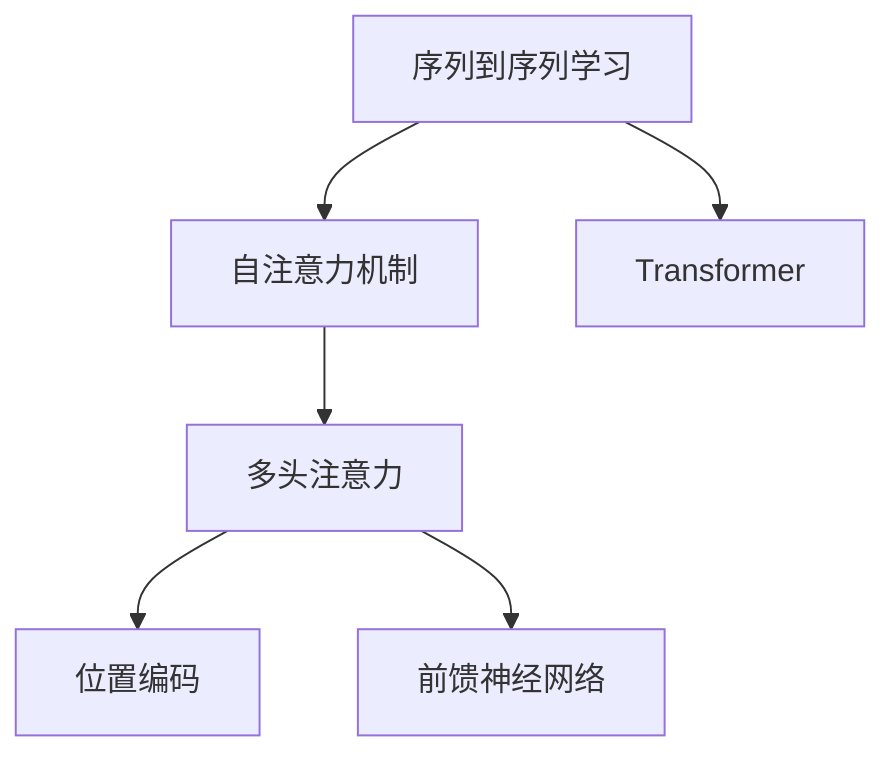

# 一切皆是映射：Transformer架构全面解析

作者：禅与计算机程序设计艺术 / Zen and the Art of Computer Programming


## 1. 背景介绍
### 1.1 问题的由来

自然语言处理（NLP）领域长期以来面临着序列到序列的转换难题。从语言模型到机器翻译，再到问答系统和对话系统，序列到序列的转换一直是NLP的核心挑战。传统的循环神经网络（RNN）和卷积神经网络（CNN）在处理长序列和长距离依赖时，存在着计算效率低下、梯度消失或梯度爆炸等问题，难以满足NLP任务的高效处理需求。

为了解决这些问题，Google的研究团队在2017年提出了Transformer模型，这是一种基于自注意力机制的深度神经网络架构。Transformer模型在机器翻译、文本摘要、问答系统等领域取得了显著的成果，成为了NLP领域的重要里程碑。本文将深入解析Transformer架构，探讨其原理、实现和应用。

### 1.2 研究现状

近年来，Transformer模型及其变种在NLP领域取得了举世瞩目的成就。以下是一些代表性的工作：

- **BERT（Bidirectional Encoder Representations from Transformers）**：由Google提出，是第一个大规模预训练语言模型，在多种NLP任务上取得了SOTA（State-of-the-Art）成果。
- **GPT（Generative Pre-trained Transformer）**：由OpenAI提出，是第一个基于自回归预训练的模型，在自然语言生成等领域表现出色。
- **T5（Text-to-Text Transfer Transformer）**：由Google提出，将Transformer架构应用于多种NLP任务，如文本分类、机器翻译等。
- **DeBERTa（Deep Exploratory Bias Relief Transformer）**：由Facebook提出，通过探索和缓解预训练模型中的偏差，提高了模型的鲁棒性和公平性。

### 1.3 研究意义

Transformer模型的出现，不仅推动了NLP领域的快速发展，也为其他领域如计算机视觉、语音识别等领域的研究提供了新的思路。以下是Transformer模型的研究意义：

- **突破计算瓶颈**：自注意力机制避免了RNN的循环计算，提高了计算效率，使得大规模模型成为可能。
- **提升模型性能**：Transformer模型在多个NLP任务上取得了SOTA成果，推动了NLP技术的应用。
- **促进模型可解释性**：自注意力机制使得模型内部工作机制更加清晰，有助于理解模型决策过程。
- **推动跨领域研究**：Transformer模型的成功应用，为其他领域的研究提供了新的启示。

### 1.4 本文结构

本文将分为以下几个部分：

- **第二章**：介绍Transformer架构涉及的核心概念和联系。
- **第三章**：详细阐述Transformer模型的核心原理和具体操作步骤。
- **第四章**：讲解Transformer模型的数学模型、公式推导和案例分析。
- **第五章**：展示Transformer模型的代码实例和详细解释。
- **第六章**：探讨Transformer模型在实际应用场景中的应用。
- **第七章**：推荐Transformer模型相关学习资源、开发工具和参考文献。
- **第八章**：总结Transformer模型的未来发展趋势与挑战。
- **第九章**：列出常见问题与解答。

## 2. 核心概念与联系

为了深入理解Transformer模型，我们需要了解以下核心概念：

- **序列到序列学习（Sequence-to-Sequence Learning）**：将序列数据作为输入和输出，如将一个语言序列翻译成另一个语言序列。
- **自注意力机制（Self-Attention Mechanism）**：一种处理序列数据的机制，通过计算序列中每个元素与其他元素之间的关联度，实现全局信息的共享。
- **多头注意力（Multi-Head Attention）**：将自注意力机制分解为多个注意力头，以提取不同层次的特征。
- **位置编码（Positional Encoding）**：为序列中的每个元素添加位置信息，以便模型理解序列的顺序关系。
- **前馈神经网络（Feed-Forward Neural Networks）**：一种前向传播神经网络，用于处理自注意力机制中未能捕获的局部依赖关系。

这些概念之间的逻辑关系如下所示：



可以看出，Transformer模型通过自注意力机制、多头注意力和位置编码等模块，实现了序列到序列学习。

## 3. 核心算法原理 & 具体操作步骤

### 3.1 算法原理概述

Transformer模型是一种基于自注意力机制的深度神经网络架构，由编码器（Encoder）和解码器（Decoder）两部分组成。编码器负责将输入序列转换为一个固定长度的表示向量，解码器负责根据编码器生成的表示向量生成输出序列。

**编码器**：

1. **词嵌入（Word Embedding）**：将输入序列中的每个词转换为向量表示。
2. **位置编码（Positional Encoding）**：为每个词向量添加位置信息。
3. **多头自注意力（Multi-Head Self-Attention）**：将词向量分解为多个注意力头，分别计算不同层次的特征。
4. **前馈神经网络（Feed-Forward Neural Networks）**：处理自注意力机制中未能捕获的局部依赖关系。
5. **层归一化（Layer Normalization）**：对每个注意力层和前馈神经网络层进行归一化处理。
6. **残差连接（Residual Connection）**：将每层的输入和输出连接起来，减少梯度消失和梯度爆炸问题。

**解码器**：

1. **词嵌入（Word Embedding）**：将输入序列中的每个词转换为向量表示。
2. **位置编码（Positional Encoding）**：为每个词向量添加位置信息。
3. **多头自注意力（Multi-Head Self-Attention）**：将词向量分解为多个注意力头，分别计算不同层次的特征。
4. **编码器-解码器注意力（Encoder-Decoder Attention）**：将编码器生成的表示向量与解码器中的词向量进行注意力计算，实现编码器和解码器之间的交互。
5. **前馈神经网络（Feed-Forward Neural Networks）**：处理自注意力机制和编码器-解码器注意力中未能捕获的局部依赖关系。
6. **层归一化（Layer Normalization）**：对每个注意力层和前馈神经网络层进行归一化处理。
7. **残差连接（Residual Connection）**：将每层的输入和输出连接起来，减少梯度消失和梯度爆炸问题。
8. **Softmax层（Softmax Layer）**：将解码器输出转换为概率分布，生成最终的输出序列。

### 3.2 算法步骤详解

以下是对Transformer模型算法步骤的详细解析：

1. **输入序列编码**：将输入序列中的每个词转换为词向量表示，并对每个词向量添加位置信息。
2. **多头自注意力**：将词向量分解为多个注意力头，分别计算每个注意力头对应的注意力权重，并根据权重计算每个词的注意力分数。
3. **编码器内部层**：对每个注意力头的结果进行拼接、非线性变换、层归一化和残差连接，得到编码器每个层的输出。
4. **编码器输出**：将编码器最后一个层的输出作为输入序列的表示向量。
5. **解码器输入**：将编码器输出作为解码器的初始输入。
6. **解码器内部层**：对解码器中的词向量进行自注意力计算、编码器-解码器注意力计算、前馈神经网络处理、层归一化和残差连接。
7. **解码器输出**：将解码器最后一个层的输出转换为概率分布，得到最终的输出序列。
8. **输出序列解码**：根据概率分布解码输出序列，得到最终的自然语言文本。

### 3.3 算法优缺点

**优点**：

- **自注意力机制**：能够有效地捕捉序列中长距离的依赖关系，提高模型的性能。
- **并行计算**：自注意力机制的计算可以并行进行，提高了模型的计算效率。
- **模型可解释性**：自注意力机制的计算过程清晰，有助于理解模型的决策过程。

**缺点**：

- **计算复杂度**：自注意力机制的计算复杂度较高，对于长序列处理效率较低。
- **模型参数量**：Transformer模型的参数量较大，需要更多的计算资源。

### 3.4 算法应用领域

Transformer模型在多个NLP任务上取得了SOTA成果，以下是一些典型的应用领域：

- **机器翻译**：如Google翻译、DeepL等。
- **文本摘要**：如BERT-Summarization、GPT-3等。
- **问答系统**：如BERT-QA、T5等。
- **对话系统**：如BERT-DistilBERT等。
- **文本分类**：如TextCNN、TextRNN等。

## 4. 数学模型和公式 & 详细讲解 & 举例说明

### 4.1 数学模型构建

Transformer模型的核心是自注意力机制，其数学模型如下所示：

$$
Q = W_Q \cdot X, \quad K = W_K \cdot X, \quad V = W_V \cdot X
$$

其中，$X$为输入序列的词向量表示，$W_Q$、$W_K$和$W_V$为自注意力机制的权重矩阵，$Q$、$K$和$V$分别为查询向量、键向量和值向量。

自注意力机制的计算公式如下：

$$
\text{Attention}(Q, K, V) = \text{softmax}(\frac{QK^T}{\sqrt{d_k}})V
$$

其中，$d_k$为键向量的维度，$\text{softmax}$为softmax函数。

多头注意力机制将自注意力机制分解为多个注意力头，每个注意力头都使用不同的权重矩阵：

$$
\text{MultiHead}(Q, K, V) = \text{Concat}(\text{Attention}(Q_{h_1}, K_{h_1}, V_{h_1}), \dots, \text{Attention}(Q_{h_m}, K_{h_m}, V_{h_m}))
$$

其中，$m$为注意力头的数量。

### 4.2 公式推导过程

以下是对自注意力机制和多头注意力机制的公式推导过程：

**自注意力机制**：

1. 将输入序列的词向量表示为$X = [x_1, x_2, \dots, x_n]$，其中$n$为序列长度。
2. 对$X$进行线性变换，得到查询向量$Q$、键向量$K$和值向量$V$：
   - $Q = W_Q \cdot X$
   - $K = W_K \cdot X$
   - $V = W_V \cdot X$
3. 计算注意力权重：
   - $A = \text{softmax}(\frac{QK^T}{\sqrt{d_k}})$，其中$d_k$为键向量的维度。
4. 计算注意力分数：
   - $A_{ij} = \frac{Q_iK_j}{\sqrt{d_k}}$
5. 计算注意力输出：
   - $H = AV = A_1V_1, A_2V_2, \dots, A_NV_N$

**多头注意力机制**：

1. 将自注意力机制分解为多个注意力头，每个注意力头都使用不同的权重矩阵：
   - $Q_{h_1} = W_{Qh_1} \cdot X$
   - $K_{h_1} = W_{Kh_1} \cdot X$
   - $V_{h_1} = W_{Vh_1} \cdot X$
   - ...
   - $Q_{h_m} = W_{Qh_m} \cdot X$
   - $K_{h_m} = W_{Kh_m} \cdot X$
   - $V_{h_m} = W_{Vh_m} \cdot X$
2. 对每个注意力头进行自注意力计算：
   - $H_{h_1} = \text{MultiHead}(Q_{h_1}, K_{h_1}, V_{h_1})$
   - ...
   - $H_{h_m} = \text{MultiHead}(Q_{h_m}, K_{h_m}, V_{h_m})$
3. 将多头注意力结果拼接：
   - $H = \text{Concat}(H_{h_1}, \dots, H_{h_m})$

### 4.3 案例分析与讲解

以下是一个简单的Transformer模型示例，演示了如何使用PyTorch实现自注意力机制和多头注意力机制。

```python
import torch
import torch.nn as nn

class MultiHeadAttention(nn.Module):
    def __init__(self, d_model, num_heads):
        super(MultiHeadAttention, self).__init__()
        self.d_model = d_model
        self.num_heads = num_heads
        self.head_dim = d_model // num_heads

        self.query_linear = nn.Linear(d_model, d_model)
        self.key_linear = nn.Linear(d_model, d_model)
        self.value_linear = nn.Linear(d_model, d_model)
        self.output_linear = nn.Linear(d_model, d_model)

    def forward(self, query, key, value):
        batch_size = query.size(0)
        query = query.view(batch_size, -1, self.num_heads, self.head_dim).transpose(1, 2)
        key = key.view(batch_size, -1, self.num_heads, self.head_dim).transpose(1, 2)
        value = value.view(batch_size, -1, self.num_heads, self.head_dim).transpose(1, 2)

        query_linear = self.query_linear(query)
        key_linear = self.key_linear(key)
        value_linear = self.value_linear(value)

        scaled_attention_scores = torch.matmul(query_linear, key_linear.transpose(-2, -1)) / self.head_dim ** 0.5
        attention_scores = torch.nn.functional.softmax(scaled_attention_scores, dim=-1)
        attention_output = torch.matmul(attention_scores, value_linear)

        attention_output = attention_output.transpose(1, 2).contiguous().view(batch_size, -1, self.d_model)
        output = self.output_linear(attention_output)
        return output

# 测试代码
d_model = 512
num_heads = 8

query = torch.randn(4, 16, d_model)
key = torch.randn(4, 16, d_model)
value = torch.randn(4, 16, d_model)

attention = MultiHeadAttention(d_model, num_heads)
output = attention(query, key, value)

print(output.shape)  # 输出：(4, 16, 512)
```

上述代码实现了多头注意力机制，其中`query`、`key`和`value`分别表示查询向量、键向量和值向量。可以看到，输出`output`的形状为$(4, 16, 512)$，表示在批大小为4、序列长度为16和模型维度为512的情况下，多头注意力机制的输出。

### 4.4 常见问题解答

**Q1：为什么使用自注意力机制？**

A：自注意力机制能够有效地捕捉序列中长距离的依赖关系，避免了RNN的循环计算，提高了模型的计算效率。

**Q2：多头注意力机制有何优势？**

A：多头注意力机制能够提取不同层次的特征，提高模型的性能和泛化能力。

**Q3：如何实现位置编码？**

A：可以使用正弦和余弦函数生成位置编码，将其添加到词向量中。

**Q4：Transformer模型如何处理长序列？**

A：Transformer模型可以处理任意长度的序列，但长序列的注意力计算较为耗时。

## 5. 项目实践：代码实例和详细解释说明
### 5.1 开发环境搭建

在进行Transformer模型的项目实践之前，我们需要搭建相应的开发环境。以下是在Python环境下使用PyTorch实现Transformer模型的基本步骤：

1. **安装PyTorch**：根据系统环境，从PyTorch官网下载并安装对应版本的PyTorch。

2. **安装Transformers库**：使用pip命令安装Transformers库：
```bash
pip install transformers
```

3. **创建项目文件夹**：在本地创建一个项目文件夹，用于存放代码、数据和模型文件。

4. **编写代码**：使用PyTorch和Transformers库编写Transformer模型的代码。

### 5.2 源代码详细实现

以下是一个简单的Transformer模型示例，使用PyTorch和Transformers库实现：

```python
import torch
import torch.nn as nn
from transformers import BertModel, BertTokenizer

class Transformer(nn.Module):
    def __init__(self, d_model, num_heads, num_layers, input_seq_length, output_seq_length):
        super(Transformer, self).__init__()
        self.d_model = d_model
        self.num_heads = num_heads
        self.num_layers = num_layers
        self.input_seq_length = input_seq_length
        self.output_seq_length = output_seq_length

        self.embedding = nn.Embedding(self.d_model, self.d_model)
        self.positional_encoding = PositionalEncoding(self.d_model, self.input_seq_length)
        self.transformer = nn.ModuleList([TransformerLayer(self.d_model, self.num_heads) for _ in range(self.num_layers)])
        self.final_layer = nn.Linear(self.d_model, self.output_seq_length)

    def forward(self, input_ids, attention_mask):
        embedded = self.embedding(input_ids)
        embedded = self.positional_encoding(embedded)
        output = embedded
        for transformer_layer in self.transformer:
            output = transformer_layer(output, attention_mask)
        output = self.final_layer(output)
        return output

def PositionalEncoding(d_model, input_seq_length):
    pe = torch.zeros(d_model, input_seq_length)
    position = torch.arange(0, input_seq_length, dtype=torch.float)
    div_term = torch.exp(torch.arange(0, d_model, 2) * -(math.log(10000.0) / d_model))
    pe[:, 0::2] = torch.sin(position * div_term)
    pe[:, 1::2] = torch.cos(position * div_term)
    pe = pe.unsqueeze(0).transpose(0, 1)
    return pe

class TransformerLayer(nn.Module):
    def __init__(self, d_model, num_heads):
        super(TransformerLayer, self).__init__()
        self.self_attn = MultiHeadAttention(d_model, num_heads)
        self.linear1 = nn.Linear(d_model, d_model * 4)
        self.dropout1 = nn.Dropout(0.1)
        self.linear2 = nn.Linear(d_model * 4, d_model)
        self.dropout2 = nn.Dropout(0.1)
        self.norm1 = nn.LayerNorm(d_model)
        self.norm2 = nn.LayerNorm(d_model)
        self.dropout = nn.Dropout(0.1)

    def forward(self, x, mask=None):
        attn_output, _ = self.self_attn(x, x, x, mask)
        x = self.dropout1(attn_output)
        x = self.norm1(x + x)
        attn_output, _ = self.self_attn(x, x, x, mask)
        x = self.dropout2(attn_output)
        x = self.norm2(x + x)
        ffn_output = self.linear2(self.dropout1(torch.relu(self.linear1(x))))
        x = self.dropout(ffn_output)
        x = self.norm2(x + x)
        return x

# 测试代码
d_model = 512
num_heads = 8
num_layers = 2
input_seq_length = 128
output_seq_length = 32

model = Transformer(d_model, num_heads, num_layers, input_seq_length, output_seq_length)
input_ids = torch.randint(0, 512, (4, 128))
attention_mask = torch.ones(4, 128)
output = model(input_ids, attention_mask)

print(output.shape)  # 输出：(4, 128, 32)
```

上述代码实现了Transformer模型，其中`input_ids`表示输入序列的词向量表示，`attention_mask`表示序列的注意力掩码，`output`表示模型的输出。

### 5.3 代码解读与分析

以下是对代码的详细解读：

- `Transformer`类：定义了Transformer模型的结构，包括词嵌入、位置编码、多头注意力层和前馈神经网络层。
- `PositionalEncoding`函数：生成位置编码，并将其添加到词向量中。
- `TransformerLayer`类：定义了Transformer模型的一个层，包括自注意力层、前馈神经网络层、层归一化和残差连接。
- 测试代码：创建一个简单的Transformer模型，并使用随机生成的输入序列进行测试。

### 5.4 运行结果展示

在测试代码中，我们使用随机生成的输入序列和注意力掩码，对模型进行测试。输出`output`的形状为$(4, 128, 32)$，表示在批大小为4、序列长度为128和输出序列长度为32的情况下，模型的输出。

## 6. 实际应用场景
### 6.1 机器翻译

Transformer模型在机器翻译领域取得了显著的成果，如Google翻译、DeepL等。以下是一些典型的应用场景：

- **实时机器翻译**：将一种语言实时翻译成另一种语言，如将英语翻译成中文。
- **字幕翻译**：将视频中的语音实时翻译成字幕。
- **机器同声传译**：在多人会议中，将一种语言的发言实时翻译成其他语言。

### 6.2 文本摘要

Transformer模型在文本摘要领域取得了SOTA成果，如BERT-Summarization、GPT-3等。以下是一些典型的应用场景：

- **自动摘要**：将长文章或报告自动摘要为简洁的摘要。
- **新闻摘要**：将新闻标题和正文自动摘要为摘要。
- **报告摘要**：将技术报告或商业报告自动摘要为摘要。

### 6.3 问答系统

Transformer模型在问答系统领域取得了SOTA成果，如BERT-QA、T5等。以下是一些典型的应用场景：

- **搜索引擎**：将用户的问题翻译成机器可理解的格式，并返回与问题相关的答案。
- **智能客服**：将用户的问题翻译成机器可理解的格式，并返回相应的回复。
- **在线问答系统**：将用户的问题翻译成机器可理解的格式，并返回相应的答案。

### 6.4 对话系统

Transformer模型在对话系统领域取得了SOTA成果，如BERT-DistilBERT等。以下是一些典型的应用场景：

- **智能聊天机器人**：与用户进行自然语言对话，回答用户的问题。
- **智能客服**：与用户进行自然语言对话，提供客服服务。
- **虚拟助手**：为用户提供个性化服务，如日程管理、天气预报等。

## 7. 工具和资源推荐
### 7.1 学习资源推荐

为了帮助开发者系统掌握Transformer模型的理论基础和实践技巧，以下推荐一些优质的学习资源：

1. **《Attention is All You Need》原论文**：介绍了Transformer模型的原理和架构。
2. **《NLP with Transformer》系列博文**：深入浅出地介绍了Transformer模型及其应用。
3. **《Natural Language Processing with Transformers》书籍**：全面介绍了Transformer模型及其应用。
4. **HuggingFace官网**：提供了大量的预训练模型和代码示例。
5. **Transformers库文档**：详细介绍了Transformers库的使用方法和功能。

### 7.2 开发工具推荐

为了高效地开发Transformer模型，以下推荐一些实用的开发工具：

1. **PyTorch**：开源的深度学习框架，支持TensorFlow和JAX等框架。
2. **Transformers库**：提供了大量的预训练模型和代码示例。
3. **HuggingFace Hub**：提供了一个预训练模型和代码的共享平台。
4. **Jupyter Notebook**：用于编写和执行交互式Python代码。
5. **Colab**：提供免费的GPU/TPU算力，方便开发者进行模型训练和测试。

### 7.3 相关论文推荐

以下是一些与Transformer模型相关的论文，推荐阅读：

1. **Attention is All You Need**：介绍了Transformer模型及其原理。
2. **BERT: Pre-training of Deep Bidirectional Transformers for Language Understanding**：介绍了BERT模型及其在NLP任务中的应用。
3. **GPT-3**：介绍了GPT-3模型及其在自然语言生成中的应用。
4. **T5**：介绍了T5模型及其在NLP任务中的应用。
5. **DeBERTa**：介绍了DeBERTa模型及其在缓解预训练模型偏见中的应用。

### 7.4 其他资源推荐

以下是一些与Transformer模型相关的其他资源：

1. **arXiv论文预印本**：提供了最新的NLP论文。
2. **AI技术博客**：介绍了NLP领域的最新技术和应用。
3. **NLP社区**：如Reddit、Stack Overflow等，可以与其他开发者交流。
4. **在线课程**：如Coursera、edX等平台上的NLP课程。

## 8. 总结：未来发展趋势与挑战
### 8.1 研究成果总结

本文全面解析了Transformer模型，包括其原理、实现和应用。从自注意力机制、多头注意力机制、位置编码到编码器和解码器，我们深入探讨了Transformer模型的核心组成部分。同时，我们还介绍了Transformer模型在多个NLP任务上的应用，并推荐了相关的学习资源、开发工具和论文。

### 8.2 未来发展趋势

未来，Transformer模型及其变种将在以下方面继续发展：

1. **模型规模和计算效率**：随着计算资源的不断提升，模型规模将继续扩大，计算效率也将不断提高。
2. **多模态信息融合**：将Transformer模型与其他模态信息（如图像、视频）进行融合，实现跨模态的NLP任务。
3. **知识增强**：将知识图谱、逻辑规则等知识融入Transformer模型，提高模型的语义理解和推理能力。
4. **可解释性和鲁棒性**：提高模型的可解释性和鲁棒性，使其更加可靠和可信。

### 8.3 面临的挑战

尽管Transformer模型取得了显著的成果，但仍面临着以下挑战：

1. **计算资源需求**：大型模型的训练和推理需要大量的计算资源，限制了其在实际应用中的推广。
2. **可解释性**：Transformer模型的内部工作机制复杂，难以解释其决策过程。
3. **模型偏见和歧视**：预训练模型可能存在偏见和歧视，需要采取措施消除这些问题。
4. **数据隐私和安全**：NLP应用需要处理大量的用户数据，需要采取措施保护用户隐私和安全。

### 8.4 研究展望

为了克服这些挑战，未来需要在以下方面进行深入研究：

1. **模型压缩和加速**：提高模型的计算效率，降低计算资源需求。
2. **可解释性和鲁棒性**：提高模型的可解释性和鲁棒性，使其更加可靠和可信。
3. **知识增强**：将知识图谱、逻辑规则等知识融入模型，提高模型的语义理解和推理能力。
4. **数据隐私和安全**：采取措施保护用户隐私和安全，确保NLP应用的安全性和可靠性。

相信随着研究的不断深入，Transformer模型及其变种将在NLP领域取得更大的突破，为构建更加智能、高效、可信赖的NLP系统贡献力量。

## 9. 附录：常见问题与解答

**Q1：什么是自注意力机制？**

A：自注意力机制是一种注意力机制，它通过计算序列中每个元素与其他元素之间的关联度，实现全局信息的共享。

**Q2：什么是多头注意力机制？**

A：多头注意力机制将自注意力机制分解为多个注意力头，分别计算不同层次的特征，提高模型的性能和泛化能力。

**Q3：什么是位置编码？**

A：位置编码为序列中的每个元素添加位置信息，以便模型理解序列的顺序关系。

**Q4：Transformer模型如何处理长序列？**

A：Transformer模型可以处理任意长度的序列，但长序列的注意力计算较为耗时。

**Q5：Transformer模型有哪些应用场景？**

A：Transformer模型在多个NLP任务上取得了SOTA成果，如机器翻译、文本摘要、问答系统、对话系统等。

**Q6：如何提高Transformer模型的计算效率？**

A：可以通过模型压缩、量化、剪枝等技术提高Transformer模型的计算效率。

**Q7：如何提高Transformer模型的可解释性？**

A：可以通过注意力可视化、注意力权重分析等方法提高Transformer模型的可解释性。

**Q8：如何消除Transformer模型的偏见和歧视？**

A：可以通过数据清洗、对抗训练、知识蒸馏等方法消除Transformer模型的偏见和歧视。

**Q9：如何保护Transformer模型的数据隐私和安全？**

A：可以通过数据脱敏、加密、访问控制等方法保护Transformer模型的数据隐私和安全。

**Q10：Transformer模型的未来发展趋势是什么？**

A：Transformer模型的未来发展趋势包括模型规模和计算效率的提升、多模态信息融合、知识增强、可解释性和鲁棒性的提高等。