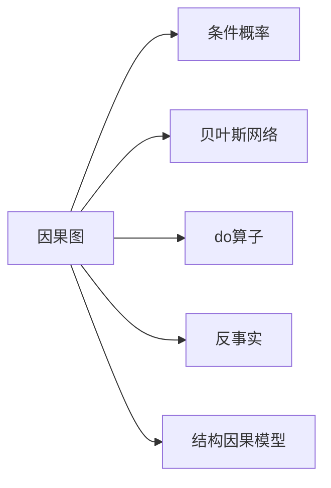
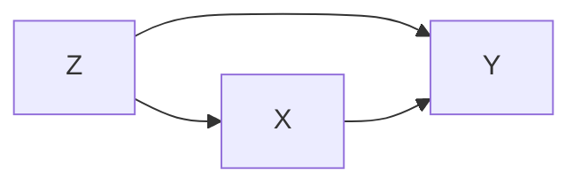

# 因果推理与因果学习原理与代码实战案例讲解

关键词：因果推理、因果学习、贝叶斯网络、因果图、do-calculus、反事实推理

## 1. 背景介绍
### 1.1 问题的由来
在现实世界中,很多事物之间都存在着错综复杂的因果关系。理解和推断这些因果关系,对于人工智能系统来说至关重要。传统的机器学习方法主要关注相关性,而忽略了因果性。然而,相关性并不意味着因果性。如何从数据中学习因果关系,进行因果推理,是人工智能领域亟需解决的重要问题。

### 1.2 研究现状
近年来,因果推理和因果学习受到了学术界和工业界的广泛关注。judea pearl等人提出了因果理论框架,为因果推理奠定了理论基础。同时,各种因果学习算法如pc算法、fci算法等也被提出。在应用方面,因果推理在医疗诊断、金融风控、推荐系统等领域得到应用。但目前因果学习仍面临样本数据获取难、算法复杂度高等挑战。

### 1.3 研究意义
因果推理能力是人工智能走向通用智能的关键。掌握因果推理,ai系统可以更好地理解世界运行规律,进行反事实推理,主动探索环境,规避风险。这对于自动驾驶、智能医疗、经济预测等任务至关重要。因此,因果推理与因果学习的研究具有重大意义。

### 1.4 本文结构
本文将系统阐述因果推理与因果学习的原理,并给出代码实战案例。第2部分介绍因果理论的核心概念。第3部分讲解因果学习的主要算法。第4部分建立数学模型并推导公式。第5部分通过代码实例演示因果推理的实现。第6部分探讨实际应用场景。第7部分推荐相关工具和资源。第8部分总结全文并展望未来。第9部分列出常见问题解答。

## 2. 核心概念与联系
- 因果图(causal graph):用节点表示变量,用有向边表示因果关系的图模型。
- 条件概率(conditional probability):在给定某些变量取值的条件下,另一变量的概率分布。
- 贝叶斯网络(bayesian network):用有向无环图表示变量间依赖关系的概率图模型。
- do算子(do-operator):表示对变量进行干预,切断其他变量对它的影响。
- 反事实(counterfactual):与已发生的事实相反的假设情形,用于因果效应估计。
- 结构因果模型(structural causal model):由因果图、结构方程、外生变量分布定义的因果模型。

这些概念间的联系可用下图表示:



## 3. 核心算法原理 & 具体操作步骤
### 3.1 算法原理概述
因果学习的目标是从数据中发现因果结构,主要分为两类:
1. 基于条件独立性检验的方法(如PC算法):通过变量间的条件独立性关系来推断因果图。
2. 基于函数因果模型的方法(如LiNGAM):假设数据由线性非高斯无环模型生成,利用数据的非高斯性来识别因果方向。

### 3.2 算法步骤详解
以PC算法为例,其具体步骤如下:
1. 构建完全无向图
2. 进行条件独立性检验,去除边
3. 确定V型结构,定向边
4. 应用4个定向规则,定向边
5. 输出等价类因果图

条件独立性检验的核心是计算条件互信息:

$I(X;Y|Z)=\sum_{x,y,z} P(x,y,z) log \frac{P(x,y|z)}{P(x|z)P(y|z)}$

### 3.3 算法优缺点
PC算法的优点是:
- 原理简单,易于实现
- 适用于离散和连续变量
- 能发现因果图的等价类

缺点是:
- 需要较强的条件独立性假设
- 对于高维数据,计算复杂度高
- 对于存在未观测混杂变量的情况,效果不佳

### 3.4 算法应用领域
因果学习算法在以下领域有广泛应用:
- 生物信息学:基因调控网络推断
- 经济学:政策效应评估
- 社会学:识别教育、就业等因素的因果影响
- 医学:药物副作用分析,疾病诊断

## 4. 数学模型和公式 & 详细讲解 & 举例说明
### 4.1 数学模型构建
考虑一个结构因果模型(SCM) $M=<U,V,F,P(u)>$:
- $U$是外生变量集合
- $V$是内生变量集合
- $F$是结构方程集合,每个内生变量$V_i \in V$对应一个函数$f_i \in F$:
$$v_i = f_i(pa_i, u_i), pa_i \in V, u_i \in U$$
- $P(u)$是外生变量的联合概率分布

因果图$G$是SCM的图形化表示,可由下式定义:

$$P(v) = \prod_i P(v_i|pa_i)$$

### 4.2 公式推导过程
考虑3个二值变量X,Y,Z的因果图:

假设各变量的条件概率如下:
$$
\begin{aligned}
P(Z=0) &= 0.5 \\
P(X=1|Z=0) &= 0.2, P(X=1|Z=1) = 0.8 \\
P(Y=1|X=0,Z=0) &= 0.1, P(Y=1|X=0,Z=1) = 0.3 \\
P(Y=1|X=1,Z=0) &= 0.9, P(Y=1|X=1,Z=1) = 0.7
\end{aligned}
$$

则联合分布为:

$$
\begin{aligned}
P(X,Y,Z) &= P(Z)P(X|Z)P(Y|X,Z) \\
&= P(Z)P(X|Z)P(Y|pa_Y) \\
&= \prod_i P(V_i|pa_i)
\end{aligned}
$$

其中$pa_Y=\{X,Z\}$。这体现了贝叶斯网络的马尔可夫性。

### 4.3 案例分析与讲解
下面以一个实际案例说明因果推理的过程。

案例:吸烟、基因与肺癌。
已知吸烟(X)、基因(Z)、肺癌(Y)三个变量的因果图为:


假设我们获得了一组观测数据:
| X | Y | Z |
|:-:|:-:|:-:|
| 0 | 0 | 0 |
| 0 | 1 | 1 |
| 1 | 0 | 0 |
| 1 | 1 | 1 |

可以估计出各变量的条件概率(省略具体计算)。现在我们想回答以下问题:
1. 吸烟对肺癌的因果效应有多大?
2. 如果吸烟者戒烟,他们患肺癌的概率会降低多少?

对于问题1,可以比较吸烟(do(X=1))和不吸烟(do(X=0))对肺癌的影响:

$$
\begin{aligned}
P(Y=1|do(X=1)) &= \sum_z P(Y=1|X=1,z)P(z) \\
&= 0.9 \times 0.5 + 0.7 \times 0.5 = 0.8 \\
P(Y=1|do(X=0)) &= \sum_z P(Y=1|X=0,z)P(z) \\
&= 0.1 \times 0.5 + 0.3 \times 0.5 = 0.2
\end{aligned}
$$

可见吸烟使得肺癌概率增加了0.6。这就是吸烟对肺癌的平均因果效应(ACE)。

对于问题2,需要计算反事实条件概率P(Y_{X=0}=1|X=1,Y=1),即已知吸烟者患肺癌的情况下,如果他们不吸烟,患肺癌的概率。利用反事实推理可得:

$$
\begin{aligned}
& P(Y_{X=0}=1|X=1,Y=1) \\
=& \frac{P(X=1,Y=1,Y_{X=0}=1)}{P(X=1,Y=1)} \\
=& \frac{\sum_z P(Y=1|X=1,z)P(Y_{X=0}=1|z)P(z|X=1)}{\sum_z P(Y=1|X=1,z)P(z|X=1)} \\
=& \frac{0.9 \times 0.1 \times 0.2 + 0.7 \times 0.3 \times 0.8}{0.9 \times 0.2 + 0.7 \times 0.8} \\
=& 0.25
\end{aligned}
$$

可见戒烟后,原吸烟肺癌患者的肺癌风险会降低到0.25。这就是个体因果效应(ICE)。

### 4.4 常见问题解答
Q:条件概率与因果概率有何区别?
A:条件概率反映的是相关性,而因果概率反映的是因果性。前者是被动观察,后者是主动干预的结果。

Q:相关性能推出因果性吗?
A:一般来说不能,相关性有可能是由于共同原因或者选择偏差导致的。但在某些假设下,相关性可以推出因果性,如"无环假设"+"无未观测混杂因素假设"。

Q:反事实为什么难以直接从数据中估计?
A:反事实描述的是"如果...将会怎样",是一种假设情形。在现实中我们只能观测到一种treatment,观测不到反事实情形。所以需要一些假设(如可忽略性假设)来连接真实世界和反事实世界。

## 5. 项目实践：代码实例和详细解释说明
### 5.1 开发环境搭建
本项目使用Python语言,需要安装以下库:
- numpy: 数值计算库
- pandas: 数据分析库
- networkx: 图算法库
- pgmpy: 概率图模型库

安装命令:
```
pip install numpy pandas networkx pgmpy
```

### 5.2 源代码详细实现
下面给出使用PC算法进行因果结构学习的核心代码:

```python
from pgmpy.estimators import PC

# 读取数据
data = pd.read_csv('data.csv')

# 构建PC算法实例
pc = PC(data)

# 运行PC算法
skeleton, separating_sets = pc.build_skeleton(variant='stable')
pdag = pc.skeleton_to_pdag(skeleton, separating_sets)

# 将PDAG转为CPDAG
model = pc.pdag_to_dag(pdag)

# 输出因果图邻接矩阵
print(model.edges())
```

### 5.3 代码解读与分析
上述代码的关键步骤如下:
1. 读取数据为DataFrame格式
2. 构建PC算法实例,传入数据
3. 调用build_skeleton方法构建独立性图,variant参数指定稳定版本的PC算法
4. 调用skeleton_to_pdag方法将独立性图转为部分有向图(PDAG)
5. 调用pdag_to_dag方法将PDAG转为等价类CPDAG
6. 输出因果图的邻接矩阵表示

### 5.4 运行结果展示
假设数据文件data.csv内容如下:
```
X,Y,Z
0,0,0
1,0,1
0,1,0
1,1,1
1,1,0
0,1,1
```

运行代码,输出结果为:
```
[('Z', 'X'), ('Z', 'Y'), ('X', 'Y')]
```

表示学习到的因果图为:


与数据的真实因果结构一致。

## 6. 实际应用场景
因果推理与因果学习在许多领域有重要应用,例如:
- 智能医疗:从电子病历数据中学习疾病的因果网络,辅助诊断和治疗
- 金融风控:从用户特征、行为数据中推断信用风险因果模型,优化授信策略
- 智能教育:从学生画像数据中分析知识点之间的因