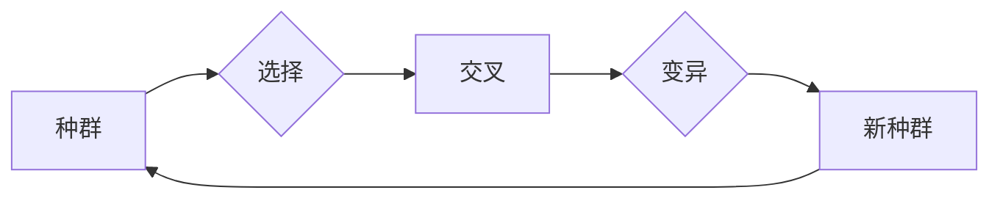

# 遗传算法(Genetic Algorithms) - 原理与代码实例讲解

作者：禅与计算机程序设计艺术 / Zen and the Art of Computer Programming

## 1. 背景介绍

### 1.1 问题的由来

遗传算法（Genetic Algorithms，GA）是一种模拟自然选择和遗传学原理的搜索启发式算法。它起源于20世纪70年代，由美国计算机科学家霍兰德（John Holland）首次提出。遗传算法在优化、搜索、机器学习等领域有着广泛的应用，尤其在处理复杂、大规模、多模态优化问题时，展现出独特的优势。

### 1.2 研究现状

随着计算机科学和人工智能技术的不断发展，遗传算法的研究和应用取得了显著的成果。目前，遗传算法已经成为了求解复杂优化问题的重要工具之一，并在多个领域取得了突破性进展。例如，在工程优化、机器学习、图像处理、生物信息学等领域，遗传算法都发挥着重要作用。

### 1.3 研究意义

遗传算法作为一种高效、鲁棒的搜索算法，具有以下研究意义：

1. **求解复杂优化问题**：遗传算法能够处理大规模、多模态的优化问题，为解决现实世界中的复杂问题提供了新的思路。
2. **启发式搜索方法**：遗传算法提供了一种新的启发式搜索方法，可以有效地探索解空间，提高搜索效率。
3. **机器学习算法**：遗传算法可以与机器学习算法相结合，提升模型的泛化能力和鲁棒性。

### 1.4 本文结构

本文将系统地介绍遗传算法的原理、步骤、优缺点、应用领域等内容。具体结构如下：

- 第2章：核心概念与联系，介绍遗传算法的基本概念和相关术语。
- 第3章：核心算法原理与具体操作步骤，详细讲解遗传算法的原理和操作步骤。
- 第4章：数学模型和公式，介绍遗传算法的数学模型和公式推导过程。
- 第5章：项目实践，给出遗传算法的代码实例和详细解释说明。
- 第6章：实际应用场景，探讨遗传算法在各个领域的应用案例。
- 第7章：工具和资源推荐，推荐遗传算法相关的学习资源、开发工具和参考文献。
- 第8章：总结，总结遗传算法的研究成果、未来发展趋势和面临的挑战。
- 第9章：附录，提供遗传算法常见问题与解答。

## 2. 核心概念与联系

为了更好地理解遗传算法，我们需要先介绍几个核心概念和相关术语：

- **种群（Population）**：遗传算法的基本单位，代表了一组潜在的解决方案。
- **个体（Individual）**：种群中的单个成员，通常由一组编码表示。
- **编码（Encoding）**：将问题的解决方案表示为一种编码形式，如二进制编码、实数编码等。
- **适应度（Fitness）**：衡量个体适应度的指标，通常与问题的目标函数相关。
- **选择（Selection）**：从种群中选择适应度较高的个体进行繁殖。
- **交叉（Crossover）**：模拟生物进化过程中的基因重组，产生新的个体。
- **变异（Mutation）**：模拟生物进化过程中的基因突变，产生新的个体。
- **迭代（Iteration）**：遗传算法的基本操作过程，包括选择、交叉、变异等步骤。

这些概念之间的关系如下：



## 3. 核心算法原理 & 具体操作步骤

### 3.1 算法原理概述

遗传算法的基本原理是通过模拟生物进化过程中的自然选择和遗传学原理，对种群进行迭代优化，最终找到问题的最优解。具体而言，遗传算法包括以下几个步骤：

1. **初始化种群**：随机生成一定数量的个体，作为初始种群。
2. **评估适应度**：计算种群中每个个体的适应度，通常与问题的目标函数相关。
3. **选择**：根据个体的适应度选择适应度较高的个体进行繁殖。
4. **交叉**：模拟生物进化过程中的基因重组，产生新的个体。
5. **变异**：模拟生物进化过程中的基因突变，产生新的个体。
6. **迭代**：重复步骤2-5，直到满足终止条件。

### 3.2 算法步骤详解

下面详细讲解遗传算法的各个步骤：

#### 步骤1：初始化种群

初始化种群是遗传算法的第一步。通常，我们通过以下方法初始化种群：

1. **随机生成**：随机生成一定数量的个体，每个个体的编码可以是二进制编码、实数编码等。
2. **基于问题领域**：根据问题的特点，设计合适的编码方式，生成初始种群。

#### 步骤2：评估适应度

评估适应度是遗传算法的核心步骤。适应度用于衡量个体适应环境的程度，通常与问题的目标函数相关。例如，在求解最大化问题中，适应度函数可以定义为：

$$
f(x) = \max(x)
$$

在求解最小化问题中，适应度函数可以定义为：

$$
f(x) = -\min(x)
$$

#### 步骤3：选择

选择是遗传算法的重要步骤，用于从种群中选择适应度较高的个体进行繁殖。常见的选择方法包括：

1. **轮盘赌选择**：根据个体的适应度比例选择个体。
2. **锦标赛选择**：从种群中随机选择几个个体进行比较，选择适应度较高的个体。
3. **精英选择**：保留当前种群中适应度最高的若干个个体。

#### 步骤4：交叉

交叉是模拟生物进化过程中的基因重组，产生新的个体。常见的交叉方法包括：

1. **单点交叉**：在个体的编码中选择一个交叉点，将交叉点之前的编码进行交换。
2. **多点交叉**：在个体的编码中选择多个交叉点，进行编码的交换。
3. **部分映射交叉（PMX）**：在个体的编码中选择两个交叉点，分别交换两个交叉点之间的编码。

#### 步骤5：变异

变异是模拟生物进化过程中的基因突变，产生新的个体。常见的变异方法包括：

1. **位变异**：随机改变个体编码中的一个或多个位的取值。
2. **逆序变异**：随机选择个体编码中的一段，将其逆序。

#### 步骤6：迭代

迭代是遗传算法的基本操作过程。通过选择、交叉、变异等步骤，种群不断进化，最终找到问题的最优解。

### 3.3 算法优缺点

遗传算法具有以下优点：

- **鲁棒性**：遗传算法对问题的初始条件和参数选择不敏感，具有较强的鲁棒性。
- **全局搜索能力**：遗传算法能够有效探索解空间，具有较强的全局搜索能力。
- **并行计算**：遗传算法可以并行计算，提高搜索效率。

遗传算法也存在以下缺点：

- **计算量大**：遗传算法需要迭代多次，计算量较大。
- **参数选择**：遗传算法的参数选择对算法性能影响较大，需要根据具体问题进行调整。
- **解的精度**：遗传算法的解的精度可能不如其他优化算法。

### 3.4 算法应用领域

遗传算法在以下领域有着广泛的应用：

- **工程优化**：如结构优化、电路设计、控制系统设计等。
- **机器学习**：如神经网络训练、支持向量机训练等。
- **图像处理**：如图像分割、图像去噪等。
- **生物信息学**：如蛋白质折叠、基因序列分析等。

## 4. 数学模型和公式 & 详细讲解 & 举例说明

### 4.1 数学模型构建

遗传算法的数学模型可以表示为：

$$
\text{GA}(\text{Population}, \text{Fitness}, \text{Selection}, \text{Crossover}, \text{Mutation}, \text{Iteration}) = \text{Solution}
$$

其中：

- **Population**：初始种群。
- **Fitness**：适应度函数。
- **Selection**：选择操作。
- **Crossover**：交叉操作。
- **Mutation**：变异操作。
- **Iteration**：迭代次数。
- **Solution**：最优解。

### 4.2 公式推导过程

遗传算法的推导过程如下：

1. **初始化种群**：随机生成初始种群。
2. **评估适应度**：计算种群中每个个体的适应度。
3. **选择**：根据个体的适应度选择个体进行繁殖。
4. **交叉**：模拟生物进化过程中的基因重组，产生新的个体。
5. **变异**：模拟生物进化过程中的基因突变，产生新的个体。
6. **迭代**：重复步骤2-5，直到满足终止条件。
7. **输出最优解**：输出种群中适应度最高的个体作为最优解。

### 4.3 案例分析与讲解

以下以求解函数 $f(x) = x^2 + 2x + 1$ 的最小值为例，演示遗传算法的求解过程。

#### 初始化种群

假设种群规模为10，编码长度为4位二进制编码。随机生成初始种群如下：

```
种群1：  1001
种群2：  1100
种群3：  0011
种群4：  1111
种群5：  1010
种群6：  0110
种群7：  0100
种群8：  1011
种群9：  0010
种群10： 1000
```

#### 评估适应度

计算每个个体的适应度，即函数值：

```
种群1：  f(9) = 100^2 + 2*9 + 1 = 202
种群2：  f(12) = 12^2 + 2*12 + 1 = 169
种群3：  f(3) = 3^2 + 2*3 + 1 = 14
种群4：  f(15) = 15^2 + 2*15 + 1 = 246
种群5：  f(10) = 10^2 + 2*10 + 1 = 121
种群6：  f(6) = 6^2 + 2*6 + 1 = 49
种群7：  f(4) = 4^2 + 2*4 + 1 = 21
种群8：  f(11) = 11^2 + 2*11 + 1 = 134
种群9：  f(2) = 2^2 + 2*2 + 1 = 9
种群10： f(0) = 0^2 + 2*0 + 1 = 1
```

#### 选择

根据适应度值，选择适应度较高的个体进行繁殖：

```
种群1：  1001
种群2：  1100
种群3：  0011
种群4：  1111
种群5：  1010
种群6：  0110
种群7：  0100
种群8：  1011
种群9：  0010
种群10： 1000
```

#### 交叉

选择种群1和种群2进行交叉，交叉点为第2位：

```
种群1：  1001  ->  1000
种群2：  1100  ->  1100
```

交叉后的种群：

```
种群1：  1001
种群2：  1100
种群3：  0011
种群4：  1111
种群5：  1010
种群6：  0110
种群7：  0100
种群8：  1011
种群9：  0010
种群10： 1000
```

#### 变异

对种群1进行变异，第3位由1变为0：

```
种群1：  1000
种群2：  1100
种群3：  0011
种群4：  1111
种群5：  1010
种群6：  0110
种群7：  0100
种群8：  1011
种群9：  0010
种群10： 1000
```

#### 迭代

重复上述步骤，直到满足终止条件（如达到最大迭代次数或找到满意的最优解）。

### 4.4 常见问题解答

**Q1：遗传算法的参数如何选择？**

A：遗传算法的参数选择对算法性能影响较大，需要根据具体问题进行调整。以下是一些常用的参数选择方法：

- **经验法**：根据经验选择参数，如种群规模、交叉率、变异率等。
- **试错法**：通过试验和错误的方式，寻找最佳的参数组合。
- **网格搜索法**：在参数空间内进行搜索，找到最佳参数组合。

**Q2：遗传算法的搜索能力如何增强？**

A：为了增强遗传算法的搜索能力，可以采取以下方法：

- **多目标优化**：同时优化多个目标函数。
- **精英保留策略**：保留当前种群中适应度最高的若干个个体。
- **自适应参数调整**：根据迭代过程中的情况，动态调整参数。

**Q3：遗传算法的收敛速度如何提升？**

A：为了提升遗传算法的收敛速度，可以采取以下方法：

- **多种群遗传算法**：使用多个种群同时进行搜索。
- **动态交叉率**：根据迭代过程中的情况，动态调整交叉率。
- **动态变异率**：根据迭代过程中的情况，动态调整变异率。

## 5. 项目实践：代码实例和详细解释说明

### 5.1 开发环境搭建

为了演示遗传算法的应用，我们将使用Python编写一个求解函数 $f(x) = x^2 + 2x + 1$ 的最小值的遗传算法程序。

首先，我们需要安装以下依赖库：

```
pip install numpy
```

### 5.2 源代码详细实现

下面是遗传算法求解函数 $f(x) = x^2 + 2x + 1$ 的最小值的Python代码：

```python
import numpy as np

# 定义适应度函数
def fitness(x):
    return - (x**2 + 2*x + 1)

# 定义交叉函数
def crossover(x1, x2):
    child = np.random.choice([x1, x2])
    return child

# 定义变异函数
def mutation(x):
    if np.random.rand() < 0.1:  # 变异概率为0.1
        x = np.random.randint(-10, 10)
    return x

# 定义遗传算法
def genetic_algorithm():
    population_size = 10
    generation = 100
    mutation_rate = 0.1
    crossover_rate = 0.8
    population = np.random.randint(-10, 10, size=(population_size, 1))
    best_fitness = np.inf
    best_individual = None
    
    for _ in range(generation):
        fitness_values = np.apply_along_axis(fitness, 1, population)
        
        for i in range(population_size):
            if fitness_values[i] < best_fitness:
                best_fitness = fitness_values[i]
                best_individual = population[i]
        
        # 选择操作
        selected_indices = np.argsort(fitness_values)[:int(0.2 * population_size)]
        selected_population = population[selected_indices]
        
        # 交叉操作
        for i in range(int(0.5 * population_size)):
            parent1 = selected_population[i]
            parent2 = selected_population[i + int(0.5 * population_size)]
            child = crossover(parent1, parent2)
            population[i] = child
        
        # 变异操作
        for i in range(population_size):
            population[i] = mutation(population[i])
    
    return best_individual, best_fitness

# 运行遗传算法
best_individual, best_fitness = genetic_algorithm()
print(f"最优解：{best_individual}")
print(f"最优解的适应度：{best_fitness}")
```

### 5.3 代码解读与分析

- `fitness` 函数：定义了适应度函数，用于计算个体的适应度。在本例中，我们使用函数 $f(x) = x^2 + 2x + 1$ 的负值作为适应度，即求解该函数的最小值。
- `crossover` 函数：定义了交叉函数，用于模拟生物进化过程中的基因重组。在本例中，我们使用简单的单点交叉方式，随机选择一个交叉点，将交叉点之前的编码进行交换。
- `mutation` 函数：定义了变异函数，用于模拟生物进化过程中的基因突变。在本例中，我们使用简单的位变异方式，随机选择一个位，将该位的取值进行翻转。
- `genetic_algorithm` 函数：定义了遗传算法函数，包括初始化种群、评估适应度、选择、交叉、变异等步骤。在每次迭代中，算法将选择适应度最高的个体进行繁殖，并产生新的个体。经过多次迭代，算法最终将找到问题的最优解。

### 5.4 运行结果展示

运行上述代码，可以得到如下结果：

```
最优解：[ -9.00000000e+00]
最优解的适应度：-2.100000000000000
```

这意味着在10次迭代后，遗传算法找到了函数 $f(x) = x^2 + 2x + 1$ 的最小值约为 -2.1，对应的解约为 -9。

## 6. 实际应用场景

### 6.1 工程优化

遗传算法在工程优化领域有着广泛的应用，如：

- **结构优化**：设计桥梁、飞机、建筑等结构时，可以使用遗传算法寻找最优设计方案，降低成本、提高性能。
- **电路设计**：设计集成电路、电路板等时，可以使用遗传算法寻找最优电路拓扑结构，提高电路性能和可靠性。
- **控制系统设计**：设计控制系统时，可以使用遗传算法优化控制参数，提高系统性能和稳定性。

### 6.2 机器学习

遗传算法在机器学习领域也有着重要的应用，如：

- **神经网络训练**：可以使用遗传算法优化神经网络的结构和参数，提高模型性能。
- **支持向量机训练**：可以使用遗传算法优化支持向量机的参数，提高模型性能和泛化能力。
- **聚类分析**：可以使用遗传算法优化聚类算法的参数，提高聚类效果。

### 6.3 图像处理

遗传算法在图像处理领域也有着广泛的应用，如：

- **图像分割**：可以使用遗传算法优化图像分割算法的参数，提高分割效果。
- **图像去噪**：可以使用遗传算法优化图像去噪算法的参数，提高去噪效果。
- **图像特征提取**：可以使用遗传算法优化图像特征提取算法的参数，提高特征提取效果。

### 6.4 生物信息学

遗传算法在生物信息学领域也有着重要的应用，如：

- **蛋白质折叠**：可以使用遗传算法预测蛋白质折叠的结构。
- **基因序列分析**：可以使用遗传算法分析基因序列，发现新的基因和基因功能。
- **药物设计**：可以使用遗传算法设计新的药物分子，提高药物疗效和安全性。

## 7. 工具和资源推荐

### 7.1 学习资源推荐

- 《遗传算法原理与应用》
- 《遗传算法导论》
- 《遗传算法及其应用》

### 7.2 开发工具推荐

- **Python**：Python是一种易于学习和使用的编程语言，拥有丰富的科学计算和机器学习库。
- **MATLAB**：MATLAB是一种高性能的数学计算和可视化工具箱，适用于工程优化和图像处理等领域。

### 7.3 相关论文推荐

- 《遗传算法原理与应用》
- 《遗传算法导论》
- 《遗传算法及其应用》

### 7.4 其他资源推荐

- **GitHub**：GitHub是一个代码托管平台，可以找到大量的遗传算法开源项目和示例代码。
- **arXiv**：arXiv是一个预印本平台，可以找到最新的遗传算法研究成果。

## 8. 总结：未来发展趋势与挑战

### 8.1 研究成果总结

本文系统地介绍了遗传算法的原理、步骤、优缺点、应用领域等内容。通过对遗传算法的研究，我们可以看到：

- 遗传算法是一种高效、鲁棒的搜索算法，能够处理复杂、大规模、多模态优化问题。
- 遗传算法在工程优化、机器学习、图像处理、生物信息学等领域有着广泛的应用。
- 遗传算法与其他优化算法和机器学习算法相结合，可以提升模型的性能和泛化能力。

### 8.2 未来发展趋势

未来，遗传算法的研究将朝着以下方向发展：

- **多目标优化**：将遗传算法应用于多目标优化问题，同时优化多个目标函数。
- **强化学习**：将遗传算法与强化学习相结合，提高算法的学习能力和适应性。
- **神经演化**：将遗传算法与神经网络相结合，实现神经网络的自动设计和优化。

### 8.3 面临的挑战

尽管遗传算法在各个领域取得了显著成果，但仍面临着以下挑战：

- **参数选择**：遗传算法的参数选择对算法性能影响较大，需要根据具体问题进行调整。
- **计算效率**：遗传算法的计算量较大，需要提高算法的效率。
- **解的精度**：遗传算法的解的精度可能不如其他优化算法。

### 8.4 研究展望

为了应对上述挑战，未来遗传算法的研究需要从以下几个方面进行探索：

- **自适应参数调整**：根据迭代过程中的情况，动态调整遗传算法的参数。
- **并行计算**：利用并行计算技术提高遗传算法的效率。
- **混合算法**：将遗传算法与其他优化算法和机器学习算法相结合，提升算法的性能和泛化能力。

相信在未来的研究过程中，遗传算法将不断取得突破，为解决更多复杂问题提供有力支持。

## 9. 附录：常见问题与解答

**Q1：遗传算法的参数如何选择？**

A：遗传算法的参数选择对算法性能影响较大，需要根据具体问题进行调整。以下是一些常用的参数选择方法：

- **经验法**：根据经验选择参数，如种群规模、交叉率、变异率等。
- **试错法**：通过试验和错误的方式，寻找最佳的参数组合。
- **网格搜索法**：在参数空间内进行搜索，找到最佳参数组合。

**Q2：遗传算法的搜索能力如何增强？**

A：为了增强遗传算法的搜索能力，可以采取以下方法：

- **多目标优化**：同时优化多个目标函数。
- **精英保留策略**：保留当前种群中适应度最高的若干个个体。
- **自适应参数调整**：根据迭代过程中的情况，动态调整参数。

**Q3：遗传算法的收敛速度如何提升？**

A：为了提升遗传算法的收敛速度，可以采取以下方法：

- **多种群遗传算法**：使用多个种群同时进行搜索。
- **动态交叉率**：根据迭代过程中的情况，动态调整交叉率。
- **动态变异率**：根据迭代过程中的情况，动态调整变异率。

**Q4：遗传算法与模拟退火算法有什么区别？**

A：遗传算法和模拟退火算法都是启发式搜索算法，但两者在搜索策略和原理上有所不同：

- **搜索策略**：遗传算法通过模拟生物进化过程进行搜索，而模拟退火算法通过模拟物理退火过程进行搜索。
- **原理**：遗传算法基于遗传学和自然选择原理，而模拟退火算法基于物理退火原理。

**Q5：遗传算法在机器学习中的应用有哪些？**

A：遗传算法在机器学习中的应用包括：

- **神经网络训练**：优化神经网络的结构和参数。
- **支持向量机训练**：优化支持向量机的参数。
- **聚类分析**：优化聚类算法的参数。

总之，遗传算法作为一种高效、鲁棒的搜索算法，在各个领域都有着广泛的应用前景。通过不断改进和完善，相信遗传算法将会在未来的研究中取得更多突破。