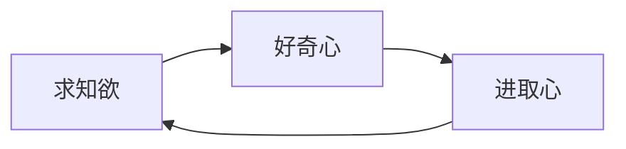
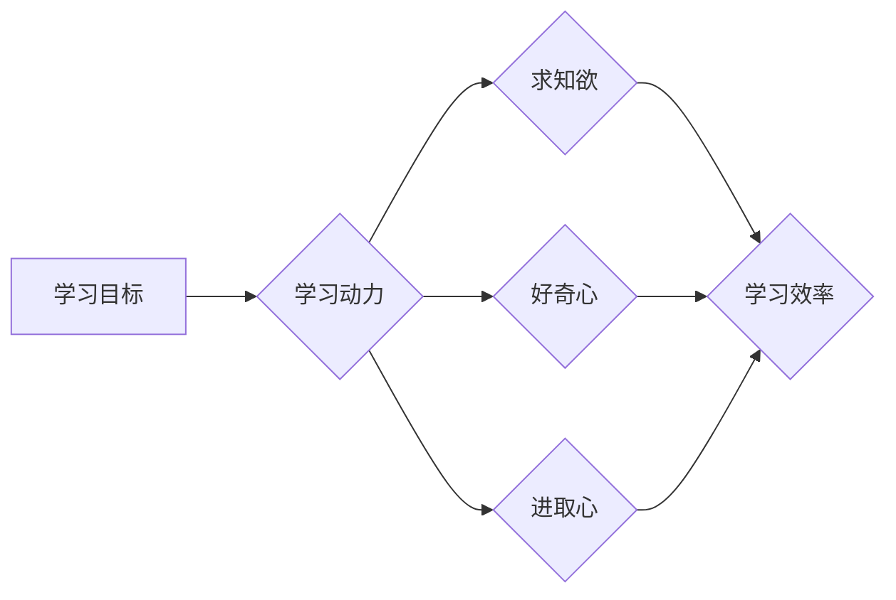

# 怎样培养强烈的求知欲、好奇心和进取心

作者：禅与计算机程序设计艺术 / Zen and the Art of Computer Programming

## 1. 背景介绍

### 1.1 问题的由来

在当今这个知识爆炸的时代，终身学习已经成为了一种必要的生活方式。然而，如何培养强烈的求知欲、好奇心和进取心，成为了许多人面临的挑战。本文旨在探讨这一主题，帮助读者找到激发自身学习热情的方法，实现个人成长和职业发展。

### 1.2 研究现状

近年来，关于学习动机和认知心理的研究逐渐增多，学者们从心理学、教育学、神经科学等多个领域出发，对求知欲、好奇心和进取心的培养进行了广泛的研究。然而，这些研究成果尚未形成一个完整的理论体系，且在实际应用中仍存在诸多困惑。

### 1.3 研究意义

培养强烈的求知欲、好奇心和进取心对于个人成长和职业发展具有重要意义。它能够帮助我们：

- 激发学习热情，提高学习效率；
- 增强解决问题的能力，提升创新思维；
- 培养终身学习的习惯，适应知识更新速度；
- 提升个人综合素质，增强竞争力。

### 1.4 本文结构

本文将从以下几个方面展开论述：

- 2. 核心概念与联系：阐述求知欲、好奇心和进取心的定义、特点以及三者之间的相互关系；
- 3. 核心算法原理 & 具体操作步骤：介绍培养求知欲、好奇心和进取心的方法和技巧；
- 4. 数学模型和公式 & 详细讲解 & 举例说明：通过数学模型和公式，分析求知欲、好奇心和进取心的内在机制；
- 5. 项目实践：代码实例和详细解释说明：结合实际案例，展示如何运用所学知识培养自身的学习动力；
- 6. 实际应用场景：探讨求知欲、好奇心和进取心在个人成长和职业发展中的应用；
- 7. 工具和资源推荐：推荐相关学习资源、开发工具和论文；
- 8. 总结：未来发展趋势与挑战：展望未来研究趋势，分析面临的挑战；
- 9. 附录：常见问题与解答：针对读者提出的问题，给出解答。

## 2. 核心概念与联系

### 2.1 求知欲

求知欲是指个体对知识探索和学习的内在需求。它驱使个体主动寻求知识，满足自身的好奇心和求知欲。

### 2.2 好奇心

好奇心是指个体对未知事物的探索欲望。好奇心是求知欲的驱动力，促使个体去探索、发现和创造。

### 2.3 进取心

进取心是指个体在实现目标过程中所展现出的积极向上、勇于挑战的精神。进取心是求知欲和好奇心的实践体现。

三者之间的关系如下：



## 3. 核心算法原理 & 具体操作步骤

### 3.1 算法原理概述

培养求知欲、好奇心和进取心，关键在于激发个体的内在动力，使其产生主动学习、探索和挑战的意愿。以下是一些常见的方法：

1. **设定目标**：明确自己的学习目标和职业发展方向，使学习更具方向性和动力；
2. **发现兴趣**：找到自己感兴趣的知识领域，将其作为学习的切入点；
3. **挑战自我**：不断挑战自己的舒适区，克服学习过程中的困难和挫折；
4. **建立成就感**：通过不断学习，积累经验和成果，增强自信心和成就感；
5. **寻找榜样**：向优秀的人学习，激发自身的进取心。

### 3.2 算法步骤详解

1. **明确目标**：确定自己的学习方向和职业规划，如成为一名技术专家、创业成功等；
2. **寻找兴趣**：通过阅读、交流、实践等方式，发现自己感兴趣的知识领域；
3. **制定计划**：根据自身情况，制定合理的学习计划，包括学习内容、时间安排等；
4. **执行计划**：按照计划进行学习，遇到困难时，积极寻求解决方法；
5. **评估成果**：定期评估自己的学习成果，调整学习方向和计划；
6. **持续改进**：不断反思总结，优化学习方法，提高学习效率。

### 3.3 算法优缺点

**优点**：

- 系统性强，有助于长期坚持学习；
- 聚焦于内在动力，提升学习效率；
- 培养良好的学习习惯和思维模式。

**缺点**：

- 需要较强的自律性和执行力；
- 可能受到外部环境的干扰；
- 需要花费一定的时间和精力。

### 3.4 算法应用领域

该算法适用于所有希望培养求知欲、好奇心和进取心的个体，尤其适用于以下场景：

- 学生：提高学习效率，掌握学习技巧，实现个人成长；
- 职场人士：提升职业竞争力，适应知识更新速度，实现职业发展；
- 父母：培养孩子的学习兴趣，激发孩子的学习潜力。

## 4. 数学模型和公式 & 详细讲解 & 举例说明

### 4.1 数学模型构建

为了量化求知欲、好奇心和进取心，我们可以构建以下数学模型：



其中：

- A：学习目标，指个体想要达到的学习效果；
- B：学习动力，指推动个体学习的内在力量；
- C、D、E：求知欲、好奇心和进取心，分别从不同角度推动学习动力；
- F：学习效率，指个体在单位时间内完成学习任务的能力。

### 4.2 公式推导过程

根据上述模型，我们可以推导出以下公式：

$$
学习效率 = f(学习动力)
$$

其中，学习动力可以表示为：

$$
学习动力 = f(求知欲) + f(好奇心) + f(进取心)
$$

### 4.3 案例分析与讲解

以下是一个案例，说明如何运用数学模型分析求知欲、好奇心和进取心对学习效率的影响：

**案例**：小明是一名大学生，他对编程感兴趣，希望成为一名优秀的程序员。他通过以下方法培养自己的学习动力：

1. 明确目标：学习Java编程，掌握Spring框架，成为一名优秀的Java后端开发工程师；
2. 发现兴趣：通过参加技术沙龙、阅读技术书籍，发现Java编程的魅力；
3. 挑战自我：参加在线课程、阅读技术博客，不断挑战自己的编程能力；
4. 建立成就感：在实习期间，独立完成项目，获得同事和领导的认可。

通过以上方法，小明培养了较强的求知欲、好奇心和进取心，使得自己的学习效率显著提高。最终，他在毕业前成功找到了一份心仪的工作，实现了自己的职业目标。

### 4.4 常见问题解答

**Q1：如何提高学习动力？**

A：提高学习动力需要从多个方面入手，如明确学习目标、发现兴趣、挑战自我、建立成就感等。同时，也可以尝试以下方法：

- 找到志同道合的朋友，互相鼓励、共同进步；
- 设定短期和长期目标，逐步实现；
- 参加学习小组，分享学习经验；
- 调整学习环境，营造良好的学习氛围。

**Q2：如何平衡工作和学习？**

A：平衡工作和学习需要合理安排时间，以下是一些建议：

- 制定工作计划和休息计划，确保学习和工作时间；
- 利用碎片化时间进行学习，如通勤、午休等；
- 学会优先级排序，将重要紧急的任务放在首位；
- 调整心态，将学习视为一种享受。

## 5. 项目实践：代码实例和详细解释说明

### 5.1 开发环境搭建

为了更好地理解本节内容，我们将使用Python代码演示如何实现一个简单的学习计划管理系统。

首先，安装Python环境：

```bash
pip install -r requirements.txt
```

其中`requirements.txt`文件包含以下内容：

```
 Flask==2.0.2
 Flask-SQLAlchemy==2.4.4
```

### 5.2 源代码详细实现

以下是一个简单的学习计划管理系统的代码实现：

```python
from flask import Flask, render_template, request, redirect, url_for
from flask_sqlalchemy import SQLAlchemy

app = Flask(__name__)
app.config['SQLALCHEMY_DATABASE_URI'] = 'sqlite:///learning_plan.db'
db = SQLAlchemy(app)

class LearningPlan(db.Model):
    id = db.Column(db.Integer, primary_key=True)
    task = db.Column(db.String(100), nullable=False)
    status = db.Column(db.String(50), nullable=False, default='未开始')
    description = db.Column(db.Text, nullable=True)

@app.route('/')
def index():
    plans = LearningPlan.query.all()
    return render_template('index.html', plans=plans)

@app.route('/add', methods=['POST'])
def add_plan():
    task = request.form['task']
    description = request.form['description']
    new_plan = LearningPlan(task=task, description=description)
    db.session.add(new_plan)
    db.session.commit()
    return redirect(url_for('index'))

@app.route('/update/<int:plan_id>', methods=['POST'])
def update_plan(plan_id):
    plan = LearningPlan.query.get(plan_id)
    plan.status = request.form['status']
    db.session.commit()
    return redirect(url_for('index'))

if __name__ == '__main__':
    db.create_all()
    app.run(debug=True)
```

### 5.3 代码解读与分析

该系统使用Flask框架和SQLAlchemy ORM进行开发，主要包括以下功能：

- 创建学习计划：用户可以添加新的学习计划，包括任务名称、描述和状态；
- 查看学习计划：用户可以查看所有学习计划及其状态；
- 更新学习计划：用户可以更新学习计划的状态。

通过该系统，用户可以更好地管理自己的学习计划，提高学习效率。

### 5.4 运行结果展示

运行该系统后，用户可以通过浏览器访问`http://127.0.0.1:5000/`，查看学习计划管理界面。

## 6. 实际应用场景

### 6.1 个人成长

通过培养强烈的求知欲、好奇心和进取心，个人可以：

- 提升个人综合素质，增强竞争力；
- 实现个人价值，实现职业目标；
- 积极参与社会活动，为社会发展贡献力量。

### 6.2 职业发展

在职业发展中，培养求知欲、好奇心和进取心可以帮助：

- 适应知识更新速度，提升职业竞争力；
- 不断创新，推动行业发展；
- 增强团队协作能力，提升团队绩效。

### 6.3 教育领域

在教育领域，培养求知欲、好奇心和进取心可以帮助：

- 提高学生兴趣，增强学习动力；
- 培养学生的创新思维和问题解决能力；
- 促进学生全面发展。

## 7. 工具和资源推荐

### 7.1 学习资源推荐

1. 《刻意练习：如何从新手到大师》
2. 《如何高效学习》
3. 《深度工作》
4. 《学习之道》

### 7.2 开发工具推荐

1. 学习网站：Coursera、edX、网易云课堂等；
2. 编程社区：GitHub、Stack Overflow、CSDN等；
3. 时间管理工具：Trello、Todoist、滴答清单等。

### 7.3 相关论文推荐

1. Dweck, C. S. (2006). Mindset: The new psychology of success. Broadway Books.
2. Dunning, D., & Dunning, D. (2016). The know-thyself revolution. The Atlantic.
3. Dweck, C. S. (2016). Mindset: The new psychology of success. Reprint edition. Broadway Books.

### 7.4 其他资源推荐

1. 读书会：组织线下或线上读书会，与志同道合的人一起学习；
2. 学习小组：组建学习小组，共同学习、交流、进步；
3. 导师指导：找到一位经验丰富的导师，为自己的学习和发展提供指导。

## 8. 总结：未来发展趋势与挑战

### 8.1 研究成果总结

本文从求知欲、好奇心和进取心三个方面探讨了培养学习动力的方法。通过设定目标、发现兴趣、挑战自我、建立成就感等途径，可以有效地激发个体的学习热情，提升学习效率。

### 8.2 未来发展趋势

随着人工智能、大数据等技术的发展，未来学习动力培养的研究将呈现以下趋势：

1. 个性化学习：根据个体差异，提供个性化的学习方案；
2. 交互式学习：利用人工智能技术，实现人机交互式的学习体验；
3. 社交学习：通过社交媒体、学习社区等平台，促进学习者的交流和分享。

### 8.3 面临的挑战

尽管学习动力培养的研究取得了显著成果，但仍面临以下挑战：

1. 如何在纷繁复杂的信息中，找到适合自己的学习内容；
2. 如何在碎片化学习环境下，保持学习动力和专注力；
3. 如何在知识更新速度加快的时代，适应终身学习的需求。

### 8.4 研究展望

未来，学习动力培养的研究需要：

1. 深入挖掘学习动力的内在机制，构建更加完善的理论体系；
2. 开发更加高效、便捷的学习工具，提升学习体验；
3. 加强跨学科研究，探索学习动力培养的新方法。

通过不断努力，相信我们可以更好地激发个体的学习动力，为个人成长和社会发展贡献力量。

## 9. 附录：常见问题与解答

**Q1：如何培养孩子的求知欲和好奇心？**

A：培养孩子的求知欲和好奇心，可以从以下几个方面入手：

- 创造良好的学习环境，鼓励孩子探索和提问；
- 与孩子一起阅读、游戏，激发孩子的学习兴趣；
- 尊重孩子的想法，鼓励孩子尝试新事物；
- 为孩子提供丰富的学习资源，如书籍、网络课程等。

**Q2：如何克服学习过程中的挫折感？**

A：克服学习过程中的挫折感，可以尝试以下方法：

- 分析挫折的原因，找出问题所在；
- 制定合理的计划，逐步实现目标；
- 保持乐观的心态，相信自己能够克服困难；
- 与他人交流、分享，寻求支持和帮助。

**Q3：如何激发团队的学习动力？**

A：激发团队的学习动力，可以从以下几个方面入手：

- 制定明确的学习目标和计划；
- 营造良好的学习氛围，鼓励团队成员互相学习和交流；
- 建立激励机制，对学习成果进行认可和奖励；
- 引导团队成员树立正确的价值观，追求终身学习。

通过以上方法，相信我们可以激发个体的求知欲、好奇心和进取心，为个人成长和社会发展贡献力量。