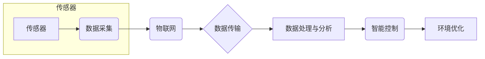

# 智能家居环境质量分析系统的设计与实现

作者：禅与计算机程序设计艺术 / Zen and the Art of Computer Programming

## 1. 背景介绍
### 1.1 问题的由来

随着科技的不断发展，人们的生活水平不断提高，对于居住环境的舒适度和健康性也提出了更高的要求。智能家居系统应运而生，通过将各种家电设备、照明系统、监控系统等连接起来，实现家庭环境的智能化管理，提升居住体验。然而，智能家居系统在提升生活便利性的同时，也带来了一系列环境质量方面的问题，如空气质量、温度、湿度、噪音等。因此，如何设计和实现一个智能家居环境质量分析系统，成为了一个亟待解决的问题。

### 1.2 研究现状

目前，智能家居环境质量分析系统的研究主要集中在以下几个方面：

1. **传感器技术**：通过各类传感器实时采集室内外环境数据，如空气质量传感器、温度传感器、湿度传感器、噪音传感器等。
2. **数据采集与传输**：采用物联网技术，将传感器采集到的数据实时传输到服务器或移动设备。
3. **数据处理与分析**：对采集到的数据进行处理和分析，识别环境质量变化趋势，预测潜在问题。
4. **智能控制**：根据环境质量分析结果，自动调节家电设备、照明系统等，实现环境质量的最优化。

### 1.3 研究意义

智能家居环境质量分析系统的设计与实现具有以下重要意义：

1. **改善居住环境**：通过对环境质量的实时监测和分析，及时发现并解决环境问题，提高居住舒适度和健康性。
2. **降低能源消耗**：通过智能控制家电设备，实现节能减排，降低能源消耗。
3. **提高生活品质**：通过提供便捷、舒适、健康的居住环境，提升人们的生活品质。
4. **推动产业发展**：推动智能家居产业的发展，促进相关技术的创新和应用。

### 1.4 本文结构

本文将围绕智能家居环境质量分析系统的设计与实现展开讨论，主要包括以下内容：

- 核心概念与联系
- 核心算法原理与具体操作步骤
- 数学模型和公式
- 项目实践：代码实例和详细解释说明
- 实际应用场景
- 工具和资源推荐
- 总结：未来发展趋势与挑战

## 2. 核心概念与联系

为了更好地理解和实现智能家居环境质量分析系统，我们需要了解以下核心概念：

1. **传感器**：用于感知环境参数，如温度、湿度、空气质量等。
2. **物联网**：将各类设备连接起来，实现数据的采集、传输和处理。
3. **数据采集与传输**：将传感器采集到的数据实时传输到服务器或移动设备。
4. **数据处理与分析**：对采集到的数据进行处理和分析，识别环境质量变化趋势，预测潜在问题。
5. **智能控制**：根据环境质量分析结果，自动调节家电设备、照明系统等，实现环境质量的最优化。

这些概念之间的关系如下图所示：



## 3. 核心算法原理与具体操作步骤
### 3.1 算法原理概述

智能家居环境质量分析系统主要包括以下核心算法：

1. **数据采集与传输**：采用物联网技术，通过传感器实时采集环境数据，并将数据传输到服务器或移动设备。
2. **数据处理与分析**：对采集到的数据进行预处理、特征提取、异常检测、趋势分析等，识别环境质量变化趋势，预测潜在问题。
3. **智能控制**：根据环境质量分析结果，自动调节家电设备、照明系统等，实现环境质量的最优化。

### 3.2 算法步骤详解

**数据采集与传输**：

1. 选用合适的传感器，如空气质量传感器、温度传感器、湿度传感器、噪音传感器等。
2. 将传感器连接到物联网平台，实现数据的实时采集和传输。
3. 采用MQTT、CoAP等物联网协议，确保数据传输的可靠性和安全性。

**数据处理与分析**：

1. 对采集到的数据进行预处理，如滤波、去噪等。
2. 提取环境质量特征，如PM2.5浓度、温度、湿度、噪音等级等。
3. 使用机器学习算法进行异常检测，如K-means聚类、孤立森林等。
4. 分析环境质量变化趋势，预测潜在问题，如空气质量恶化、温度过高等。

**智能控制**：

1. 根据环境质量分析结果，制定控制策略，如调节空调、空气净化器等。
2. 通过智能家居控制平台，实现对家电设备的远程控制。
3. 实时监测环境质量，根据控制策略调整设备状态，实现环境质量的最优化。

### 3.3 算法优缺点

**优点**：

1. 实时性：能够实时监测环境质量，及时发现并解决环境问题。
2. 智能化：能够根据环境质量分析结果，自动调节设备状态，实现环境质量的最优化。
3. 可扩展性：可以根据需求添加新的传感器和设备，扩展系统功能。

**缺点**：

1. 硬件成本：需要投入大量资金购买传感器和设备。
2. 软件成本：需要开发相应的软件系统，包括数据采集、传输、处理、分析和控制等模块。
3. 系统安全：需要保证数据传输的安全性和可靠性。

### 3.4 算法应用领域

智能家居环境质量分析系统可以应用于以下领域：

1. 家庭居住环境：提升居住舒适度和健康性。
2. 办公环境：改善办公环境，提高工作效率。
3. 医疗机构：监测病患康复环境，提供个性化护理方案。
4. 建筑工程：监测施工现场环境，确保施工安全。

## 4. 数学模型和公式 & 详细讲解 & 举例说明
### 4.1 数学模型构建

智能家居环境质量分析系统的数学模型主要包括以下内容：

1. **传感器数据采集模型**：

   $$x(t) = f(s(t))$$

   其中，$x(t)$ 表示传感器采集到的环境数据，$s(t)$ 表示环境参数，$f$ 表示传感器数据采集函数。

2. **数据处理与分析模型**：

   $$y(t) = g(x(t), t)$$

   其中，$y(t)$ 表示处理后的环境数据，$g$ 表示数据处理与分析函数。

3. **智能控制模型**：

   $$u(t) = h(y(t), t)$$

   其中，$u(t)$ 表示控制信号，$h$ 表示智能控制函数。

### 4.2 公式推导过程

**传感器数据采集模型**：

传感器数据采集模型主要涉及到传感器原理和信号处理技术。例如，PM2.5浓度传感器采用光散射原理，通过测量光散射强度来计算PM2.5浓度。

**数据处理与分析模型**：

数据处理与分析模型主要涉及到数据预处理、特征提取、异常检测和趋势分析等技术。例如，可以使用卡尔曼滤波对温度、湿度等数据进行滤波处理，去除噪声。

**智能控制模型**：

智能控制模型主要涉及到控制算法和控制策略。例如，可以使用PID控制算法调节空调温度，使其保持在设定值附近。

### 4.3 案例分析与讲解

以下以PM2.5浓度监测为例，介绍智能家居环境质量分析系统的应用。

1. **数据采集**：使用PM2.5浓度传感器实时采集室内外PM2.5浓度数据。
2. **数据处理与分析**：对采集到的PM2.5浓度数据进行滤波处理，去除噪声。然后，使用K-means聚类算法将数据分为正常、轻度污染、中度污染和重度污染四个等级。
3. **智能控制**：根据PM2.5浓度等级，自动调节空气净化器开启或关闭，以改善室内空气质量。

### 4.4 常见问题解答

**Q1：如何降低传感器数据采集误差？**

A：可以采用以下方法降低传感器数据采集误差：

1. 选用高精度的传感器。
2. 采用数据融合技术，如卡尔曼滤波，对传感器数据进行处理。
3. 定期对传感器进行校准。

**Q2：如何提高数据处理与分析的准确性？**

A：可以采用以下方法提高数据处理与分析的准确性：

1. 选择合适的特征提取方法。
2. 选择合适的异常检测算法。
3. 选择合适的趋势分析方法。

**Q3：如何优化智能控制策略？**

A：可以采用以下方法优化智能控制策略：

1. 使用自适应控制算法，根据环境质量变化动态调整控制参数。
2. 采用多智能体协同控制策略，提高控制效果。
3. 引入用户反馈，实现人机交互。

## 5. 项目实践：代码实例和详细解释说明
### 5.1 开发环境搭建

以下以Python为例，介绍智能家居环境质量分析系统的开发环境搭建。

1. 安装Python：下载并安装Python，版本建议为3.8以上。
2. 安装Python开发工具：安装PyCharm或Visual Studio Code等开发工具。
3. 安装依赖库：使用pip安装以下库：
   - `paho-mqtt`：用于MQTT协议通信。
   - `pandas`：用于数据处理。
   - `numpy`：用于科学计算。
   - `scikit-learn`：用于机器学习。
   - `matplotlib`：用于数据可视化。

### 5.2 源代码详细实现

以下以使用Python和PyCharm进行智能家居环境质量分析系统开发为例，给出部分代码示例。

**传感器数据采集**：

```python
from paho.mqtt import client as mqtt_client

def on_connect(client, userdata, flags, rc):
    if rc == 0:
        print("Connected to MQTT Broker!")
        client.subscribe("home/environment")
    else:
        print(f"Failed to connect, return code %d\
", rc)

def on_message(client, userdata, msg):
    print(f"Topic: {msg.topic} Message: {msg.payload}")

client = mqtt_client.Client()
client.on_connect = on_connect
client.on_message = on_message
client.connect("localhost", 1883, 60)

client.loop_forever()
```

**数据处理与分析**：

```python
import pandas as pd

def filter_data(data):
    # 使用卡尔曼滤波去除噪声
    pass

def extract_features(data):
    # 提取PM2.5浓度、温度、湿度等特征
    pass

def detect_anomaly(data):
    # 使用K-means聚类检测异常
    pass

def analyze_trend(data):
    # 分析PM2.5浓度变化趋势
    pass
```

**智能控制**：

```python
def control_device(target_value):
    # 调节空气净化器等设备
    pass
```

### 5.3 代码解读与分析

以上代码示例展示了智能家居环境质量分析系统开发的基本框架。在实际开发过程中，需要根据具体需求进行修改和完善。

### 5.4 运行结果展示

由于篇幅限制，此处无法展示完整的运行结果。在实际应用中，可以根据运行结果调整参数，优化系统性能。

## 6. 实际应用场景
### 6.1 家庭居住环境

智能家居环境质量分析系统可以应用于家庭居住环境，实时监测室内外环境质量，自动调节家电设备，如空调、空气净化器等，为用户提供舒适、健康的居住环境。

### 6.2 办公环境

智能家居环境质量分析系统可以应用于办公环境，监测空气质量、温度、湿度等参数，为员工提供舒适的工作环境，提高工作效率。

### 6.3 医疗机构

智能家居环境质量分析系统可以应用于医疗机构，监测病患康复环境，为医护人员提供决策支持，提高护理质量。

### 6.4 建筑工程

智能家居环境质量分析系统可以应用于建筑工程，监测施工现场环境，确保施工安全，提高工程质量。

### 6.5 未来应用展望

随着技术的不断发展，智能家居环境质量分析系统将在以下方面得到进一步发展：

1. **多模态数据融合**：将多种传感器数据（如温度、湿度、空气质量、噪音等）进行融合，提高环境质量分析的准确性和可靠性。
2. **深度学习**：利用深度学习技术，实现更高级的环境质量预测和智能控制。
3. **人机交互**：通过语音、图像等方式实现人机交互，方便用户操作和管理系统。
4. **个性化定制**：根据用户需求，提供个性化定制服务，满足不同场景下的应用需求。

## 7. 工具和资源推荐
### 7.1 学习资源推荐

1. 《Python编程：从入门到实践》
2. 《深度学习》
3. 《物联网技术》
4. 《智能家居技术》
5. 《传感器技术》

### 7.2 开发工具推荐

1. Python
2. PyCharm
3. Visual Studio Code
4. MQTT Broker
5. 传感器模块

### 7.3 相关论文推荐

1. 《基于物联网的智能家居环境监测系统设计与实现》
2. 《智能家居环境质量分析系统的研究与应用》
3. 《深度学习在智能家居环境质量分析中的应用》
4. 《物联网技术在智能家居环境监测中的应用》
5. 《传感器技术在智能家居环境监测中的应用》

### 7.4 其他资源推荐

1. 智能家居技术论坛
2. 物联网技术论坛
3. 深度学习技术论坛
4. 传感器技术论坛
5. Python技术论坛

## 8. 总结：未来发展趋势与挑战
### 8.1 研究成果总结

智能家居环境质量分析系统在近年来得到了广泛关注，并在实际应用中取得了显著成果。通过采用物联网、数据采集、数据处理、智能控制等技术，实现了对环境质量的实时监测和分析，为用户提供舒适、健康的居住环境。

### 8.2 未来发展趋势

随着技术的不断发展，智能家居环境质量分析系统将在以下方面得到进一步发展：

1. **多模态数据融合**：将多种传感器数据融合，提高环境质量分析的准确性和可靠性。
2. **深度学习**：利用深度学习技术，实现更高级的环境质量预测和智能控制。
3. **人机交互**：通过语音、图像等方式实现人机交互，方便用户操作和管理系统。
4. **个性化定制**：根据用户需求，提供个性化定制服务，满足不同场景下的应用需求。

### 8.3 面临的挑战

智能家居环境质量分析系统在发展过程中也面临着一些挑战：

1. **数据安全和隐私保护**：如何保证数据安全和用户隐私是系统设计的重要问题。
2. **设备兼容性**：如何保证系统与不同品牌、型号的传感器和家电设备兼容。
3. **能耗问题**：如何降低系统的能耗，提高能效比。

### 8.4 研究展望

针对以上挑战，未来研究可以从以下方面展开：

1. **研究新的数据安全技术和隐私保护机制，确保用户数据安全和隐私。
2. **开发通用的设备接口，提高系统与不同品牌、型号设备的兼容性。
3. **优化算法和硬件设计，降低系统能耗，提高能效比。
4. **探索新的应用场景，如智能家居、智慧城市、智慧医疗等。

智能家居环境质量分析系统是人工智能技术在智能家居领域的应用之一，随着技术的不断发展，相信它将在未来发挥越来越重要的作用。

## 9. 附录：常见问题与解答

**Q1：智能家居环境质量分析系统的核心技术有哪些？**

A：智能家居环境质量分析系统的核心技术包括物联网、数据采集、数据处理、智能控制等。

**Q2：如何保证智能家居环境质量分析系统的数据安全？**

A：可以采用以下方法保证数据安全：

1. 使用加密技术，如SSL/TLS，加密数据传输过程。
2. 采用身份认证和访问控制，限制非法访问。
3. 定期对系统进行安全审计，发现并及时修复安全漏洞。

**Q3：如何提高智能家居环境质量分析系统的兼容性？**

A：可以采用以下方法提高兼容性：

1. 采用通用的设备接口，如MQTT协议。
2. 支持多种传感器和家电设备。
3. 提供设备驱动程序，方便用户接入新设备。

**Q4：如何降低智能家居环境质量分析系统的能耗？**

A：可以采用以下方法降低能耗：

1. 优化算法，减少计算资源消耗。
2. 选择低功耗的传感器和设备。
3. 实现设备休眠模式，降低设备功耗。

**Q5：智能家居环境质量分析系统的应用场景有哪些？**

A：智能家居环境质量分析系统的应用场景包括家庭居住环境、办公环境、医疗机构、建筑工程等。

---

作者：禅与计算机程序设计艺术 / Zen and the Art of Computer Programming