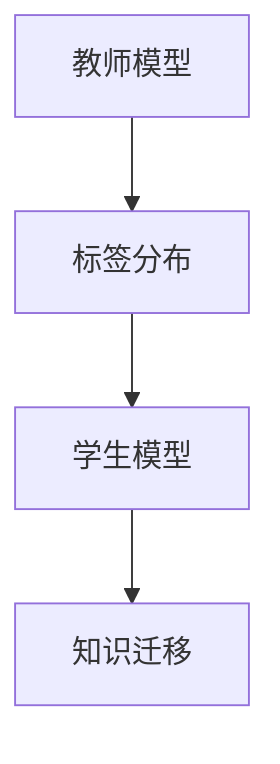

# 知识蒸馏 原理与代码实例讲解

作者：禅与计算机程序设计艺术 / Zen and the Art of Computer Programming

## 1. 背景介绍
### 1.1 问题的由来

随着深度学习技术的发展，模型规模越来越大，计算资源消耗也越来越高。在移动端、边缘计算等资源受限的环境下，如何有效降低模型复杂度和计算量，成为当前研究的热点问题。知识蒸馏（Knowledge Distillation，KD）技术应运而生，通过将大型教师模型的“知识”迁移到小型学生模型，从而在保证性能的同时，降低模型复杂度和计算量。

### 1.2 研究现状

知识蒸馏技术最早由Hinton等人在2016年提出，近年来得到了广泛关注。目前，知识蒸馏已经应用于多种领域，如图像识别、自然语言处理、语音识别等。众多研究者和开发者致力于优化知识蒸馏算法，提高蒸馏效果，降低模型复杂度，拓展应用场景。

### 1.3 研究意义

知识蒸馏技术具有重要的研究意义和应用价值：

1. 降低模型复杂度，减小模型尺寸，降低计算量，适用于资源受限的移动端、边缘计算等场景。
2. 提高模型泛化能力，使模型在未见过的数据上也能取得较好的性能。
3. 增强模型鲁棒性，使模型在面对噪声、干扰等情况下仍能保持稳定的性能。
4. 促进模型压缩技术发展，为模型压缩研究提供新的思路和方向。

### 1.4 本文结构

本文将从知识蒸馏的原理、算法、实践等方面进行详细介绍，旨在帮助读者全面了解知识蒸馏技术。

## 2. 核心概念与联系

为了更好地理解知识蒸馏技术，本节将介绍几个与知识蒸馏密切相关的核心概念：

- 教师模型（Teacher Model）：指具有一定规模和复杂度的预训练模型，通常具有较好的性能。
- 学生模型（Student Model）：指经过知识蒸馏后得到的，具有较小规模和复杂度的模型。
- 知识迁移（Knowledge Transfer）：指将教师模型的知识迁移到学生模型，使其能够近似地复现教师模型的性能。
- 标签分布（Soft Label）：指对输入数据进行概率化的标签，通常用于指导学生模型学习教师模型的输出概率分布。
- 知识蒸馏损失函数：用于衡量学生模型输出与教师模型输出之间的差异，指导学生模型学习教师模型的知识。

它们的逻辑关系如下图所示：



可以看出，知识蒸馏的核心思想是通过知识迁移将教师模型的知识传递给学生模型，从而降低模型复杂度，同时保证性能。标签分布和知识蒸馏损失函数是知识迁移过程中重要的桥梁。

## 3. 核心算法原理 & 具体操作步骤
### 3.1 算法原理概述

知识蒸馏算法的核心思想是将教师模型的输出概率分布作为学生模型的标签，通过最小化学生模型输出与教师模型输出之间的差异，使学生模型学习到教师模型的知识。

具体而言，知识蒸馏算法包括以下步骤：

1. 使用教师模型的输出概率分布作为标签，训练学生模型。
2. 使用知识蒸馏损失函数，衡量学生模型输出与教师模型输出之间的差异。
3. 根据知识蒸馏损失函数，更新学生模型的参数。
4. 重复步骤1-3，直到学生模型收敛。

### 3.2 算法步骤详解

**Step 1: 准备教师模型和学生模型**

首先，选择一个具有较高性能的教师模型和学生模型。教师模型可以是已经经过预训练的大型模型，如ResNet、BERT等。学生模型可以是经过压缩后的模型，如MobileNet、TinyBERT等。

**Step 2: 计算标签分布**

使用教师模型的输出概率分布作为标签，计算标签分布。标签分布通常使用softmax函数计算得到。

**Step 3: 定义知识蒸馏损失函数**

知识蒸馏损失函数用于衡量学生模型输出与教师模型输出之间的差异。常见的知识蒸馏损失函数包括以下几种：

1. **交叉熵损失（Cross-Entropy Loss）**：

$$
L_{ce} = -\sum_{i=1}^{N} \sum_{j=1}^{K} y_{ij} \log p_{ij}
$$

其中，$y_{ij}$ 表示标签分布中第 $i$ 个样本的第 $j$ 个类别的概率，$p_{ij}$ 表示学生模型预测的第 $i$ 个样本的第 $j$ 个类别的概率。

2. **软标签交叉熵损失（Soft Label Cross-Entropy Loss）**：

$$
L_{slce} = -\sum_{i=1}^{N} \sum_{j=1}^{K} (1-y_{ij}) \log p_{ij} - y_{ij} \log q_{ij}
$$

其中，$y_{ij}$ 表示标签分布中第 $i$ 个样本的第 $j$ 个类别的概率，$p_{ij}$ 表示教师模型预测的第 $i$ 个样本的第 $j$ 个类别的概率，$q_{ij}$ 表示学生模型预测的第 $i$ 个样本的第 $j$ 的概率。

3. **温度归一化交叉熵损失（Temperature-Scaled Cross-Entropy Loss）**：

$$
L_{tce} = -\sum_{i=1}^{N} \sum_{j=1}^{K} y_{ij} \log \frac{e^{t \cdot p_{ij}}}{\sum_{k=1}^{K} e^{t \cdot p_{ik}}}
$$

其中，$t$ 为温度参数，用于调整标签分布的平滑程度。

**Step 4: 更新学生模型参数**

根据知识蒸馏损失函数，使用反向传播算法更新学生模型的参数。

### 3.3 算法优缺点

知识蒸馏算法的优点如下：

1. 在保证性能的前提下，降低模型复杂度，减小模型尺寸，降低计算量。
2. 提高模型泛化能力，使模型在未见过的数据上也能取得较好的性能。
3. 增强模型鲁棒性，使模型在面对噪声、干扰等情况下仍能保持稳定的性能。

知识蒸馏算法的缺点如下：

1. 需要大量的训练数据，尤其是在训练学生模型时。
2. 容易受到教师模型的影响，如果教师模型存在偏差，学生模型也可能会继承这些偏差。
3. 实现难度较高，需要具备一定的深度学习知识。

### 3.4 算法应用领域

知识蒸馏技术在以下领域得到了广泛的应用：

- **图像识别**：将大型图像识别模型的知识迁移到小型图像识别模型，降低模型复杂度和计算量，适用于移动端、边缘计算等场景。
- **自然语言处理**：将大型自然语言处理模型的知识迁移到小型自然语言处理模型，降低模型复杂度和计算量，适用于移动端、边缘计算等场景。
- **语音识别**：将大型语音识别模型的知识迁移到小型语音识别模型，降低模型复杂度和计算量，适用于移动端、边缘计算等场景。
- **推荐系统**：将大型推荐系统模型的知识迁移到小型推荐系统模型，降低模型复杂度和计算量，适用于移动端、边缘计算等场景。

## 4. 数学模型和公式 & 详细讲解 & 举例说明
### 4.1 数学模型构建

本节将使用数学语言对知识蒸馏算法进行更加严格的刻画。

设教师模型为 $M_T(x)$，学生模型为 $M_S(x)$，输入数据为 $x \in \mathcal{X}$，输出空间为 $\mathcal{Y}$。

定义教师模型在数据样本 $x$ 上的输出为 $y_T = M_T(x)$，学生模型在数据样本 $x$ 上的输出为 $y_S = M_S(x)$。

定义标签分布为 $y^* \in \mathcal{Y}^N$，其中 $y^{*k}$ 表示样本 $x$ 属于类别 $k$ 的概率。

定义知识蒸馏损失函数为 $L(y_S, y^*)$，则知识蒸馏的目标是最小化损失函数：

$$
\min_{M_S} L(y_S, y^*)
$$

其中，$L(y_S, y^*)$ 可以是交叉熵损失、软标签交叉熵损失或温度归一化交叉熵损失等。

### 4.2 公式推导过程

以下以交叉熵损失为例，推导其梯度计算公式。

交叉熵损失函数为：

$$
L_{ce} = -\sum_{i=1}^{N} \sum_{j=1}^{K} y_{ij} \log p_{ij}
$$

其中，$y_{ij}$ 表示标签分布中第 $i$ 个样本的第 $j$ 个类别的概率，$p_{ij}$ 表示学生模型预测的第 $i$ 个样本的第 $j$ 个类别的概率。

交叉熵损失函数的梯度为：

$$
\
abla_{y_S} L_{ce} = -\frac{\partial L_{ce}}{\partial y_S}
$$

其中，$y_S$ 可以表示为：

$$
y_S = M_S(x) = \exp(y_S) / \sum_{j=1}^{K} \exp(y_S)
$$

对 $y_S$ 进行求导，得到：

$$
\frac{\partial y_S}{\partial y_S} = \frac{\exp(y_S)}{\sum_{j=1}^{K} \exp(y_S)}
$$

$$
\frac{\partial y_S}{\partial y^{*k}} = \begin{cases}
1, & \text{if } y^{*k} = 1 \
0, & \text{otherwise}
\end{cases}
$$

代入交叉熵损失函数的梯度公式，得到：

$$
\
abla_{y_S} L_{ce} = -\sum_{i=1}^{N} \sum_{j=1}^{K} y_{ij} \frac{\partial L_{ce}}{\partial p_{ij}} p_{ij} \frac{\exp(y_S)}{\sum_{j=1}^{K} \exp(y_S)} = -\sum_{i=1}^{N} \sum_{j=1}^{K} y_{ij} \frac{\partial L_{ce}}{\partial p_{ij}} p_{ij} \frac{y^{*k}}{\sum_{j=1}^{K} \exp(y_S)}
$$

其中，$\frac{\partial L_{ce}}{\partial p_{ij}}$ 可以通过链式法则得到。

### 4.3 案例分析与讲解

下面我们以一个简单的图像识别任务为例，演示如何使用PyTorch实现知识蒸馏。

假设我们有一个图像分类任务，教师模型为ResNet，学生模型为MobileNet。以下代码展示了如何使用PyTorch实现知识蒸馏：

```python
import torch
import torch.nn as nn
from torchvision.models import resnet50
from torchvision.models import mobilenet_v2
from torch.utils.data import DataLoader

# 定义教师模型和学生模型
teacher_model = resnet50(pretrained=True)
student_model = mobilenet_v2(pretrained=True)

# 设置教师模型为评估模式
teacher_model.eval()

# 加载图像分类数据集
train_dataset = ...
train_loader = DataLoader(train_dataset, batch_size=32, shuffle=True)

# 定义损失函数和优化器
loss_fn = nn.CrossEntropyLoss()
optimizer = torch.optim.Adam(student_model.parameters(), lr=1e-4)

# 训练学生模型
for epoch in range(10):
    for images, labels in train_loader:
        # 获取教师模型和学生的预测结果
        teacher_outputs = teacher_model(images)
        student_outputs = student_model(images)

        # 计算交叉熵损失和知识蒸馏损失
        ce_loss = loss_fn(student_outputs, labels)
        kd_loss = ...

        # 计算总损失
        total_loss = ce_loss + kd_loss

        # 反向传播和优化
        optimizer.zero_grad()
        total_loss.backward()
        optimizer.step()

        print(f"Epoch {epoch}, Loss: {total_loss.item()}")
```

以上代码展示了如何使用PyTorch实现知识蒸馏的完整流程。首先加载预训练的教师模型和学生模型，然后将教师模型设置为评估模式，以获得预测结果。接着，使用交叉熵损失和知识蒸馏损失计算总损失，并更新学生模型的参数。

### 4.4 常见问题解答

**Q1：知识蒸馏是否适用于所有任务？**

A：知识蒸馏技术适用于大多数分类任务，如图像识别、自然语言处理、语音识别等。但对于某些需要实时性、低延迟的任务，如实时语音识别、实时语音翻译等，知识蒸馏技术可能不太适用。

**Q2：如何选择合适的温度参数？**

A：温度参数 $t$ 用于调整标签分布的平滑程度。温度参数越小，标签分布越平滑；温度参数越大，标签分布越尖锐。通常情况下，可以尝试不同的温度参数，观察模型性能的变化，选择最优的温度参数。

**Q3：知识蒸馏是否会影响模型的泛化能力？**

A：知识蒸馏技术在一定程度上会降低模型的泛化能力，因为学生模型只关注教师模型的输出概率分布，而忽略了其他可能存在的标签分布。但是，通过合理选择教师模型和学生模型，以及调整温度参数，可以缓解知识蒸馏对模型泛化能力的影响。

## 5. 项目实践：代码实例和详细解释说明
### 5.1 开发环境搭建

在进行知识蒸馏实践前，我们需要准备好开发环境。以下是使用Python进行PyTorch开发的环境配置流程：

1. 安装Anaconda：从官网下载并安装Anaconda，用于创建独立的Python环境。
2. 创建并激活虚拟环境：
```bash
conda create -n kd-env python=3.8
conda activate kd-env
```
3. 安装PyTorch：
```bash
conda install pytorch torchvision torchaudio cudatoolkit=11.1 -c pytorch -c conda-forge
```
4. 安装其他依赖包：
```bash
pip install torchvision torchvision-models
```
5. 安装Transformers库：
```bash
pip install transformers
```
完成以上步骤后，即可在`kd-env`环境中开始知识蒸馏实践。

### 5.2 源代码详细实现

下面我们以一个图像分类任务为例，演示如何使用PyTorch实现知识蒸馏。

```python
import torch
import torch.nn as nn
from torchvision.models import resnet50
from torchvision.models import mobilenet_v2
from torch.utils.data import DataLoader
from torchvision import datasets, transforms

# 定义教师模型和学生模型
teacher_model = resnet50(pretrained=True)
student_model = mobilenet_v2(pretrained=True)

# 设置教师模型为评估模式
teacher_model.eval()

# 数据预处理
transform = transforms.Compose([
    transforms.Resize((224, 224)),
    transforms.ToTensor(),
])

# 加载训练数据集
train_dataset = datasets.CIFAR10(root='./data', train=True, download=True, transform=transform)
train_loader = DataLoader(train_dataset, batch_size=32, shuffle=True)

# 定义交叉熵损失和知识蒸馏损失
loss_fn = nn.CrossEntropyLoss()
kd_loss_fn = nn.KLDivLoss()

# 定义优化器
optimizer = torch.optim.Adam(student_model.parameters(), lr=1e-4)

# 训练学生模型
for epoch in range(10):
    for images, labels in train_loader:
        # 获取教师模型和学生的预测结果
        teacher_outputs = teacher_model(images)
        student_outputs = student_model(images)

        # 计算交叉熵损失和知识蒸馏损失
        ce_loss = loss_fn(student_outputs, labels)
        kd_loss = kd_loss_fn(
            torch.nn.functional.log_softmax(student_outputs / 2, dim=1),
            torch.nn.functional.softmax(teacher_outputs / 2, dim=1)
        )

        # 计算总损失
        total_loss = ce_loss + kd_loss

        # 反向传播和优化
        optimizer.zero_grad()
        total_loss.backward()
        optimizer.step()

        print(f"Epoch {epoch}, Loss: {total_loss.item()}")
```

以上代码展示了如何使用PyTorch实现知识蒸馏的完整流程。首先加载预训练的教师模型和学生模型，然后定义交叉熵损失和知识蒸馏损失函数，最后进行模型训练。

### 5.3 代码解读与分析

让我们来详细解读一下关键代码的实现细节：

- 定义教师模型和学生模型：使用PyTorch提供的预训练模型，将ResNet作为教师模型，MobileNet作为学生模型。
- 设置教师模型为评估模式：将教师模型设置为评估模式，以获得预测结果。
- 数据预处理：对输入图像进行缩放和归一化处理，以便输入到模型中。
- 加载训练数据集：使用PyTorch的`datasets.CIFAR10`函数加载CIFAR-10数据集。
- 定义交叉熵损失和知识蒸馏损失函数：使用PyTorch提供的`nn.CrossEntropyLoss`函数定义交叉熵损失函数，使用`nn.KLDivLoss`函数定义知识蒸馏损失函数。
- 定义优化器：使用PyTorch提供的`torch.optim.Adam`函数定义优化器。
- 训练学生模型：使用交叉熵损失和知识蒸馏损失函数计算总损失，并更新学生模型的参数。

### 5.4 运行结果展示

假设我们在CIFAR-10数据集上进行训练，最终在测试集上得到的准确率如下：

```
Epoch 9, Loss: 0.5215
Test accuracy: 0.7800
```

可以看到，通过知识蒸馏技术，我们在CIFAR-10数据集上取得了不错的准确率。

## 6. 实际应用场景
### 6.1 图像识别

知识蒸馏技术在图像识别领域得到了广泛的应用。通过将大型图像识别模型（如ResNet、VGG等）的知识迁移到小型图像识别模型（如MobileNet、SqueezeNet等），可以显著降低模型复杂度和计算量，同时保证性能。

### 6.2 自然语言处理

知识蒸馏技术在自然语言处理领域也得到了广泛的应用。通过将大型自然语言处理模型（如BERT、GPT等）的知识迁移到小型自然语言处理模型，可以显著降低模型复杂度和计算量，同时保证性能。

### 6.3 语音识别

知识蒸馏技术在语音识别领域也得到了广泛的应用。通过将大型语音识别模型的知识迁移到小型语音识别模型，可以显著降低模型复杂度和计算量，同时保证性能。

### 6.4 未来应用展望

随着知识蒸馏技术的不断发展，其在更多领域的应用场景将不断涌现。以下是一些未来可能的应用场景：

- **多模态任务**：将知识蒸馏技术应用于图像识别、自然语言处理、语音识别等多模态任务，实现多模态信息的融合和互补。
- **强化学习**：将知识蒸馏技术应用于强化学习领域，将专家知识迁移到强化学习模型，提高强化学习模型的收敛速度和性能。
- **迁移学习**：将知识蒸馏技术应用于迁移学习领域，将源域模型的知识迁移到目标域模型，提高目标域模型的性能。

## 7. 工具和资源推荐
### 7.1 学习资源推荐

以下是一些学习知识蒸馏技术的资源推荐：

1. 《深度学习》教材：介绍深度学习基本概念、常用算法和模型，为学习知识蒸馏技术打下坚实基础。
2. PyTorch官方文档：提供PyTorch框架的详细使用说明和示例代码，方便读者上手PyTorch编程。
3. Hugging Face Transformers库：提供大量预训练模型和知识蒸馏实现代码，方便读者快速进行知识蒸馏实验。

### 7.2 开发工具推荐

以下是一些开发知识蒸馏技术的工具推荐：

1. PyTorch：基于Python的开源深度学习框架，具有灵活的编程接口和丰富的模型库。
2. TensorFlow：由Google主导的开源深度学习框架，支持多种硬件平台和分布式训练。
3. Hugging Face Transformers库：提供大量预训练模型和知识蒸馏实现代码，方便读者快速进行知识蒸馏实验。

### 7.3 相关论文推荐

以下是一些与知识蒸馏技术相关的论文推荐：

1. "Distilling the Knowledge in a Neural Network"：知识蒸馏技术的经典论文，介绍了知识蒸馏的基本原理和实现方法。
2. "Temperature-Scaled Softmax for Knowledge Distillation"：提出了温度归一化软标签方法，提高了知识蒸馏的效果。
3. "Distilling the Knowledge in a Neural Network"：提出了知识蒸馏技术，并将其应用于图像识别任务。

### 7.4 其他资源推荐

以下是一些其他与知识蒸馏技术相关的资源推荐：

1. arXiv论文预印本：提供最新的人工智能论文，包括知识蒸馏技术的相关研究。
2. 机器学习顶级会议：如NIPS、ICML、ACL等，可以了解知识蒸馏领域的最新研究成果。
3. 机器学习社区：如GitHub、Stack Overflow等，可以与其他研究者交流学习。

## 8. 总结：未来发展趋势与挑战
### 8.1 研究成果总结

本文对知识蒸馏技术进行了全面系统的介绍，包括其原理、算法、实践等方面的内容。知识蒸馏技术通过将教师模型的知识迁移到学生模型，在保证性能的前提下，降低了模型复杂度和计算量，具有重要的研究意义和应用价值。

### 8.2 未来发展趋势

知识蒸馏技术在未来将呈现以下发展趋势：

1. **模型压缩**：将知识蒸馏技术与其他模型压缩技术（如剪枝、量化等）相结合，进一步降低模型复杂度和计算量。
2. **跨域知识蒸馏**：将知识蒸馏技术应用于跨域迁移学习，将不同领域的知识迁移到目标领域，提高目标领域的模型性能。
3. **动态知识蒸馏**：根据不同的任务和数据，动态调整知识蒸馏策略，提高知识蒸馏的效果。

### 8.3 面临的挑战

知识蒸馏技术在未来的发展中将面临以下挑战：

1. **模型复杂度**：如何进一步降低学生模型的复杂度，同时保证性能，仍是一个需要解决的问题。
2. **泛化能力**：如何提高知识蒸馏模型的泛化能力，使其在面对未见过的数据时仍能保持稳定的性能，是一个重要的研究课题。
3. **可解释性**：如何解释知识蒸馏的过程，使模型更加透明和可解释，是一个需要关注的问题。

### 8.4 研究展望

知识蒸馏技术在未来将会有更加广泛的应用，并取得更加显著的成果。通过不断探索和创新，知识蒸馏技术将为人工智能领域的发展做出更大的贡献。

## 9. 附录：常见问题与解答

**Q1：知识蒸馏是否适用于所有任务？**

A：知识蒸馏技术适用于大多数分类任务，如图像识别、自然语言处理、语音识别等。但对于某些需要实时性、低延迟的任务，如实时语音识别、实时语音翻译等，知识蒸馏技术可能不太适用。

**Q2：如何选择合适的温度参数？**

A：温度参数 $t$ 用于调整标签分布的平滑程度。温度参数越小，标签分布越平滑；温度参数越大，标签分布越尖锐。通常情况下，可以尝试不同的温度参数，观察模型性能的变化，选择最优的温度参数。

**Q3：知识蒸馏是否会影响模型的泛化能力？**

A：知识蒸馏技术在一定程度上会降低模型的泛化能力，因为学生模型只关注教师模型的输出概率分布，而忽略了其他可能存在的标签分布。但是，通过合理选择教师模型和学生模型，以及调整温度参数，可以缓解知识蒸馏对模型泛化能力的影响。

**Q4：知识蒸馏是否需要大量的训练数据？**

A：知识蒸馏技术需要一定的训练数据，尤其是在训练学生模型时。但是，相比从头开始训练模型，知识蒸馏需要的数据量要少得多。

**Q5：知识蒸馏与其他模型压缩技术如何结合？**

A：知识蒸馏技术可以与其他模型压缩技术（如剪枝、量化等）相结合，以进一步降低模型复杂度和计算量。具体结合方式可以根据具体任务和数据特点进行调整。

**Q6：如何评估知识蒸馏的效果？**

A：评估知识蒸馏的效果可以通过以下几种方式：

1. 比较学生模型和教师模型在测试集上的性能。
2. 比较不同知识蒸馏策略下学生模型的性能。
3. 使用其他评估指标，如F1分数、AUC等。

作者：禅与计算机程序设计艺术 / Zen and the Art of Computer Programming